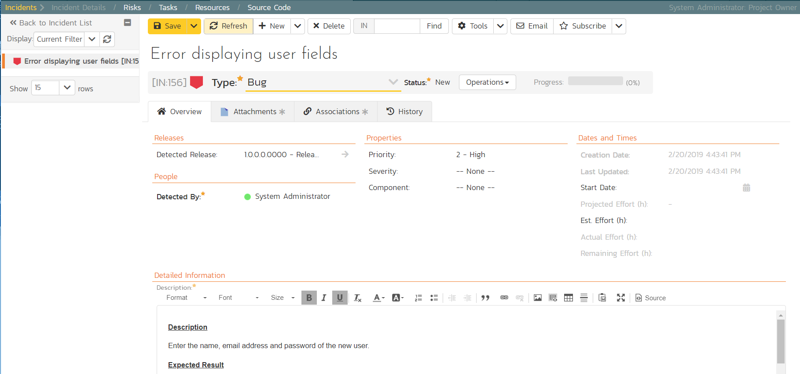
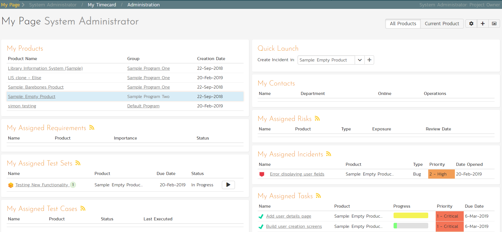
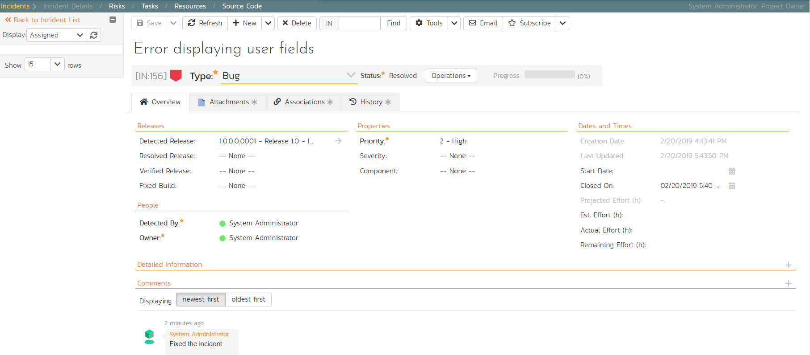

# Triaging Issues and Defects

Now that a new incident has been logged, the next step in the process is
to review the incident and assign it to a developer to be fixed. First,
click on the Artifacts \> Incidents menu item. This will display the
incident list page for the product. You can also view the same list of
incidents in a Kanban board view.

In either view, click on the hyperlink for the new incident "Error
displaying user fields". This will display the incident details page:

1.  In the 'Operations' dropdown menu underneath the incident name on
the top of the page, select 'Assign Incident' option. This will
switch the status of the incident from New \> Assigned.

2.  Location the 'People' section and set the 'Owner' field to System
Administrator (your user)

3.  Add a new comment in the 'Comments' section at the bottom of the
page. Type "Assigning this to you to fix. Issue was found during
testing."

4.  Click the 'Save' button in the top toolbar.

The incident will be assigned to your user for fixing.

To see what a developer would see in real life, go back to the "My Page"
by clicking on the orange SpiraPlan icon in the top-left of the main
Navigation Bar on the top of the screen:

You can see that you've been assigned an incident under the "My Assigned
Incidents" widget (on the right-hand side). Now click on the hyperlink
for the incident to bring up the incident details page:

The status is 'Assigned' and the comment from the product manager is
clearly visible. To help you reproduce the issue, you can click on the
"Associations" tab to display the test run and requirements associated
with this incident:

If you click on the test run hyperlink "Test ability to add new users",
you will see the detailed information about the test execution that
resulted in the bug being logged:

This allows the developer to retrace the steps taken by the tester and
attempt to reproduce the issue. We are going to assume we can reproduce
and fix the issue so we can go right ahead and resolve the incident.

1.  Make your way back to the incident details screen: Artifacts\>
Incidents \> Error displaying user fields' Hyperlink.

2.  Click on the workflow 'Operations' drop-down menu and select
'Resolve Incident'.

3.  Fill in the following fields

<!-- -->

1.  Resolved Release = Release 1.0 - Iteration 2

2.  In 'Comments' section enter a new comment = "Fixed the incident."

<!-- -->

4.  Click 'Save' on the main toolbar

The incident will now change from Assigned \> Resolved and an email will
be sent to the tester letting them know that they need to retest the
test case and close the incident.

