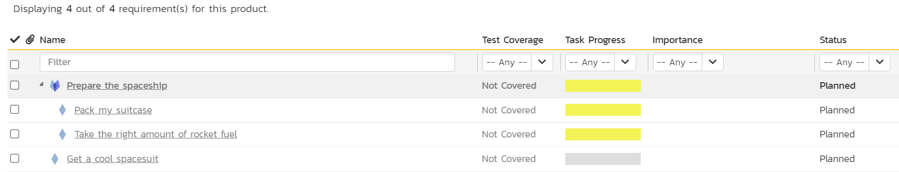
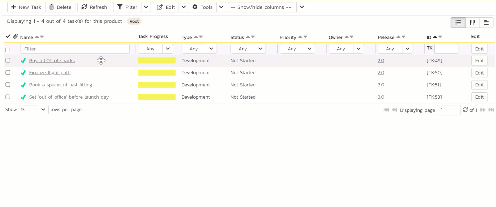
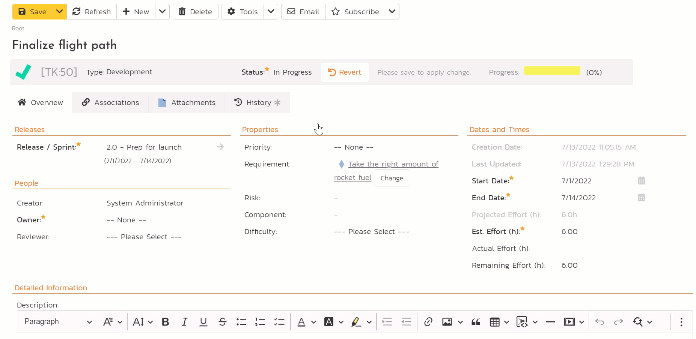
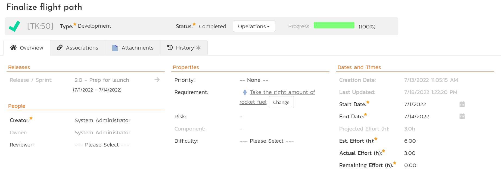
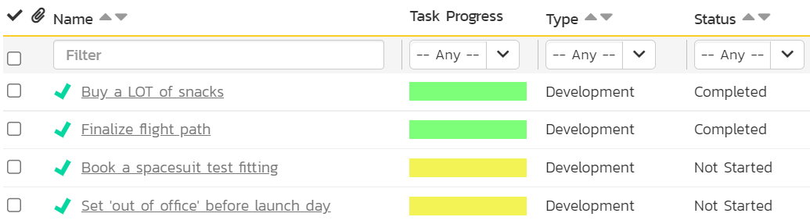
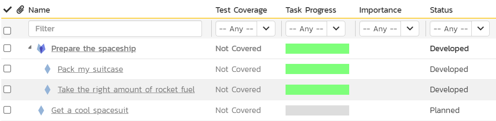
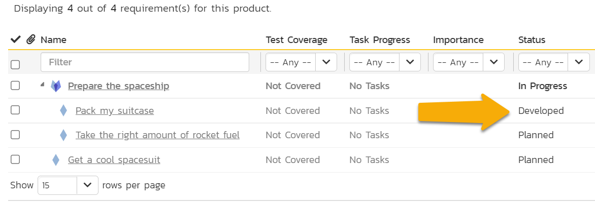
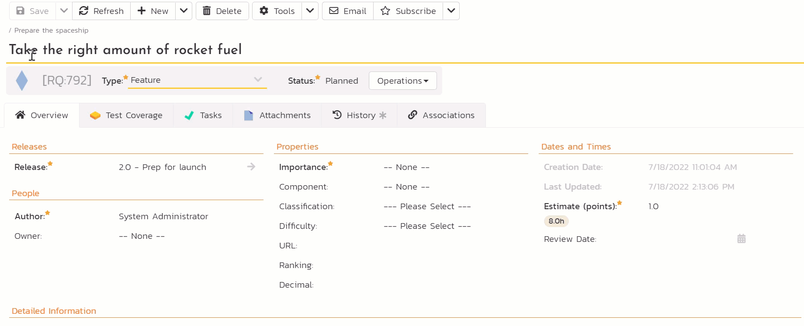
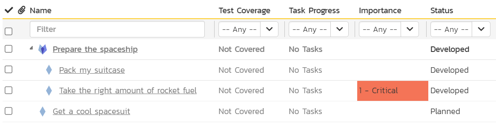

# Doing the work

!!! tldr annotate "The story so far (1)"

    We are going on a vacation to Mars (2). It's a long journey. Like you should do before any big trip, we started by planning out what we have to do. We made some reqirements, tasks, sprints, and even thought about the risks. Now its time to stop planning and start doing.

1.  :woman_raising_hand: Get a reminder or learn about the parts of the guide you missed (we recommend following the whole guide and it is pretty quick, but no pressure)
2.  :rocket: Because of the awesome hiking everyone raves about

## Moving Through the Workflow
{==

**Workflows** are a way of moving an artifact (like a task or requirement) through a series of steps. These steps take the artifact from its creation to its end point. Workflows give you control about the who, how, and what of moving an artifact through specific steps.

For example, a task going from not done to done. In SpiraPlan the task starts as "Not Started" and transitions through the workflow steps to "Completed". You can mark the task as "In Progress" when you have started work but not finished it yet. Maybe the task doesn't end up "Completed" - it may get blocked or become obsolete. All of these options are possible with workflows.

==}

!!! info "If you are starting the quick start guide here"
    This part of the guide only works if you have already made some requirements and (optionally) tasks for those requirements. If you haven't done this, please [go back](plan.md/#features-and-goals) and do so now.

    **There are two different ways to "do the work" in this part of the guide - you only need to do one**:

    - Either complete tasks linked to requirements  (if you are using SpiraTeam or SpiraPlan and did all the steps on the Plan page)
    - Or work with requirements directly (if you are using SpiraTest or if you worked on the Plan page already but did not create tasks)

### Completing Tasks
!!! info "Using SpiraTest or did not follow all steps on the Plan page?"
    [Skip ahead](#completing-standalone-requirements)

- [x] Open the Artifact dropdown from the global navigation and click "Requirements"
- [x] Look at the "Task Progress" and "Status" columns on each requirement. This is our starting state before we do any work. None of the tasks are started and all the requirements are still "Planned".

??? faq "Why do the task progress bars look like that?"
    We have 4 requirements. We made 4 tasks as well, but one of those tasks never got attached to a requirement. We never added a task to "Prepare the spaceship". So why do all 4 requirements show a filled in task progress bar? This is because of a feature called "**rollup**". The task progress from a requirement's children "rollup" to the parent. The task progress bar of "Prepare the spaceship" is a rolled up combination of the task progress of its two children.

    Why are 3 of the task progress bars yellow? Because the tasks have start dates in the past and have not yet started. In SpiraPlan we consider these tasks to be "starting late". We never directly set their start dates, but the tasks got their start and end dates from the releases (sprints) they are linked to. The remaining task progress bar is gray because, although it too is still not started, its start date is in the future. Your task progress bars may look a little different if you choose different dates for your sprints.

We are not going to work on the requirements themselves, instead we do the work on the tasks we made.

- [x] Open the Artifact dropdown from the global navigation and click "Tasks"
- [x] Click the "Edit" button in the list of tasks for the task "Buy a LOT of snacks"
- [x] Change the task's status by changing the "Status" value from "Not Started" to "Completed"
- [x] Click "Save". You will see that the "Task Progress" goes from yellow to green. That is because the task is now finished.

Let's now complete another task. We will record this in a different way. On the list page, where we are now, you can make any changes to any task at any time. Workflows only let you do certain things at certain times. For the workflow to control what we can do we need to be on the details page for a task.

- [x] Click on the name of "Finalize flight path"
- [x] Underneath the task name is a highlighted area that shows the task ID, its type, and its status ("Not Started"). Click on the "Operations" button next to the status. This shows all the ways you can move through the workflow from "Not Started"
- [x] Click "Start Task" - you will see the status change to "In Progress"

You may have missed it but as soon as the task status was at "In Progress" some names of the different fields went bold and got a star by them. This means they are now required. Most of these required fields are already filled in. But one, "Owner" is still blank.

- [x] Click on the "Owner" dropdown and set the value to you (System Administrator)
- [x] Click "Save"

We will now move the task through to completed

- [x] Click on the "Operations" button next to the status
- [x] Click "Complete Task" - you will see the status change to "Completed". This now makes different fields required or not (what fields are required or disabled is completely customizable for every task status individually)
- [x] Find the "Actual Effort" field in the "Dates and Times" section. Set it to `3` for 3 hours of work
- [x] Because we are finished with this task, there is no more work to do so set "Remaining Effort" to `0`
- [x] Click "Save". The task is now completed

Let's check our progress.

- [x] Open the Artifact dropdown from the global navigation and click "Tasks" to open the tasks list page again. You can see 2 tasks are complete

| Task Name                              | Status      |
|----------------------------------------|-------------|
| Buy a LOT of snacks                    | Completed   |
| Finalize flight path                   | Completed   |
| Book a spacesuit test fitting          | Completed   |
| Set 'out of office' before launch day  | Not Started |

- [x] Open the Artifact dropdown from the global navigation and click "Requirements" to open the requirements list page

The task progress bars for 3 requirements are now green. This makes sense because it is the tasks linked to these requirements that we completed. The statuses have also changed. They all had statuses of "Planned" and now 3 have the status of "Developed". This happened automatically because all the tasks linked to these requirements are now complete. The system sees the requirement has tasks and judges that all the work for those requirements in stored in the tasks. So when the tasks are done, the requirement is done. For now done = "Developed": we have done the work but have not yet verified that work. 

!!! faq "Why are statuses changing by themselves for requirements?"
    Requirements do not need to work like explained above. You can set your product up so that whatever you do with tasks, the requirements' statuses do **not** change. In this quick start guide, we are showing one way of using SpiraPlan, but you do not need to work this way.

| Requirement Name                       | Status    |
|----------------------------------------|-----------|
| Prepare the spaceship                  | Developed |
| > Pack my suitcase                     | Developed |
| > Take the right amount of rocket fuel | Developed |
| Get a cool spacesuit                   | Planned   |

### Completing Standalone Requirements
!!! info "Already completed tasks (above)?"
    [Skip ahead](test.md)

- [x] Open the Artifact dropdown from the global navigation and click "Requirements"
- [x] Click the "Edit" button in the list of requirements for the task "Pack my suitcase"
- [x] Change the requirement's status by changing the "Status" value from "Planned" to "Developed". This means that the work on the requirement has been done but it has not yet been verified
- [x] Click "Save".

Let's now finish development on another requirement. We will record this in a different way. On the list page, where we are now, you can make any changes to any requirement at any time. Workflows only let you do certain things at certain times. For the workflow to control what we can do we need to be on the details page for a requirement.

- [x] Click on the name of "Take the right amount of rocket fuel"
- [x] Underneath the requirement name is a highlighted area that shows the requirement ID, its type, and its status ("Planned"). Click on the "Operations" button next to the status. This shows all the ways you can move through the workflow from "Planned"
- [x] Click "Start Development" - you will see the status change to "In Progress"

You may have missed it but some fields names of the different fields are shown in bold and have a star by them. This means they are required. Most of these required fields are already filled in. But one, "Importance" is still blank.

- [x] Click on the "Importance" dropdown and set the value to "1 - Critical"
- [x] Click "Save"

We will now move the task through to completed

- [x] Click on the "Operations" button next to the status
- [x] Click "Finish Development" - you will see the status change to "Developed". No extra fields are required so we do not need to make any other changes
- [x] Click "Save". The requirement is now developed

Let's check our progress.

- [x] Open the Artifact dropdown from the global navigation and click "Requirements" to open the requirements list page

We changed the statuses of 2 requirements, but 3 requirements now have different statuses. They all had statuses of "Planned" and now 3 have the status of "Developed". This happened automatically because when all of a parent requirement's children change their status, the parent status changes too. 

| Requirement Name                       | Status    |
|----------------------------------------|-----------|
| Prepare the spaceship                  | Developed |
| > Pack my suitcase                     | Developed |
| > Take the right amount of rocket fuel | Developed |
| Get a cool spacesuit                   | Planned   |

## Summary
**You're doing great!** 

- We start taking action to get us that bit closer to our dream vacation on Mars. 
- We completed some tasks (be especially proud of all those snacks you bought)
- These in turn helped us finish the first phase of work on most of our requirements

What's next? According to our requirements all our work to prepare the spaceship is developed, but we need to know for sure. In the next part, we will check our work, to make sure our tasks and requirements do what they are supposed to.