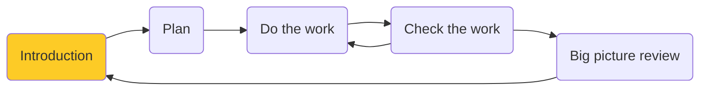
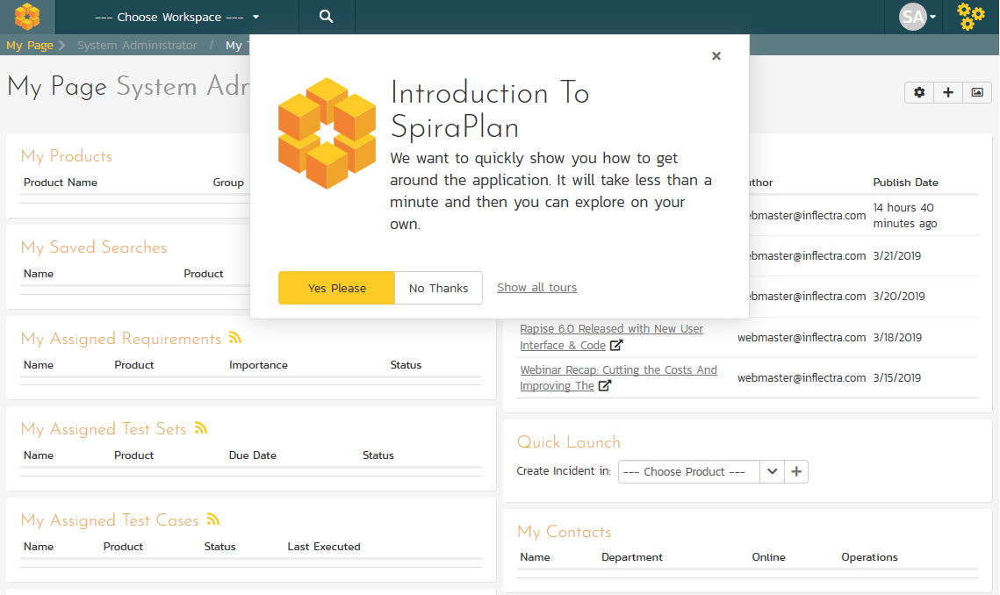
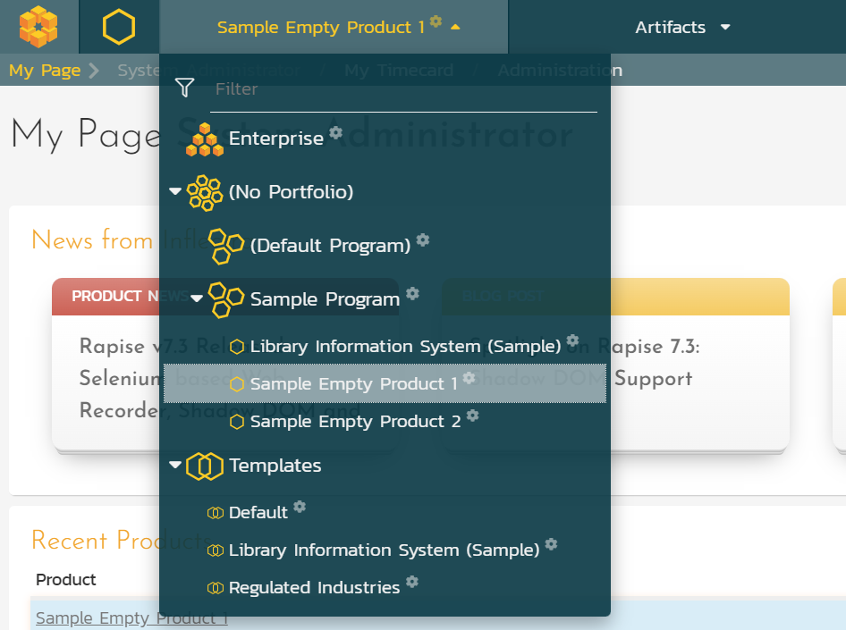
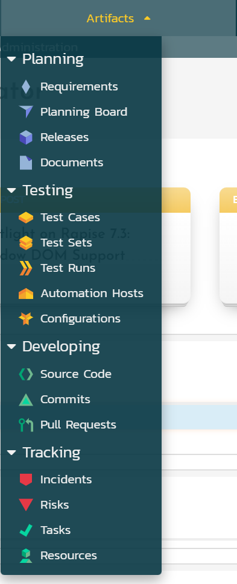
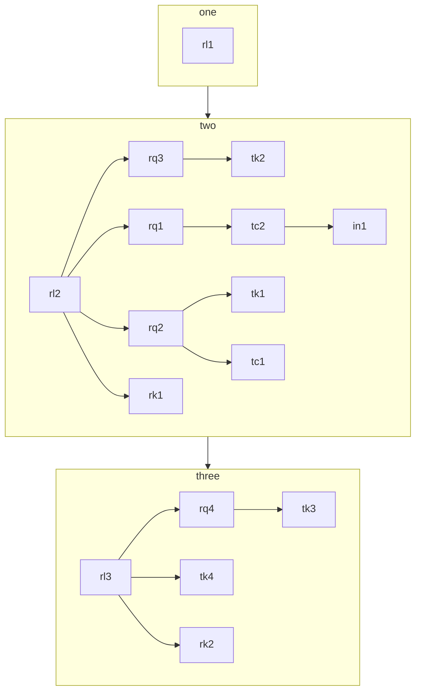

# Welcome to the SpiraPlan Quick Start Guide
In this guide we will learn about the different parts of the application, how to use them, and how they fit together. 

You don't need to know how to use the application already, and you don't need to be familiar with application management tools, or agile, or waterfall.

All you need to get started is the application itself.

!!! tip "You say SpiraTest, I say SpiraPlan"

    The SpiraPlan family of applications comes in 3 different editions:

    - SpiraTest
    - SpiraTeam, which is SpiraTest plus some extra features
    - SpiraPlan, which takes all the features of SpiraTeam and adds a few more

    Whatever flavor of Spira you have (we will say **"Spira"** from here on) you can use this Quick Start Guide. 

## Introduction

Let's go on a journey together. In fact, let's go to Mars! For a vacation. We deserve it. In this Quick Start Guide we use SpiraPlan to help us plan and prepare for our Mars trip. 

This Guide is split into different parts, the different stages of our preparation before the big launch. 

- We start with planning things out (planning)
- Then we get to work on doing what we planned (doing the work)
- We can't stop there, we have to check the work for mistakes or bugs (checking the work). 
- As we iron out bugs in the vacation plan, we should check in on the overview of the project to see if we are on track (big picture review) 

We recommend doing things in order if you can. This will really let you see the power of how SpiraPlan helps you connect your work together. This in turn helps you better understand your progress and better meet your goals. That being said, this is your time and your time is precious. We have designed this guide so that you can dip into any part you want at ant time. However you approach it and whatever edition of Spira you have, there will be clear signposts and tips to guide you along the way.

Enough explaining, let's start doing...

## Start using the application

!!! info "What you will learn"

    - Logging in to the application
    - Workspaces (products and projects)
    - Artifacts (bugs, sprints, tests)

### Logging In to the application

You have a brand new SpiraPlan application ready to go. This is either in the cloud or on-premise. First, go to the home page of the application in your browser to get to the login page:

Login using the default admin account:

- **User Name**: administrator
- **Password**: PleaseChange

You are now logged-in and will see the "My Page". The My Page looks pretty empty right now. This is normal.

The first time you log in you will see a popup that gives you a quick orientation of the application. Please follow this guide first.

### Products
To start getting things done in the application you need to select a workspace to explore, manage, or work on. The most common and important workspace is the product. This is where you and your team will spend most of their time in SpiraPlan. Products are long running areas of work with tangible outputs or goals. This can be a software or hardware product that gets new regular new releases, patches, and features. A product can also be used like a project, where the focus may be a different kind of output or to manage a process.

For this tutorial we want to start with an empty product that has no data in it. By default, the system ships with a couple like this. 

- [x] Click on the workspace dropdown to show all available workspaces. 
- [x] Click "Sample Empty Product 1" in the "Sample Program". This will select this as your product, but you will likely still be on the My Page. That is fine for now. 

The "Sample Program" in this screenshot is a program. Programs are used to group products together. Programs can themselves get grouped together into portfolios. We are not going to get into that though.

### Artifacts
Artifacts are the building blocks of a product in SpiraPlan. Artifacts contain all of the data in the product. Each artifact holds different data and is used in different ways. For instance, requirements are one artifact, and releases are another. They work differently, and are not interchangable. There are artifacts to help you test, plan, track bugs and tasks, and more.

Throughout this guide we will be moving between the different artifacts in our sample product. This will help us focus on one type of activity at a time. You will also see how all these different artifacts fit together like neat little puzzle pieces.

[Let's Start :rocket:](./plan){ .md-button .md-button--primary }

## Overview
1. Planning things out

  - Features and goals (req)
  - Tasks to get done (tasks for reqs - 2 ways)
  - Map out your time
  - Organize your work into sprints (add RQ to RL, TK to RL)
  - What are the risks

2. Doing the work (editing)

- Using the workflows on details pages - complete tasks, progress requirements (auto settings)

3. Checking your work (QA)

- Check your goals are being met with tests (TC - and link to RQ)
- Map your QA work to sprints (add RQ to RL, TC to RL)
- QA your goals and find a bug (test execution)
- Triage your incidents

4. Big picture review

- Are you ready to launch? Using home pages
- Ideally 1 or 2 small issues outstanding - resolve
- Ready to release!

5. Advanced section:

- Planning board
- Test sets
- Test parameters
- Admin - planning
- Admin - make a product
- Admin - components
- Admin - custom properties

## Artifacts
Creates 16 in total, which is about half of the current QSG - seems about right

### Requirements
Prepare the spaceship rq1 [rl2]
> Pack my suitcase rq2 [rl2]
> Take the right amount of rocket fuel rq3 [rl2]
Get a cool spacesuit rq4 [rl3]

### Tasks
buy a LOT of snacks tk1 [rq2 -> rl2]
finalize flight path tk2 [rq3 -> rl2]
Book a spacesuite test fitting tk3 [rq4 -> rl3]
set 'out of office' before launch day tk4 [rl3]

### Releases
Build spaceship rl1 [already complete]
Prep for launch rl2 
Lift off rl3

### Risks
Fly right on past Mars rk1 [rl2]
Spaceship computer turns evil rk2 [rl3]
> Be its friend mitgitation1
> Know how to turn it off mitgitation2

### Test Cases
Verify suitcase is well packed tc1 [rq2, rl2]
Check if the spaceship computer seems nice tc2 [rq1, rl2] 

### Incidents
There are too many snacks to fit in the suitcase in1 [tc1]

