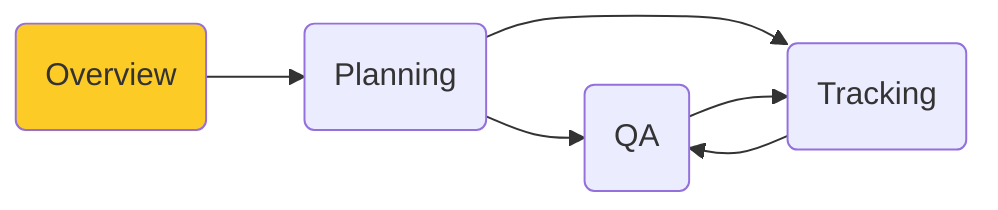

# Welcome to the SpiraPlan Quick Start Guide
In this guide we will learn about the different parts of the application, how to use them, and how they fit together. 

You don't need to know how to use the application already, and you don't need to be familiar with application management tools, or agile, or waterfall.

All you need to get started is the application itself.

## Introduction
!!! tip "You say SpiraTest, I say SpiraPlan"

    The SpiraPlan family of applications comes in 3 different editions:

    - SpiraTest
    - SpiraTeam, which is SpiraTest plus some extra features
    - SpiraPlan, which takes all the features of SpiraTeam and adds a few more

    Whatever flavor of Spira you have (we will say **"Spira"** from here on) you can use this Quick Start Guide. 

This Quick Start Guide is split into different parts. You can dip into any part you want. However, we recommend doing the parts in order. This will really let you see the power of how things connect together to help you meet your goals. However you approach it and whatever edition of Spira you have, there will be clear signposts and tips to guide you along the way.

### Guide to the Guide

## Application Overview

!!! info "What you will learn"

    - Logging in to the application
    - Your user profile
    - Workspaces (products and projects)
    - Artifacts (bugs, sprints, tests)

### Logging In to the application

You have a brand new SpiraPlan application ready to go. This is either in the cloud or on-premise. First, go to the home page of the application in your browser to get to the login page:

Login using the default admin account:

- **User Name**: administrator
- **Password**: PleaseChange

You are now logged-in and will see the "My Page". The My Page looks pretty empty right now. This is normal.

The first time you log in you will see a popup that gives you a quick orientation of the application.

### Your user profile

### Workspaces
For this tutorial we want to start with an empty product that has no data in it, so click the hyperlink under 'My Products' for 'Sample Empty Product 2' / 'Sample Program'. That will select the empty product. Now to see the homepage for the product you just selected, click on the hexagon in the top left:

The product home page shows various widgets containing key product metrics. These are empty now, because the product has no data in it. In the rest of this guide we are going to fix that.

### Artifacts
