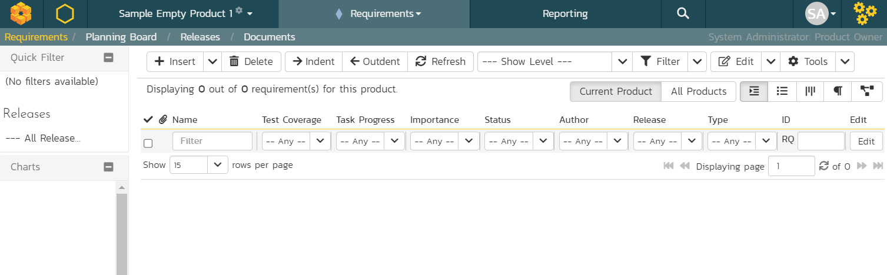
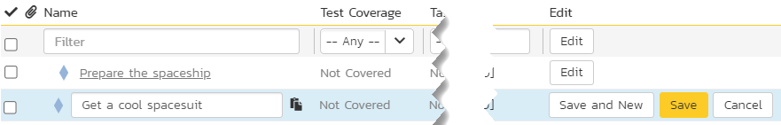
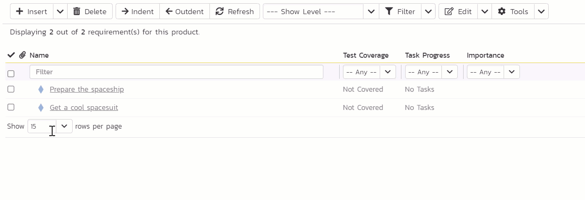

# Plan

We will spend the first chunk of this guide planning things out. We start by outlining the big features and goals we need to deliver. Then we break those down into smaller tasks. Once we know the scope of the work we can plan out our time. This let's us plan out when we need to do each of our tasks and deliver on our goals. With that the planning is almost complete. Before we move onto the next section we should think about the risks that things could go wrong, or go off track. 

## Features and Goals
{==

**Requirements** are also known as features, or user stories. Different methodologies call them different things and use them in different ways. SpiraPlan is methodology agnostic so you can use requirements however you want. 

Often, as you work with requirements or features you need to structure your requirements with some nested inside others. SpiraPlan gives you full support for hierarchically arranging your requirements. 

==}

!!! tldr annotate "The story so far (1)"

    We are going on a vacation to Mars, (2). It's a long journey. So it's a good idea to plan it out first, instead of jumping into the first rocket for Mars you can find. We've logged into SpiraPlan and we are ready to go.

1.  :woman_raising_hand: Get a reminder or learn about the parts of the guide you skipped
2.  :rocket: Because we want to and it sounds fun

We've decided on our vacation destination: Mars. Currently, we're on Earth, don't have a rocket, and have got a lot to do. We need to make a list of our big goals. SpiraPlan uses "**Requirements**" as the artifact (the item type in the application) for tracking these major goals.

- [x] Open the Artifact dropdown from the global navigation 
- [x] click "Requirements" under Planning. This shows the Requirement lists page. The main list in the middle of the page is empty. This is expected.

Let's make some requirements. In SpiraPlan, there is almost always more than one way to do something, but let's start out simple. 

- [x] Find the toolbar of buttons above the empty list of requirements
- [x] Click the `Insert` button to make your first requirement. The new requirement is added to the list and highlighted in blue. 
- [x] Type the name of the requirement or feature into the "Name" box: `Prepare the spaceship`

- [x] Click the "Save and New" button on the far right of this new row. This adds a second requirement beneath the first
- [x] Give this second requirement a name of `Get a cool spacesuit`
- [x] Finally, hit "Save"

We've made a great start. We have two requirements. Let's add a couple more and see how easy it is to nest requirements inside others.

- [x] Check the checkbox for the "Prepare the spaceship" requirement
- [x] Click the dropdown arrow next to "Insert" button in the toolbar
- [x] Click "Child Requirement" from the dropdown menu. You will see the new requirement directly underneath "Prepare the spaceship" and a little indented
- [x] Give this new child requirement a name of "Pack my suitcase"

- [x] Click "Save and New" to add another requirement and give this is a name of "Take the right amount of rocket fuel"
- [x] Finally, hit "Save" and then refresh the page

You will see your 4 requirements and the top one has a different icon. This shows us that it is a parent requirement that has children nested inside it.

| Name                                   | Position  |
|----------------------------------------|-----------|
| Prepare the spaceship                  | Parent    |
| > Pack my suitcase                     | Child     |
| > Take the right amount of rocket fuel | Child     |
| Get a cool spacesuit                   | By itself |

??? tip "Other ways to add and position requirements"
    If you have a list of requirements and want to make one a child of the requirement above it, select the requirement and click the "Indent" button on the toolbar. Use the "Outdent" button to move a child requirement out one level.

    You can also right click on a requirement to indent or outdent them.

    Click and drag requirements to move them around and change the order.

     
