# Plan

We will spend the first chunk of this guide planning things out. We start by outlining the big features and goals we need to deliver. Then we break those down into smaller tasks. Once we know the scope of the work we can plan out our time. This lets us plan out when we need to do each of our tasks and deliver on our goals. With that the planning is almost complete. Before we move onto the next section we should think about the risks that things could go wrong, or go off track. 

!!! tldr annotate "The story so far (1)"

    We are going on a vacation to Mars (2). It's a long journey. So it's a good idea to plan it out first, instead of jumping into the first rocket for Mars you can find. We've logged into SpiraPlan and we are ready to go.

1.  :woman_raising_hand: Get a reminder or learn about the parts of the guide you skipped
2.  :rocket: Because we want to and it sounds fun

## Features and Goals
{==

**Requirements** are also known as features, or user stories. Different frameworks and methodologies call them different things and use them in different ways. SpiraPlan is methodology agnostic so you can use requirements however you want. 

Often, as you work with requirements or features you need to structure your requirements with some nested inside others. SpiraPlan gives you full support for hierarchically arranging your requirements. 

==}

We've decided on our vacation destination: Mars. Currently, we're on Earth, don't have a rocket, and have got a lot to do. We need to make a list of our big goals. SpiraPlan uses "**Requirements**" as the artifact (the item type in the application) for tracking these major goals.

- [x] Open the Artifact dropdown from the global navigation 
- [x] Click "Requirements" under Planning. This shows the Requirements list page. The main list in the middle of the page is empty. This is expected.

=== "SpiraPlan or SpiraTeam"

    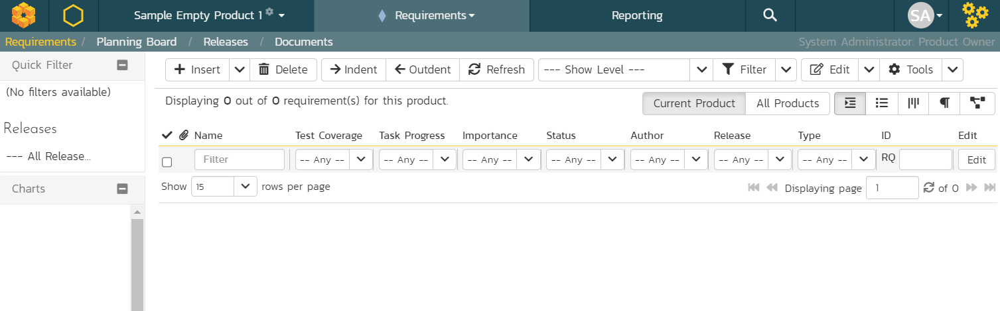

=== "SpiraTest"

    Not all features are available in SpiraTest. SpiraTeam takes SpiraTest and adds some features, SpiraPlan adds even more. Below you can see the requirements page as it looks for SpiraTest. Only features that SpiraTest supports are available in the app. Compared to SpiraTeam or SpiraPlan it does not have the "Task Progress" column, because SpiraTest does not include tasks.

    In the rest of this guide we normally show screenshots of SpiraPlan. If you are using SpiraTest or SpiraTeam you may see columns or tabs or widgets on certain screenshots that you do not have. This is expected.

    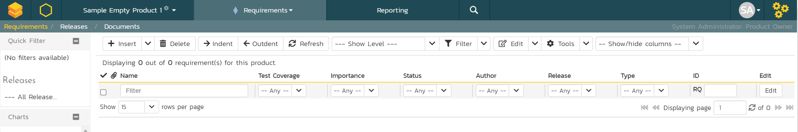

Let's make some requirements. In SpiraPlan, there is almost always more than one way to do something, but let's start out simple. 

- [x] Find the toolbar of buttons above the empty list of requirements
- [x] Click the "Insert" button to make your first requirement. The new requirement is added to the list and highlighted in blue. 
- [x] Type the name of the requirement or feature into the "Name" box: `Prepare the spaceship`

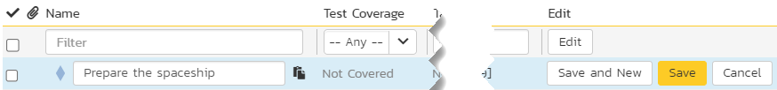

- [x] Click the "Save and New" button on the far right of this new row. This adds a second requirement beneath the first
- [x] Give this second requirement a name of `Get a cool spacesuit`
- [x] Finally, hit "Save"

We've made a great start. We have two requirements. Let's add a couple more and see how easy it is to nest requirements inside others.

- [x] Check the checkbox for the "Prepare the spaceship" requirement
- [x] Click the dropdown arrow next to "Insert" button in the toolbar
- [x] Click "Child Requirement" from the dropdown menu. You will see the new requirement directly underneath "Prepare the spaceship" and a little indented
- [x] Give this new child requirement a name of `Pack my suitcase`

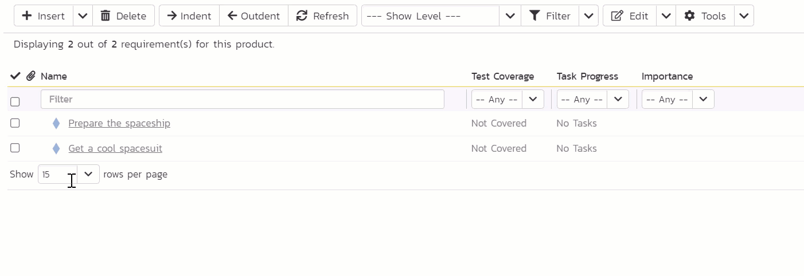

- [x] Click "Save and New" to add another requirement and give this is a name of `Take the right amount of rocket fuel`
- [x] Finally, hit "Save" and then refresh the page

You will see your 4 requirements and the top one has a different icon. This shows us that it is a parent requirement that has children nested inside it.

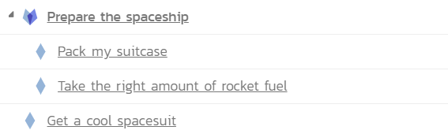

| Requirement Name                       | Position  |
|----------------------------------------|-----------|
| Prepare the spaceship                  | Parent    |
| > Pack my suitcase                     | Child     |
| > Take the right amount of rocket fuel | Child     |
| Get a cool spacesuit                   | By itself |

??? tip "Other ways to add and position requirements"
    If you have a list of requirements and want to make one a child of the requirement above it, select the requirement and click the "Indent" button on the toolbar. Use the "Outdent" button to move a child requirement out one level.

    You can also right click on a requirement to indent or outdent them.

    Click and drag requirements to move them around and change the order.

    Select a requirement then click the "Insert" button. This adds a new requirement above the selected requirement.

    Click the "Insert" button with no requirements selected. The new requirement is added at the end of the list of requirements as a sibling of the requirement above it.

     
## Make Tasks
!!! info "Skip this section if you are not using SpiraTeam or SpiraPlan"
    [Skip ahead](#time-planning-with-releases)

{==

**Tasks** are available in SpiraTeam and SpiraPlan. Tasks are used to define specific chunks of work to do. 

They can be used in lots of different ways in SpiraPlan. A great way to use tasks is to link them to big pieces of work, to better manage and track what has to get done when. You can create tasks for requirements, that are then tied to sprints, so you can easily see your progress in finishing all relevant tasks. 

==}

### Tasks from Requirements
!!! info "Start here if you have created requirements"
    Otherwise [skip ahead](#standalone-tasks)

We wrote out some top features we need for our Mars vacation to be a success. These requirements are very broad. It is a good idea to break them down into smaller chunks of work - tasks. Let's create some tasks for some of our requirements!

- [x] From your list of requirements click on "Pack my suitcase". This takes us from the requirements list to the details page for that requirement. You can see all the information about the requirement. Right now a lot of this is blank and that is OK.
- [x] Click "Tasks" tab. This shows a list of all the tasks on this requirement. The list is currently empty.

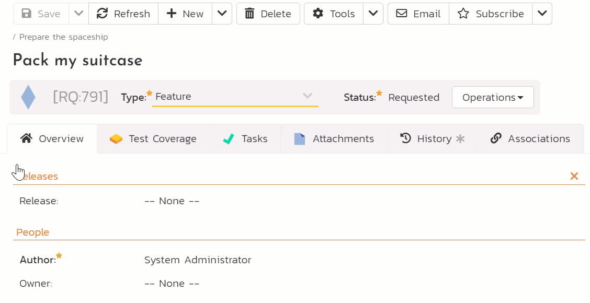

- [x] Click the "New Task" button 
- [x] Type the name of the task as "Buy a LOT of snacks" in the new row on the list of tasks
- [x] Click the "Save" button at the far end of the row for this new task

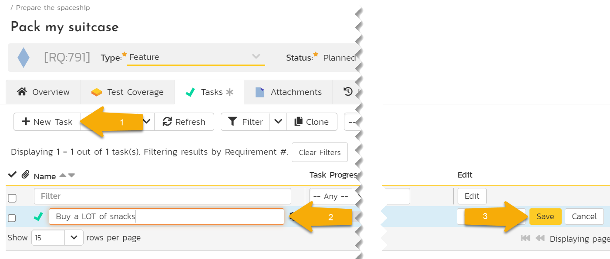

Congratulations! You have made one task. In real life you would make a few more so that the requirement has 2 or 3 or more tasks on it. For now, let's try making a task on a different requirement

- [x] Look at the sidebar on the left and you will see an easy access list of our requirements. Click on "Take the right amount of rocket fuel"

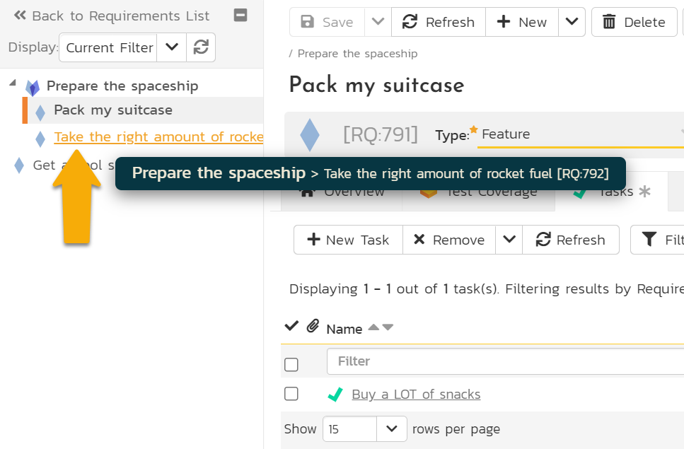

- [x] Once this requirement loads you will see that the task list is blank. Click the "New Task" button
- [x] Enter "Finalize flight path" for the task name
- [x] Click "Save" on the task (you can also press ++enter++)

We've made tasks directly from a requirement. These tasks are directly linked to the requirement. But we can also make tasks a different way, which we will try now. 

### Standalone Tasks 
- [x] Open the Artifact dropdown from the global navigation 
- [x] Click "Tasks" under Tracking. This shows the Tasks lists page. If you have been following along you will see 2 tasks here already (otherwise the list will be empty)

=== "Following along"

    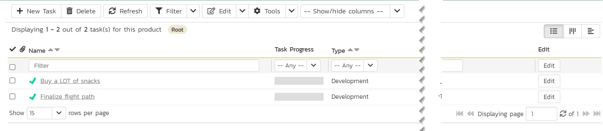

=== "Starting here"

    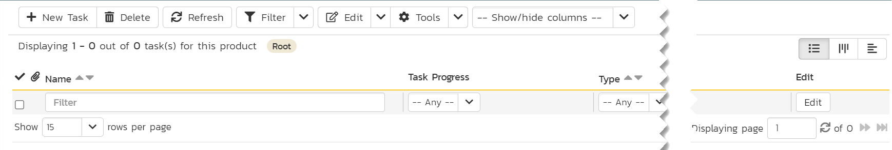

- [x] Click "New Task". The new tasks is added to the list and highlighted in blue 
- [x] Type the name of the task into the "Name" box: `Book a spacesuit test fitting`
- [x] Click the "Save and New" button on the far right of this new row. This adds another new task
- [x] Give this new task a name of `Set 'out of office' before launch day`
- [x] Hit "Save"

We now have four tasks in total (two if you have only created standalone tasks). The task we made about our spacesuit fitting is actually part of our requirement (if you made it) to get a cool spacesuit. We made this task independently of that requirement, but we can still link them together.

- [x] Click on the name of the task "Book a spacesuit test fitting" to open the details page for that task
- [x] On the Overview tab find the column called "Properties". You will see a field there called "Requirement". It is currently blank because it has no linked requirement. Click the "Change" button
- [x] In the "Change Requirement" popup, select "Get a cool spacesuit" 
- [x] Click "Update" on the popup
- [x] Click "Save" from the toolbar at the top of the page

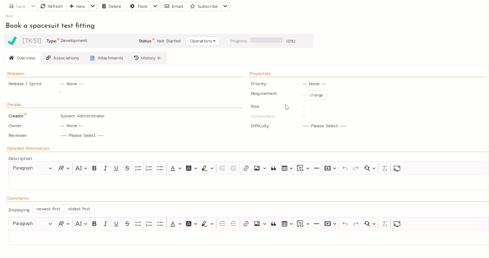

=== "Following along"

    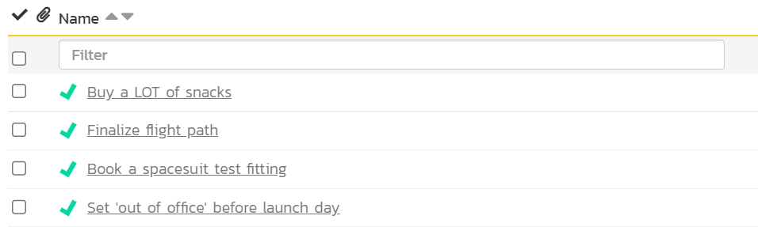

    | Task Name                              | Requirement                          |
    |----------------------------------------|--------------------------------------|
    | Buy a LOT of snacks                    | Pack my suitcase                     |
    | Finalize flight path                   | Take the right amount of rocket fuel |
    | Book a spacesuit test fitting          | Get a cool spacesuit                 |
    | Set 'out of office' before launch day  | none                                 |

=== "Starting here"

    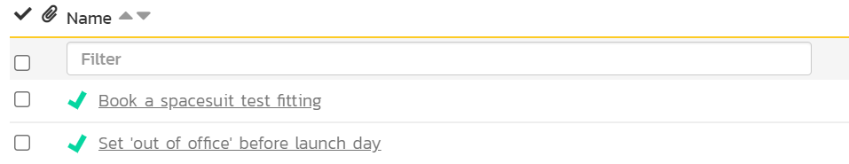

    | Task Name                              | Requirement                          |
    |----------------------------------------|--------------------------------------|
    | Book a spacesuit test fitting          | N/A                                  |
    | Set 'out of office' before launch day  | N/A                                  |

## Time Planning with Releases
{==

**Releases** let you create a list of different releases or sprints for the product. They can be nested to create a hierarchy of releases.

Releases let you divide up your product or project into smaller blocks of time. If preparing for our vacation to Mars will take a year, you can use releases to plan what you will do every two weeks, or every month. Because releases are mostly time bound, their start and end dates are really important. You can have multiple releases on the go at the same time.

In SpiraPlan releases have lots of special properties. By themselves they are simple, but as you link up more and more things (using other artifacts) the more powerful releases become.

==}

We're making good progress with our Mars vacation. We have worked out the top areas of work left to do and made some tasks for them. Next, we move from thinking about the **what** to thinking about the **when**. That's where releases come in.

- [x] Open the Artifact dropdown from the global navigation 
- [x] Click "Releases" under Planning. This shows the Releases lists page. 

The main list in the middle of the page is empty. Let's change that.

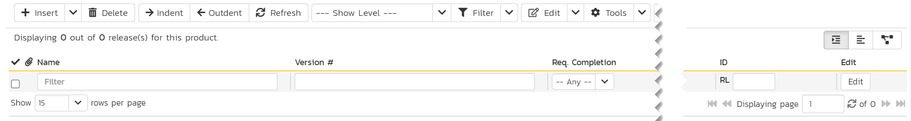

- [x] Find the toolbar of buttons above the empty list of releases
- [x] Click the "Insert" button to make your first release. The new release is added to the list and highlighted in blue. 
- [x] Type the name of the release into the "Name" box: `Build spaceship`. Good news! We've already finished building the spaceship. Let's make this clear by marking this release as finished
- [x] Change the "End Date" field to a date in the past. You can change the "Start Date" too if you like
- [x] Change the "Status" field by opening the dropdown to "Completed"
- [x] Click "Save"

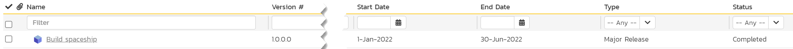

Let's add two more releases - these won't be completed yet.

- [x] Click the "Insert" button again from the toolbar
- [x] Type `Prep for launch` as the name of the new release
- [x] Set the "Version #" as `2.0`
- [x] Set the "Status" to "In Progress" - that means we have already started on doing what we need to for this sprint
- [x] Click "Save and New" on this row. This will add another release below this one
- [x] Give this third release a name of `Lift off` and a "Version #" of `3.0`. Leave the "Status" as "Planned"
- [x] Click "Save"

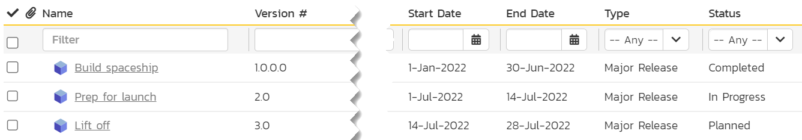

| Release Name     | Status        | Start Date | End Date   |
|------------------|---------------|------------|------------|
| Build spaceship  | Completed     | Past       | Past       |
| Prep for launch  | In Progress   | Past       | Future     |
| Lift off         | Planned       | Future     | Future     |

## Link Work to Releases
!!! tldr "The story so far"

    We have planned out the things we need to get done before we head to Mars. And we've created releases so we can track what we do and when we need to do it. 

    Currently, our what (things to do) are not linked up to our when (releases). Let's fix that.

    If you have not made any requirements or tasks you can go back and do that now or skip this section.

### Set Releases for Requirements
First, we are going to set the release for our requirements.

- [x] Open the Artifact dropdown from the global navigation 
- [x] Click "Requirements" under Planning. On the left hand side of the list of requirements is a column of checkboxes. These let you select one or more of your requirements
- [x] Check the checkbox at the very top of the requirements list (above the topmost requirement). This will select all four of your requirements for you
- [x] On the right side of the list are a number of "Edit" buttons. Click the "Edit" button at the very top of the list. You are now editing all four requirements at once
- [x] Give each requirement a release (see the table below)
- [x] Once you are finished click the "Save" button

| Requirement Name                       | Release               |
|----------------------------------------|-----------------------|
| Prepare the spaceship                  | 2.0 - Prep for launch |
| > Pack my suitcase                     | 2.0 - Prep for launch |
| > Take the right amount of rocket fuel | 2.0 - Prep for launch |
| Get a cool spacesuit                   | 3.0 - Lift off        |

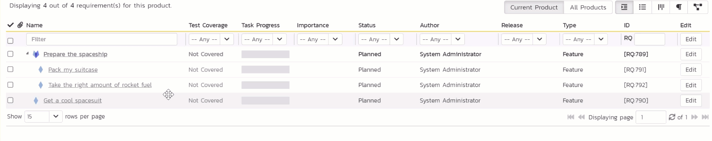

### Set Releases for Tasks
!!! info "Skip this section if you are not using SpiraTeam or SpiraPlan"
    [Skip ahead](do-the-work.md)

Let's hook our tasks up to releases. 

- [x] Open the Artifact dropdown from the global navigation 
- [x] Click "Tasks" under Tracking to view the task list page

=== "Following along in full"

    Look at the release column of your tasks. Three of them already have a release set. This is because they are linked to requirements, and we just set the release for the requirements. That release information flows from the requirement to any of their linked tasks.

    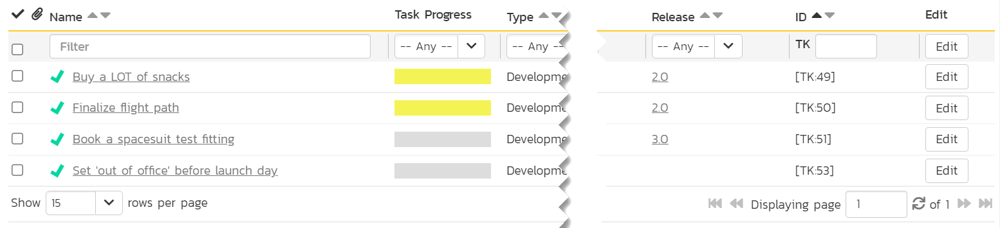

    - [x] Click the "Edit" button in the row of the task called "Set 'out of office' before launch day". The row will turn blue
    - [x] Set the release to "3.0 - Lift off"
    - [x] Click the "Save" button

    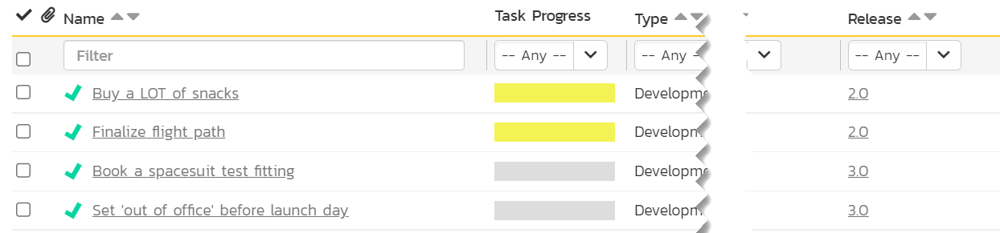

    | Task Name                              | Requirement                          | Release               |
    |----------------------------------------|--------------------------------------|-----------------------|
    | Buy a LOT of snacks                    | Pack my suitcase                     | 2.0 - Prep for launch |
    | Finalize flight path                   | Take the right amount of rocket fuel | 2.0 - Prep for launch |
    | Book a spacesuit test fitting          | Get a cool spacesuit                 | 3.0 - Lift off        |
    | Set 'out of office' before launch day  | none                                 | 3.0 - Lift off        |

    !!! question "Why is the Task Progress bar yellow for some tasks?"
        Because the release these tasks are linked to has been started (its status is "In Progress") but the tasks have **not** started yet, we flag their progress as yellow

=== "Did not make requirements"

    Our two tasks do not have a release yet, so let's change that.

    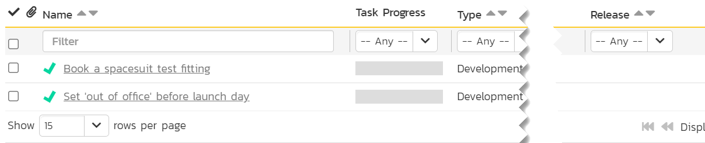

    - [x] Check the checkbox at the very top of the task list (above the topmost task). This will select both tasks
    - [x] On the right side of the list are a number of "Edit" buttons. Click the "Edit" button at the very top of the list. You are now editing both tasks at once
    - [x] Set the release for both tasks to "3.0 - Lift off"
    - [x] Once you are finished click the "Save" button

    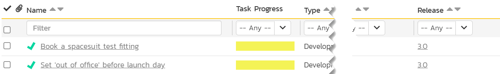

    | Task Name                              | Release               |
    |----------------------------------------|-----------------------|
    | Book a spacesuit test fitting          | 3.0 - Lift off        |
    | Set 'out of office' before launch day  | 3.0 - Lift off        |

## What are the Risks
!!! info "Skip this section if you are not using SpiraTeam or SpiraPlan"
    [Skip ahead](do-the-work.md)

{==

**Risks** let you set up a full risk management solution for your products. You can log and track risks at any time and link them up to releases as well as other artifacts. 

Each risk can have a probability and an impact to help you analyze each risk's exposure. Add risk mitigations to track how you are treating the risk.

==}

!!! tldr "" 
    The more we think about this vacation to Mars, the more we realize it is kind of risky. These risks may make our trip of a lifetime kind of suck. Just thinking about all the ways things can go wrong is not very productive. Instead, we should write things down so we can manage the risks and not be scared of them.

- [x] Open the Artifact dropdown from the global navigation 
- [x] Click "Risks" under Tracking. This shows the Risks list page, which is currently empty

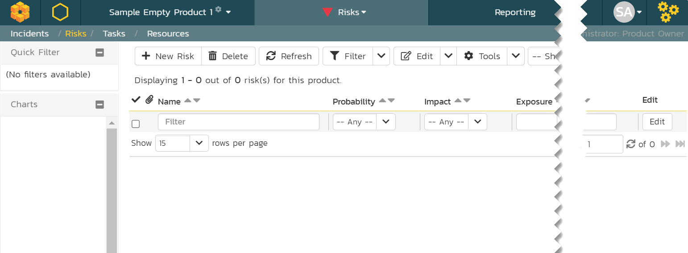

- [x] Click the "New Risk" button from the toolbar. This will open the risk details page. This is different from what happens when we added other artifacts so far.
- [x] Enter `Fly right on past Mars` for the name (at the top of the page)
- [x] Look for the "Source" section of the Overview tab. Set the "Release" field to "2.0 - Prep for launch"
- [x] We want to make another risk so click the "Save and New" toolbar button

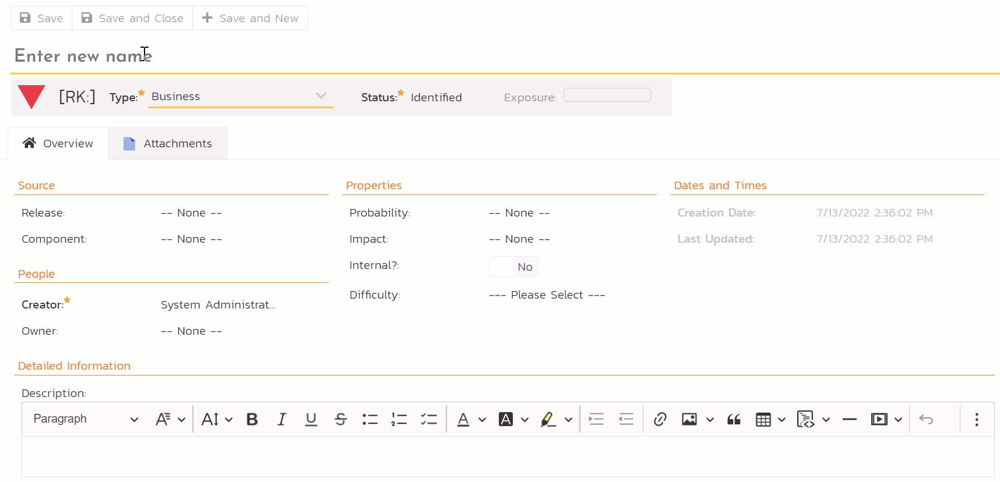

- [x] Enter `Spaceship computer turns evil` for the name (at the top of the page)
- [x] Set the "Release" field to "3.0 - Lift off"
- [x] Click "Save"

Let's now add some ideas about how we can manage (or mitigate) this risk. We do so by creating mitigations, because we really, really need that computer to treat us well.

- [x] Look to the "Mitigations" section of the Overview tab
- [x] Click the "Add" button in that section to add our first mitigation

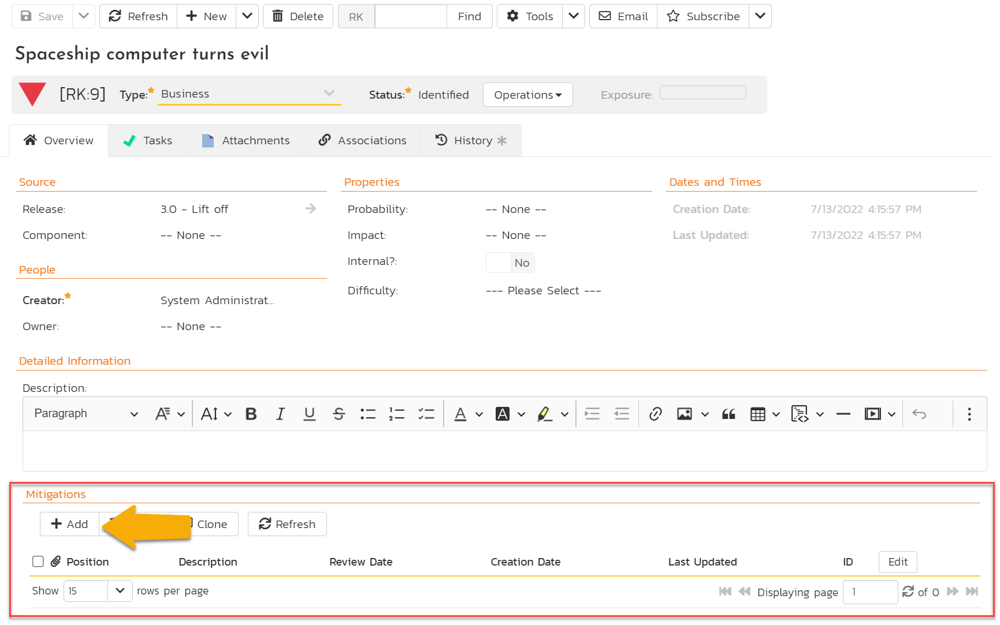

- [x] Enter the following into the description box: `Be its friend`
- [x] Click "Save and New" to make a second mitigation
- [x] Type `Know how to turn it off` into the description
- [x] Click "Save"

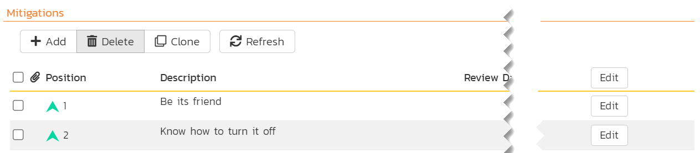

You have created two mitigations on this risk and created two risks in total. 

| Risk Name (with mitigations)             | Release               |
|------------------------------------------|-----------------------|
| Fly right on past Mars                   | 2.0 - Prep for launch |
| Spaceship computer turns evil            | 3.0 - Lift off        |
| > Be its friend                          | N/A                   |
| > Know how to turn it off                | N/A                   |

## Summary
**Congratulations** we have now finished planning! 

- We have made requirements to mark the big features we need to deliver
- We added tasks to set out what exactly we need to do
- Then we added releases to plan out our time
- This helped us plan what features and tasks we need to do when
- Finally, we wrote down some key risks to be aware of at each stage, as well as how we can mitigate one of those risks.

Our vacation to Mars is taking shape. But there is still lots more to do. In the next part of this quick start guide we will learn how to manage our work with SpiraPlan and get things done.