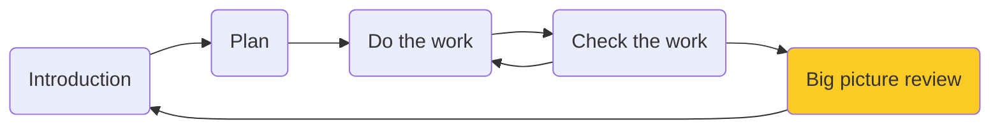
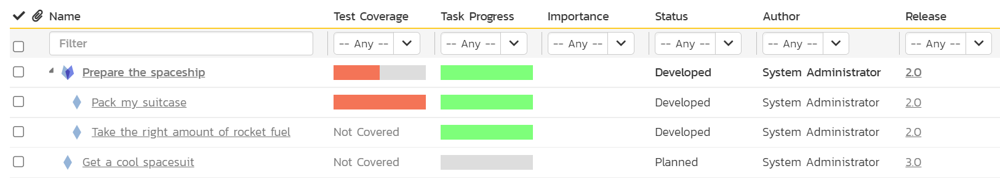
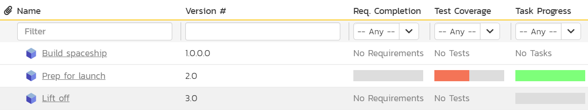
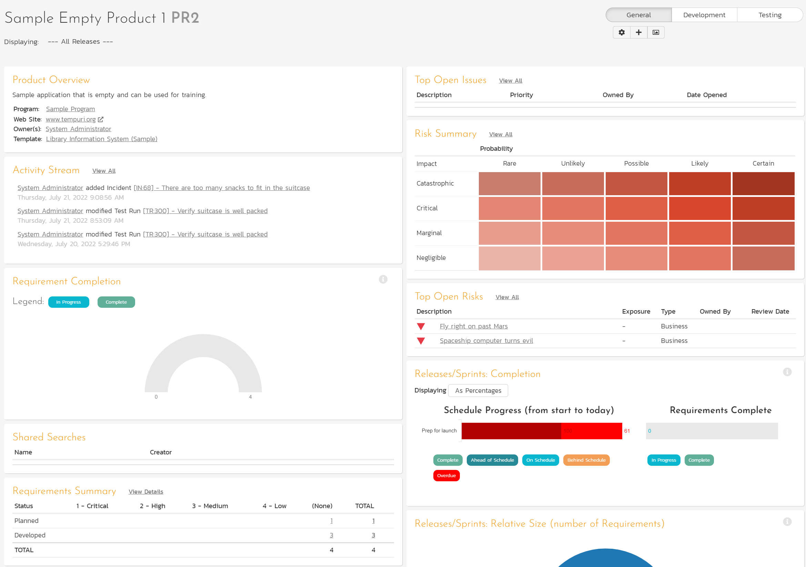
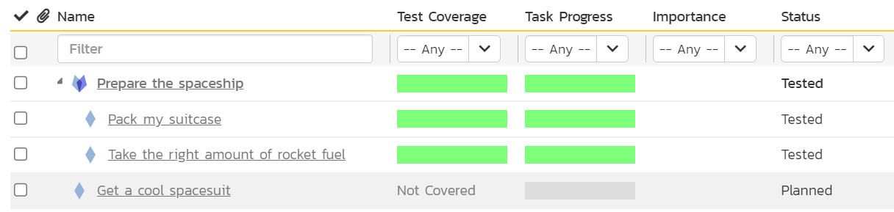
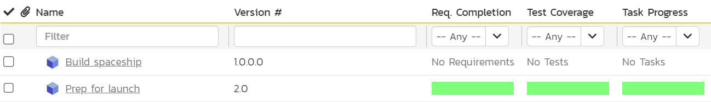
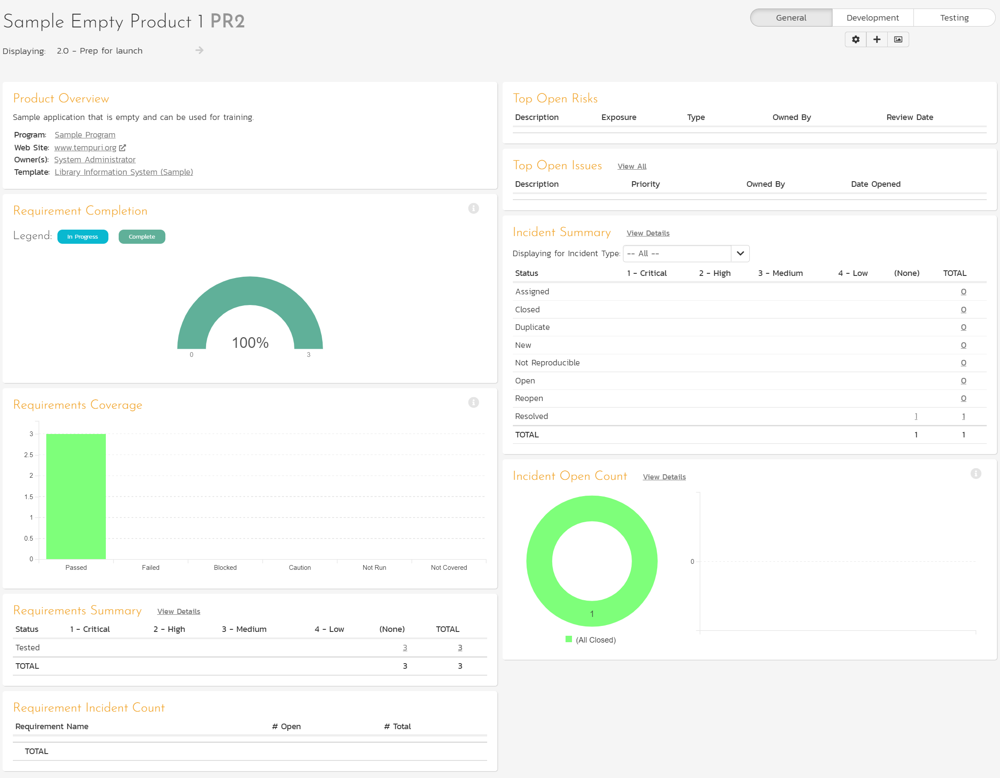

# Review and Next Steps

!!! tldr annotate "The story so far (1)"

    We are going on a vacation to Mars (2). We've been busy planning, preparing, and checking things for the long journey ahead. Are we ready to leave or not? What is left to do? That's what we are going to find out in the is final core section of the SpiraPlan Quick Start Guide.

1.  :woman_raising_hand: Get a reminder or learn about the parts of the guide you missed (we recommend following the whole guide and it is pretty quick, but no pressure)
2.  :rocket: Because there's zero cell reception on the entire planet

## Reviewing Artifacts
!!! info "If you haven't followed the guide all the way through"
    We are going to see how the different artifacts link together. So, you really need to have done all the parts of the quick start guide to see this in action on your installation. If you haven't, you will be able to see how things could work, which will still be useful.

We left on the test case list page. We have two test cases and one of them has failed. Before going to Mars you want your tests to all pass, so you know that the trip will go as smoothly as possible.

We already have a hint with that failed test that our trip may need a little more work. Let's look around and find out.

- [x] Open the Artifact dropdown from the global navigation and click "Requirements" under the Planning section

The first 3 requirements are for release 2.0 (the one we are currently working on). 

- Task progress is looking good, but the test coverage side? Not so much
- Test coverage has an issue. We see our failed test about our suitcase packing. This failure has rolled up to the parent requirement "Prepare the spaceship" because if the child's tests are failing, the parent requirement can't be ready either
- The statuses are also still at Developed. They haven't moved to "Tested" because our testing is not complete yet

- [x] Open the Artifact dropdown from the global navigation and click "Releases" under the Planning section

We have three releases. One was finished before we started this guide, one has not yet started, and the third (release 2.0) is the one we are working on. This is the one our requirements, and by extension, tasks and tests are linked to.

- Task progress is all green as all our tasks are completed
- Test Coverage shows half (one of two) of our tests has failed, and the rest have not been run
- Requirement completion shows that none of our requirements are complete yet. This is because they are all still at "Developed" and are not further along

From a quick glance here, we can see that the "Prep for launch" release is not ready. We are not going to take action on this yet. Instead, let's take a look at one more place to review things. This time at the product wide level.

## Reviewing the Product
- [x] Click the Product Home Page button. This is to the left of the workspace dropdown and has a hexagon icon in it

There's a lot of information on the Product Home Page. The page is divided into widgets that each display different information. Together they give you a useful overview of the state of your product. You can customize how this page looks for you for every product. Below is the default view you will see when looking at the page for the first time.

What can we see from these widgets?

- None of our requirements are complete
- We have two open risks that we have not yet taken action on
- It looks like we are behind schedule 
- Our test coverage for requirements has a mix of things - failure, not run, and a requirement without any test coverage
- We have one open bug that we have not yet addressed
- This incident is linked to a requirement

## What do we do now?
This quick start guide ends here. We've done a lot together, but the rest is up to you. 

For this vacation to happen you need:

:fontawesome-solid-check: tasks done

:fontawesome-solid-times: tests to pass

:fontawesome-solid-times: bugs to be fixed

:fontawesome-solid-times: risks to be managed

:fontawesome-solid-times: requirements completed

:fontawesome-solid-times: releases to be ready. 

Even if we only focus on the "Prep for launch" release, apart from the tasks, you still have a lot to do. You can stop here, just like this guide. Or you can play around and and see if you can get this release looked 100% ready.

??? tip "SPOILERS: Hints to finish the release"
    Want some help about what you need to do, to get everything looking great? We've got you!

    === "What success looks like"
        **Requirements**:
        
        

        **Release 2**:

        

        **Product Home Page**: the screenshot below is only displaying data for the "Prep for launch" release (using the dropdown in the top left), and it is showing a customized set of widgets that show that our requirements, risks, and incidents are all looking good.

        

    === "Specific steps"

        - Close the risks (move them through the workflow to a closed status - closed or rejected)
        - Create a new test case to check the rocket fuel amount and link this to the rocket fuel requirement
        - Execute the three test cases against the "Prep for launch" release and make sure they pass
        - Resolve the bug we opened

        Collectively, these will move the three requirements in release 2.0 to the Tested Status. This in turn will make the requirement completion and test coverage for release 2.0 go 100% green.

<!-- ## More to come
- Planning board
- Test sets
- Test parameters
- Admin - planning
- Admin - make a product
- Admin - components
- Admin - custom properties -->