# Checking the Work

!!! tldr annotate "The story so far (1)"

    We are going on a vacation to Mars (2). It's a long journey. We spent time planning the trip, and then doing the most important tasks. Before we blast off without a care in the world, let's check that we did everything right.

1.  :woman_raising_hand: Get a reminder or learn about the parts of the guide you missed (we recommend following the whole guide and it is pretty quick, but no pressure)
2.  :rocket: Because why should robots be the only ones to enjoy it?

## What are we Testing
There's a lot to check before going on any trip. All the more so when traveling over 100 million miles. We need to stay focused. We made a few releases and work happens in each. 

Let's focus on just one of those releases "Prep for launch". Three of our requirements should get delivered in this release / sprint. Because of our work in finishing tasks on these requirements, they all have a status of "developed". This is perfect, because it means the development (doing) work is done. The next step is to verify things. In SpiraPlan, we verify with the Test Case artifact. 

## Create some Tests
!!! info "If you are starting the quick start guide here"
    Don't worry! You can create tests and execute them without doing the earlier steps in this guide. Some of the details may not apply to you, importantly linking our tests to requirements and releases. But don't let that stop you.

{==

**Test Cases** are the main unit of testing in SpiraPlan. A Test Case defines a scenario or user flow that you want to verify. A Test Case is made up of Test Steps. These steps are the sequence the tester needs to go through and check. Each test step is an opportunity to verify functionality is working as it should, or recording where there are problems.

First you create your test cases, then you execute them. Test execution records the results of what you did or found. You can execute the same test many times and keep a list of records of what happened each time. These are called Test Runs. This system means you have test cases that you can reuse very efficiently. Each test run logs the execution status of that run (eg pass or fail). Together with requirements and releases, test cases help you have full traceability across your whole product.

==}

- [x] Open the Artifact dropdown from the global navigation and click "Test Cases" under the Testing section. This shows the Test Case list page. The main list in the middle of the page is empty

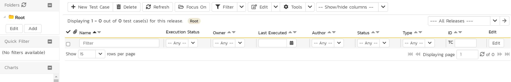

- [x] Click the "New Test Case" button. The new test case is added to the list and highlighted in blue
- [x] Type the name of the test case into the "Name" box: `Verify suitcase is well packed`

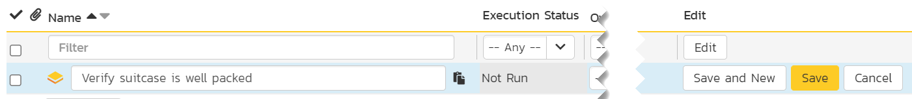

- [x] Click the "Save and New" button on the far right of this new row. This adds a second test case
- [x] Give this second test case a name of `Check if the spaceship computer seems nice`
- [x] Finally, hit "Save"

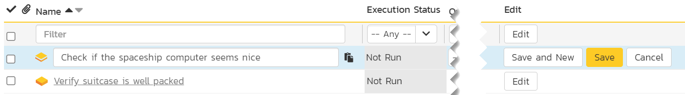

!!! info "Didn't make any requirements?"
    [Skip Ahead](#execute-a-test-case)

This is great. We have already created two test cases. We could start running these tests now, but first let's hook these tests up to requirements and releases.

- [x] Check the checkbox for "Check if the spaceship computer seems nice"
- [x] Click the dropdown arrow next to "Tools" button in the toolbar to open the tools menu
- [x] Click "Add to Requirement" from the dropdown menu to open the popup dialog
- [x] Select "Prepare the spaceship" from the dialog's dropdown
- [x] Click "Add"

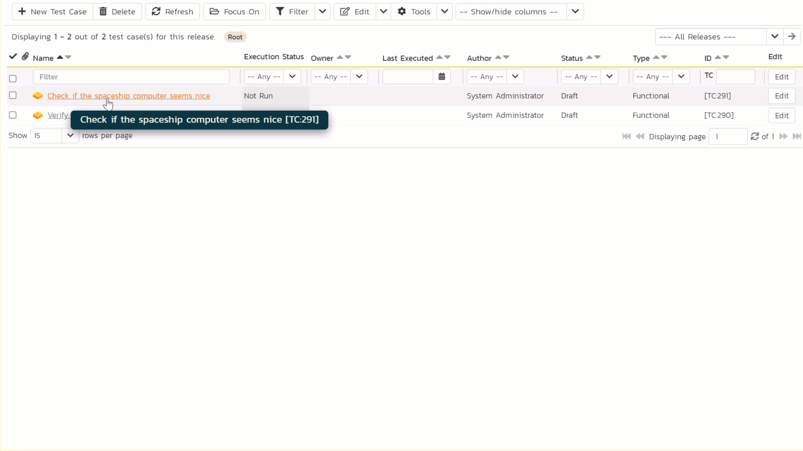

- [x] Let's repeat this for the other test case. Check the checkbox for "Verify suitcase is well packed"
- [x] Click the dropdown arrow next to "Tools" button and select "Add to Requirement" to open the popup dialog
- [x] Select "Pack my suitcase" from the dialog's dropdown, and then click "Add"

These actions link each test case to the correct requirement. Because the requirements are already connected to a release, the test cases are automatically linked to the correct releases. So by adding a requirement to a test case we also added a release. Neat. You can link many requirements to a test case. And you can independently add many releases to a test case as well. Our setup for now looks like this:

| Test Case Name                             | Requirement Coverage   | Release Coverage      |
|--------------------------------------------|------------------------|-----------------------|
| Check if the spaceship computer seems nice | Prepare the spaceship  | 2.0 - Prep for launch |
| Verify suitcase is well packed             | Pack my suitcase       | 2.0 - Prep for launch |

## Execute a Test Case

{==

**Test Execution** in SpiraPlan has a dedicated module for running manual tests. This makes it easy for testers to see what they have to test each step of the way. They can quickly record results and log bugs. SpiraPlan also supports other types of tests, including automated tests and unit tests. These tests are not managed from the test execution module.

==}

Now that we have a very simple test case, we can execute it to check if things are working as they should. Above, we said that test cases in SpiraPlan are made up of Test Steps, which are the steps the tester needs to go through and check. You can add as many steps as you want to a test case, and customize them to exactly your needs. 

We didn't make any test steps on our test cases. Without steps there's nothing to actually verify! Don't worry, SpiraPlan automatically made a test step each time we made a test case. These test steps are empty, but they are enough for us to try out executing tests.

- [x] Right (alt) click on the test case "Verify suitcase is well packed". This brings up the context menu
- [x] Click "Execute" (with the play icon)

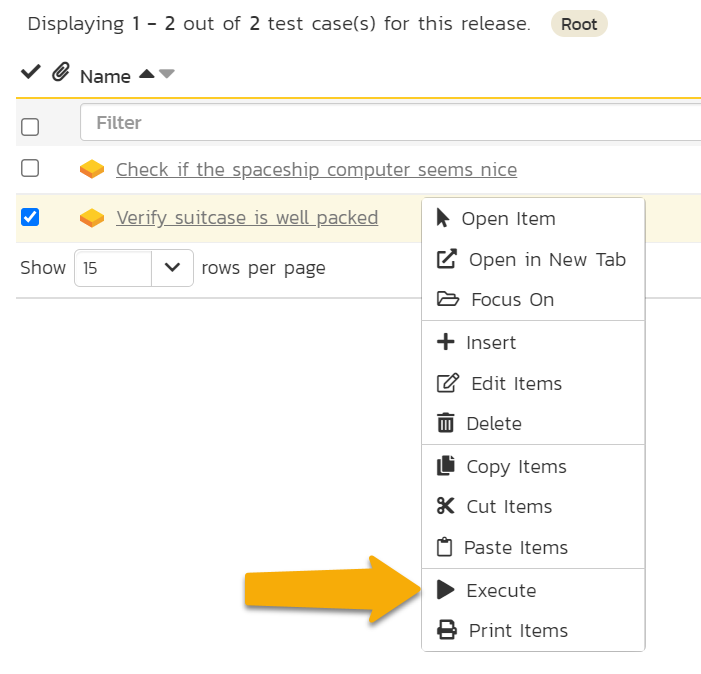

This will launch a popup showing you that the Test Run is being prepared for execution from the test case. Once it finishes, you will see the Test Execution Wizard. On this screen you can: pick a release to execute the test run against; and set any test run custom properties. You can see that the Release is currently set to "1.0.0.0 - Build Spaceship", because it is the first release in the list.

The test case is about our suitcase packing, which is part of our sprint to prepare for launch (release 2.0). So let's make sure to run the test against the correct release.

- [x] Select "2.0 - Prep for launch" from the Release dropdown
- [x] Click "Next" to load the main test execution window

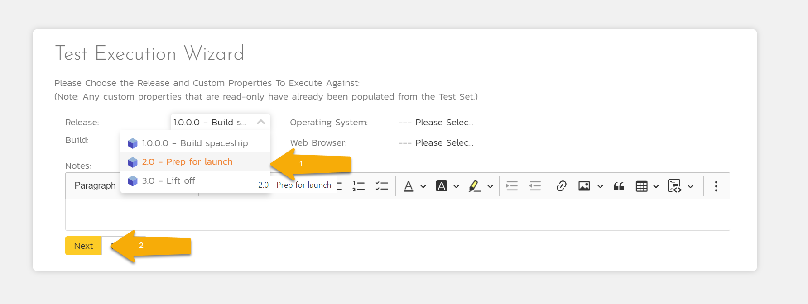

!!! faq ""
    When you go to this page for the first time, you can go through a guided tour of how the page works

As a tester, you move through each of the test steps in the test run in order. Each test step needs a result: Pass, Fail, Blocked, Caution, or Not Applicable (N/A). If you enter any status other than Pass you need to enter a value for the "Actual Result". For a pass status, the Actual Result is optional.

We only have one test step. If we thought our packing was great, we could mark the step as Passed. That means the whole test run has passed, so we could finish the test run and officially log its results. That's no fun, so let's do something else.

- [x] Click the "Fail" button. This tries to mark the test step as failed. But it can't. Not Yet. Because we haven't entered an Actual Result yet. When we click fail, our cursor is automatically placed in the "Actual Result" box.

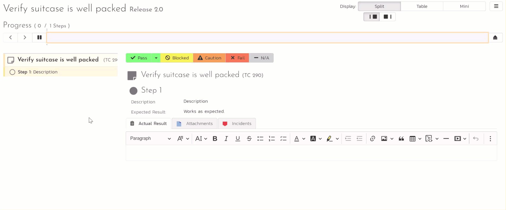

- [x] Let's enter an "Actual Result". Type `Cannot close suitcase because of all the snacks`
- [x] Click either of the "Fail" buttons. You can see that the test step is now clearly marked as failed (see #1 in the screenshot below). Because the whole test run (with its single step) has been tested we can (but we won't yet) finish the test run (see the "Finish" button at #2 in the screenshot below)

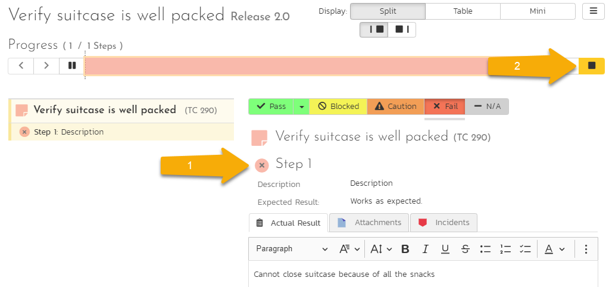

Before we finish testing, we have one more thing to do. We failed the test and now we should log this failure with an incident. 

!!! faq "Why create an incident?" 
    Creating an incident (or a bug) during testing is the perfect way to capture what is wrong so someone can fix it (like a developer, or here whoever has to pack the bags). The incident is linked to the exact test step that failed.
    
    You can then track this bug outside of testing. Once the bug is fixed, the tester can rerun the test case and see if things are fixed.

- [x] Click on the "Incidents" tab (this is just above where you typed in the actual result). This opens up a form we can fill in to record the incident
- [x] Enter a name of `There are too many snacks to fit in the suitcase`
- [x] Set the Type to "Bug"
- [x] Pick any value you want for the "Difficulty", "Operating System", and "Web Browser" fields. These aren't relevant to us, but are a part of a more general incident workflow that is typically used for testing web applications. No one thought to tweak it for interstellar vacations!
- [x] Click the "Add" button at the bottom. You don't have to enter a description for the incident - this is automatically generated based on the test step and its actual result

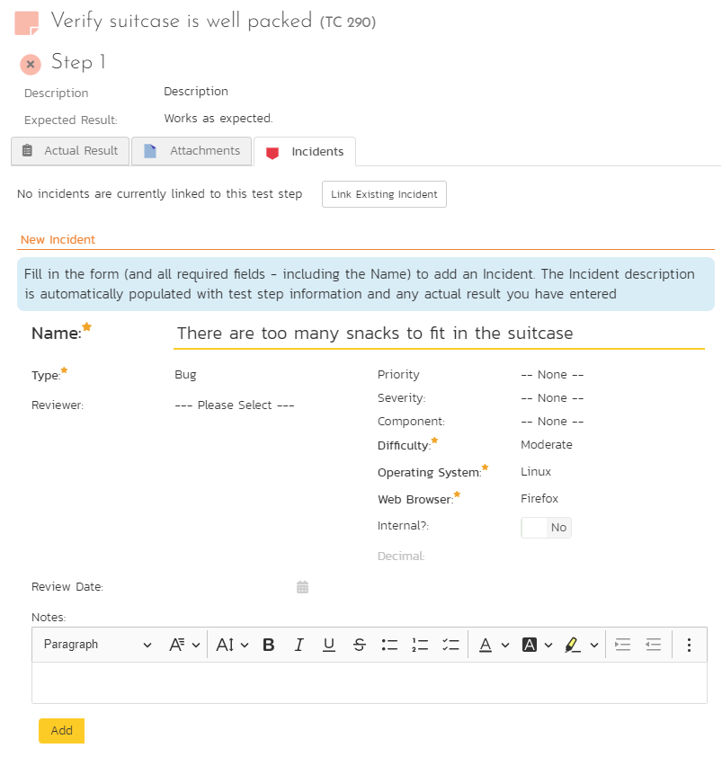

After clicking "Add" the incident is created and the Incident tab shows us that the incident is linked to this test step.

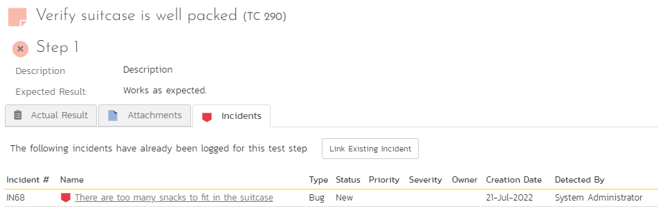

We are now ready to finish our test. 

- [x] Click the "Finish" button in the top right (the yellow button with the stop icon in it)
- [x] Click "OK" on the browser confirmation popup

This will take you back to the Test Case list page. Here we see the two test cases, and we can see that "Verify suitcase is well packed" is marked as failed.

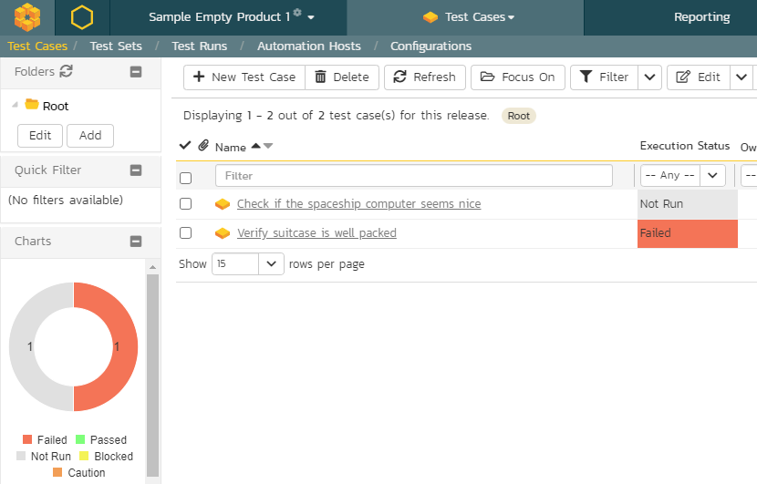

| Test Case Name                             | Execution Status |
|--------------------------------------------|------------------|
| Check if the spaceship computer seems nice | Not Run (gray)   |
| Verify suitcase is well packed             | Failed (red)     |

## Summary
**Almost there!** 

- We made a couple of test cases to check if our requirements are really complete, like we think
- We linked those test cases to the right requirements (and releases)
- We executed a test case using SpiraPlan's powerful test execution module
- We saw how to fail (or pass) a test and how to log bugs of things we find during testing

In the next and final part of this quick start guide we will review where things stand for our Mars vacation. How can SpiraPlan help us work out if we are ready to blast off, or if we are destined to stay stuck on Earth? Let's find out.