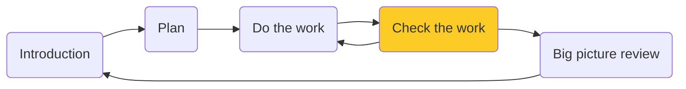

# Checking the Work

!!! tldr annotate "The story so far (1)"

    We are going on a vacation to Mars, (2). It's a long journey. We spent time planning the trip, and then doing the most important tasks. Before we blast off without a care in the world, let's check that we did everything right.

1.  :woman_raising_hand: Get a reminder or learn about the parts of the guide you missed (we recommend following the whole guide and it is pretty quick, but no pressure)
2.  :rocket: Because we want to and it sounds fun

## What are we Testing
There's a lot to check before going on any trip. All the more so when traveling over 100 million miles. We need to stay focused. We made a few releases and work happens in each. 

Let's focus on just one of those releases "Prep for launch". Three of our requirements should get delivered in this release / sprint. Because of our work in finishing tasks on these requirements, they all have a status of "developed". This is perfect, because it means the development (doing) work is done. The next step is to verify things. In SpiraPlan, we verify with the Test Case artifact. 

## Create some Tests
!!! info "If you are starting the quick start guide here"
    Don't worry! You can create tests and execute them without doing the earlier steps in this guide. Some of the details may not apply to you, importantly linking our tests to requirements and releases. But don't let that stop you.

{==

**Test Cases** are the main unit of testing in SpiraPlan. A Test Case defines a scenario or user flow that you want to verify. A Test Case is made up of Test Steps. These steps are the sequence of steps the tester needs to go through and check. Each test step is an opportunity to verify functionality is working as it should, or recording where there are problems.

First you create your test cases, then you execute them. Test execution records the results of what you did or found. You can execute the same test many times and keep a list of records of what happened each time. These are called Test Runs. This system means you have test cases that you can reuse very efficiently. Each test run logs the execution status of that run (eg pass or fail). Together with requirements and releases, test cases help you have full traceability across your whole product.

==}

- [x] Open the Artifact dropdown from the global navigation and click "Test Cases" under the Testing section. This shows the Test Case list page. The main list in the middle of the page is empty

- [x] Click the "New Test Case" button. The new test case is added to the list and highlighted in blue
- [x] Type the name of the test case into the "Name" box: `Verify suitcase is well packed`

- [x] Click the "Save and New" button on the far right of this new row. This adds a second test case
- [x] Give this second test case a name of `Check if the spaceship computer seems nice`
- [x] Finally, hit "Save"

This is great. We have already created two test cases. We could start running these tests now, but first let's hook these tests up to requirements and releases.

- [x] Check the checkbox for "Check if the spaceship computer seems nice"
- [x] Click the dropdown arrow next to "Tools" button in the toolbar to open the tools menu
- [x] Click "Add to Requirement" from the dropdown menu to open the popup dialog
- [x] Select "Prepare the spaceship" from the dialog's dropdown
- [x] Click "Add"

- [x] Let's repeat this for the other test case. Check the checkbox for "Verify suitcase is well packed"
- [x] Click the dropdown arrow next to "Tools" button and select "Add to Requirement" to open the popup dialog
- [x] Select "Pack my suitcase" from the dialog's dropdown, and then click "Add"

These steps link each test case to the correct requirement. Because the requirements are already connected to a release, the test cases are automatically linked to the correct releases. So by adding a requirement to a test case we also added a release. Neat. You can link many requirements to a test case. And you can independently add many releases to a test case as well. Our setup for now looks like this:

| Test Case Name                             | Requirement Coverage   | Release Coverage      |
|--------------------------------------------|------------------------|-----------------------|
| Check if the spaceship computer seems nice | Prepare the spaceship  | 2.0 - Prep for launch |
| Verify suitcase is well packed             | Pack my suitcase       | 2.0 - Prep for launch |

## Execute a Test Case