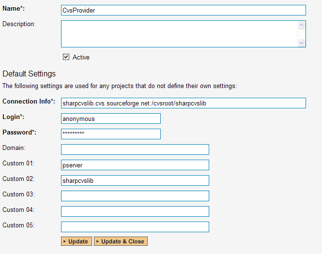
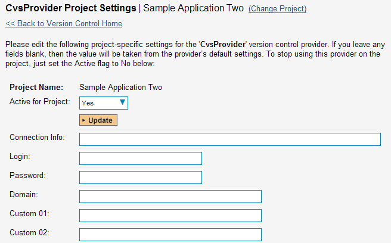
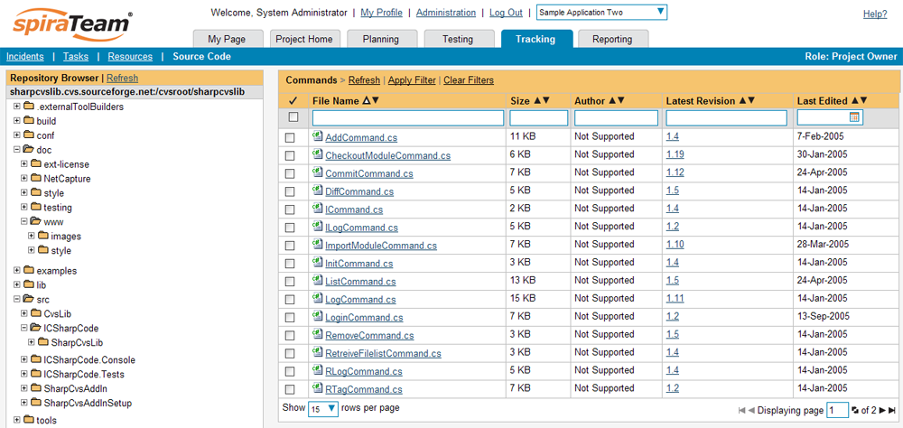
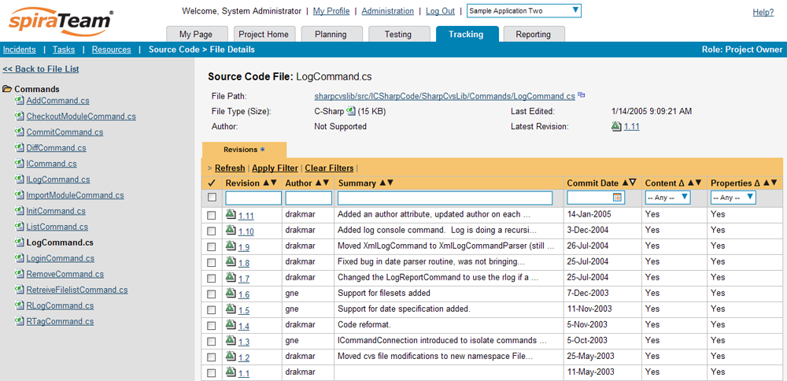
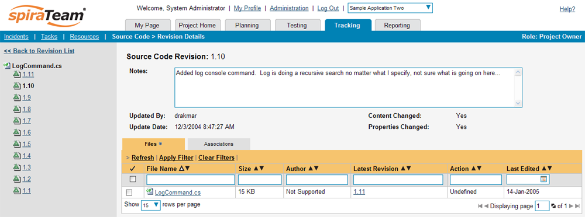
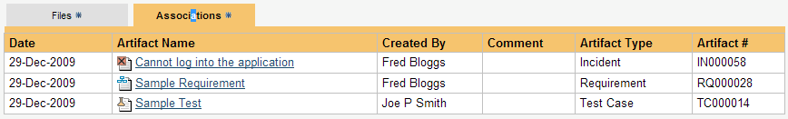

# Integrating with CVS

The Concurrent Versions System (CVS) is a Software Configuration
Management (SCM) system that enables users to work on code
simultaneously while preserving previous versions by avoiding collisions
in code edits. This plug-in will allow users of SpiraPlan or SpiraTeam
(hereafter referred to as SpiraTeam) to be able to browse a CVS
repository and view revisions linked to SpiraTeam artifacts.

The plug-in will download a working-copy of the CVS repository onto the
SpiraTeam server and use that for displaying the list of files/folders.
The list of revisions will be queries dynamically from the CVS
repository on an as-needed basis. The rest of this section outlines how
to install and use the plug-in with SpiraTeam.

*Note: The plug-in will allow users to download and view different
revisions of files and view revision logs, but no changes to the
repository are allowed through the plug-in.*

## Installing the CVS Plug-In To install the CVS Version Control plug-in, follow these steps:

-   ## Copy the following files from the plug-in zip-archive into the "VersionControl" sub-folder of the SpiraTeam installation:

-   CvsProvider.dll

-   DocsVision.Remoting.dll

-   ICSharpCode.SharpCvsLib.dll

-   ICSharpCode.SharpZipLib.dll

-   log4net.dll

-   Log in as the Administrator and go into SpiraTeam main
Administration page and click on the "Version Control" link under
**System**.

-   Click the "Add" button to enter the Plug-in details page. The fields
required are as follows:

-   **Name**: The name must be "CvsProvider".

-   **Description**: The description is for your use only, and does
not affect operation of the plug-in.

-   **Active**: If checked, the plug-in is active and able to be
used for any project.

-   **Connection Info**: This field holds the root of the repository
for any project accessing the plug-in, unless overridden in the
Project Settings. Please use the following format:

-   \<cvs repository url\>:/cvsroot/\<repository path\>

-   For example:
sharpcvslib.cvs.sourceforge.net:/cvsroot/sharpcvslib

-   **Login / Password**: The user id and the password of the user
to use while accessing and retrieving information from the CVS
server. If you are accessing a public repository anonymously,
just use "*anonymous*" for both username and password and it
will be handled correctly.

-   **Custom 01 --** This must contain the name of the connection
protocol being used to access the CVS server. The following
protocols are supported:

-   **pserver** - the first access protocol according to the
client-server scheme, the most simple and the fastest one.
Its imperfection - it transfers all the data unsecured. If
you need to secure codes and user passwords, do not use this
protocol in public nets.

-   **ext** or **ssh** - access protocol using SSH (Secure
Shell). It is used for accessing UNIX servers and it
supports all data encodings.

-   **sspi** - access protocol for Windows server with data
encoding support.

-   **Custom 02 --** This must contain the name of the *module* you
wish to access in the CVS repository.

-   When finished, click the "Insert" button and you will be taken back
to the Version Control integration list page, with CvsProvider
listed as an available plug-in.

-   Verify that you are in the correct project using the drop-down at
top, and click on the "Project Settings" link for the CvsProvider.
You will get a screen listing all the same configuration settings:

-   Be sure to change the Active field to Yes, or the repository
will not be available for the current project.

-   Any other settings entered on this page will override - and have
the same use as - the general settings that you created above.
You would use these settings if you will have more than one
project access different code repositories.

-   Initial setup is complete, click on the "Source Code" menu under the
Tracking tab to navigate and browse the source code repository.

## Using CVS with SpiraTeam

While being able to browse the source code repository can be useful in
itself, the real strength comes from linking artifacts in SpiraTeam -
including Incidents, Requirements, and Tasks - to revisions checked into
the software repository.

### Viewing the Repository Tree

View the source code tree by selecting the "Source Code" link under the
Tracking tab. You will get a screen similar to:

The folder tree of the repository is on the left, and files in the
current selected directory will be listed in the right table. Note that
this view will always show the current (HEAD) revision of the
repository. The file view will display the filename, the current
revision number of the file and the date of the last commit. You can
filter and sort on any of the columns, as well.

### Viewing File Details

To view the file details, click on a file in the right-hand side of the
repository. The file details page displays the details on the selected
revision. By default, it will be the HEAD revision, unless you clicked
to view the file details from a revision. By clicking on the file name,
you can download the specified revision of the file to your local
machine. This does not do an CVS checkout; you are merely downloading
the file to your local machine.

Underneath the file details is a list of all the revisions that this
file belongs in, or was committed to, who performed the commit, and the
log message for the commit. Throughout SpiraTeam, revisions are
indicated by the

 icon.

### Revision Details

By clicking on a revision in SpiraTeam, you will be taken to the
revision details page.

The revision details screen shows the log for the Commit, the commit
date and author. At the bottom of the page are two tabs, Files and
Associations. The Files tab lists all files that were a part of this
commit, with their full path, size, latest revision and date of edit.

The Associations tab shows any artifact (Incident, Requirement, Test
Case, Test Set) that the log message references. See section 3.2.4 for
information on how to link a revision with a CVS Commit:

### Linking Artifacts

Linking an artifact is quite simple. To maintain the readability of CVS
commit messages, we adopted a square bracket token. The token is in the
format of:

**\[\<artifact identifier\>:\<artifact id\>\]**

The first half, the Artifact Identifier, is a two-letter code that is
used throughout SpiraTeam, and is visible on almost every page in the
application. For example, a requirement's identifier is "**RQ**".
Incidents are "**IN**", and test cases are "**TC**". The artifact ID is
the number of the artifact. So by creating a commit message that reads:

SpiraTeam will automatically detect tokens and will include links to
them under the Associations tab for a revision detail.

## Troubleshooting

While integration with CVS is rather complex, as a user you will only
receive a couple of errors that will prevent the integration from
working:

-   When you first load the list of folders and files for a repository
> it may take several minutes to load as it's downloading the entire
> repository from the CVS server to the SpiraTeam server. This delay
> will not occur on subsequent views of the page.

-   SpiraTeam will not display the login page, and there is an error
> (either on the page or in the Application Event Log) that says
> "Could not load file or assembly.". If this error occurs, it is
> most likely that the CvsProvider.dll or some of its dependent
> assemblies were not correctly placed in the VersionControl folder
> of the SpiraTeam installation.

-   SpiraTeam reports that the login information is incorrect. In this
> case, double check the Version Control settings, both for the
> Project (which overrides the general settings) and the general
> settings. Project settings will over-ride the general settings. Be
> sure to use a user that has access to all nodes in the tree
> starting from the root repository location.

-   If you are taken back to the repository screen and given a message
> saying that the requested file was deleted from the system, this
> means that an attempt was made to view details on a file that is
> no longer part of the HEAD revision. This can happen when a file
> is deleted or renamed, and this is a normal condition in the code
> repository, not necessarily an error with CVS or SpiraTeam.

## Data Purging

Since the integration with CVS requires that a working copy of the CVS
repository be stored on the SpiraTeam server, you may decide at some
point to unlink a disused CVS repository from SpiraTeam to save
disk-space. However unlinking the repository through the SpiraTeam web
interface will not remove the working copy of the repository from the
server.

To permanently remove a repository from the SpiraTeam server, you need
to locate the following path:

-   **(Windows XP, 2003)** - C:\\Documents and Settings\\All
Users\\Application Data

-   **(Windows 2008, 7, Vista)** -- C:\\ProgramData

If you look inside this folder, you will see a subfolder called
"Inflectra", and under that will be a subfolder called "CvsProvider". If
you open up this subfolder, you will see a list of all the CVS modules
that have been accessed through SpiraTeam. To purge a module, just
select it and choose the Delete Folder option in Windows.

