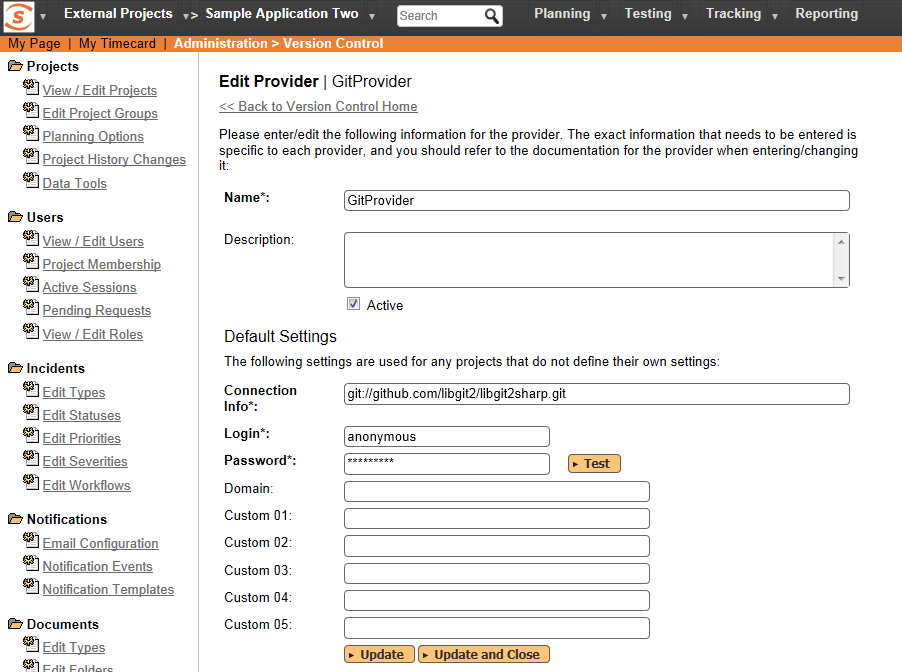

# Integrating with Git

Git is a Distributed Version Control System (DVCS) system that keeps
track of software revisions and allows many developers to work on a
given project without necessarily being connected to a common network
since it doesn't rely on a central repository, but instead distributes
copies of the entire source code repository to each user's workstation.

The SpiraTeam plug-in for Git allows users of SpiraPlan or SpiraTeam
(hereafter referred to as SpiraTeam) to be able to browse a Git
repository and view revisions linked to SpiraTeam artifacts.

The plug-in will clone a read-only "bare" (i.e. no working folder) copy
of the Git repository onto the SpiraTeam server and use that for
displaying the list of branches/files/folders/revisions. The plug-in
also performs 'pull' requests from the specified remote repository to
ensure that the local bare repository remains up to date.

The rest of this section outlines how to install and use the plug-in
with SpiraTeam.

The current version of the Git plugin requires SpiraPlan or SpiraTeam
v4.2.0.2 or later.

*Note: The plug-in will allow users to download and view different
revisions of files and view revision logs, but no changes to the
repository are allowed through the plug-in.*

## Installing the Git Plug-In To install the Git Version Control plug-in, follow these steps:

-   Copy the following files from the plug-in zip-archive into the
"VersionControl" sub-folder of the SpiraTeam installation:

-   GitProvider.dll

-   Inflectra.Global.dll

-   LibGit2Sharp.dll

-   If your server operating system is 64-bit, then copy "**git2.dll**"
from the "**x64**" directory of the downloaded plug-in zip file into
the "VersionControl" sub-folder of the SpiraTeam installation.
*Note: Do not create an x64 folder under VersionControl, make sure
the file lives in the VersionControl folder itself.*

-   If your server operating system is 32-bit, then copy "**git2.dll**"
from the "**x32**" directory of the downloaded plug-in zip file into
the "VersionControl" sub-folder of the SpiraTeam installation.
*Note: Do not create an x32 folder under VersionControl, make sure
the file lives in the VersionControl folder itself.*

-   Log in as the Administrator and go into SpiraTeam main
Administration page and click on the "Version Control" link under
**System**.

-   Click the "Add" button to enter the Plug-in details page. The fields
required are as follows:\

-   **Name**: The name must be "GitProvider".

-   **Description**: The description is for your use only, and does
not affect operation of the plug-in.

-   **Active**: If checked, the plug-in is active and able to be
used for any project.

-   **Connection Info**: This field holds the clone URL of the
repository for any project accessing the plug-in, unless
overridden in the Project Settings:

-   For example:\
git://github.com/henon/GitSharp.git\
http://github.com/user/repo.git

-   **Login / Password**: The user id and the password of the user
to use while accessing and retrieving information from the
remote Git repository. If you are accessing a public repository
anonymously, just use "*anonymous*" for both username and
password and it will be handled correctly.

-   **Custom 01** -- By default, SpiraTeam will store a copy of the
Git working directory in the
C:\\ProgramData\\Inflectra\\Spira\\GitProvider\\URL folder
(where URL is the Git connection URL). If you would like to use
an override location for the Git repository, you should specify
it in this setting (e.g. C:\\Git\\Repositories)

-   **Custom 02 -- Custom 05** -- Not used by this plugin.

-   When finished, click the "Insert" button and you will be taken back
to the Version Control integration list page, with GitProvider
listed as an available plug-in.

-   Verify that you are in the correct project using the drop-down at
top, and click on the "Project Settings" link for the GitProvider.
You will get a screen listing all the same configuration settings:\

-   Be sure to change the Active field to Yes, or the repository
will not be available for the current project.

-   Any other settings entered on this page will override - and have
the same use as - the general settings that you created above.
You would use these settings if you will have more than one
project access different code repositories.

-   Initial setup is complete, click on the "Source Code" menu under the
Tracking tab to navigate and browse the source code repository.

## Using Git with SpiraTeam

While being able to browse the source code repository can be useful in
itself, the real strength comes from linking artifacts in SpiraTeam -
including Incidents, Requirements, and Tasks - to revisions checked into
the software repository.

### Viewing the Repository Tree

View the source code tree by selecting the "Source Code" link under the
Tracking tab. You will get a screen similar to:

The folder tree of the repository is on the left, and files in the
current selected directory will be listed in the right table. The file
view will display the filename, the current revision number of the file
and the date of the last commit. You can filter and sort on any of the
columns, as well.

The page will display the folders and files for the currently selected
branch (in the example above "master"), you can change the current
branch at any time by selecting it from the dropdown menu:

### Viewing File Details

To view the file details, click on a file in the right-hand side of the
repository. The file details page displays the details on the selected
revision. By default, it will be the latest revision in the current
branch, unless you clicked to view the file details from a revision. By
clicking on the file name, you can download the specified revision of
the file to your local machine. This does not do a Git clone or pull;
you are merely downloading the file to your local machine.

Underneath the file details are tabs that show a preview of the file
(with syntax highlighting), a list of all the revisions that this file
belongs in, or was committed to, who performed the commit, and the log
message for the commit, and a tab that shows any artifact associations.
Throughout SpiraTeam, revisions are indicated by the

 icon:

### Revision Details

By clicking on a revision in SpiraTeam, you will be taken to the
revision details page.

The revision details screen shows the log for the commit, the commit
date and author. At the bottom of the page are two tabs, Files and
Associations. The Files tab lists all files that were a part of this
commit, with their full path, size, latest revision and date of edit.

The Associations tab shows any artifact (Incident, Requirement, Test
Case, Test Set) that the log message references. See section 8.2.4 for
information on how to link a revision with a Git commit:

### Linking Artifacts

Linking an artifact is quite simple. To maintain the readability of Git
commit messages, we adopted a square bracket token. The token is in the
format of:

**\[\<artifact identifier\>:\<artifact id\>\]**

The first half, the Artifact Identifier, is a two-letter code that is
used throughout SpiraTeam, and is visible on almost every page in the
application. For example, a requirement's identifier is "**RQ**".
Incidents are "**IN**", and test cases are "**TC**". The artifact ID is
the number of the artifact. So by creating a commit message that reads:

SpiraTeam will automatically detect tokens and will include links to
them under the Associations tab for a revision detail.

If you forget to add the association during the commit, you can use the
'Add Association' option within SpiraTeam to add the association after
the fact.

## Troubleshooting

While integration with Git is sophisticated behind the scenes, as a user
you will only receive a couple of errors that will prevent the
integration from working:

-   When you first load the list of folders and files for a repository
> it may take several minutes to load as it's cloning the entire
> 'bare' repository from the remote Git server to the SpiraTeam
> server. This delay will not occur on subsequent views of the page.

-   SpiraTeam will not display the login page, and there is an error
> (either on the page or in the Application Event Log) that says
> "Could not load file or assembly.". If this error occurs, it is
> most likely that the GitProvider.dll or some of its dependent
> assemblies were not correctly placed in the VersionControl folder
> of the SpiraTeam installation.

-   SpiraTeam reports that the login information is incorrect. In this
> case, double check the Version Control settings, both for the
> Project (which overrides the general settings) and the general
> settings. Project settings will over-ride the general settings. Be
> sure to use a user that has access to all nodes in the tree
> starting from the root repository location.

-   If you are taken back to the repository screen and given a message
> saying that the requested file was deleted from the system, this
> means that an attempt was made to view details on a file that is
> no longer part of the current branch. This can happen when a file
> is deleted or renamed, and this is a normal condition in the code
> repository, not necessarily an error with Git or SpiraTeam.

## Data Purging

Since the integration with Git requires that a bare copy of the Git
repository be stored on the SpiraTeam server, you may decide at some
point to unlink a disused Git repository from SpiraTeam to save
disk-space. However unlinking the repository through the SpiraTeam web
interface will not remove the bare copy of the repository from the
server.

To permanently remove a repository from the SpiraTeam server, you need
to locate the following path:

-   **(Windows XP, 2003)** - C:\\Documents and Settings\\All
Users\\Application Data\\Inflectra

-   **(Windows 2008, 7, Vista)** -- C:\\ProgramData\\Inflectra

If you look inside this folder, you will see a subfolder called "Spira",
and under that will be a subfolder called "GitProvider". If you open up
this subfolder, you will see a list of all the Git repositories that
have been accessed through SpiraTeam. To purge a module, just select it
and choose the Delete Folder option in Windows.

