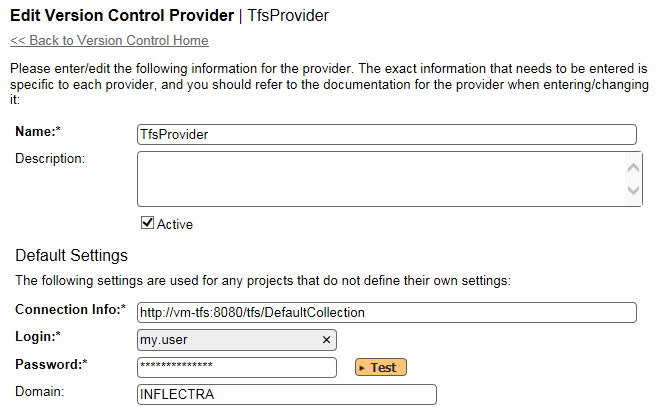
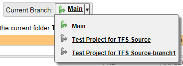
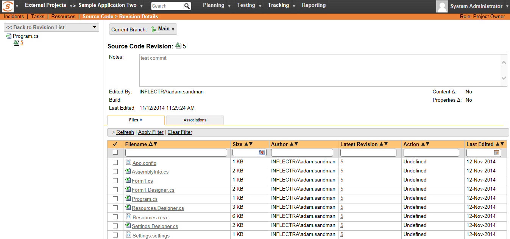

# Integrating with TFS

Microsoft Visual Studio Team System (VSTS) Team Foundation Server (TFS)
from Microsoft® (hereafter referred to as TFS) is a Software
Configuration Management (SCM) system that enables users to work on code
simultaneously while preserving previous versions by avoiding collisions
in code edits. This plug-in will allow users of SpiraPlan or SpiraTeam
(hereafter referred to as SpiraTeam) to be able to browse a TFS
repository and view revisions linked to SpiraTeam artifacts. There are
separate plug-ins for TFS 2005/2008, 2010 and 2012+. When connecting to
a TFS 2010/2012+ repository, the connection URL will also need to be in
a different format (see below).

While users working on the code will usually have a complete copy of the
repository on their local systems, this plug-in will access the TFS
repository remotely. The rest of this section outlines how to install
and use the plug-in with SpiraTeam.

*Note: The plug-in will allow users to download and view different
revisions of files and view revision logs, but no changes to the
repository are allowed through the plug-in.*

## Installing the TFS Plug-In To install the TFS Version Control plug-in, follow these steps:

-   ## Download the appropriate TFS provider from the Inflectra website (http://www.inflectra.com/SpiraTeam/Downloads.aspx) -- there are separate versions for TFS 2005/2008, 2010 and TFS 2012 or later.

-   ## Copy the following files from the plug-in zip-archive into the "VersionControl" sub-folder of the SpiraTeam installation:

-   Microsoft.TeamFoundation.Client.dll

-   Microsoft.TeamFoundation.Common.dll

-   Microsoft.TeamFoundation.Common.Library.dll

-   Microsoft.TeamFoundation.dll

-   Microsoft.TeamFoundation.VersionControl.Client.dll

-   Microsoft.TeamFoundation.VersionControl.Common.dll

-   Microsoft.TeamFoundation.VersionControl.Common.Integration.dll

-   TfsProvider.dll

-   Log in as the Administrator and go into SpiraTeam main
Administration page and click on the "Version Control" link under
**System**.

-   Click the "Add" button to enter the Plug-in details page. The fields
required are as follows:\

-   **Name**: The name must be "TfsProvider".

-   **Description**: The description is for your use only, and does
not affect operation of the plug-in.

-   **Active**: If checked, the plug-in is active and able to be
used for any project.

-   **Connection Info**: This field points to the URL used for
accessing the Team Foundation Server. Typically TFS runs on
website port 8080, but you may need to check with your IT
administrator to verify. The exact connection URL will depend on
your version of TFS:

-   **For TFS 2005 / 2008:**

-   <http://myservname:8080>

-   **For TFS 2010**

-   <http://myservname:8080/tfs/projectcollection>

-   Where "projectcollection" is the name of the project
collection you will be connecting to

-   **For TFS 2012 or later**

-   <http://myservname:8080/tfs/projectcollection>

-   Where "projectcollection" is the name of the project
collection you will be connecting to

-   **Login / Password**: The user id and the password of the user
to use while accessing and retrieving information from the TFS
repository. If the repository doesn't require a
username/password, just use "*anonymous"* as both the username
and password.

-   **Domain:** This is the Windows Domain that the TFS server is a
member of. If the machine is not part of a domain, you should
just use the TFS server name instead. **If you are connecting to
a hosted Visual Studio Online (VSO) repository, you should leave
the Domain blank.**

-   **Custom01 -- 05:** are not used by the TFS plug-in and can be
ignored

-   When finished, click the "Insert" button and you will be taken back
to the Version Control integration list page, with TfsProvider
listed as an available plug-in.

-   Verify that you are in the correct project using the drop-down at
top, and click on the "Project Settings" link for the TfsProvider.
You will get a screen listing all the same configuration settings:\

-   Be sure to change the Active field to Yes, or the repository
will not be available for the current project.

-   **Custom 01:** This should contain the name of the equivalent
team project in TFS.

-   **Custom 02 -- 05:** are not used by the TFS plug-in and can be
ignored

-   Any other settings entered on this page will override - and have
the same use as - the general settings that you created above.
You would use these settings if you will have more than one
project access different code repositories.

-   Initial setup is complete, click on the "Source Code" menu under the
Tracking tab to navigate and browse the source code repository.

## Using TFS with SpiraTeam

Whilst being able to browse the source code repository can be useful in
itself, the real strength comes from linking artifacts in SpiraTeam -
including Incidents, Requirements, and Tasks - to revisions checked into
the TFS repository.

### Viewing the Repository Tree

View the source code tree by selecting the "Source Code" link under the
Tracking tab. You will get a screen similar to:

The folder tree of the repository is on the left, and files in the
current selected directory will be listed in the right table. Note that
this view will always show the most recent revision of the database. The
file view will display the filename, the current revision number of the
file and the date of the last check-in. You can filter and sort on any
of the columns, as well.

The page will display the folders and files for the currently selected
branch (in the example above "Main"), you can change the current branch
at any time by selecting it from the dropdown menu:

### Viewing File Details

To view the file details, click on a file in the right-hand side of the
repository. The file details page displays the details on the selected
revision. By default, it will be the most recent revision, unless you
clicked to view the file details from a revision. By clicking on the
file name, you can download the specified revision of the file to your
local machine. This does *[not]{.underline}* do a TFS checkout; you are
merely downloading the file to your local machine.

Underneath the file details is a preview of the contents of the source
code file (with syntax coloring to make it easier to read).

In addition, there are two other tabs that display the list of all the
revisions made to this file and any associations with other SpiraTeam
artifacts:

The revision list will display the name of the revision, who performed
the revision, and the log message for the action performed. Throughout
SpiraTeam, revisions are indicated by the

 icon.

The association list will display the list of SpiraTeam artifacts that
are linked to this specific source code file. You can add a new
association by clicking on the 'Add Association' hyperlink.

### Revision Details

By clicking on a revision in SpiraTeam, you will be taken to the
revision details page.

The revision details screen shows the log for the action performed, the
date and author. At the bottom of the page are two tabs, Files and
Associations. The Files tab lists all files that were a part of this
revision, with their full path, latest revision and date of edit.

The Associations tab shows any artifact (Incident, Requirement, Test
Case, Test Set) that the log message references. See section 5.2.4 for
information on how to link a revision with a TFS check-in or other
action:

### Linking Artifacts

Linking an artifact is quite simple. To maintain the readability of TFS
check-in messages, we adopted a square bracket token. The token is in
the format of:

**\[\<artifact identifier\>:\<artifact id\>\]**

The first half, the Artifact Identifier, is a two-letter code that is
used throughout SpiraTeam, and is visible on almost every page in the
application. For example, a requirement's identifier is "**RQ**".
Incidents are "**IN**", and test cases are "**TC**". The artifact ID is
the number of the artifact. So by creating a commit message that reads:

SpiraTeam will automatically detect tokens and will include links to
them under the Associations tab for a revision detail.

If you forget to add the association during the commit, you can use the
'Add Association' option within SpiraTeam to add the association after
the fact.

## Troubleshooting

While integration with TFS is rather sophisticated behind the scenes, as
a user you will only receive a couple of errors that will prevent the
integration from working:

-   SpiraTeam will not display the login page, and there is an error
> (either on the page or in the Application Event Log) that says
> "Could not load file or assembly.". If this error occurs, it is
> most likely that the TfsProvider.dll or some of its dependent
> assemblies were not correctly placed in the VersionControl folder
> of the SpiraTeam installation.

-   SpiraTeam reports that the login information is incorrect. In this
> case, double check the Version Control settings, both for the
> Project (which overrides the general settings) and the general
> settings. Project settings will over-ride the general settings. Be
> sure to use a user that has access to all nodes in the tree
> starting from the root repository location.

-   If you are taken back to the repository screen and given a message
> saying that the requested file was deleted from the system, this
> means that an attempt was made to view details on a file that was
> deleted in TFS. This is a normal condition in the code repository,
> not necessarily an error with TFS or SpiraTeam.

## Enforcing Associations with a Custom Policy

As described in section 5.2.4 above, you can easily associate check-ins
of code in TFS with relevant SpiraTeam artifacts by adding the
appropriate artifact identifier in the commit messages.

In order to enforce this process, one of our customers has written a
custom Visual Studio 2008 and 2010/2012+ Team System check-in policy
that will force users to enter at least one SpiraTeam artifact in each
of the check-in comments. This policy will also check the IDs of the
supplied artifacts to make sure they exist in the appropriate SpiraTeam
installation.

To install the custom check-in policy, you should download the
SpiraPolicySetup.msi (for 2008) or SpiraPolicy.vsix (for 2010+)
installation package from the Add-Ons/Downloads section of the Inflectra
website (<http://www.inflectra.com/SpiraTeam/Downloads.aspx>) and run
the installation package on each workstation that has Visual Studio
installed. Once this installation has been completed, you need to tell
Visual Studio to add the custom check-in policy:

1.  Inside Visual Studio, go to Team \> Team Project Settings \> Source
Control to open up the Source Code extensions dialog box:\
\

2.  Click on the Check-in Policy tab to list the various check-in
policies:\
\

3.  Click on the \[Add...\] button to add a new check-in policy:\

4.  Select the SpiraTeam/Plan TFS check-in Policy and click \[OK\]. This
will bring up the SpiraTeam custom policy configuration dialog box:\

5.  Enter the URL for the SpiraTeam server (you only need the server
name and virtual directory portion) as well as a valid login and
password. Then click \[Connect\] to get the list of projects.

6.  Select the checkboxes for which artifact types you want to be
included in the artifact enforcement and click the \[OK\] button to
confirm the settings.

7.  Now when a user checks-in a change to the TFS source code
repository, they will be required to enter at least one SpiraTeam
artifact, and the system will check to make sure that artifact
actually exists in the specified project.

