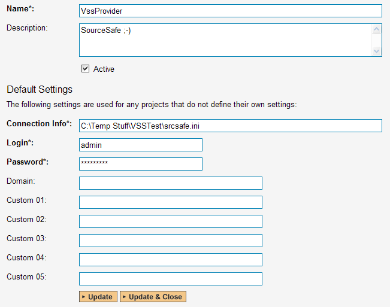
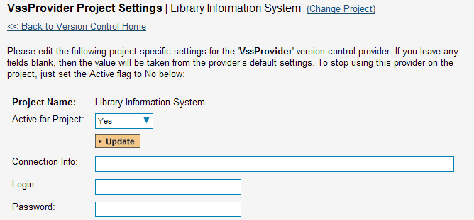
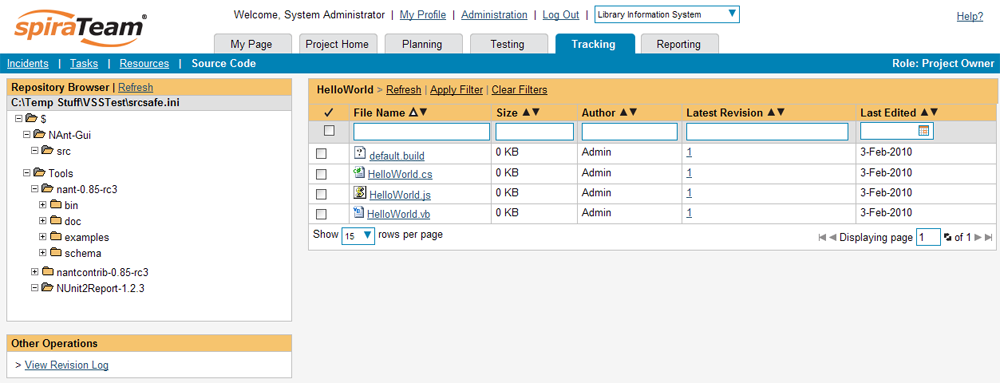
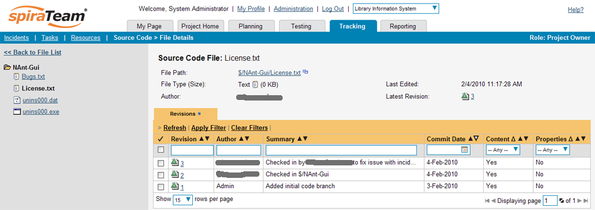
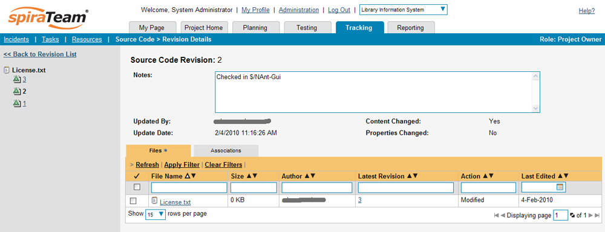
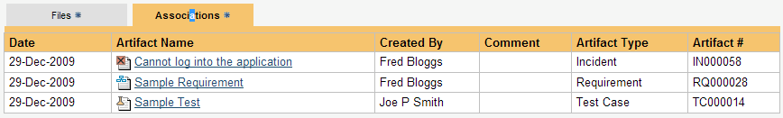

# Integrating with VSS

Visual SourceSafe® (VSS) from Microsoft® is a Software Configuration
Management (SCM) system that enables users to work on code
simultaneously while preserving previous versions by avoiding collisions
in code edits. This plug-in will allow users of SpiraPlan or SpiraTeam
(hereafter referred to as SpiraTeam) to be able to browse a VSS database
and view revisions linked to SpiraTeam artifacts.

While users working on the code will usually have a complete copy of the
repository on their local systems, this plug-in will access the VSS
database remotely.The rest of this section outlines how to install and
use the plug-in with SpiraTeam.

*Note: The plug-in will allow users to download and view different
revisions of files and view revision logs, but no changes to the
repository are allowed through the plug-in.*

## Installing the VSS Plug-In To install the VSS Version Control plug-in, follow these steps:

-   ## Install a copy of Visual SourceSafe on the same server that is running SpiraTeam (if it is already installed on the server, you can disregard this step).

-   ## Copy the following files from the plug-in zip-archive into the "VersionControl" sub-folder of the SpiraTeam installation:

-   VssProvider.dll

-   SourceSafe.Interop.dll

-   Log in as the Administrator and go into SpiraTeam main
Administration page and click on the "Version Control" link under
**System**.

-   Click the "Add" button to enter the Plug-in details page. The fields
required are as follows:\

-   **Name**: The name must be "VssProvider".

-   **Description**: The description is for your use only, and does
not affect operation of the plug-in.

-   **Active**: If checked, the plug-in is active and able to be
used for any project.

-   **Connection Info**: This field points to the filepath where the
srcsafe.ini file is located (which contains the VSS database
information).

-   For example: C:\\VssDatabases\\Project1\\srcsafe.ini

-   **Login / Password**: The user id and the password of the user
to use while accessing and retrieving information from the VSS
database. If the repository doesn't require a password, just use
"*anonymous"* as the password.

-   **Domain:** is not used by the VSS plug-in and can be ignored

-   **Custom01 -- 05:** are not used by the VSS plug-in and can be
ignored

-   When finished, click the "Insert" button and you will be taken back
to the Version Control integration list page, with VssProvider
listed as an available plug-in.

-   Verify that you are in the correct project using the drop-down at
top, and click on the "Project Settings" link for the VssProvider.
You will get a screen listing all the same configuration settings:\

-   Be sure to change the Active field to Yes, or the repository
will not be available for the current project.

-   Any other settings entered on this page will override - and have
the same use as - the general settings that you created above.
You would use these settings if you will have more than one
project access different code repositories.

-   Initial setup is complete, click on the "Source Code" menu under the
Tracking tab to navigate and browse the source code database.

## Using VSS with SpiraTeam

While being able to browse the source code repository can be useful in
itself, the real strength comes from linking artifacts in SpiraTeam -
including Incidents, Requirements, and Tasks - to revisions checked into
the VSS database.

### Viewing the Repository Tree

View the source code tree by selecting the "Source Code" link under the
Tracking tab. You will get a screen similar to:

The folder tree of the repository is on the left, and files in the
current selected directory will be listed in the right table. Note that
this view will always show the most recent revision of the database. The
file view will display the filename, the current revision number of the
file and the date of the last check-in. You can filter and sort on any
of the columns, as well.

### Viewing File Details

To view the file details, click on a file in the right-hand side of the
repository. The file details page displays the details on the selected
revision. By default, it will be the most recent revision, unless you
clicked to view the file details from a revision. By clicking on the
file name, you can download the specified revision of the file to your
local machine. This does *[not]{.underline}* do a VSS checkout; you are
merely downloading the file to your local machine.

Underneath the file details is a list of all the revisions made to this
file, who performed the revision, and the log message for the action
performed. Throughout SpiraTeam, revisions are indicated by the

 icon.

### Revision Details

By clicking on a revision in SpiraTeam, you will be taken to the
revision details page.

The revision details screen shows the log for the action performed, the
date and author. At the bottom of the page are two tabs, Files and
Associations. The Files tab lists all files that were a part of this
revision, with their full path, latest revision and date of edit.

The Associations tab shows any artifact (Incident, Requirement, Test
Case, Test Set) that the log message references. See section 4.2.4 for
information on how to link a revision with a VSS check-in or other
action:

### Linking Artifacts

Linking an artifact is quite simple. To maintain the readability of VSS
check-in messages, we adopted a square bracket token. The token is in
the format of:

**\[\<artifact identifier\>:\<artifact id\>\]**

The first half, the Artifact Identifier, is a two-letter code that is
used throughout SpiraTeam, and is visible on almost every page in the
application. For example, a requirement's identifier is "**RQ**".
Incidents are "**IN**", and test cases are "**TC**". The artifact ID is
the number of the artifact. So by creating a commit message that reads:

SpiraTeam will automatically detect tokens and will include links to
them under the Associations tab for a revision detail.

## Troubleshooting

While integration with VSS is rather complex behind the scenes, as a
user you will only receive a couple of errors that will prevent the
integration from working:

-   SpiraTeam will not display the login page, and there is an error
> (either on the page or in the Application Event Log) that says
> "Could not load file or assembly.". If this error occurs, it is
> most likely that the VssProvider.dll or some of its dependent
> assemblies were not correctly placed in the VersionControl folder
> of the SpiraTeam installation.

-   SpiraTeam reports that the login information is incorrect. In this
> case, double check the Version Control settings, both for the
> Project (which overrides the general settings) and the general
> settings. Project settings will over-ride the general settings. Be
> sure to use a user that has access to all nodes in the tree
> starting from the root repository location.

-   If you are taken back to the repository screen and given a message
> saying that the requested file was deleted from the system, this
> means that an attempt was made to view details on a file that was
> deleted or destroyed in VSS. This is a normal condition in the
> code repository, not necessarily an error with VSS or SpiraTeam.

-   If you have the VSS database located on a remote file-share on a
> separate server to SpiraTeam, you will need to modify the identify
> used by the IIS Application Pool running SpiraTeam. By default the
> IIS Application Pool will run as the special Windows user "NETWORK
> SERVICE". Whilst this is a secure account with low privileges for
> normal use of the system, it may not have sufficient permissions
> to access the VSS repository over your Local Area Network (LAN).
> We recommend changing the IIS Application Pool to instead run as a
> Windows Domain user that has permissions to access the remote
> file-share containing the VSS database.

