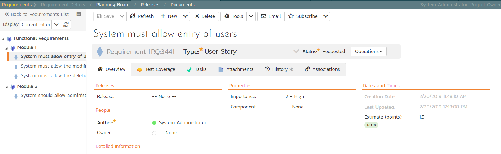

# Adding Requirement Tasks

We have defined the high-level schedule for Release 1.0. The next stage
is to have the developers take each of the requirements defined so far
and define the various tasks needed to deliver them. Each task will have
its own estimate associated with it. In addition, you can optionally
specify date-ranges and priorities to each of the individual tasks.

To start adding tasks, go to the main navigation bar and click out of
Releases and hit Requirements to display the requirements list. Click on
the hyperlink for the first requirement ("System must allow entry of
users") and the requirement's details page will be displayed:

*Notice that under 'Dates and Times' column on the right, the system
displays an initial resource estimate of 1.5 points and 12 hours. This
is based on an initial product setting of 8 hours per story point. Once
you start adding tasks and getting metrics based on the actual team
velocity (how many story points they can accomplish in a given time
frame), the system can update that conversion metric.*

Click on the 'Tasks' tab to display the list of tasks defined for this
requirement. The list is empty, so let's change that:

1.  Because we want to enter the estimated effort for each task, before
entering the tasks, first click on the 'Show/Hide Columns' dropdown
list and hit the 'Show Est. Effort' column.

2.  Click the 'New Task' button (this adds a new task and associated it
with this requirement)

3.  Set the task's name to "Create user data tables"

4.  Choose a 'Priority' level

5.  Set the 'Est. effort' to 10.0h.

6.  Click 'Save'.

The new task has now been added:

We have more tasks to add. The table below shows 12 tasks in total to
add to 4 different requirements. This includes the one we just created
for completeness.

| **Requirement / Task**            | **Est. Estimate**                 |
|-----------------------------------|-----------------------------------|
<td colspan="2"><b>System must allow entry of users</b></td>
| Create user data tables         | 10.0h                             |
| Develop user business object    | 10.0h                             |
| Build user creation screens     | 20.0h                             |
<td colspan="2"><b>System must allow the modification of users</b></td>
| Extend user business object to handle updates | 5.0h                              |
| Add user list page              | 15.0h                             |
| Add user details page           | 20.0h                             |
| Add user permissions page       | 15.0h                             |
<td colspan="2"><b>System must allow the deletion of users</b></td>
| Extend user business object to handle deletes | 5.0h                              |
| Update user list page to add delete functionality   | 10.0h                             |
<td colspan="2"><b>System should allow administrators to setup notifications</b></td>
| Create user administration home  | 15.0h                             |
| Add user settings for notifications to database          | 10.0h                             |
| Create user notifications administration page      | 20.0h                             |

On the main Navigation bar, click again on 'Requirements'. You should
now have the following requirements list page. In this screenshot we
have hidden the 'Author' field and shown the 'Task Effort' field to show
the detailed task effort aggregated up to the requirements.

The total number of hours for these tasks divided by the total number of
story points, gives a number a lot more than the 8 hours that the system
assumes. We can update the system to better estimate then number of
hours to deliver each story point.

To update the metric, go to the three cogs dropdown menu on the
rightmost corner of the main Navigation Bar, locate Planning and click
Planning Options:

As you can see, the system lists 8.0 hours as the current number of
hours required to deliver a single story point of functionality. Now
that we have some actual tasks in the product, click on the 'Suggest
'button to have the system provide its suggestion of the new metric:

Click the 'Apply' button to update the planning metric, and then click
the main 'Save' button at the very bottom of the page to confirm the
change.

