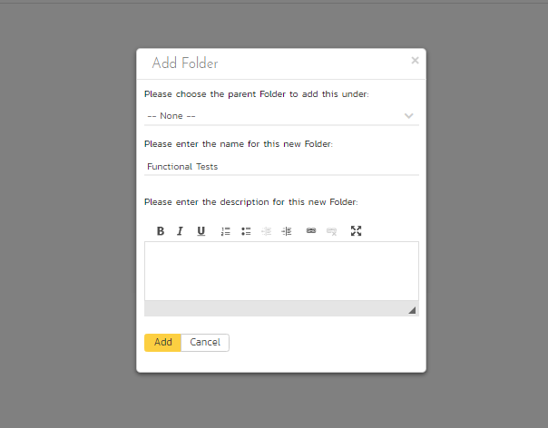

# Adding the Test Cases

Click on the Artifacts \> Test Cases menu option to display the
product's test case list page:

The test case list is empty and the only folder visible in the 'Folders'
tree on the left-hand side is 'Root'.

1.  Click on the 'Add' button underneath the folder tree,

2.  Enter the new folder name 'Functional Tests'.

3.  Click 'Add'.

4.  You now have a new folder in the 'Folders' tree view. To show it,
click 'Refresh'.

5.  Click on this folder from the 'Folders' tree on the left

6.  Click 'New Test Case' from the toolbar.

7.  Enter "Test ability to add new users" for the name of this new test
case

8.  Click 'Save And New'

9.  Repeat the above steps to create 3 more test cases:

<!-- -->

1.  Test ability to edit existing users

2.  Test ability to delete existing users

3.  Test ability to edit notifications

You should now have the following test case list:

Next, we need to enter detailed test steps to each test case, and link
each test to the appropriate requirements.

1.  Click on the hyperlink for the first test case 'Test ability to add
new users'. This will bring up the test case details page

2.  In the 'Description' box under 'Detailed Information' section, enter
a brief overview of the test case (something like "this test case
verifies that you can add new users to the system and that all of
the fields get saved correctly.").

3.  Scrolling down to the 'Test Steps' section, you will see a single
test step has been automatically created for you with some suggested
text:

This test case needs 3 test steps.

1.  Click 'Edit' on 'Step 1' and enter the first set of parameters
below.

2.  Click 'Save and New' to add the second test step and enter its
information from below

3.  Click 'Save and New' again to make the third step

4.  Once you've entered its information click 'Save'

| **Test Step Description**      |                               **Expected Result**      |   **Sample Data** |
| ----------- | -------------------- | ------------------ |
Click on the link to add new user      |                       New user screen displayed   | |
Enter the name, email address and password of the new user. |  Data accepted    |           Fred Bloggs <fredblogs@aol.com> |
Click the 'Submit' button to create the user.     |            The user is created     |   | 

You should now have the following test steps in the test case:

Next, we need to link this test case to the requirement(s) that it
validates.

1.  Click the 'Req. Coverage' tab above:

2.  Click the '+ Add' button to display the association adding panel:

3.  Choose the 'System must allow the entry of users' requirement

4.  Click the 'Save' button beneath the list of requirements to add the
test case to this requirement

Let's repeat the process for the other test cases, adding a couple of
test steps to each. Then link the test cases to the requirements
according to this table just like you did above:

| **Test Case**                         |   **Requirement** |
| ------------- | ----------- |
| Test ability to add new users         |   System must allow entry of users |
| Test ability to edit existing users   |   System must allow the modification of users |
| Test ability to delete existing users |   System must allow the deletion of users |
| Test ability to edit notifications    |   System should allow administrators to setup notifications |

We have created test cases and set up their test coverage. Next, we need
to specify which releases and sprints they can be tested in.

1.  First navigate to the product's test case list page again by
clicking on 'Test Cases' on the main navigation bar

2.  Select the checkbox of each test case in the 'Functional Tests'
folder.

3.  Click on 'Tools' drop-down menu on the toolbar

4.  Click 'Add to Release'

5.  Select 'Release 1.0

6.  Click 'Add'.

You have added all the tests to the overarching Release. Finally, we
want to add the tests to the different sprints, based off the data in
the table below.

1.  Select the checkbox of each relevant test case in the 'Functional
Tests' folder.

2.  Click on 'Tools' drop-down menu on the toolbar

3.  Click 'Add to Release'

4.  Select the appropriate sprint

5.  Click 'Add'

| **Test Case**             |              **Sprint(s)** |
| -------------- | ------------------ |
| Test ability to add new users      |     Release 1.0 - Iteration 1   Release 1.0 - Iteration 2   Release 1.0 - Iteration 3 |
| Test ability to edit existing users  |   Release 1.0 - Iteration 1   Release 1.0 - Iteration 2   Release 1.0 - Iteration 3 |
| Test ability to delete existing users  | Release 1.0 - Iteration 2   Release 1.0 - Iteration 3 |
| Test ability to edit notifications   |   Release 1.0 - Iteration 3 |

You typically want to include previous functionality in each of the
successive iterations to ensure regression coverage. That is what we
have done here. This means that each sprint includes new test cases for
the new requirements, as well as existing test cases for pre-existing
functionality.

