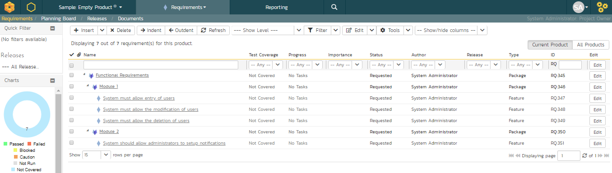
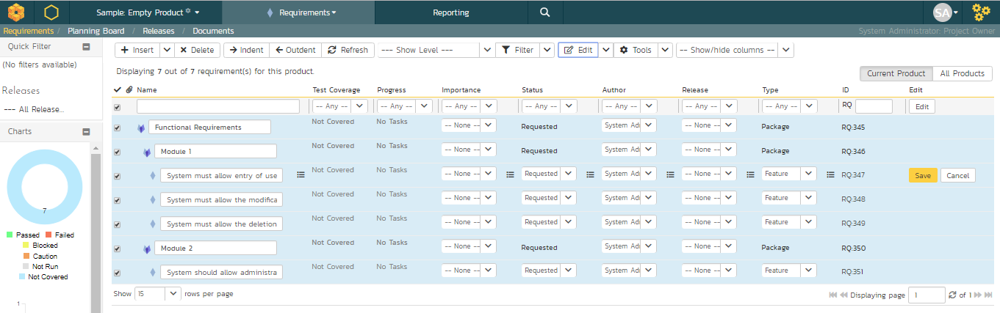
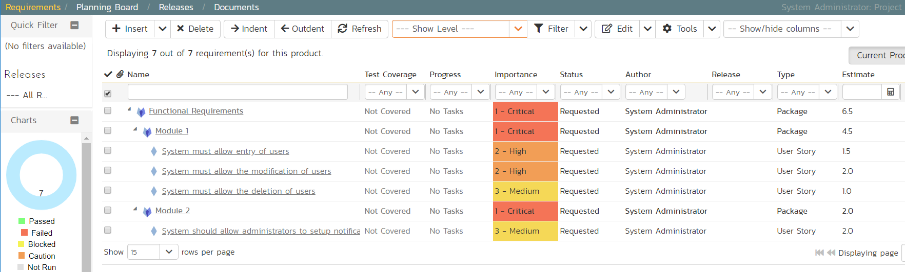

# Define the Requirements

On the main Navigation bar, click Artifacts \> Requirements to display
the product's requirements list page:

The terminology in SpiraPlan is designed to be methodology agnostic. The
table below shows how the terms used in SpiraPlan relate to some common
methodologies:

| **SpiraPlan**        | **Extreme Programming**  | **Scrum**    |  **AgileUP / DSDM** |
| ---------- | ---------- | -------- | ---------- |
| Summary Requirement  | Epic                     | Epic         |  Feature Group |
| Requirement          | User Story               | Backlog Item |  Requirement |
| Task                 | Task                     | Task         |  Task |
| Release              | Release                  | Release      |  Release |
| Sprint               | Iteration                | Sprint       |  Iteration |

At first, the requirements list will be empty. Click the 'Insert' button
in the toolbar to create your first requirement. Hit 'Save and New'
(shown as buttons on the right of the new requirement in the list table)
to add each new requirement after that. Below is the list of requirement
names to add:

1.  Functional Requirements

2.  Module 1

3.  System must allow entry of users

4.  System must allow the modification of users

5.  System must allow the deletion of users

6.  Module 2

7.  System should allow administrators to setup notifications

You should now have a simple, flat requirements list, like the one
below:

Next, we are going to indent the requirements. This will give us a
hierarchy, with some requirements being children of others.

1.  To indent, select the checkboxes of all the requirements below
'Functional Requirements' and click 'Indent'. This makes 'Functional
Requirements' the parent and all the other requirements its
children.

2.  Now, select the three requirements immediately below 'Module 1' and
click 'Indent' again. This makes these three requirements children
of 'Module 1' (and grandchildren of 'Functional Requirements')

3.  Repeat for the requirement below 'Module 2' by right-clicking on
this last requirement and choosing 'Indent' from the popup context
menu.

You should now have a list that looks like:

We now have a nicely group set of requirements. Let's enter more
information about them, starting with setting their types and
priorities.

1.  Click the ''select all' checkbox at the top of the list (the
checkbox just above the checkbox for 'Functional Requirements')

2.  Click on the top 'Edit' button in the right-hand column of that same
row. That will make all the requirement rows editable:

3.  Set the 'Type' of the four requirements you can edit this for to
User Story'.

4.  Choose whatever values you like for the 'Importance' field.

5.  Click the 'Save' button.

You now have a prioritized list of user story requirements:

The next thing we can do is assign estimates to each requirement. This
is something that the developers or business analysts may do based on
the complexity and scope of each. The 'Estimates' column is not visible
yet, so first we need to show it. To do that, click on the 'Show/Hide
Columns' dropdown list and select 'Show Estimate'.:

By default, all the requirements will have been assigned a default
estimate of 1.0 point. A point is not a defined number of hours, but an
indication of the size of the requirement. The estimates should reflect
how big each of the requirements are relative to each other.

To change the estimates:

1.  Click the "select all" checkbox at the top of the list

2.  Click on the top 'Edit' button in the right-hand column. The
requirements should be in editable mode again.

3.  Enter the following estimates for the requirements

4.  Click 'Save'

| **Requirement**                                           |   **Estimate** |
| ------------ | --------- |
| System must allow entry of users                          |   1.5 points |
| System must allow the modification of users               |   2.0 points |
| System must allow the deletion of users                   |   1.0 points |
| System should allow administrators to setup notifications |   2.0 points |

Your requirements should now look like this (with each parent's
estimates automatically summing up the estimates of their children):

We have created a list of prioritized, estimated requirements, which is
a great way to start our product. In the next section we are going to
enter releases and sprints.

