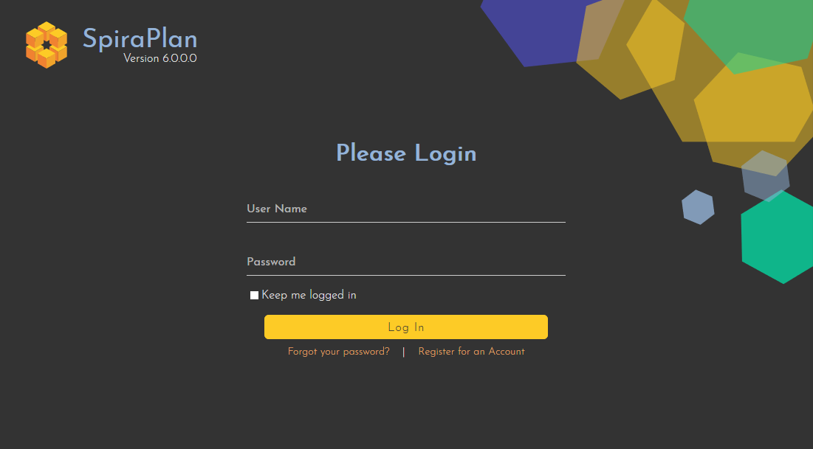
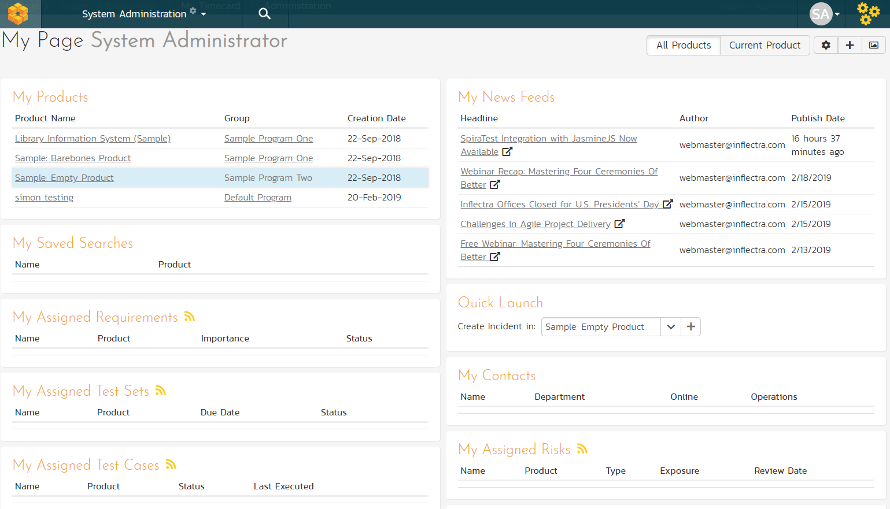

# Logging In and Selecting a Product

Once you have installed a self-hosted trial or signed up for a hosted
trial of SpiraPlan, you should see the following login screen in your
web browser:

Enter the following default details to start using the system:

-   Login: administrator

-   Password: PleaseChange

Once logged-in, you are shown your "My Page". The very first time you
log in you will be able to take a quick orientation tour of the
application (as shown in the screenshot below).

The My Page looks pretty empty right now. This is normal.

For this tutorial we want to start with an empty product that has no
data in it, so click the hyperlink under 'My Products' for 'Sample Empty
Product' / 'Sample Program Two'. That will bring up the homepage for the
empty product:

The product home page shows various widgets containing key product
metrics. These are empty now, because the product has no data in it. In
the rest of this guide we are going to fix that.

