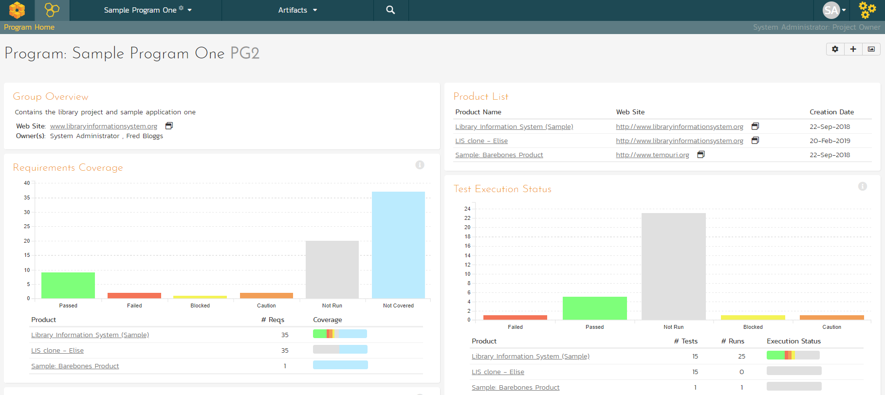

# Reviewing A Program

In addition to having dashboards that let you monitor the performance of
your product, SpiraPlan has several views available at the program
level. These let your group products together into a common program and
report on them as a whole.

To see this in action, click on the "Sample Program One" link in the
main navigation bar.

You can click on the Artifacts \> **Planning** Board tab to display the
Program Planning Board (which is similar to the one we used previously
for products, except that is works across multiple products):

There are additional program views that let you see the **Releases** and
**Incidents** at a program level. Click Artifacts \> Releases:

*Congratulations! You have now completed the software development and
testing lifecycle using SpiraPlan. For more information about any of the
features, please refer to the SpiraPlan User Manual.*

