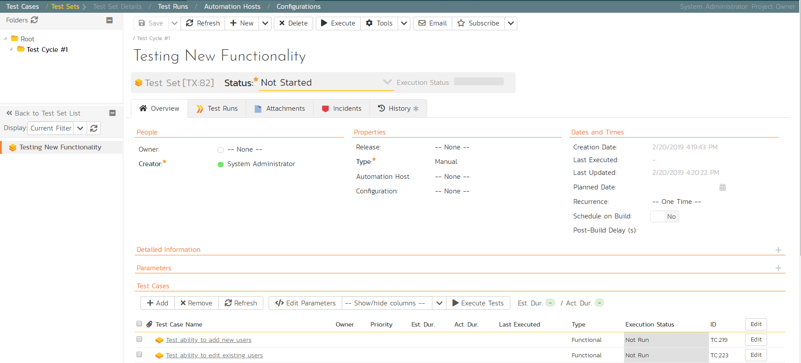
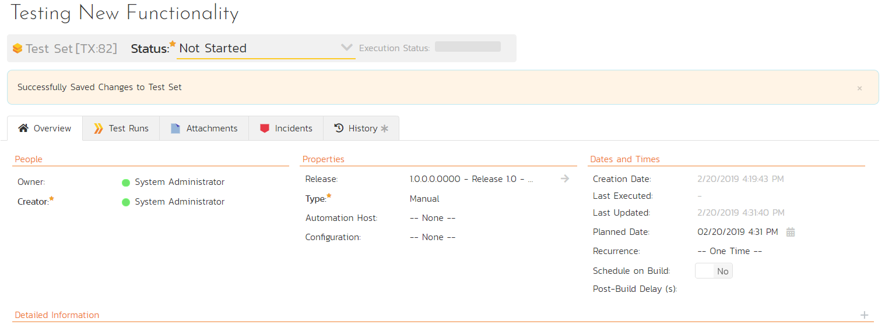

# Scheduling the Testing Activities

Now that we have created our test plan for each release and sprint, we
need to schedule the test cases for execution by our testers. As an
example, we'll create a single test set (also known as a test suite)
that contains a list of test cases to be executed by a specific tester.

On the main Navigation Bar, click on Artifacts \>Test Sets menu option
to display the product's test set list page:

At first, the test set list will be empty and the 'Folders' tree on the
left will only show 'Root'.

1.  Click the 'Add' button beneath the folder tree

2.  Enter the new folder name 'Test Cycle \#1'

3.  Click the 'Add' button.

4.  Click on the folder you just made

5.  Click 'New Test Set' from the toolbar.

6.  Enter the name of the new test set 'Testing new functionality'

7.  Click 'Save'

You should now have the following test set list:

Click on the hyperlink for the test set to bring up the test set details
page:

Let's add the appropriate test cases to this set.

1.  Click the 'Add' button in the 'Test Cases' section half way down the
page to bring up the following panel:

2.  Locate 'Root' drop down menu under 'Test Cases' section.

3.  Choose the 'Functional Tests' folder and the test cases in that
folder will be displayed:

4.  Select the following test cases and click the 'Save' button:

<!-- -->

1.  Test ability to add new users

2.  Test ability to edit existing users

You should now have the following displayed:

Next, let's assign this test set to a specific release and to a
particular tester. To do that, choose the following values for the
following fields and click 'Save':

-   Owner = System Administrator (your user)

-   Release = Release 1.0 - Iteration 1

-   Planned Date = (Today's Date).

You have now scheduled this test set to be executed by your user by the
end of today against the first iteration of release 1.0:

