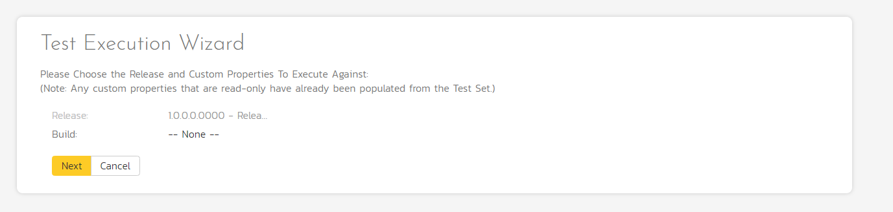

# Running Tests and Logging Incidents

Now that you have scheduled the test set, if you go to the 'My Page' by
clicking on the SpiraTeam logo in the top-left, you'll see your newly
assigned test set down on the left:

Click the 'Execute' button (with the play icon) to the right of this new
test set. That will start the test execution wizard:

On the first screen, the release dropdown list will have been
automatically pre-selected to the release specified in the test set.
Click 'Next' to move to the first test step in the first test case:

*Note that when you first visit this page, you will be shown a quick
guided tour of how the page works.*

As a tester, you can progress through each of the test steps in each
test case in the test set in turn. For each test step you can enter
**Pass**, **Fail**, **Blocked,** **Caution, or Not Applicable**. If you
enter any status other than Pass you need to enter a value for the
'Actual Result'. For a pass status, the Actual Result is optional.

Click the 'Pass' button to pass the first test step. As soon as you do,
the test will automatically progress to the second test step:

Now for the second test step, enter in the actual result field "Unable
to enter the sample data as the fields were disabled". Before clicking
the Fail button, we also want to enter in the following fields in the
Incident form (accessed by clicking the "Incidents" tab):

-   Name = Error displaying user fields

-   Type = Bug

-   Priority = 2 -- High

Now click the 'Fail' button and you will have recorded a test failure
and a new incident/defect:

Now that we have logged the test failure and the new incident/defect,
click on a hexagon on the main navigation bar on the left of "Sample
Empty Product" option.

You'll be taken to the product homepage with the requirements and test
case metrics now visible in individual widgets (like the Test Execution
Status widget shown below):

If you go to the Artifacts \> Test Sets page, you also see the status of
our test set:

If you go to the Artifacts \> Requirements page, you'll see the
different requirements' test coverage and the status of the tests
associated with each requirement:

The next step in the process is to triage the logged defect and assign
it to a developer to be fixed.

