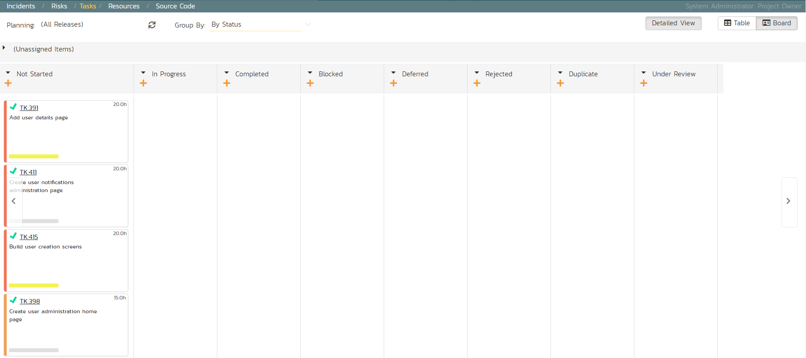
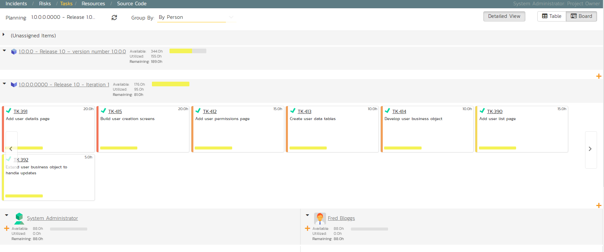
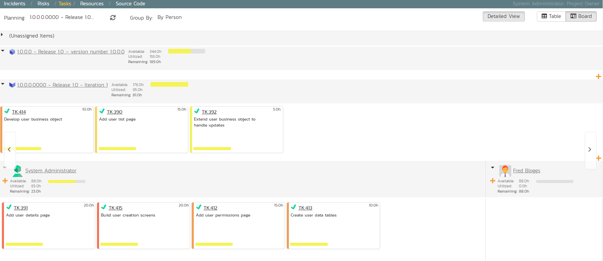
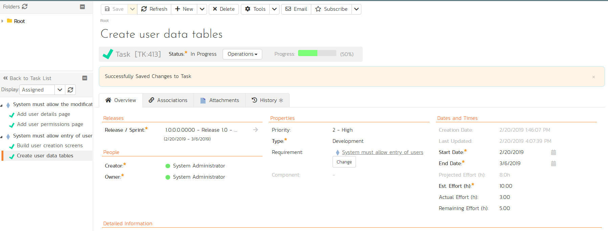

# Assigning the Requirements & Tasks

Now that we have planned which requirements (user stories) and tasks are
planned for each sprint, we can assign tasks to the appropriate
developer(s). The process you follow will depend on your methodology
(e.g. in Scrum the developers pick the tasks, but in Extreme Programming
the product manager usually assigns tasks).

To assign the tasks, go to the main Navigation Bar and click on Artifact
\> Tasks to display the main tasks list page:

Click on the 'Board' option on the top-right of the screen to change to
the Kanban board view:

You can see at a glance which tasks are in each status (in this case,
they are all marked as 'Not Started'). To see the distribution of tasks
by person for a specific sprint, change the release selection to
'Release 1.0 Iteration 1', and the 'Group By' dropdown to 'By Person':

For our sample product, we have two product members listed (included
ourselves). As an example, select the first four tasks (which are all
priority = 1 -- Critical) and drag them to your user's section:

Now you can clearly see the four tasks that have been assigned to your
user. To simulate how this would appear to a developer, click on the
main SpiraTeam icon (in the top-left) to display your user's "My Page"
dashboard:

This page lists all the development tasks that have been assigned to
your user. Click on the task "Create user data tables" to display the
task details page:

This task has been estimated at 10.0 hours and is currently not started.
The next step is to start working on the assigned task and report back
progress. As an example:

1.  click the workflow 'Operations' and chose 'Start Task'.

2.  Then under 'Dates and Times' enter an 'Actual Effort' of 3.0 hours,
and a 'Remaining Effort' of 5.0 hours.

3.  In the 'Comments' section below, add a comment: "Added initial set
of data tables",

4.  Click 'Save' at the top of the page.

The progress indicator will reflect the changes and the new comment will
have been added.

Now click on the other three assigned tasks, start them, and specify the
following:

| **Requirement / Task**            |  **Est. Estimate** |  **Actual Effort** |  **Remaining Effort** |
| ---------- | ---------- | --------- | ---------- |
| Create user data tables                       |  10.0h             |  3.0h              |  5.0h |
| Develop user business object                  |  10.0h             |  2.0h              |  7.5h |
| Build user creation screens                   |  20.0h             |  3.0h              |  18.0h |
| Extend user business object to handle updates |  5.0h              |  0.5h              |  4.0h |

After updating the assigned tasks, the 'My Page' dashboard will show all
these changes:

Similarly, for the product manager, On the main Navigation Bar, clicking
on Artifacts \> Requirements to display the requirements list will show
the task progress as it impacts the various requirements:

