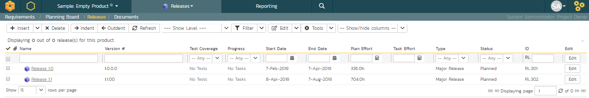

# Create the Release and Iteration Plan

On the main navigation bar, click out of 'Requirements' and select
'Releases' menu option to display the product's release list page:

The release list will be empty. Click the 'Insert' button in the toolbar
to create your first release. Hit 'Save and New' (shown as buttons on
the right of the new release in the list table) to add each new release
after that. Below is the list of release names to add

-   Release 1.0 -- version number 1.0.0.0

-   Start Date: Today's Date

-   End Date: Today's Date + 2 months

<!-- -->

-   Release 1.1 -- version number 1.1.0.0

-   Start Date: Today's Date + 2 months

-   End Date: Today's Date + 4 months

You should have a list of releases like this:

We need to add one additional level of detail to each release -- the
list of sprints that will take place in each release.

Let's add some sample sprints for the first release.

1.  Select the checkbox for Release 1.0 and, from the toolbar, click
Insert \> Child Release.

2.  Choose a name for the new sprint

3.  Make sure its 'Type' is set to 'sprint'

4.  Specify its date-range. We recommend making each sprint last 2-weeks
and have each one scheduled in series

5.  click 'Save And New'.

6.  Repeat steps 2-5 above, then steps 2-4 and then finally click 'Save'
on the final sprint's row. You should have three sprints added to
the list, all children of Release 1.0

Finally, let's specify the number of resources assigned to each sprint
and release.

1.  Click on the 'Show/Hide Columns' dropdown list and select 'Show \#
Resources' column

2.  Select the three checkboxes for the sprints of "Release 1.0"

3.  Click the 'Edit' button on the toolbar.

4.  Adjust the \# resources for the sprints to 2.

5.  Click 'Save':

