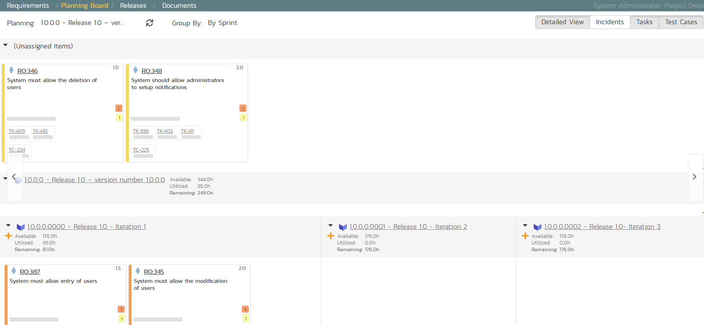

# Planning the Sprint

We have requirements that have tasks, and tests connected to them. What
we haven't done yet is scope out which requirements go in which sprint.

1.  On the main Navigation Bar, click on the Planning \> Planning Board
option ~~on the main menu~~ to display the product backlog planning
board.

2.  Make sure the 'Group By' dropdown on the left is set to "By
Priority"

3.  Make sure all requirements are visible by checking the left-most
column and ensuring that all priority levels are shown in an
expanded view (downward facing triangle signs)

4.  To view the iteration plan for a specific release, select 'Release
1.0' on the 'Planning:' drop down menu on the top left.

5.  Choose 'By Sprint' from the drop-down 'Group By' menu. That will
display the sprint plan for the selected release (currently empty)

6.  Expand the '(Unassigned Items)' entry to display the requirements
that are in the product backlog

Each backlog item (requirement or incident) is represented by a virtual
"story card" in the iteration. The left-hand side of each item displays
the priority color. The progress bar near the bottom of each item
depicts the progress of the item. You can flip through each iteration to
see the work planned by clicking the left/right arrow buttons at the
sides of the screen.

Now drag the two highest priority requirements (the ones with Importance
= 1-Critical) to the first iteration:

In the screenshots above the cards are showing more information then you
may see by default. Extra information can be shown by toggling the
buttons at the top right of the planning board

-   To see more information about each requirement, enable the 'Detailed
View' option

-   To see the individual tasks associated with each requirement, select
the 'Tasks' option

-   To see the individual tests associated with each requirement, select
the 'Test Cases' option

You can determine how much time has been scheduled in the first sprint
and how much time is remaining. Although we have spare time available in
Iteration 1, we will leave room left for fixing incidents, so next, drag
and drop the remaining two requirements to Iteration 2:

