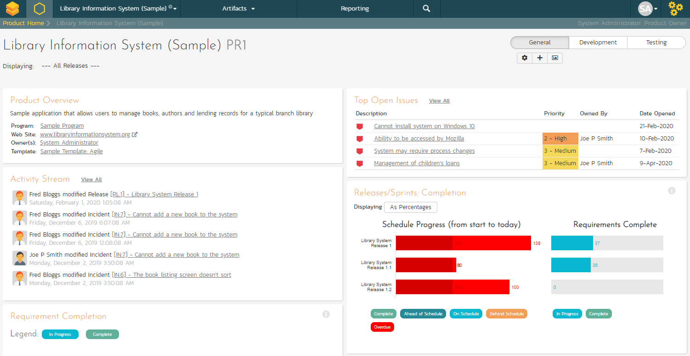

# Reviewing Your Product

You can check on the overall status of the product by clicking the
hexagon on the main navigation bar. This will take you to the product
home page. Below is what this home page looks like for a more complete
product than we have been working through in this quick start guide.

Note how you can change between several views (the buttons on the right)
to show different information based on your role or current needs, or
only show data for a particular release (see the dropdown beneath the
product name on the left).

*Congratulations, you have now completed the testing lifecycle using
SpiraTest. For more information about any of the features, please refer
to the SpiraTest User Manual.*

