# SpiraTest Quick Start Guide

!!! tip "Want to access the new and improved Quick Start Guide?"
    This SpiraTest quick start guide still works great, but we have a newer and greater quick start guide. Please feel free to [check it out](../../SpiraPlan-Quick-Start-Guide/).

## Logging in and Selecting a Product

Once you have installed a self-hosted trial or signed up for a hosted
trial of SpiraTest, you should see the following login screen in your
web browser:

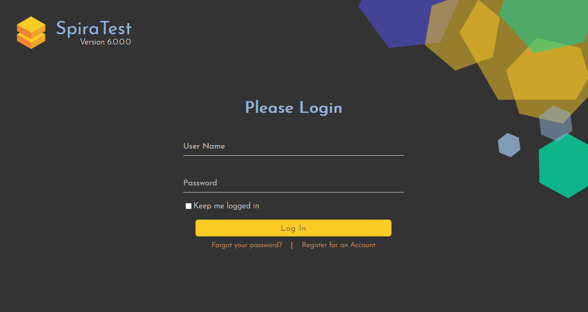

Enter the following default details to start using the system:

-   Login: administrator

-   Password: PleaseChange

Once logged-in, you are shown your "My Page". The very first time you
log in you will be able to take a quick orientation tour of the
application (as shown in the screenshot below).

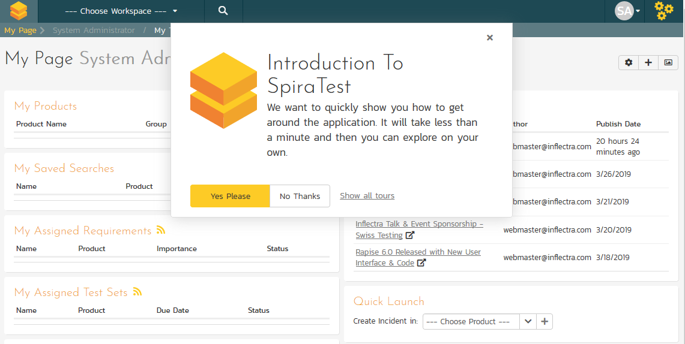

The My Page looks pretty empty right now. This is normal.

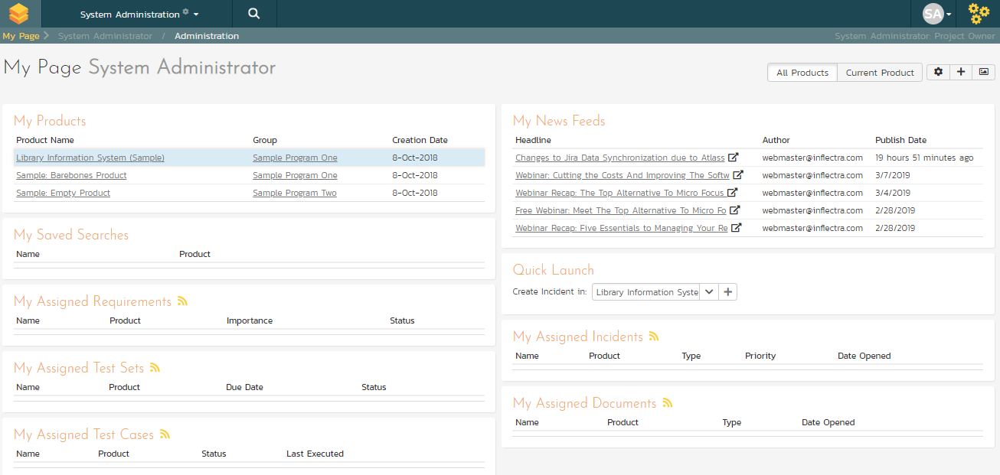

For this tutorial we want to start with an empty product that has no data in it, so click the hyperlink under 'My Products' for 'Sample Empty Product 2' / 'Sample Program'. That will select the empty product. Now to see the homepage for the product you just selected click on the hexagon in the top left:

The product home page shows various widgets containing key product metrics. These are empty now, because the product has no data in it. In the rest of this guide we are going to fix that.

***

## Define the Requirements

On the main Navigation bar, click Artifacts \> Requirements to display the product's requirements list page:

The terminology in SpiraTest is designed to be methodology agnostic. The
table below shows how the terms used in SpiraTest relate to some common
methodologies:

| **SpiraPlan**        | **Extreme Programming**  | **Scrum**    |  **AgileUP / DSDM** |
| ---------- | ---------- | -------- | ---------- |
| Summary Requirement  | Epic                     | Epic         |  Feature Group |
| Requirement          | User Story               | Backlog Item |  Requirement |
| Task                 | Task                     | Task         |  Task |
| Release              | Release                  | Release      |  Release |
| Sprint               | Iteration                | Sprint       |  Iteration |

At first, the requirements list will be empty. Click the 'Insert' button in the toolbar to create your first requirement. Hit 'Save and New' (shown as buttons on the right of the new requirement in the list table) to add each new requirement after that except for the last requirement. After entering the last requirement, hit "Save" button. Below is the list of requirement names to add:

1.  Functional Requirements

2.  Module 1

3.  System must allow entry of users

4.  System must allow the modification of users

5.  System must allow the deletion of users

6.  Module 2

7.  System should allow administrators to setup notifications

You should now have a simple, flat requirements list, like the one below:

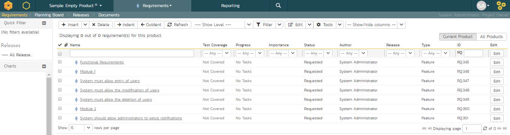

Next, we are going to indent the requirements. This will give us a hierarchy, with some requirements being children of others.

1.  To indent, select the checkboxes of all the requirements below 'Functional Requirements' and click 'Indent'. This makes 'Functional Requirements' the parent and all the other requirements its children.

2.  Now, select the three requirements immediately below 'Module 1' and click 'Indent' again. This makes these three requirements children of 'Module 1' (and grandchildren of 'Functional Requirements')

3.  Repeat for the requirement below 'Module 2' by right-clicking on this last requirement and choosing 'Indent' from the popup context menu.

You should now have a list that looks like:

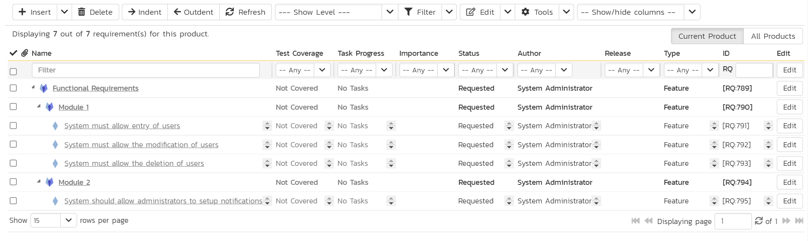

We now have a nicely group set of requirements. Let's enter more information about them, starting with setting their types and priorities.

1.  Click the ''select all' checkbox at the top of the list (the checkbox just above the checkbox for 'Functional Requirements')

2.  Click on the top 'Edit' button in the right-hand column of that same row. That will make all the requirement rows editable:

3.  Change the 'Type' to 'User Story' for some of the requirements - in the example screenshot all requirements that are children (have a single diamond icon and a non bold name) are now user stories.

4.  Choose whatever values you like for the 'Importance' field for each of the requirements.

5.  Click the 'Save' button.

You now have a prioritized list of user story requirements:

The next thing we can do is assign estimates to each requirement. This is something that the developers or business analysts may do based on the complexity and scope of each. The 'Estimates' column is not visible yet, so first we need to show it. To do that, click on the 'Show/Hide Columns' dropdown list and select 'Show Estimate (points)'.:

By default, all the requirements will have been assigned a default estimate of 1.0 point. A point is not a defined number of hours, but an indication of the size of the requirement. The estimates should reflect how big each of the requirements are relative to each other. 

To change the estimates:

1.  Click the "select all" checkbox at the top of the list

2.  Click on the top 'Edit' button in the right-hand column. The
requirements should be in editable mode again.

3.  Enter the following estimates for the requirements

4.  Click 'Save'

| **Requirement**                                           |   **Estimate** |
| ------------ | --------- |
| System must allow entry of users                          |   1.5 points |
| System must allow the modification of users               |   2.0 points |
| System must allow the deletion of users                   |   1.0 points |
| System should allow administrators to setup notifications |   2.0 points |

Your requirements should now look like this (with each parent's
estimates automatically summing up the estimates of their children):

We have created a list of prioritized, estimated requirements, which is a great way to start our product. In the next section we are going to enter releases and sprints.

***

## Create the Release and Iteration Plan

On the main navigation bar, click out of 'Requirements' and select 'Releases' menu option to display the product's release list page:

The release list will be empty. Click the 'Insert' button in the toolbar to create your first release. Hit 'Save and New' (shown as buttons on the right of the new release in the list table) to add each new release after that. Below is the list of release names to add

-   Release 1.0 -- version number 1.0.0.0

-   Start Date: Today's Date

-   End Date: Today's Date + 2 months

<!-- -->

-   Release 1.1 -- version number 1.1.0.0

-   Start Date: Today's Date + 2 months

-   End Date: Today's Date + 4 months

You should have a list of releases like this:

We need to add one additional level of detail to each release -- the list of *sprints* that will take place in each release.

Let's add some sample sprints for the first release.

1.  Select the checkbox for Release 1.0 and, from the toolbar, click Insert \> Child Release.

2.  Choose a name for the new sprint

3.  Make sure its 'Type' is set to 'sprint'

4.  Specify its date-range. We recommend making each sprint last 2-weeks
and have each one scheduled in series

5.  click 'Save And New'.

6.  Repeat steps 2-5 above, then steps 2-4 and then finally click 'Save' on the final sprint's row. You should have three sprints added to the list, all children of Release 1.0

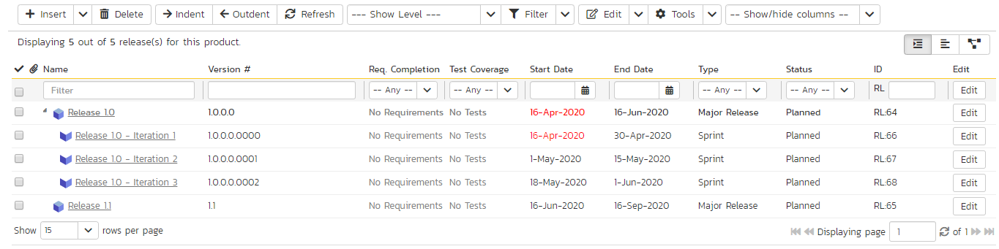

Finally, let's specify the number of resources assigned to each sprint and release.

1.  Click on the 'Show/Hide Columns' dropdown list and select 'Show \# Resources' column

2.  Select the three checkboxes for the sprints of "Release 1.0"

3.  Click the 'Edit' button on the toolbar.

4.  Adjust the \# resources for the sprints to 2.

5.  Click 'Save'

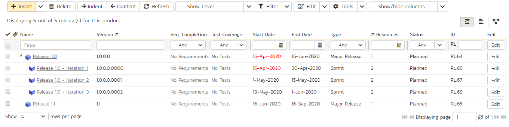

Now that we have the releases and sprints scheduled, we now need to assign our previously defined requirements to the different releases.

1.  On the main navigation bar, click on Artifacts' drop-down menu and click Requirements to display the requirements list.

2.  Click the 'select all' checkbox at the top of the list

3.  Click the top 'Edit' button on the main tool bar. That will make all the cells editable.

4.  Now choose the release/sprint for each of the lower-level requirements

5.  Click 'Save'

Notice that all the requirements have automatically changed status from 'Requested' to 'Planned', this is because they have been assigned a specific release/iteration.

***

## Build the Test Plan

On the main Navigation bar, click on the Artifacts drop-down menu and select Test Cases menu option to display the product's test case list page:

The test case list is empty and the only folder visible in the 'Folders' tree on the left-hand side is 'Root'.

1.  Click on the 'Add' button underneath the folder tree,

2.  Enter the new folder name 'Functional Tests'.

3.  Click 'Add'.

4.  You now have a new folder in the 'Folders' tree view. To show it, click 'Refresh'.

5.  Click on this folder from the 'Folders' tree on the left

6.  Click 'New Test Case' from the toolbar.

7.  Enter "Test ability to add new users" for the name of this new test
case

8.  Click 'Save And New'

9.  Repeat the above steps to create 3 more test cases:

<!-- -->

1.  Test ability to edit existing users

2.  Test ability to delete existing users

3.  Test ability to edit notifications

You should now have the following test case list:

Next, we need to enter detailed test steps to each test case, and link each test to the appropriate requirements.

1.  Click on the hyperlink for the first test case 'Test ability to add new users. This will bring up the test case details page

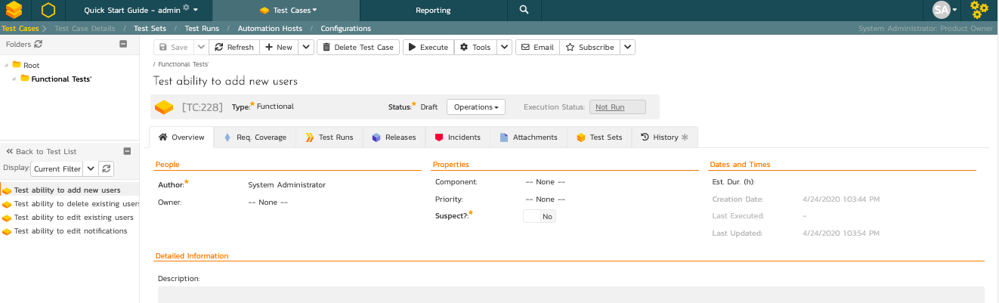

2.  In the 'Description' box under 'Detailed Information' section, enter a brief overview of the test case (something like "this test case verifies that you can add new users to the system and that all of the fields get saved correctly.").

3.  Scrolling down to the 'Test Steps' section, you will see a single test step has been automatically created for you with some suggested text:

This test case needs 3 test steps.

1.  Click 'Edit' on 'Step 1' and enter the first set of parameters below.

2.  Click 'Save' and then 'Insert Step' to add the second test step and enter its information from below

3.  Click 'Save and New' to make the third step

4.  Once you've entered its information click 'Save'

| **Test Step Description**      |                               **Expected Result**      |   **Sample Data** |
| ----------- | -------------------- | ------------------ |
Click on the link to add new user      |                       New user screen displayed   | |
Enter the name, email address and password of the new user. |  Data accepted    |           Fred Bloggs <fredblogs@example.com> |
Click the 'Submit' button to create the user.     |            The user is created     |   |     

You should now have the following test steps in the test case:

Next, we need to link this test case to the requirement(s) that it validates.

1.  Click the 'Req. Coverage' tab above:

2.  Click the '+ Add' button to display the association adding panel:

3.  Choose the 'System must allow the entry of users' requirement

4.  Click the 'Save' button beneath the list of requirements to add the
test case to this requirement

Let's repeat the process for the other test cases, adding a couple of test steps to each. Then link the test cases to the requirements according to this table just like you did above:

| **Test Case**                         |   **Requirement** |
| ------------- | ----------- |
| Test ability to add new users         |   System must allow entry of users |
| Test ability to edit existing users   |   System must allow the modification of users |
| Test ability to delete existing users |   System must allow the deletion of users |
| Test ability to edit notifications    |   System should allow administrators to setup notifications |

We have created test cases and set up their test coverage. Next, we need to specify which releases and sprints they can be tested in.

1.  First navigate to the product's test case list page again by clicking on 'Test Cases' on the main navigation bar

2.  Select the checkbox of each test case in the 'Functional Tests' folder.

3.  Click on 'Tools' drop-down menu on the toolbar

4.  Click 'Add to Release'

5.  Select 'Release 1.0

6.  Click 'Add'.

You have added all the tests to the overarching Release. Finally, we want to add the tests to the different sprints, based off the data in the table below.

1.  Select the checkbox of each relevant test case in the 'Functional Tests' folder.

2.  Click on 'Tools' drop-down menu on the toolbar

3.  Click 'Add to Release'

4.  Select the appropriate sprint

5.  Click 'Add'

| **Test Case**             |              **Sprint(s)** |
| -------------- | ------------------ |
| Test ability to add new users      |     Release 1.0 - Iteration 1   Release 1.0 - Iteration 2   Release 1.0 - Iteration 3 |
| Test ability to edit existing users  |   Release 1.0 - Iteration 1   Release 1.0 - Iteration 2   Release 1.0 - Iteration 3 |
| Test ability to delete existing users  | Release 1.0 - Iteration 2   Release 1.0 - Iteration 3 |
| Test ability to edit notifications   |   Release 1.0 - Iteration 3 |

You typically want to include previous functionality in each of the successive iterations to ensure regression coverage. That is what we have done here. This means that each sprint includes new test cases for the new requirements, as well as existing test cases for pre-existing functionality.

***

## Scheduling the Testing Activities

Now that we have created our test plan for each release and sprint, we need to schedule the test cases for execution by our testers. As an example, we'll create a single test set (also known as a test suite) that contains a list of test cases to be executed by a specific tester.

On the main Navigation Bar, click on Artifacts \>Test Sets menu option to display the product's test set list page:

At first, the test set list will be empty and the 'Folders' tree on the left will only show 'Root'.

1.  Click the 'Add' button beneath the folder tree

2.  Enter the new folder name 'Test Cycle \#1'

3.  Click the 'Add' button.

4.  Click on the folder you just made

5.  Click 'New Test Set' from the toolbar.

6.  Enter the name of the new test set 'Testing new functionality'

7.  Click 'Save'

You should now have the following test set list:

Click on the hyperlink for the test set to bring up the test set details page:

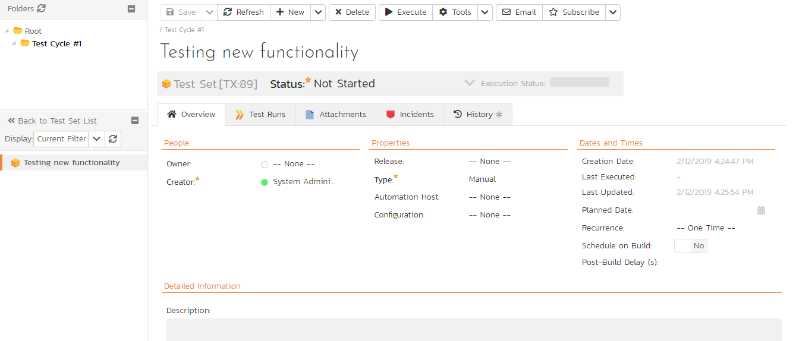

Let's add the appropriate test cases to this set.

1.  Click the 'Add' button in the 'Test Cases' section half way down the page to bring up the following panel:

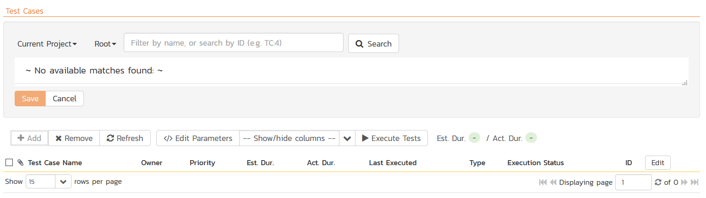

2.  Locate 'Root' drop down menu under 'Test Cases' section.

3.  Choose the 'Functional Tests' folder and the test cases in that folder will be displayed:

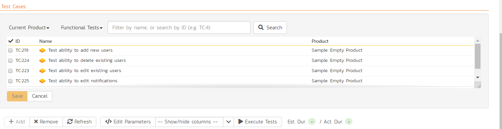

4.  Select the following test cases and click the 'Save' button:

<!-- -->

1.  Test ability to add new users

2.  Test ability to edit existing users

You should now have the following displayed:

Next, let's assign this test set to a specific release and to a particular tester. To do that, choose the following values for the following fields and click 'Save':

-   Owner = System Administrator (your user)

-   Scheduled = Release 1.0 - Iteration 1

-   Planned Date = (Today's Date).

You have now scheduled this test set to be executed by your user by the end of today against the first iteration of release 1.0:

***

## Running Tests and Logging Incidents

Now that you have scheduled the test set, if you go to the 'My Page' by clicking on the SpiraTest logo in the top-left, you'll see your newly assigned test set down on the left:

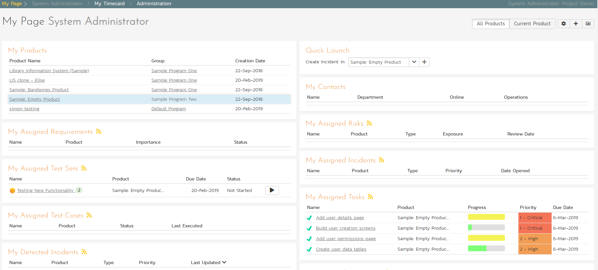

Click the 'Execute' button (with the play icon) to the right of this new test set. That will start the test execution wizard:

On the first screen, the release dropdown list will have been automatically pre-selected to the release specified in the test set. Click 'Next' to move to the first test step in the first test case:

*Note that when you first visit this page, you will be shown a quick guided tour of how the page works.*

As a tester, you can progress through each of the test steps in each test case in the test set in turn. For each test step you can enter **Pass**, **Fail**, **Blocked,** **Caution, or Not Applicable**. If you enter any status other than Pass you need to enter a value for the 'Actual Result'. For a pass status, the Actual Result is optional.

Click the 'Pass' button to pass the first test step. As soon as you do, the test will automatically progress to the second test step:

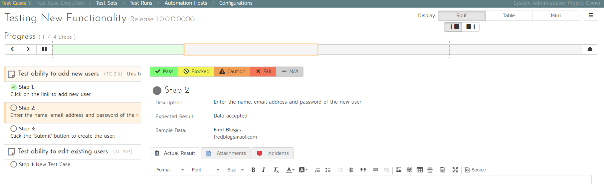

Now for the second test step, enter in the actual result field "Unable to enter the sample data as the fields were disabled". Before clicking the Fail button, we also want to enter in the following fields in the Incident form (accessed by clicking the "Incidents" tab):

-   Name = Error displaying user fields

-   Type = Bug

-   Priority = 2 -- High

Now click the 'Fail' button and you will have recorded a test failure and a new incident/defect:

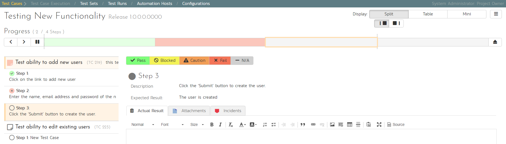

Now that we have logged the test failure and the new incident/defect, click on a hexagon on the main navigation bar on the left of "Sample Empty Product 2" option.

You'll be taken to the product homepage with the requirements and test case metrics now visible in individual widgets (like the Test Execution Status widget shown below):

If you go to the Artifacts \> Test Sets page, you also see the status of our test set:

If you go to the Artifacts \> Requirements page, you'll see the different requirements' test coverage and the status of the tests associated with each requirement:

The next step in the process is to triage the logged defect and assign it to a developer to be fixed.

***

## Triaging Issues and Defects

Now that a new incident has been logged, the next step in the process is to review the incident and assign it to a developer to be fixed. First, click on the Artifacts \> Incidents menu item. This will display the incident list page for the product.

Click on the hyperlink for the new incident "Error displaying user fields". This will display the incident details page:

1.  In the 'Operations' dropdown menu underneath the incident name on the top of the page, select 'Assign Incident' option. This will switch the status of the incident from New \> Assigned. 

2.  Location the 'People' section and set the 'Owner' field to System Administrator (your user)

3.  Add a new comment in the 'Comments' section at the bottom of the page. Type "Assigning this to you to fix. Issue was found during testing."

4.  Click the 'Save' button in the top toolbar.

The incident will be assigned to your user for fixing.

To see what a developer would see in real life, go back to the "My Page" by clicking on the orange SpiraTest icon in the top-left of the main Navigation Bar on the top of the screen:

You can see that you've been assigned an incident under the "My Assigned Incidents" widget (on the right-hand side). Now click on the hyperlink for the incident to bring up the incident details page:

The status is 'Assigned' and the comment from the product manager is clearly visible. To help you reproduce the issue, you can click on the "Associations" tab to display the test run and requirements associated with this incident:

If you click on the test run hyperlink "Test ability to add new users", you will see the detailed information about the test execution that resulted in the bug being logged:

This allows the developer to retrace the steps taken by the tester and attempt to reproduce the issue. We are going to assume we can reproduce and fix the issue so we can go right ahead and resolve the incident.

1.  Make your way back to the incident details screen: Artifacts\> Incidents \> Error displaying user fields' Hyperlink.

2.  Click on the workflow 'Operations' drop-down menu and select 'Resolve Incident'.

3.  Fill in the following fields

    -   Planned Release = Release 1.0 - Iteration 2
    -   In 'Comments' section enter a new comment = "Fixed the incident."

4.  Click 'Save' on the main toolbar

The incident will now change from Assigned \> Resolved and an email will be sent to the tester letting them know that they need to retest the test case and close the incident.

***

## Reviewing Your Product

You can check on the overall status of the product by clicking the hexagon on the main navigation bar. This will take you to the product home page. Below is what this home page looks like for a more complete product than we have been working through in this quick start guide.

Note how you can change between several views (the buttons on the right) to show different information based on your role or current needs, or only show data for a particular release (see the dropdown beneath the product name on the left).

*Congratulations, you have now completed the testing lifecycle using SpiraTest. For more information about any of the features, please refer to the SpiraTest User Manual.*