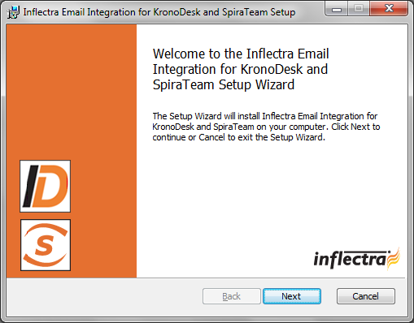
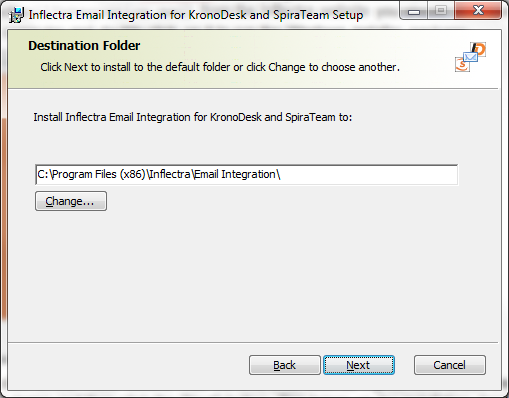
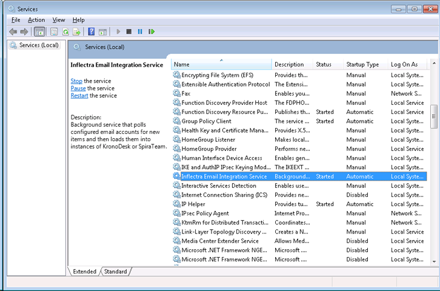

# Installing the Email Integration Service

This section outlines how to install the SpiraTeam email integration
service onto your environment. Depending on your environment you can
install the email integration service on:

1.  Your SpiraTeam application server

2.  Your corporate mail server

3.  A separate workstation that can connect to both SpiraTeam and your
mail server

If your SpiraTeam installation is installed on-premise, then you can use
options (1), (2) or (3), if your SpiraTeam installation is hosted by
Inflectra as a Software as a Service (SaaS) subscription then you'd need
to use either option (2) or (3).

Once you have downloaded the SpiraTeam email integration installation
package (InflectraEmailIntegration.msi) from the Inflectra website you
should download it onto the appropriate computer and double-click on it
to run the Windows installer package:

You should click on the "Next" button, read the End User License
Agreement, check the box that you agree with its terms and then click
the "Next" button. This brings up the installation location page:

You should choose the appropriate place to install the email integration
service and then click "Next". On the next screen click the "Install"
button and it will complete the software installation.

Once the installation has completed, you will see the following new
service listed in the Control Panel \> Administrative Tools \> Windows
Services section:

The service should be listed to run in Automatic mode and should already
be started.

Note: This email integration service is able to integrate with both
KronoDesk and SpiraTeam from Inflectra, however the focus of this guide
is the integration with SpiraTest, SpiraPlan and SpiraTeam (hereafter
SpiraTeam) only.

