# Using Spira with ServiceNow

This section outlines how to use SpiraTest, SpiraTeam or SpiraPlan
(hereafter referred to as SpiraPlan) in conjunction with tables in
ServiceNow.

► STOP! Please make sure you have first read the Instructions in Section
1 before proceeding!

ServiceNow tables are a highly configurable system that can now be used
in conjunction with SpiraPlan. This integration service enables two-way
syncing of new incidents and requirements with any table in ServiceNow
and syncing of updates from ServiceNow into SpiraPlan. Attachments will
only be synced with creation.

## Configuring the Integration Service 

This section outlines how to set up the integration service between
ServiceNow and SpiraPlan. It assumes that you already have a working
installation of SpiraPlan and appropriate ServiceNow tables. To setup
the service, you must be logged into SpiraPlan as a user with
System-Administrator level privileges.

Inside SpiraPlan, go to the Administration page and navigate to the
Integration \> Data Synchronization webpage. Check that you don't
already have a Plug-In called "ServiceNowDataSync", as shown below:

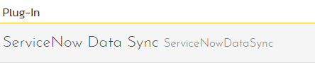

If you already have a plug-in called **ServiceNowDataSync**, please
click on its "edit" button, otherwise please click the "Add" button to
create a new plug-in:

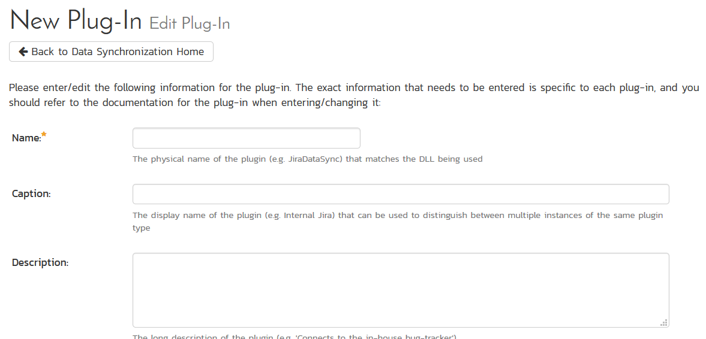

Now fill out this configuration page as follows:

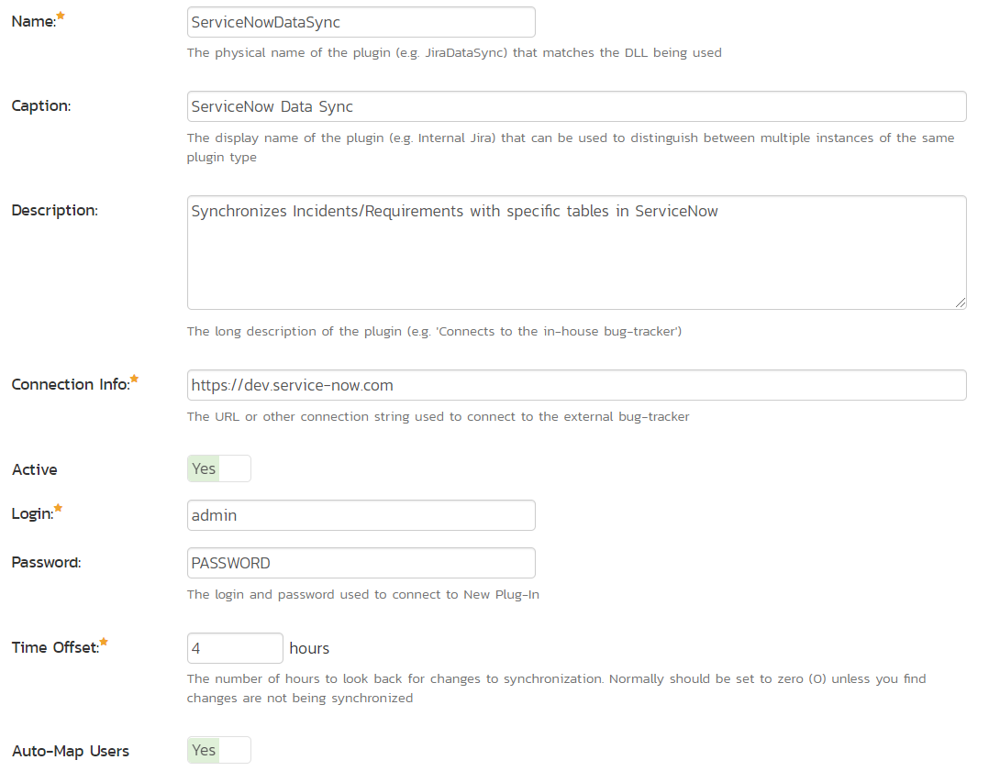

You need to fill out the following fields for the ServiceNow Data Sync
plugin to work properly:

-   **Name** -- This needs to be set to **ServiceNowDataSync**

-   **Caption** -- This is the display name of the plug-in, generally
something generic like "ServiceNow" will work.

-   **Description** -- The description of what you're using the plug-in
for. This field is entirely optional and is not used by the system
in any way.

-   **Connection Info** -- The location of your ServiceNow account. For
example, if you're on a dev instance, your connection info should be
https://devxxxxx.service-now.com

-   **Login** -- Your ServiceNow username

-   **Password** -- Your ServiceNow password

-   **Time Offset** -- Set this to how many hours *ahead* UTC is, so for
EDT (UTC-4), you would put in *positive* 4.

-   **Auto-Map Users -- Set to yes** if you would like the plugin to map
users one-to-one by checking first & last names. Set to no if you
would like to map users manually.

-   **Custom 01** -- The name of the table you would like to sync with
incidents in SpiraPlan. This can be found in the *name* field in the
table definition within ServiceNow Studio.

-   **Custom 02 -- The name of the table column in ServiceNow which will
decide which project an incident is created in. This can be found in
ServiceNow Studio under the column name.**

-   **Custom 03 -- The name of the table you would like to sync with
requirements in SpiraPlan. This can be found in the *name* field in
the table definition within ServiceNow Studio. This *cannot* be the
same as the table in Custom 01.**

-   **Custom 04 - The name of the table column in ServiceNow which will
decide which project a requirement is created in. This can be found
in ServiceNow Studio under the column name.**

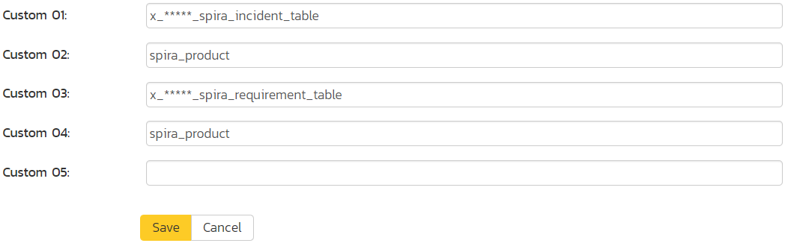

Custom 05 should be left blank. Once all those fields have been filled
out, click the "Add" or "Save" button to save your changes.

## Configuring Project Mappings

For this step, please ensure that you are in a SpiraPlan project you
would like to sync with ServiceNow. For this example, the project is
called "ServiceNowDataSync Test."

Click on the "View Project Mappings" button for the ServiceNow Data
Sync. You need to fill out the following fields to sync correctly:

-   **External Key** -- The value of the property in Custom 02/04 you
would like to map with this project

-   **Active** -- Set this to yes so that the Data Sync plug-in knows to
synchronize with this project.

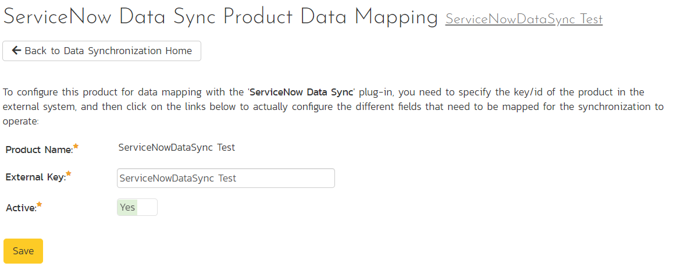

The spira\_product example above is a 'choice' type with the choices
shown below:

Type in the 'Label' field of the choice, *not* the 'Value.'

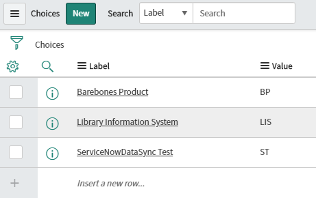

A brief note about field syncing in ServiceNow: The sheer
configurability of ServiceNow meant some assumptions were made in the
designing of this data sync. Specific column names are mapped to their
counterparts in SpiraPlan based on the list below. If a field is not
present in ServiceNow, it will simply not be synced.

SpiraPlan Field       ServiceNow Column Name
Name                  name/short\_description \[both will work\]
Description           description
Priority/Importance   priority
Author/Detected By    opened\_by
Owner                 assigned\_to
Status                state

### Configuring the Incident/Requirement Status Mappings

Now click the "Status" button within the "Incident" section to map the
Incident statuses together. The purpose of this is so that the
ServiceNow Data Sync plug-in knows what the equivalent status is in
ServiceNow for an incident status in SpiraPlan. The process is identical
for Requirement statuses, so repeat these steps with Requirement \>
Status instead if you are also/only syncing requirements.

If you don't have a status equivalent in your table, you can ignore this
section.

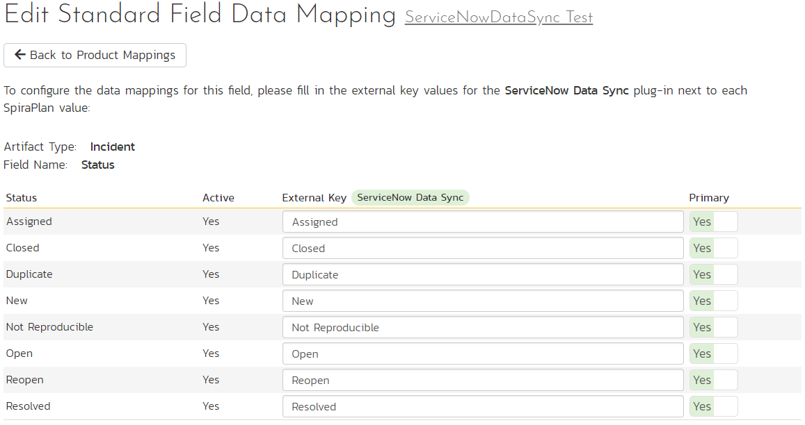

You must map every status in SpiraPlan to ServiceNow. Descriptions of
the field are below:

-   **External Key** -- If state is a dropdown in ServiceNow, it's the
'Label' (*not* 'Value') of the choice, which is also what is shown
in the ServiceNow UI. If state is a string in ServiceNow, just write
in the value of the string to be mapped to the SpiraPlan status.
Please take care to **match it exactly** (case, spaces, etc)

-   **Primary** -- You must have exactly one primary key for each
ServiceNow status. This is what status the plug-in should set the
incident in SpiraPlan to when the status in ServiceNow changes. This
is only used if there are more options in SpiraPlan than ServiceNow.

Here are the corresponding statuses in ServiceNow

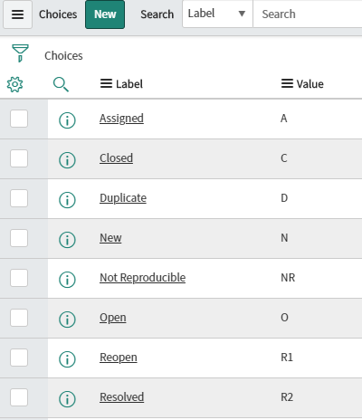

### Configuring the Priority/Importance Mapping

Now click the "Priority" button within the "Incident" section to map
incident priorities. This will tell the ServiceNow Data Sync plug-in
which priorities in ServiceNow map to those in SpiraPlan. The process is
identical for Requirement importance, so repeat these steps with
Requirement \> Importance instead if you are also/only syncing
requirements.

If you don't have a priority equivalent in your table, you can ignore
this section.

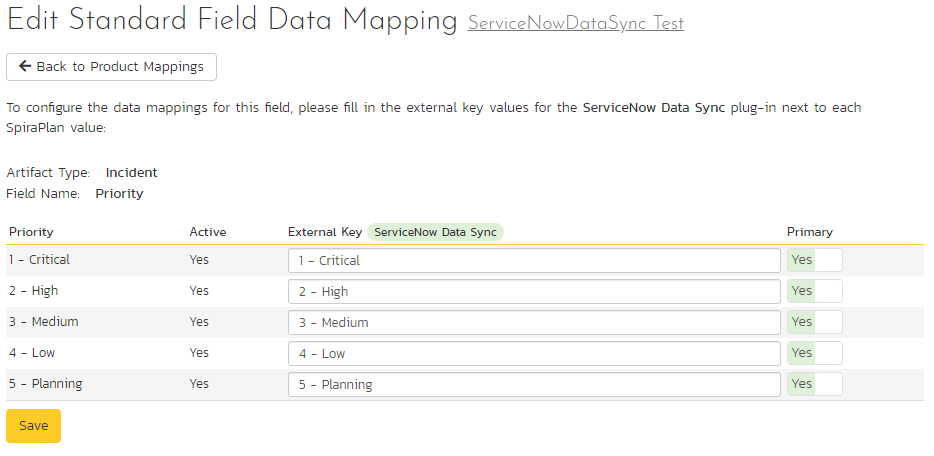

You must map every priority/importance in SpiraPlan to ServiceNow.
Descriptions of the field are below:

-   **External Key** -- If state is a dropdown in ServiceNow, it's the
'Label' (*not* 'Value') of the choice, which is also what is shown
in the ServiceNow UI. If state is a string in ServiceNow, just write
in the value of the string to be mapped to the SpiraPlan status.
Please take care to **match it exactly** (case, spaces, etc.)

-   **Primary** -- You must have exactly one primary key for each
ServiceNow priority. This is what priority the plug-in should set
the incident in SpiraPlan to when the priority in ServiceNow
changes. This is only used if there are more options in SpiraPlan
than ServiceNow.

Here are the corresponding priorities in ServiceNow:

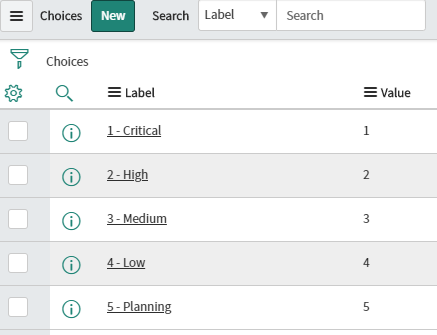

### Cloning ServiceNow Fields

Due to some of the assumptions made in the creation of this integration,
it is often necessary to create a hidden compatibility layer between the
fields you use in your ServiceNow table and those recognized by the
SpiraPlan data sync. This section will lay out how to create 'hidden'
fields that will be kept in sync with those in SpiraPlan.

1.  Create the field you would like to clone \[for this example I will
keep "Complete Notes" (visible by ServiceNow users) in sync with
"Description" (for syncing with SpiraPlan)\]

2.  A brief discussion about the requirements for this to work

a.  Both fields must be of the same type in ServiceNow

b.  If you have a list or choice, the "Value" of each choice must
map one-to-one between the hidden 'Spira' field and the visible
ServiceNow field

3.  These steps will show how to store description in complete notes
when Spira creates an artifact in ServiceNow

c.  If Studio is not open already, open System Applications \>
Studio, then select the application the tables are being synced
with

d.  In the top left, click "Create Application File" and select
Server Development \> Business Rule

e.  Create a new Business Rule and assign it to the table you are
working with \[for this example I will use Spira Test Table\]

f.  Name it something helpful \[like "description -\> complete
notes"\]

g.  Under *Where to run*, check the Insert box

h.  Add a Filter Condition such that the field you're cloning with
the Spira field is empty:

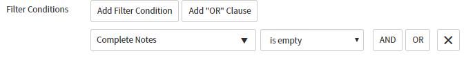

i.  Under *Actions*, where it says "---choose field --" set it to the
field you would like to be populated \["Complete Notes" in this
example\]

j.  To the right of the field name, set "To" to "Same as" and select the
Spira field \["Description" in this example\]

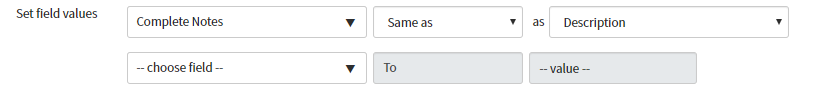

4.  These steps will show you how to store complete notes in description
when the user updates complete notes

k.  In the top left, click "Create Application File" and select
Server Development \> Business Rule

l.  Create a new Business Rule and assign it to the table you are
working with \[for this example I will use Spira Test Table\]

m.  Name it something helpful \[like "\[update\] complete notes -\>
description"\]

n.  Under *Where to run*, check the Update box

o.  Under *Actions*, where it says "---choose field --" set it to
the Spira field you would like to be synced \["Description" in
this example\]

p.  To the right of the field name, set "To" to "Same as" and select
the ServiceNow field editable by the user \["Complete Notes" in
this example\]

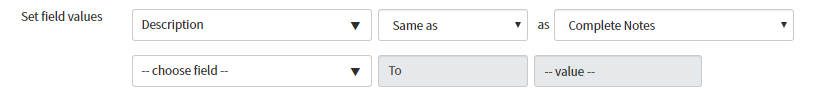

5.  These steps will show you how to store complete notes in description
when the user creates a new artifact in ServiceNow

q.  In the top left, click "Create Application File" and select
Server Development \> Business Rule

r.  Create a new Business Rule and assign it to the table you are
working with \[for this example I will use Spira Test Table\]

s.  Name it something helpful \[like "\[creation\] complete notes
-\> description"\]

t.  Under *Where to run*, check the Insert box

u.  Add a Filter Condition such that the Spira field is empty:

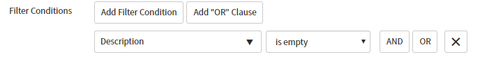

v.  Under *Actions*, where it says "---choose field---" set it to the
Spira field you would like to be synced \["Description" in this
example\]

w.  To the right of the field name, set "To" to "Same as" and select the
ServiceNow field editable by the user \["Complete Notes" in this
example\]

### Configuring Custom Properties

This section assumes the custom properties in SpiraPlan and ServiceNow
are of the same type (integer -\> integer, SingleSelect -\>
SingleSelect, etc.) Custom property syncing **will not** work otherwise.
This applies to both requirement and incident custom properties.

Click on a custom property mapping for a property you would like to
sync. For the "External Key" right below the "Name" field put the column
name (*not* the column label), so for the Operating System field in
ServiceNow, you would put in "operating\_system" No extra work is
required for user (sys\_user references in ServiceNow), text, integer,
or date fields.

If your custom property is a single-select list (choice in ServiceNow),
for each custom value, put in the "Label" (*not* Value) of the choice in
ServiceNow. So your single-select should look similar:

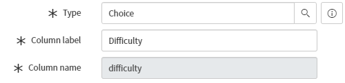

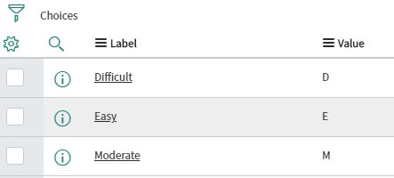

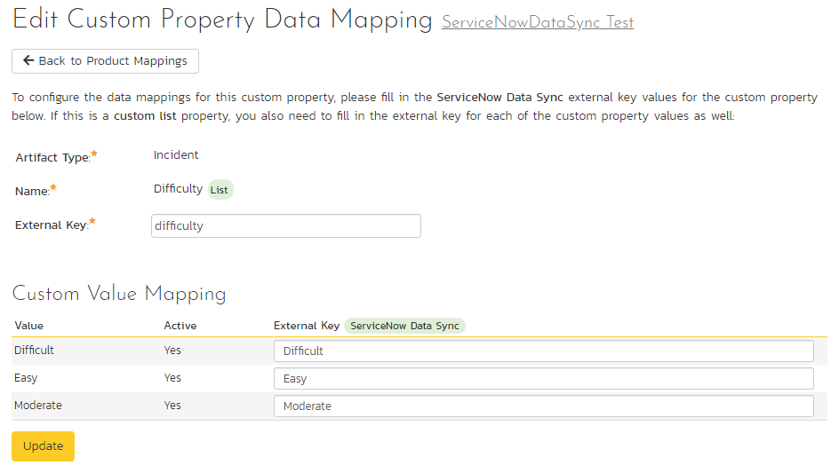

If you have a multi-select in SpiraPlan (List in ServiceNow), repeat the
same steps as for a single-select, except instead putting "Label" in the
external key, put "Value" instead. You should have something like this:

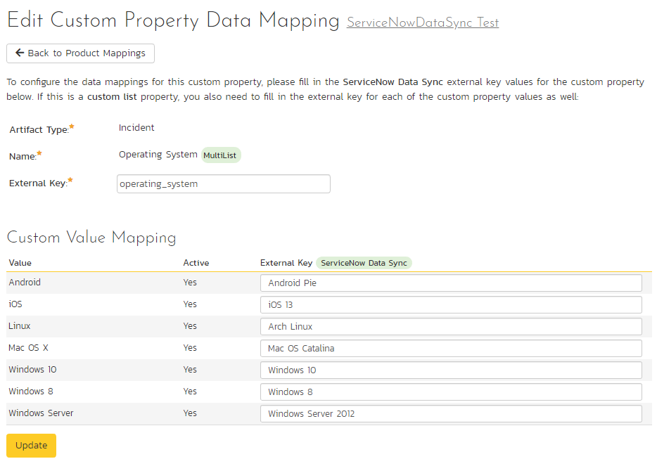

For these ServiceNow choices:

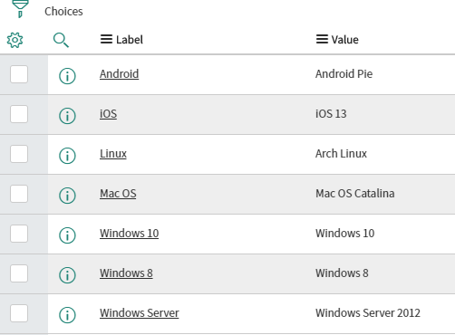

### Configuring the User Mapping

*If you have set the "Auto-Map Users" option set to yes in the
ServiceNow plugin, you can skip this section completely.*

To configure the mapping of users in the two systems, you need to go to
Administration \> Users \> View Edit Users, which will bring up the list
of users in the system. Then click on the "Edit" button for a particular
user that will be editing issues in ServiceNow:

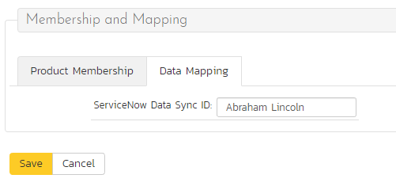

Click on the 'Data Mapping' tab to list all the configured
data-synchronization plug-ins for this user. In the text box labeled
"ServiceNow Data Sync ID," you need to enter the first and last name of
the user in ServiceNow. This will allow the data-synchronization plug-in
to know which user in SpiraPlan matches with an equivalent user in
ServiceNow. Click \[Save\] once you've entered the appropriate login
name. You should now repeat for the other users who will be active in
both systems.

## Using the Data Synchronization

Assuming everything was done correctly, the plug-in should start
working. Start your Data Sync service and verify that issues in
ServiceNow appear inside SpiraPlan. Note that the Data Sync service is
not running constantly, so it may take some time for changes to
materialize.

Congratulations, you have just integrated your SpiraPlan instance with
ServiceNow!