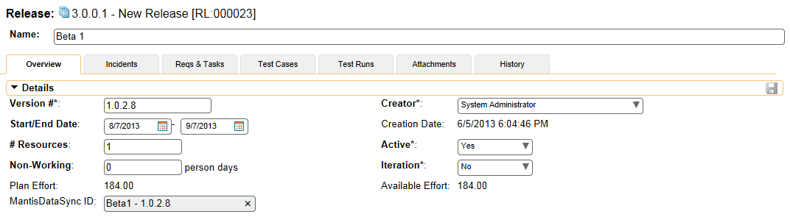

# Using SpiraTeam with Mantis

This section outlines how to use SpiraTest, SpiraPlan or SpiraTeam
(hereafter referred to as SpiraTeam) in conjunction with the Mantis
issue tracking system. The built-in integration service allows the
quality assurance team to manage their requirements and test cases in
SpiraTeam, execute test runs in SpiraTest, and then have the new
incidents generated during the run be automatically loaded into Mantis.

Once the incidents are synchronized into Mantis, the development team
can then manage the issues in Mantis and have the status changes and
additional notes entered in Mantis be reflected back in SpiraTeam. In
addition, any new issues logged into mantis will get imported into
SpiraTeam so that they can be linked to test cases and requirements.

► STOP! Please make sure you have first read the Instructions in Section
1 before proceeding!

## Configuring the Plug-In

The next step is to configure the plug-in within SpiraTeam so that the
system knows how to access the Mantis server. To start the
configuration, open up SpiraTeam in a web browser, log in using a valid
account that has System-Administration level privileges and click on the
System \> Data Synchronization administration option from the left-hand
navigation:

This screen lists all the plug-ins already configured in the system.
Depending on whether you chose the option to include sample data in your
installation or not, you will see either an empty screen or a list of
sample data-synchronization plug-ins.

If you already see an entry for **MantisDataSync** you should click on
its "Edit" link. If you don't see such an entry in the list, please
click on the \[Add\] button instead. In either case you will be taken to
the following screen where you can enter or modify the Mantis
Data-Synchronization plug-in:

You need to fill out the following fields for the Mantis Plug-in to
operate correctly:

-   **Name** -- this needs to be set to **MantisDataSync**. This needs
to match the name of the plug-in DLL assembly that was copied into
the C:\\Program Files\\SpiraTeam\\Bin folder (minus the .dll file
extension). If you renamed the MantisDataSync.dll file for any
reason, then you need to change the name here to match.

-   **Description** -- this should be set to a description of the
plug-in. This is an optional field that is used for documentation
purposes and is not actually used by the system.

-   **Connection Info** -- this should the URL that you use to access
your instance of Mantis (e.g. https://www.mycompany.com/bugs)

-   **Login** -- this should be set to a valid login to the Mantis
installation. The login needs to have permissions to create and view
issues and versions within Mantis for the projects that you will be
syncing to SpiraTeam.

-   **Password** -- this should be set to the password of the login
specified above.

-   **Time Offset** -- The time offset between the two servers, if the
Mantis server is on a different server than SpiraTeam. For example,
if the Mantis server's clock is set to Pacific Standard Time (PST)
and the SpiraTeam server is set to Eastern Standard Time (EST), the
Mantis server would be three hours behind SpiraTeam, so you would
need to put **-3** into this field.

-   **Auto-Map Users** -- If enabled and a mapped user is not found
between the two systems, a search will be made comparing logins
between SpiraTeam and Mantis for matching UserIDs. If one is found,
than that user will be used. If not enabled and a match is not
found, then the UserID used will be the connecting user for the Data
Sync. (The SpiraTeam User for issues coming into SpiraTeam, and the
Mantis Login for issues imported into Mantis.)

-   **Custom 01** -- This field specifies whether or not a Resolution
item in SpiraTeam, or a Note item in Mantis will be created when an
issue is created in either system for a new issue. Valid values are
**True** or **False**. Default (or blank) is **True**.

-   **Custom 02** -- This field indicates whether or not to convert
Carriage Returns and spaces in Mantis issues when synchronizing them
into SpiraTeam. If enabled, then carriage returns will be converted
to HTML breaks, and multiple spaces will be converted to
non-breaking spaces to preserve formatting when importing into
SpiraTeam. If disabled, then carriage returns and spaces will be
left as-is. Valid values are **True** or **False**. Default (or
blank) is **True**.

-   **Custom 03** -- This field is only used when 'Auto-Map Users' is
enabled and for Incidents synchronized from SpiraTeam into Mantis.
If enabled, and the Auto-Map User did not find a user with a
matching Login ID, then the Login ID will be set to the User in
Spira, even if that user may not exist in Mantis. Depending on
Mantis configuration, the user may be accepted, or it may default
back to the Mantis UserID that the Data Sync runs under. Valid
values are **True** or **False**. Default (or blank) is **False**.

-   **Custom 04** -- If enabled, this option specifies whether or not to
append the "Additional Information" and "Steps To Reproduce" fields
to the end of the Description field in Spira. During transfer of new
issues from Mantis to SpiraTeam, the Description field in SpiraTeam
will consist of the Description field in Mantis appended by the
Additional Information field in Mantis, and finally the Steps To
Reproduce field in Mantis. If this option is disabled, only the
Description will be transferred over. Valid values are **True** or
**False**. Default (or blank) is **False**.

-   **Custom 05** -- This is not currently used by the MantisDataSync,
and can be left blank.

## Configuring the Data Mapping

Next, you need to configure the data mapping between SpiraTeam and
Mantis. This allows the various projects, users, releases, incident
types, statuses, priorities and custom property values used in the two
applications to be related to each other. This is important, as without
a correct mapping, there is no way for the integration service to know
that an "Enhancement" in SpiraTeam is the same as a "Feature" in Mantis
(for example).

The following mapping information needs to be setup in SpiraTeam:

The linking between the project in SpiraTeam and the project in Mantis.

The linking of users between the two systems.

The linking of releases between the two systems.

The linking of standard SpiraTeam fields to Mantis fields.

The linking of custom SpiraTeam fields to Mantis custom fields.

Each of these is explained in turn below:

### Configuring the Project Mapping

While working in the project you want to map, from the data
synchronization administration page you need to click on the "View
Project Mappings" hyperlink next to the Mantis plug-in name. This will
take you to the data-mapping overview page:

If the project name does not match the name of the project you want to
configure the data-mapping for, click on the "(Change Project)"
hyperlink to change the current project.

To enable this project for data-synchronization with Mantis, you need to
enter:

**External Key** -- This should be set to the ID of the project in
Mantis. To get the ID of the Project in Mantis, log in as an
administrator and go to Manage -\> Manage Projects:

> 

> 

>
> Then hover the mouse over the project name. The project ID will be
> displayed in the URL line as **project\_id=X** where **X** is the
> numeric ID of the project.

**Active Flag** -- Set this to 'Yes' so that SpiraTeam knows that you
want to synchronize data for this project. Once the project has been
completed, setting the value to "No" will stop data synchronization,
reducing network utilization.

Click \[Update\] to confirm these settings. Once you have enabled the
project for data-synchronization, you can now enter the other data
mapping values outlined below.

***Note: Once you have successfully configured the project, when
creating a new project, you should choose the option to "Create Project
from Existing Project" rather than "Use Default Template" so that all
the project mappings get copied across to the new project, if you are
going to want to Sync the new project up to Mantis.***

### Configuring the User Mapping

To configure the mapping of users in the two systems, you need to go to
Administration \> Users \> View Edit Users, which will bring up the list
of users in the system. Then click on the "Edit" button for a particular
user that will be editing issues in Mantis:

You will notice that below the Active flag for the user is a list of all
the configured data-synchronization plug-ins. In the text box next to
the MantisDataSync ID you need to enter the Login ID of this user in
Mantis. If you have the "Automap Users" checkbox enabled in the
MantisDataSync plugin, then if no link is created, the system will scan
for a matching Login ID from both systems and use a match. (If you then
do not have Custom3 set to "**False**", then for data going into Mantis
the User ID will be forced to that of the User ID in SpiraTeam.)

Once you have entered the Mantis Login ID in, click \[Update\]. You
should now repeat for the other users who will be active in both
systems.

### Configuring the Release Mapping

When the data-synchronization service runs and it comes across a release
in SpiraTeam (or a Version in Mantis) that it has not linked before, it
will create a corresponding entry in the other system. When starting out
a new project, it is recommended that you let the MantisDataSync handle
creation of the releases/versions in either system, and then edit the
information once the link is made.

In cases where you are syncing up two existing projects in both systems,
it is advised that you link any existing releases that exist in both
systems manually, and then only create new releases in one system. To
link a release in SpiraTeam up to a version in Mantis, please navigate
to Planning \> Releases and click on the Release/Iteration in question.
Make sure you have the 'Overview' tab visible and expand the "Details"
section of the release/iteration:

In addition to the standard fields and custom properties configured for
Releases, you will see an additional text property called
"**MantisDataSync ID**" that is used to store the mapped external
identifier for the equivalent Release in Mantis. The Mantis ID of a
version is the string that is in the

The Mantis Release ID can be found by going to **Manage -\> Manage
Projects -\> Versions** and viewing a release's details:

The Mantis Release ID is the highlighted text field. Copy and paste this
into the field in SpiraTeam. Depending on your regional settings in both
applications, this field will likely be case-sensitive.

For versions imported into Mantis from SpiraTeam, the Version will have
an "(S)" appended to the name, and for versions in SpiraTeam imported
from Mantis the version field of the Release will have "(M)" appended to
the name.

### Configuring the Standard Field Mapping

Now that the projects, user and releases have been mapped correctly, we
need to configure the standard incident fields. To do this, go to
Administration \> System \> Data Synchronization and click on the "View
Project Mappings" for the MantisDataSync plug-in entry:

From this screen, you need to set up the Priority, Severity, Status, and
Type fields:

[a) Incident Type]{.underline}

The Incident Type field is optional and can be linked to the Mantis
Category selection.

**If you do not link values**, then all issues being imported into
SpiraTeam from Mantis will be set to the Default Type (as specified in
the "View/Edit Types" screen), and issues going from SpiraTeam into
Mantis will be assigned to the first Category in the list. (Usually
Mantis orders them alphabetically, but this may change depending on your
installation. If you do not have any Categories set-up, then issues will
not transfer over and error messages will be logged.) For existing
issues, updates to this field will not be transferred.

The table lists each of the incident types available in SpiraTeam and
provides you with the ability to enter the matching Mantis Category for
each one. The value to put in External ID is the Category text:

The Mantis Release ID is the highlighted text field. Copy and paste this
into the field in SpiraTeam. Depending on your regional settings in both
applications, this field will likely be case-sensitive.

You can map multiple SpiraTeam fields to the same Mantis fields (e.g.
Bug and Incident in SpiraTeam are both equivalent to category
"development" in Mantis). In a situation like this, enter in the Mantis
category in both Big and Incident external keys, and decide which one
will be primary. For issues coming from Mantis into SpiraTeam, the one
marked Primary will be used, and for issues being created in Mantis, the
same category will be used to create the issue.

[b) Incident Status]{.underline}

The Incident Status is an optional field to be linked to the Mantis
field by the same name.

**If you do not link values**, then defaults will be used. For issues
coming from Mantis into SpiraTeam, incidents will be marked as 'New' (as
defined by the "View/Edit Status" in Administration), and for issues
being transferred to Mantis, the default is 'new'. Note that if an issue
has an Owner in SpiraTeam, then the default for the new issue in Mantis
is 'assigned'. For existing issues, updates to the field will not be
transferred over.

The table lists each of the incident types available in SpiraTeam and
provides you with the ability to enter the matching Mantis Category for
each one. The values to put in External Key is any one of the Status
values in Mantis. By default in Mantis, the available statuses are:

The Mantis values are in the highlighted text field. Type these into the
External Key field in SpiraTeam. Depending on your regional settings in
both applications, this field will likely be case-sensitive.

You can map multiple SpiraTeam fields to the same Mantis fields, just
like the Incident Type above.

[c) Incident Priority & Severity]{.underline}

The Incident Priority and Severity are optional fields that are linked
to Mantis fields by the same name.

**If you do not link values**, then defaults will be used. For issues
coming from Mantis into SpiraTeam, incidents will leave those fields
undefined (unset). For issues coming from SpiraTeam into Mantis, the
default priority of 'normal' and severity of 'minor' is used. For
existing issues, updates to the field will not be transferred over.

The table lists each of the priorities available in SpiraTeam and
provides you with the ability to enter the matching Mantis priority for
each one. (The table for Severities has the same functionality.) The
values to put in External Key are any one of the Priority (or Severity)
values in Mantis. By default in Mantis, the available values are:

The Mantis values are in the highlighted fields above. Type these into
the External Key field in SpiraTeam. Depending on your regional settings
in both applications, this field will likely be case-sensitive.

You can map multiple SpiraTeam fields to the same Mantis fields, just
like described in Incident Type above.

### Configuring the Custom Property Mapping

Now that the various SpiraTeam standard fields have been mapped
correctly, we need to configure the custom property mappings. At the
moment, only custom fields in Mantis can be linked to custom fields in
SpiraTeam.

From the View/Edit Project Data Mapping screen, you need to click on the
name of the Incident Custom Property that you want to add data-mapping
information for. Both field types in SpiraTeam can be linked up to any
of the supported field types in Mantis. Linking between the two systems
is done in text values only -- that means that if you have a SpiraTeam
custom list, then the values that will be put into Mantis will be the
strings of the list. The same works for moving fields back from Mantis.
Rules for linking different field types up are as follows:

**SpiraTeam 'List' to Mantis 'Enum', 'List', or 'Multiselection'**: For
linking these types of fields together, the available values must match.
For example, if you have "Windows" as an item in your list in SpiraTeam,
then in the associated field in Mantis, "Windows" must be an available
item as well. In instances where there is no match, then the default
will be used in either system. On a Multiselection-type field, for
importing back into SpiraTeam, only the first (top) selected value will
be stored.

**SpiraTeam 'List' to Mantis 'Numeric', 'Float', 'Date', 'Text', or
'Email'**: In this case, the text value of the SpiraTeam list will be
assigned to the Mantis field, and values must be exact. For example, if
you linked a SpiraTeam List to a Mantis Date field, the value for the
List must be a valid date, like "1/1/2010". If any value fails the
Mantis validation, the value will be ignored and the custom field will
be set blank or to default. When transferring a value back from Mantis
into SpiraTeam, the text must equal an available item in the custom
list, or the field will be left blank.

**SpiraTeam 'Text' to Mantis 'Numeric', 'Float', 'Date', 'Text', or
'Email'**: In this case, text will be copied over as-is. Note that in
some special cases, like the number, date, and e-mail fields, Mantis may
apply formatting or verification on values transferred over.

**SpiraTeam 'Text' to Mantis 'Enum', 'List', or 'Multiselection'**: When
pulling data from Mantis, the SpiraTeam custom field will be translated
as the field in Mantis displays. However, when transferring data to
Mantis, if the text in the SpiraTeam field does not match an available
item in the lists, then Mantis may leave the field blank or set it to
the default value.

*a) Mapping custom fields*

For a SpiraTeam test field, all you need to do is link the custom field
to the custom field in Mantis. To do this, click on the name of the
custom field under the "Custom Properties" header in the MantisDataSync
Project Mappings, and you will see a screen allowing you to enter the
External Key:

\[insert screenshot of custom map text prop screen with mapping for
below\]

In the External Key field, put the name of your custom field in Mantis:

*Once you have updated the various mapping sections, you are now ready
to use the service.*

## Using SpiraTeam with Mantis

Now that the integration service has been configured and the service
started, initially any incidents created in SpiraTeam for the specified
projects will be imported into Mantis and any existing issues in Mantis
will get loaded into SpiraTeam. After the first sync, we recommend
opening the Windows Event Viewer and viewing the Application Log. Any
errors (unable to connect messages, invalid required field mappings) and
warnings (incomplete field mappings) will be displayed. If on Server
2008/Vista or later, you can filter by the Application name
"MantisDataSync". If you see any error messages (or warning messages
that you want to correct before continuing) at this point, we recommend
immediately stopping the SpiraTeam service and checking the various
mapping entries. If you cannot see any issues with the mapping
information, we recommend sending a copy of the event log message(s) to
Inflectra customer services (<support@inflectra.com>) who will help you
troubleshoot the problem.

To use SpiraTeam with Mantis on an ongoing basis, we recommend the
following general processes be followed:

When running tests in SpiraTest or SpiraTeam, defects found should be
logged through the Test Execution Wizard as normal.

Developers using Mantis can log new defects into either SpiraTeam or
Mantis. In either case they will get loaded into the other system.

Once created in one of the systems and successfully replicated to the
other system, the incident should not be modified again inside
SpiraTeam. Since Mantis is considered the ***master system*** for
incidents/issues, all data changes to the issue should be made inside
Mantis. To enforce this, you should modify the workflows set up in
SpiraTeam so that the various fields are marked as inactive for all the
incident statuses other than the "New" status. This will allow someone
to submit an incident in SpiraTeam, but will prevent them from making
changes in conflict with Mantis after that point.

As the issue progresses in Mantis, changes to the type of issue, changes
to its status, priority, description and resolution will be updated
automatically in SpiraTeam. In essence, SpiraTeam acts as a read-only
viewer of these incidents.

You are now able to perform test coverage and incident reporting inside
SpiraTeam using the test cases managed by SpiraTeam and the incidents
managed on behalf of SpiraTeam inside Mantis.

