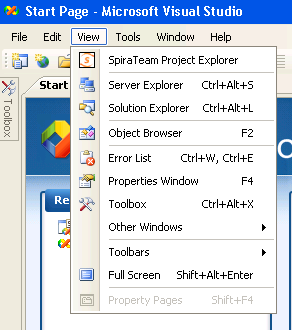

# Visual Studio 2005 - 2008

This section outlines how to use SpiraTest, SpiraPlan or SpiraTeam
(hereafter referred to as SpiraTeam) in conjunction with the Visual
Studio (VS) integrated development environment (IDE) for viewing
Requirements, completing Tasks and fixing Incidents.

The Add-In will operate in Visual Studio 2005 and 2008 but does require
that the .NET framework version 3.5 SP1 is installed. It is normally
installed with Visual Studio 2008 SP1 and Visual Studio 2010, but can be
separately installed on a system with Visual Studio 2005 by downloading
the installation file from Microsoft:
<http://www.microsoft.com/downloads/details.aspx?FamilyID=ab99342f-5d1a-413d-8319-81da479ab0d7>

Visual Studio Express versions cannot support Add-Ins, you must at least
have the standard version of the IDE for the Add-In to appear in the
menu bar.

## 
7.1. Installing the Visual Studio Add-In

Download and execute the Add-In installation file from the Inflectra
website. The add-in will be automatically added to VS's menu bar.

## Adding and Assigning SpiraTeam Projects

To view the Project Explorer, select "SpiraTeam Project Explorer" from
the View menu. The tool window will open, and can be docked with any
existing tool windows. When a solution is loaded that hasn't had any
SpiraTeam projects assigned to it -- or if no solution is open -- the
dialog will report so. If you have already assigned SpiraTeam projects
to the open solution, they will each be loaded in a tree format in the
tool window.

Visual Studio will remember the docking and location of the window, so
that if you close it you can re-open it by selecting the menu option a
second time. The window will re-open in the last position before it was
closed.

Once the Project Explorer is open, click the "Configuration" button
() in the Project Explorer's toolbar to
open the SpiraTeam project dialog. Note that if you have no solution
open, you can add, remove, and edit SpiraTeam projects, but you can only
assign them to a solution when that solution is open:

Click the New button
(

) to link to a new SpiraTeam project. The
"new SpiraTeam Project" dialog will open. In the fields, enter in the
following:

-   **Server URL**: The root address of your SpiraTeam installation. For example:
> <https://server1/SpiraTeam/>
> Do not put "login.aspx" or any other page address in this field.

-   **User ID**: Your user ID you use to log into the SpiraTeam application.

-   **Password**: Your password you use to log into the SpiraTeam application.

Once entered, click the "Get Projects" button. The add-in will connect
to the server and get a list of projects that you are assigned to.
Select the SpiraTeam project that you want to add, and click the "Save"
button. Your project will appear in the dialog in the format of "Project
Name \[Server\]". With a project selected in the left box, you can also
Edit
() and Delete 
(
) the project.

With a solution loaded, you can select any number of SpiraTeam projects
and assign them to the open Solution, by highlighting them, and clicking
the "Add \>" button. All projects assigned to the open solution will
appear in the right side.

Clicking "Save" will return you to the IDE, and if you made any changes
in the configuration, the Project Explorer will refresh and update its
display.

## Viewing SpiraTeam Project Artifacts

Once a solution is opened and there is a SpiraTeam
project assigned, you can view the project's contents. At this time, the
add-in will display the following items:

 **Incidents**: Assigned to you,
unassigned.

 **Tasks**: Assigned to you, unassigned.

 **Requirements**: Assigned to you.

By default, the Project Explorer will not show closed and completed
items. However, by clicking the 'View Closed'
() button in the toolbar, the Project
Explorer will be updated to show closed and completed items as well.

Double-clicking on a node (or clicking on the item's arrow) will open
that item up and show all the sub-items.

Clicking the Refresh
() button on the toolbar will refresh the
SpiraTeam projects in the Project Explorer. Double-clicking an artifact
will open its details in the main tabbed document area for viewing and
editing.

## Viewing Artifact Details

By double-clicking an artifact in the Project Explorer, you can open the
details for the item in the main tabbed-document view. All the details
screens are very similar, here is the Incident Details view for
reference:

The top of the window has the "Save" button, and any informational or
warning messages will appear to the right of the Save button. The rest
of the window has detail fields relating to the item, and depending on
the current workflow, some fields may be required or disabled. (Note
that at this time, Requirements are read-only.)

Once you make changes to the artifact, changes are saved to the server
when the "Save" button is clicked.

*Note that due to platform architecture differences, the HTML
description may not appear and save exactly as entered, and there is no
'Source HTML' view. If visual integrity/layout is important, then we
recommend editing the description and resolution fields in SpiraTeam's
Web user interface instead.*

## Data Concurrency Warnings

When trying to save an artifact, you may get a warning at the top of the
window stating that the item was modified by another user. This error is
telling you that changes were made to the item after the data on your
screen was pulled from the server.

When this happens, you may see some fields highlighted in yellow or red.
The colors represent data collisions:

-   Yellow -- Any field highlighted yellow is a field that you tried to
change that wasn't changed by the other user.

-   Red -- Any field highlighted in red is a field that both you and the
other user tried to change.

-   No Highlight -- Fields without a highlight were possibly changed by
the other user, but you did not make any changes to those fields.

When a concurrency issue occurs, the new data is loaded from the server,
losing your changes due to possible workflow collisions. Simply review
the changed data and make your changes accordingly.

## Troubleshooting

The add-in is designed to capture all errors so that when something
unexpected happens, work isn't lost. In most situations where an error
occurs, a notification will be displayed of the error. In the Project
Explorer, hover the mouse over the error node to get a full description
of the error. Errors will also be logged to the desktop's Application
Event Log.

A common symptom of an internal error is a blank or empty Details screen
-- if this occurs when opening an artifact, save all your open work and
restart Visual Studio. Contact support with the Application Event Log
and inform them of the issue.

