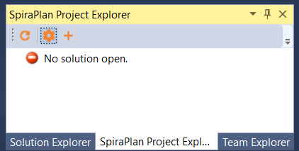
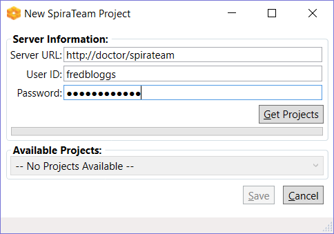
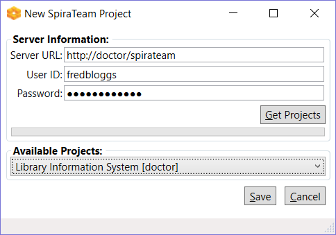
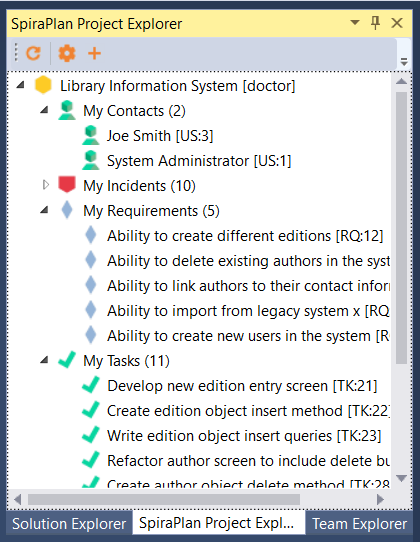
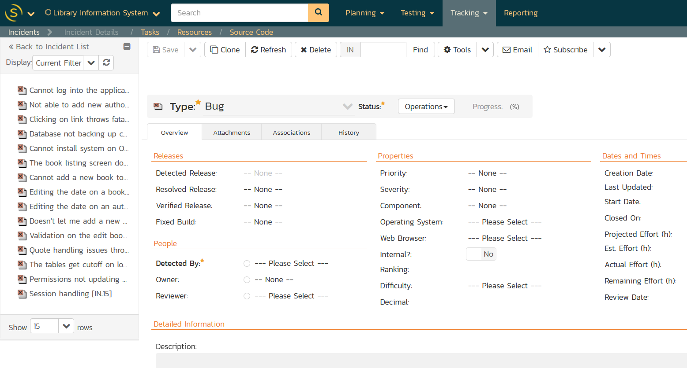
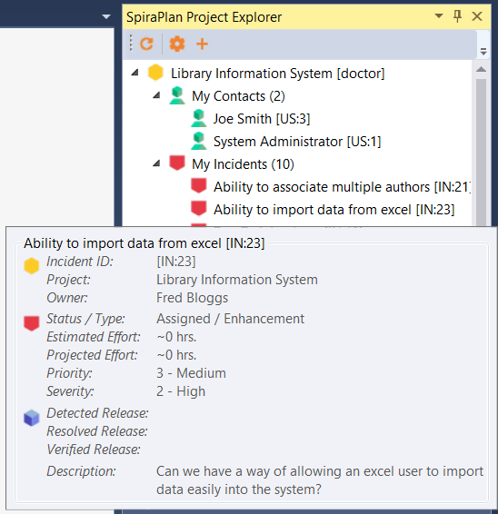
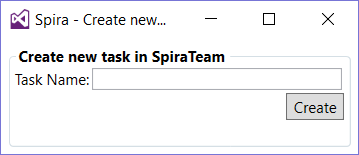

# Visual Studio

This section outlines how to use SpiraTest, SpiraPlan or SpiraTeam
(hereafter referred to as SpiraTeam) in conjunction with the Visual
Studio (VS) integrated development environment (IDE) for viewing
Requirements, completing Tasks and fixing Incidents.

This add-in is meant for use with Visual Studio 2012 or later and
SpiraTest, SpiraPlan or SpiraTeam (hereafter referred to as SpiraTeam)
version v5.0 or later. It does require that .NET v4.5 be installed;
however this is required by Visual Studio 2012 by default.

## Installing the Visual Studio Add-In

The addin is downloadable from [Microsoft's Visual Studio
Gallery](http://visualstudiogallery.msdn.microsoft.com/ef3e5da0-ac1e-48de-9c4b-0a8479ef8498),
or from within Visual Studio by going to *Tools* -\> *Extension Manager*
and searching for "SpiraTeam". If downloaded from within Visual Studio,
after installation the IDE will need to be restarted. If downloaded from
the browser, double-click on the VSIP file and it will walk you through
the installation process.

## Adding and Assigning SpiraTeam Projects

After installing, a new menu item will appear under the "View" menu:

To view the Project Explorer, select "SpiraTeam Project Explorer" from
the View menu. The tool window will open, and may be docked like any
other tool window. When a solution is loaded that hasn't a SpiraTeam
project assigned to it -- or if no solution is open -- the tool window
will give a message saying so:

Once a project is loaded that contains linked SpiraTeam projects, or a
SpiraTeam project is added to the current open solution, then the tool
window will load in the SpiraTeam projects and display them.

To add, remove, and assign a SpiraTeam project to the open solution,
click the SpiraTeam Configuration Button in the Tool Window (looks like
a cog), which will open the configuration dialog:

In the fields, enter in the following:

-   **Server URL**: The root address of your SpiraTeam installation. For
> example:\
> <https://server1/SpiraTeam/>\
> Do not put "login.aspx" or any other page address in this field.

-   **User ID**: Your user ID you use to log into the SpiraTeam application.

-   **Password**: Your password you use to log into the SpiraTeam application.

Once entered, click the "Get Projects" button. The add-in will connect
to the server and get a list of projects that you are assigned to.

Select the SpiraTeam project that you want to add, and click the "Save"
button.

Clicking "Save" will return you to the IDE, and if you made any changes
in the configuration, the Project Explorer will refresh and update its
display.

## Viewing SpiraTeam Project Artifacts

Once a solution is opened and there is a SpiraTeam project assigned, you
can view the project's contents. At this time, the add-in will display
the following items:

-   **Users:** Users in your Spira contacts list

-   **Incidents**: Assigned to you and open.

-   **Tasks**: Assigned to you and not completed.

-   **Requirements**: Assigned to you and not developed yet.

Double-clicking on a node (or clicking on the item's arrow) will open
that item up and show all the sub-items:

Clicking the Refresh button on the toolbar will refresh the highlighted
item in the tree, and all sub-items contained within it. SpiraTeam
projects in the Project Explorer.

All items have a right-click menu, and the options available for items
are as follows:

-   **View in Browser**: Opens the details of the item in your current
web browser.

-   **Refresh List**: For folders and project only. Refreshes the folder
or project's contents.

-   **Copy to Clipboard**: Copies the artifact's token into the
clipboard, for easy pasting into Version Control commits or
descriptions.

## Viewing Artifact Details

By double-clicking an artifact in the Project Explorer (or choosing View
in Browser), you can open the details for the item in the current tab of
your web browser:

In addition, when you select one of the items in the add-in treeview,
the add-in will display the properties for that item in the standard
Visual Studio properties window:

This lets you decide whether you want to open the item in SpiraTeam
before actually doing so. In a similar vein, there is a helpful tooltip
displayed for all items in the tree:

## Creating a Task

If you click on the (+) icon in the extension toolbar you will be able
to quickly log a new task in SpiraTeam or SpiraPlan, making it easier to
track new developer tasks and have them sync across machines:

Just enter the name of the new task and it will be created in SpiraTeam,
then displayed in the task list:

## Troubleshooting

The add-in is designed to capture all errors so that when something
unexpected happens, work isn't lost. In most situations where an error
occurs, a notification will be displayed of the error. In the Project
Explorer, hover the mouse over the error node to get a full description
of the error.

Errors will also be logged to the desktop's Application Event Log or a
text file in case there was a problem connecting to the Event Log on the
local computer. Contact support with the Application Event Log and
inform them of the issue.

