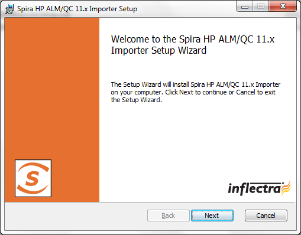
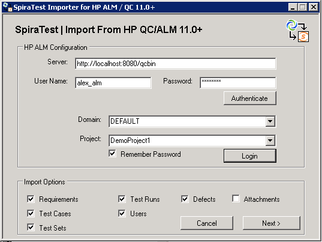
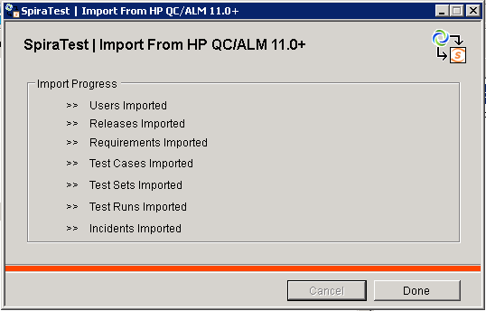

#  Migrating from HP ALM

This section outlines how to use the included Migration Tool for
importing Releases, Hosts, Requirements, Test Cases, Test Runs and
Incidents from HP ALM (formerly known as HP Quality Center).

## Installing the HP ALM Migration Tool

This section outlines how to install the migration tool for HP ALM onto
a workstation so that you can then migrate whole projects from HP ALM to
either SpiraTest or SpiraTeam (hereafter referred to as SpiraTest). It
assumes that you already have a working installation of SpiraTest v4.0
or later and a working version of HP ALM 11.5 or later. If you have an
earlier version of SpiraTest you will need to upgrade to at least v4.0
before trying to migrate projects. If you are using HP QualityCenter
10.0 or older, please refer to the migration tool for this version in
section 4 of this document.

The Windows installation package can be downloaded from the 'Add-Ons &
Downloads" section of the Inflectra website. Once you have obtained the
Windows Installer package, simply double-click on the package to begin
the installation wizard which should display the following welcome page:

> 

> 

Click the \<Next\> button, accept the software license, then click
\<Next\> again to choose the folder to install the migration tool to:

> 

> 

Choose the folder to install to, and then decide whether the application
should be accessible by all users on the workstation or just the current
user. Then click the \<Install\> button to start the installation
process. It will confirm if you want to proceed, click \<Next\> then
wait for it to finish.

## Using the HP QualityCenter Migration Tool

Now that you have installed the migration tool, you can launch it at any
time by going to Start \> Programs \> Inflectra \> SpiraTest \> Tools \>
HP ALM Importer. This will launch the migration tool application itself:

> 

> 

The first thing you need to do is to enter the URL for the instance of
HP ALM that you want to import the information from (typically of the
form http://\<server name\>/qcbin) together with a valid username and
password.

Once you have entered this information, click the \<Authenticate\>
button and the list of possible domains and projects will be populated.
Select the HP ALM domain and project that you want to ***import from***
and click the \<Login\> button.

Assuming that the user name selected has permission to access this
project, you will be prompted with a message box indicating that the
login was successful. Now choose the types of artifact you want to
import and then click the \<Next\> button to move to the next page in
the import wizard:

> 

> 

This page allows you to enter the URL, user name and password that you
want to use to access the instance of SpiraTest that you want to
***import to*** and click \<Login\>. Typically the URL is of the form
(http://\<server name\>/SpiraTest). The version of the importer being
used must be compatible with the version of SpiraTest you're importing
into; if not you will receive an error message.

In addition, you need to enter the default password for all users that
the importer will create in SpiraTest. You need to make sure that this
password meets the minimum complexity requirements of your SpiraTest
installation or the import will fail with an error message indicating
the password is not allowed.

Assuming that the login was successful, click the \<Start Import\>
button to actually begin the process of importing the various artifacts
from HP ALM into SpiraTest. Note that the importer will automatically
create a new project in SpiraTest to hold all the artifacts with the
same name as that used in HP ALM.

> 

> 

During the import process, as each of the types of artifact are
imported, the progress display will change (as illustrated above). Once
the import has finished, you will receive a message to that effect and
the \<Done\> button will be enabled. Clicking this button closed the
importer. You should now log into SpiraTest using the same user name and
password that was used for the import to view the imported project.

The migration tool will import the following artifacts:

Custom Properties and Custom Lists

Users (but not their roles and permissions)

Releases

Requirements

Automation Hosts

Test Cases and their associated manual design steps (but not any
automated test scripts)

Test Runs and their associated manual test steps

Test Sets and the association with the test cases

Defects, together with their associated lists of priorities and statuses

The coverage relationship between requirements and test cases

The linkages between any defects and test runs

Any attachments associated with the requirements, test cases, test sets
or design steps.

*Note: Once you have migrated a project into SpiraTest you will have the
definitions of incident priorities and statuses from both SpiraTest and
HP ALM (this is because HP ALM doesn't use the same codes as SpiraTest,
so they will be imported).*

*You should go back in to the Administration screen and make all the
standard SpiraTest statuses and priorities inactive, and then create a
new incident workflow using the imported HP ALM statuses.*

