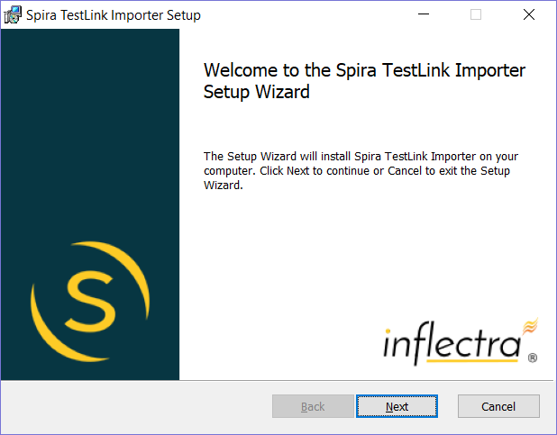
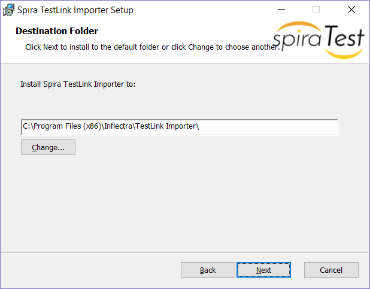
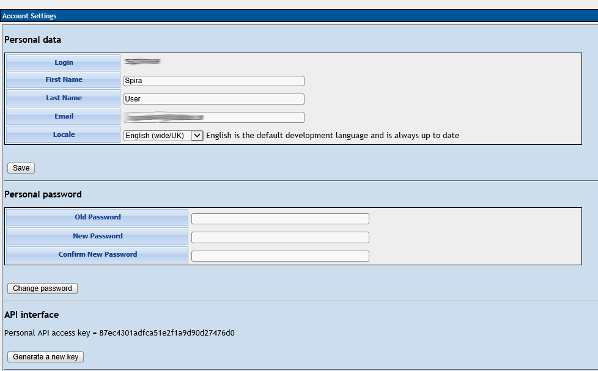
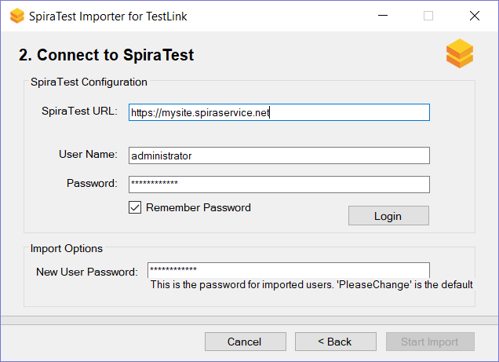
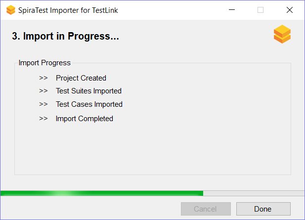
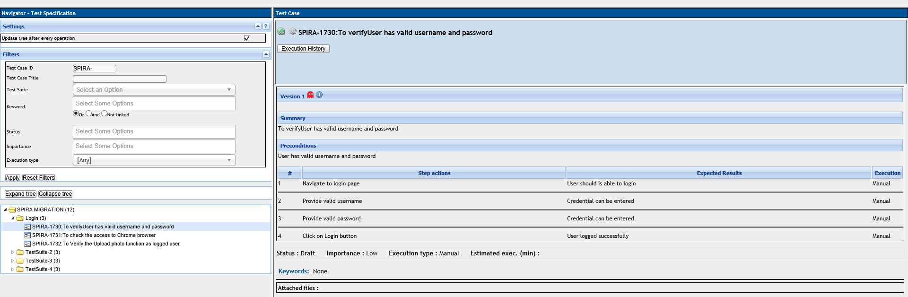
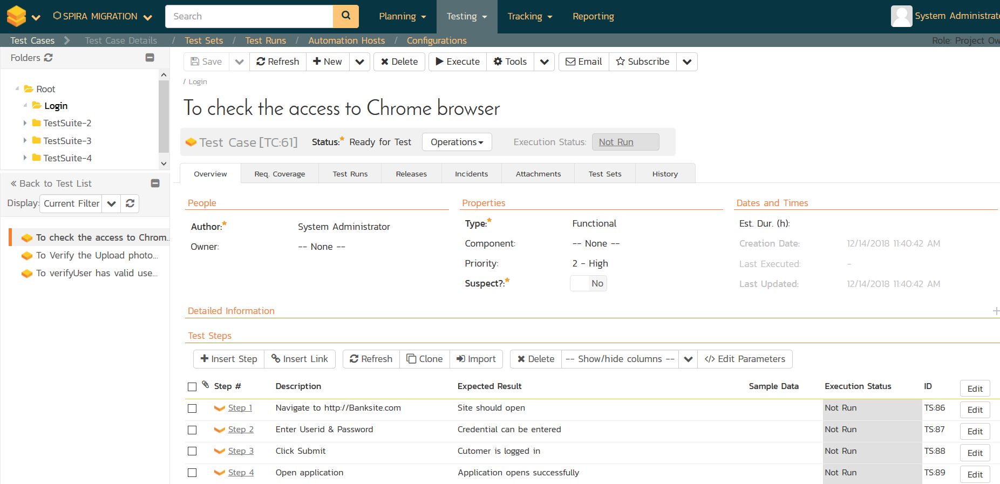

# Migrating from TestLink

This section outlines how to use the free Migration Tool for importing
Projects, Test Suites, Test Cases, and Test Steps from the open source
TestLink application into SpiraTest.

## Installing the TestLink Migration Tool

This section outlines how to install the migration tool for TestLink
onto a workstation so that you can then migrate whole projects from
TestLink to either SpiraTest, SpiraTeam or SpiraPlan (hereafter referred
to as SpiraTest). It assumes that you already have a working
installation of SpiraTest v5.0 or later and a live instance of TestLink
to migrate from. If you have an earlier version of SpiraTest you will
need to upgrade to at least v5.0 before trying to migrate projects.

The Windows installation package can be downloaded from the 'Add-Ons &
Downloads" section of the Inflectra website. Once you have obtained the
Windows Installer package, simply double-click on the package to begin
the installation wizard which should display the following welcome page:

 
 

Click the \<Next\> button, accept the software license, then click
\<Next\> again to choose the folder to install the migration tool to:

 
 

Choose the folder to install to, and then decide whether the application
should be accessible by all users on the workstation or just the current
user. Then click the \<Install\> button to start the installation
process. It will confirm if you want to proceed, click \<Next\> then
wait for it to finish.

## Using the TestLink Migration Tool

Now that you have installed the migration tool, you can launch it at any
time by going to Start \> Programs \> Inflectra \> SpiraTest \> Tools \>
TestLink Importer. This will launch the migration tool application
itself:

The first thing you need to do is to enter the URL for the instance of
TestLink that you want to import the information from (typically of the
form http://myserver/testlink) together with a valid API Key. If you
don't have an API Key, you need to first login to TestLink using your
normal username and password, then generate an API on the user profile
page:

Once you have entered this information, click the \<Authenticate\>
button and the list of projects will be populated. Select TestLink
project that you want to ***import from*** then click the \<Next\>
button to move to the next page in the import wizard:

This page allows you to enter the URL, user name and password that you
want to use to access the instance of SpiraTest that you want to
***import to*** and click \<Login\>. Typically, the URL is of the form
(https://xxxx.spiraservice.net). The version of the importer being used
must be compatible with the version of SpiraTest you're importing into;
if not you will receive an error message.

In addition, you need to enter the default password for all users that
the importer will create in SpiraTest. You need to make sure that this
password meets the minimum complexity requirements of your SpiraTest
installation or the import will fail with an error message indicating
the password is not allowed.

Assuming that the login was successful, click the \<Start Import\>
button to actually begin the process of importing the various artifacts
from TestLink into SpiraTest. Note that the importer will automatically
create a new project in SpiraTest to hold all the artifacts with the
same name as that used in TestLink.

 
 

During the import process, as each of the types of artifact are
imported, the progress display will change (as illustrated above). Once
the import has finished, you will receive a message to that effect and
the \<Done\> button will be enabled. Clicking this button closed the
importer. You should now log into SpiraTest using the same user name and
password that was used for the import to view the imported project.

The migration tool will import the following artifacts from TestLink:

The project name and description

Test suites

Test cases with their steps (if defined)

For example, the following TestLink project:

Now looks like this in SpiraTest (v5.4):

*Should the import fail for any reason, there will be a log file created
on the Desktop of the person doing the import. The filename is usually:
**Spira\_TestLink\_Import.log**.*

