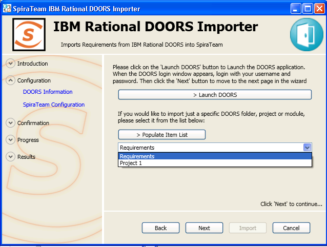
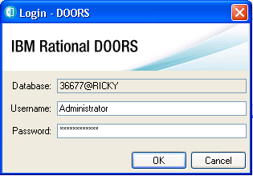
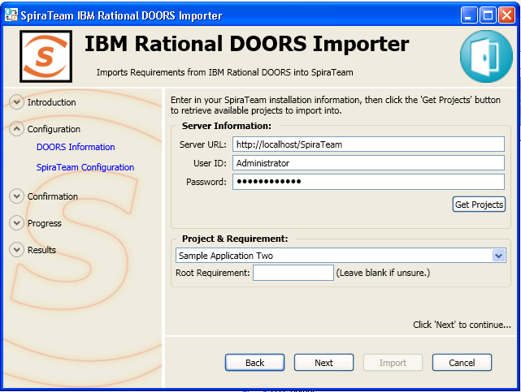
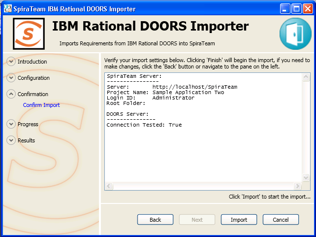
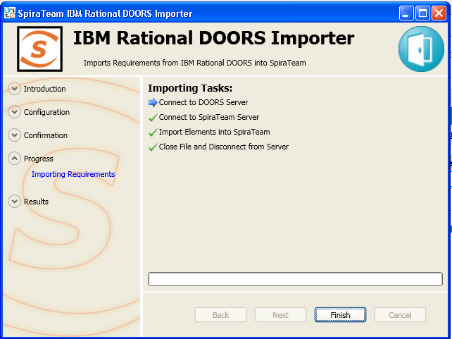

# Importing From DOORS

This section outlines how to use the included Importer for importing
folders, projects, modules and requirements from an IBM Rational DOORS
database into a project in SpiraTest®, SpiraPlan® or SpiraTeam®
(hereafter referred to as SpiraTeam).

## Installing the Importer

This section outlines how to install the importer onto a workstation so
that you can then import requirements from DOORS into SpiraTeam. It
assumes that you already have a working installation of SpiraTeam v3.0
or later and a working installation of DOORS 9.0 or later.

You can download the Importer from the Inflectra's website under
"Downloads and Add-Ons". When downloaded, double-click the MSI file.
Follow the instructions in the MSI file to install the importer.

## Importing from a DOORS Database

Now that you have installed the integration adapter, you can launch it
at any time by going to Start \> Programs \> SpiraTest \> Tools \> IBM
Rational DOORS Adapter. This will launch the import application itself.
You will be shown an introduction screen. Click 'Next' to get to the
second screen:

You need to click on the \[Launch DOORS\] button to connect to the
locally installed DOORS client. Then you can enter in your DOORS
login/password to access the system:

> 

> 

Once you have successfully authenticated with DOORS, you have the option
of importing ALL the requirements in the DOORS database into a SpiraTeam
project or selecting just a specific item (folder, project or module) in
the DOORS hierarchy. To select a specific item, click on the "Populate
Item List" button and choose the item from the dropdown list.

Then click *Next* to continue to the screen where you enter your
SpiraTeam server and project information:

On this screen, you need to enter the SpiraTeam Server URL, the username
and password you use to log onto the system, then click the *Get
Projects* button. The program will connect to the server and get a list
of all available projects. Select the project you want to import into
under the *Project & Requirement* section.

The *Root Requirement* box is for specifying a base requirement to load
all the DOORS elements into. If left blank, then the importer will
create a single placeholder requirement that all of the DOORS folders,
projects, modules and requirements will be nested under.

If you have a requirement already in SpiraTeam, and want the DOORS items
to appear inside it, then you need to enter the requirement number into
the *Root Requirement* text box. For example, if you have a requirement
named "DOORS Requirements" with a number of RQ1920, then put 1920 into
the *Root Requirement* field and run the import. When import is
finished, the SpiraTeam requirements will be nested underneath.

Note: At this time, Link Modules are **[not]{.underline}** imported from
DOORS databases.

Once the fields have been populated, click *Next* to get to the summary
screen.

The summary screen tells you what will actions will be performed, and
once you have verified the information, click the *Import* button to
start the import:

Anything flagged with a red

 failed, green

 means that they succeeded. Once finished,
click *Finish* to get to the last page of the wizard:

If the *Minimize to System Tray* option is selected, when you click
Finish or exit the from the application, it will minimize to the system
tray. Once in the system tray, you can right-click on the icon and the
it will give you the option to either re-import from the same project or
select another project for a fresh import. If the option is not
selected, the program will exit, and you can re-launch the importer to
import from the same or another DOORS database.

## Using the System Tray Shortcut Menu

When the application is minimized to the system tray, there are several
shortcuts available:

-   Double-Clicking the icon will bring the importer back to the first
screen, allowing you to import another DOORS database.

-   Right-clicking will give a shortcut menu with the following options:

-   Exit -- Close the program entirely.

-   Rerun Import -- Will provide you the screen to re-launch the
last import you just ran.

-   Show Window -- Same as double-clicking on the icon, will bring
the wizard back to the first screen, allowing new input options
to be set.

## DOORS & SpiraTeam Importing Notes

At this time, only formal modules are imported into SpiraTeam from
DOORS. The folders, projects and modules in DOORS become summary
requirements in SpiraTeam and the actual requirements in each module are
simply nested as child requirements in SpiraTeam. In addition, the
following fields are brought over into SpiraTeam from DOORS according to
the following mapping table:

**DOORS Field**   **SpiraTeam Field**
Heading           Name
Short Text        Description
Long Text         Description
Number            Name
DOORS Object ID   Custom Text Property TEXT\_01

Using this adapter, you can manage the appropriate artifacts in IBM
Rational DOORS and then periodically re-run the import application to
update SpiraTeam. The application will remember that the project was
already used for an initial load and will simply update the requirements
as appropriate as well as add any additional ones added.

Note that any changes to the requirement hierarchy are not reflected.
This allows you to change the organization of the artifacts in SpiraTeam
to make them easier to use without the changes being overwritten on the
next import cycle.

Finally, should you want to start again and re-import a project from
scratch that has already been imported once before, you may do so by
re-running the Importer, and entering in **-1** as the *Root
Requirement*. This will not delete requirements from SpiraTeam, only
remove mappings, so the next time you run the importer on this file, all
new requirements will be created.

***Note: This option is irreversible and should be performed with
care.***
