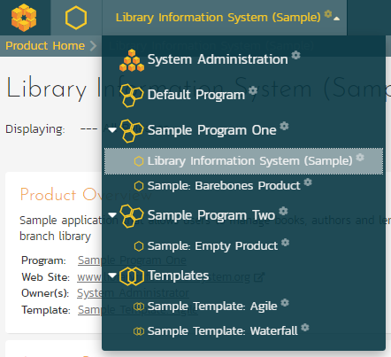

# System Administration

Now that you have successfully installed SpiraPlan®, this section of the
guide outlines how to perform the typical administrative tasks necessary
for setting up products and programs in the system, managing users and
verifying the license information.

To perform these tasks, you need to login to the system with a user that
has some level of "administration" permissions within the system. There
are four different sections to administration, and each has its own
permission. These sections and their permissions are:

1.  **System Administration**: tasks like approving new users, creating
new products, changing security settings, or viewing the logs all
happen at the system-wide level of administration. There is a
special "System Administrator" flag that can be assigned to any user
(by an existing system admin only). Any user that has this flag can
perform any system administrator task. *Please note that a special
"administrator" user is created by the installer. You should
initially login to SpiraPlan® with the username
    administrator, and the password
    'PleaseChange'. Change this password as soon as
possible to something that is secure yet memorable by clicking on
the "User Profile" link -- see the SpiraPlan® User Manual for more
details.*

2.  **Product Administration:** a product admin can make changes
specific to that product and that product only. For instance, they
can add or remove users from a product. Once a user is made a
product admin, they can perform all the actions in the product
administration section. *Each individual product has a defined set
of users who are members of that product. Each member is assigned a
specific role (many users can share the same role), and a role can
be set to be a product admin.* *Please note, that when a system
admin creates a product, they are automatically added as "Product
Owner*".

3.  **Program Administration:** just like with products, some aspects of
a program are managed in the program section of administration.
Anyone who is assigned the role of "Program Owner" on a program can
perform these administrative functions.

4.  **Template Administration:** end users of the application will work
with products and sometimes programs. However, behind the scenes of
every product is a template. This template controls the bulk of how
that product is configured and will work for the end users. Each
product is controlled by one template, though each template can
control many products at once. Making a change to a template in
template administration will immediately affect all products
controlled by that template. Such changes to a template include
changing the name of incident types, changing the colors used to
indicate requirement priorities, or changing custom properties.
*Please note that template admin permissions are managed by the same
roles that manage product admin permissions and that apply to
members of each product.*

Once you have logged in as an administrator, you can click the
"Administration" link which can be found on the right-hand side of the
global navigation at the top of any page:

This will display the context aware administration menu popup. This menu
will show different sections depending on where you are in the
application and your administrative privileges. For example, only system
administrators see the "System: Admin Home" section shown at the bottom
of the screenshot below.

In the screenshot below you can see that administration links are being
shown for three different sections:

1.  Library Information System -- which is a product

2.  The template called Sample Template: Agile (this is the template the
controls the above product)

3.  System wide administration

This menu only shows the links to one product, one template, or one
program at a time (and System Admin all the time to system
administrators). Because this user is currently viewing a page in the
product 'Library Information System', admin items for that product and
its template are visible.

You can see that the "Requirements" sub section is highlighted. This is
because the user is currently on a requirements page of the 'Library
Information System' product (either in the main application or in
template administration). The highlighting serves no function other than
to guide the user to where they may wish to focus.

Below is an example of an administration menu where a user is a Program
Owner but with no other access to administration. This menu is much
barer than the one above, because the administrative options this user
has are that much more limited. This user only has admin access to
Sample Program One. If they navigate to a different program page or to a
product page in the application, they would not see the admin menu at
all.

If a user wants to see what, if any, parts of the system they have
administrative access to, they can do so at any time. Clicking on the
workspace dropdown on the global navigation will show them the list of
workspaces they have access to. Below, you can see that products are
grouped into programs, and there is a dedicated Templates section at the
bottom. Any workspace the user has administrative access to has a
superscript gray cog to the right of that workspace's name.

If this user wants to access the admin menu for "Sample Barebones
Product", first that cog tells them they can do so. By clicking on that
workspace's name, they will be switched to that workspace and then they
can click on the admin button to get the right menu.

In the screenshot above at the top there is a "System Administration"
workspace. This is visible because this user is a system administrator.
Clicking this will take the user directly to the System Administration
home page.

The Administration home page, like all admin pages, is divided into two
areas:

1.  the skinny left-hand bar. Clicking this will show the context-aware
administration menu discussed above

2.  the main pane that displays the available options for the selected
page.

This home page shows a number of useful widgets with information about
the system. You can edit these widgets, their position, and what is
shown, using the two buttons in the top right (the cog and the plus).

Product and Template administration home pages also show useful data and
links relevant to them. On most admin pages for products and templates
the name of the current product or template is shown at the top of the
page in a heading. These names are hyperlinks that will open the product
or template administration home page.

When you first install the system, we suggest **three main tasks** to
perform as the system administrator to get familiar with the basics and
to help colleagues start to use the application:

1.  Create a new product to use (see XXXX below)

2.  Create the users that will be accessing the system (see XXXX below)

3.  Add the users as members of the various products (see XXXX below)

These tasks typically need to be performed before any other users can
use the system, since there will be no logins or products available
other than the sample ones provided during the installation.

The rest of this guide explores each area of administration in order,
grouped by administration section.

## System: Workspaces

### View/Edit Products

The following screen is displayed when you choose the "View/Edit
Products" link from the administration menu:

This screen displays the list of products in the system (both inactive
and active) together with their program, template, date of creation, and
active status. Clicking on either the "View" link in the right-hand
column or the name of the product will change the currently selected
product to one clicked.

You can filter the list of products by either choosing an active status,
program, or entering a portion of the name or date into the appropriate
text box. When you click the "Filter" button, the list of products will
be filtered by the criteria you entered. You can clear the filter
selection by clicking the "Clear Filters" button. To sort the list of
products, just click on the appropriate arrow icon located in the header
row of each field (one each for ascending / descending) In addition, the
list of products is paginated into groups of fifteen (15). You can step
through the different pages by clicking the page numbers at the bottom
of the product list.

To permanently delete a product, you should click the "Delete" button to
the right of the product details. This is irreversible and will delete
all the artifacts associated with the product. If you want to
temporarily delete a product, set its Active flag to 'No' instead. To
make a copy of a product to reuse its test cases, releases, test sets
and requirements, click the "Copy" link to the right of the product.
*Note that this will not make a copy of any historical
information, test runs or incidents.*

To add a new product to the system, click the "Add" button at the bottom
of the product list, and a new screen will be displayed that allows you
to enter the new product information:

You need to:

-   enter a name for the product (which cannot be the same as any
already in use);

-   select which program it belongs to and optionally enter a detailed
description and/or web-site URL;

-   you should initially make sure that the product is marked as
"Active";

-   decide what to base the product on. It can either be a new empty
product, or be based on another product already in the system. Doing
the latter will copy across its membership, settings and
customizations;

-   select a template that will control the product. If you are creating
an empty product (not based on an existing one) you can select any
template in the system to use for this product, or you can start
with a brand new template. If you are creating a product based on an
existing one, then by default the template will be the same as the
one the existing product uses. You can still create a new template
in this case, which will effectively be a clone of the template the
existing product uses.

Once you are satisfied with the information, click the "Insert" button
to actually create the new product.

In a similar way, to edit the details of an existing product, click the
"Edit" button in the right hand column of the product list box, and you
will be taken to the following screen that allows you modify the product
details:

On this screen you can edit the name, description, program, website URL
and active status. Once you have made the necessary changes, click the
"Save" button to commit them. If you decide that you want to ignore the
changes, click the "Cancel" button and the changes will be discarded.

### View/Edit Programs

The following screen is displayed when you choose the "View/Edit
Programs" link from the Administration menu:

This screen displays the list of programs in the system (both inactive
and active) together with their template, web site URL, date of creation
and active status. Programs are used to relate products that are in the
same department/division/organization or are for a common customer,
client, etc. When products are in the same program, a user that is a
member of the program can see the special Program Dashboard that
displays key metrics from all the products in the program combined.
Also, such users will have observer-level access to the contained
products without needing to be explicitly added to each product.

You can filter the list of programs by either choosing an active status,
or entering a portion of the name, web-site or date into the appropriate
text box. When you click the "Filter" button, the list of programs will
be filtered by the criteria you entered. You can clear the filter
selection by clicking the "Clear Filters" button. To sort the list of
programs, just click on the appropriate arrow icon located in the header
row of each field (one each for ascending / descending) In addition, the
list of programs is paginated into groups of fifteen (15). You can step
through the different pages by clicking the page numbers at the bottom
of the product list.

To permanently delete a program, you should click the "Delete" button to
the right of the program details. Any products contained in the program
will not be deleted, but instead just moved to the default
program. There has to be at least one program in the system at all
times, so the program designated as the 'default' one will not be
available for deletion.

To add a new program to the system, click the "Add" button at the bottom
of the program list, and a new screen will be displayed that allows you
to enter the new program information:

You need to enter:

-   a name for the program;

-   optionally enter a detailed description and/or web-site URL;

-   you should initially make sure that the program is marked as
"Active";

-   you can choose to make this program the default one (meaning that it
cannot be deleted and products get added to it when their programs
are deleted);

-   in addition you can optionally choose to associate the program with
a product template. The template only controls the products that use
it. It does not control the program, but it can affect what data is
visible from some of the program pages.

Once you are satisfied with the information, click the "Insert" button
to actually create the new program.

In a similar way, to edit the details of an existing program, click the
"Edit" button in the right-hand column of the program list box, and you
will be taken to the following screen that allows you modify the program
details. **Please note that this is the only administrative page in the
program administration section.**

On the top part of this screen you can edit the name, description,
website URL, active status and default status. Once you have made the
necessary changes, click the "Save" button to commit them. If you decide
that you want to ignore the changes, click the "Cancel" button and the
changes will be discarded.

In addition, the lower part of the screen allows you to view/edit the
users that are members of the program and also see which products are in
the program:

a) Program User Membership

This tab allows you to see which users are members of the program and
which program role they have:

The two program roles are "Executive" and "Program Owner":

**Executive** -- This role allows the user to see the dashboard for this
program, which contains all the key metrics for the contained products
displayed in an aggregated manner. Please see the *SpiraPlan User
Manual* for more details on this dashboard. In addition, the user is
automatically granted 'observer' permissions for all the products in the
program.

**Program Owner** -- This role consists of all the permissions granted
to the "Executive" role above, but in additional allows the user to make
changes to the Program itself in the Administration section.

To change the role of an existing program member, just change the role
in the drop-down list and click \[Save\]. To remove a member from the
program, just select the appropriate checkboxes and click \[Delete\].
Finally, to add a new user to the program, click on the \[Add\] button:

You now should narrow down the list of users by entering filter criteria
and clicking \[Filter\]. Once you have located the appropriate user(s),
just select a program role for them from the drop-down list and click
\[Add\] to add them to the program in the specified role.

b) Program Product List

This tab allows you to see the list of products that are contained
within the current program. Clicking on the name of the product will
take you to the details page for that product:

### View/Edit Templates

The following screen is displayed when you choose the "View/Edit
Templates" link from the administration menu:

This screen displays the list of templates in the system (both inactive
and active) with their active status.

You can filter the list of products by either choosing an active status,
ID, or entering a portion of the name into the appropriate text box.
When you click the "Filter" button, the list of templates will be
filtered by the criteria you entered. You can clear the filter selection
by clicking the "Clear Filter" button. To sort the list of templates,
click on the appropriate arrow icon located in the header row of each
field (one each for ascending / descending).

To permanently delete a template, click the "Delete" button to the right
of the template details. This is irreversible. If you want to
temporarily delete a product, set its Active flag to 'No' instead.
Neither of these actions will be possible if any product (active or
inactive) is controlled by the template*.*

To add a new template to the system, you need to create a new template
when creating a new product (as described in section 3.1.1 above). To
edit the details of an existing template, click the "Edit" button in the
right hand column of the template list box, and you will be taken to the
following screen that allows you modify the template details:

On this screen you can edit the name, description, program, and active
status. Once you have made the necessary changes, click the "Save"
button to commit them. If you decide that you want to ignore the
changes, click the "Cancel" button and the changes will be discarded.

## System: Users

### View / Edit Users

The following screen is displayed when you choose the "View/Edit Users"
link from the Administration menu:

This screen displays the list of users in the system (both inactive and
active) together with their first name, middle initial, last name,
username (login), administrative permission status and active status.

You can filter the list of users by either choosing an administrative /
active status, or entering a portion of the first name, middle initial,
last name or username into the appropriate text box. When you click the
"Filter" button, the list of users will be filtered by the criteria you
entered. You can clear the filter selection by clicking the "Clear
Filters" button. To sort the list of users, just click on the
appropriate arrow icon located in the header row of each field (one each
for ascending / descending). In addition, the list of users is paginated
into groups of fifteen (15). You can step through the different pages by
clicking the page numbers at the bottom of the user list.

To add a new user to the system, click the "Add" button at the bottom of
the user list, and a new screen will be displayed that allows you to
enter the new user information:

On this screen, you can enter information about the user, such as their
name, email address, and department. You can also create their password,
password reset question and answer. If you want the user to be able to
subscribe to items in the system as RSS feeds, you should also make sure
that the "Enable RSS Feeds" checkbox is selected and a GUID token is
displayed in the text-box underneath.

When creating a new user, you can also set their role for products. A
user can be assigned a role to multiple products at once, by checking
the required checkboxes in the dropdown list of products. The same role
will be applied across all products.

*Note: If you make a user a System Administrator, it will force that
user to always have the 'Product Owner' role on all their assigned
products, regardless of the chosen role. If you disable this option,
they will then revert back to their true role.*

In a similar way, to edit the details of an existing user, click the
"Edit" hyperlink in the user list box, and you will be taken to the
following screen that allows you modify the user details:

On this screen you can edit the first name, middle initial, last name,
username, email address, system administration status and active status.
You can also change the user's password (if the user is managed by
SpiraPlan) or LDAP information (if managed by an external LDAP directory
server). In LDAP-Managed mode you enter the fully Distinguished Name
(DN) for that user in your corporate LDAP server and provide no
password. SpiraPlan® will then query your corporate LDAP server for the
password information, reducing the number of passwords that a user needs
to remember. Please see the sections on *"Importing LDAP Users"* and
*"LDAP Configuration"* for more details.

Once you have made the necessary changes, click the "Save" button to
commit them. If you decide that you want to ignore the changes, click
the "Cancel" button and the changes will be discarded.

At the top of the page you can also see information relating to the
activity of the user on the system, such as when they last logged in.

In addition, there are three tabs that allow you to add/remove the user
from products, update the data-mapping used when synchronizing artifacts
that are assigned or created by the current user, and, where relevant,
specify whether the user can access the linked TaraVault™ source code
management service.

If you click on the "Product Membership" tab you will be shown a list of
products that the user is currently a member of:

You can change the role that the user has on the various products, by
choosing the appropriate role from the drop-down list and then clicking
\[Save\]. To remove the user from a product, select its checkbox and
then click \[Delete\]. To add a user to a new product, click on the
\[Add\] button and then choose the product and associated role from the
list of products on the screen that is displayed:

Then click \[Add\] to add the selected product(s) to the user's product
membership.

To view/change the list of usernames that a user has in an external
bug-tracking system, click on the "Data Mapping" tab. This section is
used by the SpiraPlan data-synchronization service to map incidents from
SpiraPlan to other bug-tracking systems

Please see the *SpiraPlan External Bug-Tracking Integration Guide* for
more details on using the data-mapping tab.

If you click on the TaraVault membership tab, you can choose whether or
not the user has access the linked TaraVault source code repository.
This service is only available for hosted/cloud instances of SpiraPlan,
and more details can be found in section 3.3.4 of this guide.

### Importing LDAP Users

If your organization already has an LDAP compatible user management
system in place (e.g. Windows Active Directory, Novell eDirectory,
OpenLDAP, IBM Tivoli, etc.), then instead of having to manually enter
users one by one into SpiraPlan®, you can simply import them from your
LDAP Server. Before doing this however, you need to first setup the LDAP
configuration (see the section on LDAP Configuration below.

Once you have setup your LDAP server configuration in SpiraPlan®,
clicking on the "Import Users From and LDAP Server" will bring up the
following screen:

This screen lists all the users available in the LDAP server that [have
not been already imported]{.underline} into SpiraPlan®. The users are
listed by name along with their login, email address and fully
distinguished LDAP name (DN). You can narrow down the list by entering
partial name matches in any of the fields displayed and clicking
\[Filter\] and/or you can sort the results by clicking on the
directional arrows in the field headings.

Select the checkbox of any users you want to import and click "Import"
to complete the operation. These users can now login to SpiraPlan® and
use their existing LDAP login and password information.

### Active Sessions

Often an administrator of the system will want to know how many users
are currently logged into the system, especially on installations
licensed by concurrent-user. Clicking on the 'Active User Sessions'
administration option will display a list of all the users who currently
have active sessions in the system:

Each user is displayed along with their user ID, whether they're
connected through the application or via a third-party add-on, and the
date they last logged-in. The administrator is able to forcibly end a
user's session using the 'End Session' link to the right of their name.
Clicking this link will result in that user being logged out when they
try and perform an operation in the system. **Warning: You
should make sure that the user is not actively using the system to
prevent any unsaved data being lost**.

### Pending Requests

If you have enabled the ability for users to register for new SpiraPlan
accounts themselves (see section 3.3.6 -- Security Settings), clicking
on the "Pending Requests" administration option allows you to view a
list of all the outstanding requests for new user accounts:

For each pending user request you can choose to either Approve or Deny
the request:

**Approve** -- clicking this option will approve the user. They will get
an email letting them know that they have been approved and can now log
into the system.

**Delete** -- clicking this option will delete the pending user request
from the system.

### View / Edit Roles

There are six (6) default product roles that a user may be assigned to a
product with:

**Product Owner** -- the same rights as a Manager, but in addition can
access the product administration tools

**Manager** -- can see all screens and add/edit all artifacts, but
cannot access product administration tools

**Developer** -- can see all screens, but can only add/edit incidents,
tasks and tests and change requirement coverage

**Tester** -- can see all screens, but can only add/edit incidents and
execute tests. Note: cannot delete incidents, only a Manager can do
that.

**Observer** -- can see all screens, but cannot perform any write
operations (insert / update / delete)

**Incident User** -- can only view and edit incidents. This user cannot
even see the product's requirements, tasks, test cases or releases.

Note: The System Administrator (with a user id of 1) is automatically
added to every product as a Product Owner, and can never be removed as
Product Owner, made inactive or made a different role on the product.

You can make changes to the permissions associated with each of these
default roles, and also create as many additional roles as you like. To
customize the roles in your installation of SpiraPlan®, click on the
"View / Edit Roles" link in the Administration menu:

The screen lists all of the roles currently configured in the system
(both active and inactive) together with the name, description, and an
active flag. You can create new roles by clicking the "Add" button which
will create a new default role entry in the list. You can edit the name,
description and associated permissions of a role by clicking on the
appropriate "Edit" button. You can delete an existing role, by clicking
the "Delete" button. Note that you cannot delete any of the default
roles, but can instead make them inactive.

Clicking on the edit button will take you to the following screen:

On the top of the screen, you can edit the name, description, product
admin, limited view and active flags:

**Product Admin** -- this flag denotes whether this role has
administration-level access to the product (for example the product
owner role has this set by default)

**Template Admin** -- this flag denotes whether this role has
administration-level access to the template that controls this product.
You can be a product admin, without also being a template admin.
However, you cannot be a template admin, without also being a product
admin.

**Limited View** -- this flag denotes that the role has a restricted
view of the product, with the user only allowed to see the artifacts
that they have either *created* or been *assigned*

**Active** -- This flag denotes if the role is active in the system

Underneath you can specify the various artifact-specific permissions for
the role:

These permission options allow you to specify if a user can **create**,
**modify**, **delete** or **view** each of the artifacts in the system.
If a user does not have view permissions for the artifact, then the
corresponding tab in the system will also be disabled. There are three
kinds of Modify permission available:

**Modify All** -- this option specifies that the user can modify all the
artifacts of this type in the product (e.g. the user can edit all test
cases)

**Modify Owned** -- this option specifies that the user can modify only
the artifacts in the product that were either created or assigned to
this user (e.g. the user can edit only the requirements they created or
have been assigned)

**Bulk Edit** -- this option means that the user can modify items on the
artifact list pages and on the various planning boards. This means the
user can bypass the workflow restrictions on changing status and the
need to enter required fields and electronic signatures. This should be
disabled in a system that is being used for a regulated product that
requires electronic signatures.

*Note: The permission needed to execute a test case is the
"Create + Test Run" permission since that initiates the creation of a
new test run.*

In addition, there are some artifact-wide permissions that can be
specified for each role:

This section lets you specify if the role allows users to add new
documents to the product, edit existing documents, delete documents,
edit the document folders, and view/edit source code revisions.

## System

### General Settings

The general settings page allows you to configure SpiraPlan® to better
match your environment and setup. In the current version, you can
specify the default language, or configure the folder used to store
document attachments:

The available settings include:

-   **Default Culture** -- SpiraPlan can display information in a
variety of different languages (assuming that the appropriate
language packs have been installed) and number formats. By default,
SpiraPlan will use the regional settings (language and number
formats) of the operating system it has been installed on. However,
you can override this default by choosing the appropriate culture
from the list of options displayed in the drop-down list. *Note: The
list of culture options does not reflect the available language
packs, so in some cases, the setting will only change the number
formats.*

-   **Default Timezone --** SpiraPlan stores all dates and times
internally in Universal Coordinated Time (UTC) and can therefore
display dates/times adjusted for different timezones. By default,
SpiraPlan will display dates in the timezone specified in the
operating system it has been installed on. However, you can override
this default by choosing the appropriate display timezone from the
list of options displayed in the drop-down list.

-   **Web Server URL --** This is the URL that your users use to access
the system. Do not put the /Login.aspx or any other page here, as
this URL is used to generate links to pages in the application.

-   **Attachments Folder** - By default when SpiraPlan® is installed,
the document attachments uploaded in the system get stored inside
    the C:\Program Files\SpiraPlan\Attachments folder
located inside the main SpiraPlan® installation root. However you
may want to have the documents stored on a remotely mounted drive or
on a different hard disk partition. In which case you can simply
change the folder pointed to in the text-box illustrated above and
then click \[Update\] to commit the change.

-   **Cache Folder** -- By default when SpiraPlan needs to store
temporary data (generated reports, the version control cache, etc.)
it will store them in the C:\\ProgramData\\Inflectra\\Spira folder.
Sometimes this folder is not appropriate (e.g. you want them on a
different drive that has more space). You can enter in a different
folder for temporary storage and SpiraPlan will use that instead.

-   **Login Notice** -- this can be used system wide to set a message to
permanently display at the bottom of the login screen for all users
(for example, a company disclaimer).

-   **Administration Message** -- this can be used by the administrator
to display a temporary notice displayed on the login screen for all
users. For example it could be used to remind all users that the
server will be down for upgrading over the weekend. The
administrator should delete the message once it is no longer needed.

-   **Instant Messenger** -- SpiraPlan and SpiraTeam come with a
built-in instant messenger that allows users to communicate with
each other in real-time. This can result in higher levels of network
traffic and some system administrators may wish to disable this
feature. This option lets you disable the integrated instant
messenger. In addition, you can specify how long (in days) instant
messages are retained in the system.

-   **Event Log Retention** -- As described in section 3.3.7, SpiraPlan
comes with a built-in diagnostic event log. By default the system
will only retain the last 30-days of events to avoid wasting storage
space. You can adjust the retention period in this section to match
your organization's policies.

-   **Enable Free Text Indexes** -- This tells SpiraPlan to use SQL
Server Free Text Indexing to speed up keyword searches in the Global
Search box. You should only have this set to "Yes" if you have the
Free Text Indexing featured enabled in SQL Server, otherwise you
will cause SpiraPlan to display error messages when users try and
use the global search.

### File Type Icons

The "File Types List" administration page allows you to view all the
different filetypes that are recognized by SpiraPlan and add or edit the
associated icon, name, description and MIME type:

If you click on the "Edit" button next to a filetype, or click on the
"Add" button at the bottom of the screen, the system will display the
page that lets you add or edit a filetype entry:

On this page you can enter/edit the file extension that's used to
recognize the type of file uploaded, the description of the file type
(displayed in popup tooltips), the MIME type (used to determine how the
browser handles the file type) and the path to the icon image. Once you
are satisfied with the values, you can click on the "Save" button to
confirm the changes.

### License Details

The license details page displays the information about the installed
license for the particular instance of SpiraPlan® being used. This will
display less information for hosted customers. The information displayed
for self-hosted customers includes: the product name (e.g. SpiraPlan),
the license version (e.g. v6.0.0.0), type of license in effect (x-user
fixed, x-user concurrent, demonstration, enterprise, etc.), the
expiration date (if any) of the license, the organization that the
license belongs to, and the number of users concurrently logged-in right
now. This last piece of information is useful as it helps administrators
track down how many licenses are currently in use.

A sample page is illustrated below:

To change the license key used by the system (for example, if to upgrade
from Trial edition to Standard edition), you do **not**
need to reinstall SpiraPlan®. All you need to do is change the
**organization** and **license key** text-boxes to match the license key
and organization name found in the customer area of our website
(<http://www.inflectra.com/CustomerArea>) and click the "Save" button.

If there is an issue with the license key (e.g. a trial version that is
passed its expiration date, or where the license key doesn't match the
organization name) an error will be displayed describing the specific
issue with the information you entered. If you are unable to get the
system to work with the license key information, please contact
Inflectra^®^ customer support at: <support@inflectra.com>.

### LDAP Configuration

As described previously, you can configure SpiraPlan® to use an external
LDAP server for importing new user profiles into the system, and for
authenticating users -- instead of having to store separate passwords
inside SpiraPlan®. However, you need to first configure the LDAP server
settings. To do this, click on the "LDAP Configuration" link the
Administration navigation:

You need to fill out the various configuration settings for your LDAP
server, each of which is explained in more detail below:

**LDAP Host\
**This should contain the name of the LDAP server that you want
SpiraPlan to connect to together with the port number if it's not the
default of 389.

**Use Secure Sockets Layer (SSL)\
**You should select this check-box if your LDAP server requires use of
the LDAPS secure protocol. Leave unchecked for unencrypted LDAP
communication.

**Base DN\
**This should be the distinguished name of the object inside your LDAP
server that contains the list of user accounts. This varies by the type
of LDAP server, please consult your LDAP server documentation for more
details.

**Bind DN\
**This should be the distinguished name of the user inside your LDAP
server that will be used to authenticate against when importing users.
If not provided, SpiraPlan® will try and authenticate with the LDAP
server anonymously.

**Bind Password\
**The is the password of the user specified in the Bind DN field above.

**Login Attribute\
**When SpiraPlan® imports users from the LDAP server it needs to know
the user attribute inside the LDAP server that it should use to generate
the SpiraPlan® user-name. For most LDAP servers the appropriate
attribute would be "uid". However for Windows ActiveDirectory, the
attribute "sAMAccountName" should be used instead.

**First Name Attribute\
**Providing this optional attribute will allow SpiraPlan® to
automatically populate the first name field of the imported user instead
of simply using the username as a placeholder.

**Last Name Attribute\
**Providing this optional attribute will allow SpiraPlan® to
automatically populate the last name field of the imported user instead
of simply using the username as a placeholder.

**Middle Initial Attribute\
**Providing this optional attribute will allow SpiraPlan® to
automatically populate the middle initial field of the imported user
instead of simply leaving it blank.

**Email Address Attribute\
**Providing this optional attribute will allow SpiraPlan® to
automatically populate the email address field of the imported user
instead of simply using the username\@spiratest.com as a placeholder.

**Sample User\
**You can optionally enter a sample user and password to test that the
user is correctly authenticated against the server. You can update the
LDAP configuration without setting this, but if you do provide a sample
user/password, it will not save the configuration unless the
authentication succeeds. If you choose to enter it, the user's name
should be the fully-distinguished name of the user (e.g. CN=Sample User,
CN=Users, OU=Headquarters, DC=MyCompany, DC=Com).

### Security Settings

The "Security Settings" administration page lets you specify the various
security settings within SpiraPlan to match your organization's policies
and processes:

The following settings can be changed within the system, once you are
satisfied, click the "Save" button to commit the changes:

**Allow User Registration** -- Set this to "Yes" if you want to allow
users to self-register for SpiraPlan accounts (that you can subsequently
approve). If you set this to "No", a system administrator will need to
create all user accounts. Also set this to "No" if you plan on using
LDAP-based authentication.

**Maximum \# Invalid Password Attempts** -- Set this to the number of
times a user can enter an incorrect password before their account is
temporarily locked out. This is important in preventing 'brute force'
password hacking attempts.

**Minimum Required Password Length** -- Set this to the minimum length
of passwords in the system. Choosing a longer password will make it
harder for an unauthorized user to crack a password and gain entry into
the system.

**Minimum Required Special Characters** - Set this to the minimum number
of non-alphanumeric characters that will be required for passwords in
the system. Choosing more required special characters will make it
harder for an unauthorized user to crack a password and gain entry into
the system.

**Password Attempt Time Window** -- Set this to the duration (in
minutes) after which a user's account will be automatically unlocked
(due to repeated incorrect password attempts).

**Password Change Interval --** If set to a value, it will require all
password to be changed after the specified number of days.

**Require Password Change on First Login --** Enabling this requires all
new users to change their password on first login.

**Disallow Names in Passwords --** If enabled, passwords cannot contain
the user's real name and/or username.

**Authentication Expiration** -- This specifies the amount of time (in
minutes) after which a user will be logged out due to inactivity when
they login without choosing the 'Keep Me Logged-In' option.

**Keep Me Logged-In Expiration** - This specifies the amount of time (in
minutes) after which a user will be logged out due to inactivity if they
have chosen to login with the \'Keep Me Logged-In\' option. This should
normally be longer than the previous setting.

**Allowed Domains -** This should contain the list of other web domains
that are allowed to make CORS (cross-origin) REST API calls to this
instance. You can specify a comma separated list of base URLs (e.g.
https://www.domain1.com, http://www.domain2.com) or an asterisk (\*) to
denote all domains are allowed (not recommended).

### TaraVault®

*This section refers to the functionality available to hosted/cloud
customers of SpiraPlan. If you are using the on-premise version of
SpiraPlan, please refer to section **3.4.2** (Version Control
Integration) instead.*

TaraVault® is the hosted source code repository and software
configuration management (SCM) system provided by Inflectra. When you
signed-up or purchased a subscription to either SpiraPlan or SpiraTeam,
it will have come with an entry-level subscription to TaraVault.

When you first click on the Administration \> TaraVault administration
page, you will see the following screen:

This lets you know that you have not yet activated your TaraVault
account with Inflectra. When you click on the \[Activate TaraVault\]
button you will see the following:

This will let you see how many TaraVault SCM users your subscription
allows and also the name of the TaraVault instance that your SpiraPlan
instance is associated with.

Each product in SpiraPlan has its own corresponding TaraVault product,
and each TaraVault product can be configured to use one of the two
different SCM providers:

-   **Subversion (SVN)** -- This is a simple, centralized version
control system (VCS) that works best for teams that want to have a
centralized SCM environment with only one central instance of the
SCM repository. Subversion only allows a single branch to be managed
and is generally easier to understand conceptually.

-   **Git** -- This is a more powerful, distributed version control
system (DVCS) that works best for teams that want to have multiple
distributed instances of their source code repository. Git offers
superior merging and branching functionality to Subversion but is
generally more complicated to understand conceptually.

For the current SpiraPlan product you can choose the type of provider
you wish to use, enter the name of the TaraVault product and click
Activate:

Since you cannot change the type or name of the TaraVault product once
activated, please review your entries and click \[OK\] to confirm the
new product activation.

Once the product activation has been completed, the screen will display
the following:

The screen will display the name of the linked TaraVault product as well
as the list of TaraVault SCM users that are configured to use this
TaraVault product -- this list will not necessarily be all of the users
in the SpiraPlan product, just those that need to connect to TaraVault
to commit source code into the repository.

If you want to deactivate this TaraVault product, click the
\[Deactivate\] button and the product will be removed from TaraVault.

To improve performance, SpiraPlan will cache some of the data it
receives from TaraVault. Normally SpiraPlan will know when to update the
cached data based on changes made in TaraVault automatically. However
sometimes you may wish to flush the cached data completed, to do this,
click on the \[Clear Cache\] button.

To add new SCM users to the TaraVault product, click on the 'Add Users'
link to add new SCM users to the product.

### Event Log

The "System Event Log" administration page lets you view all of the
errors, warning and other diagnostic messages that have been logged in
the system:

Each event entry is displayed along with the date-time it occurred, the
type of event (error, warning, information, success audit, failure
audit), category (application, source code provider,
data-synchronization) and the short name. To view the full message,
click on the "View Item" hyperlink:

The popup dialog box will display the full error message log and stack
trace in a moveable dialog box. This information should be provided to
Inflectra customer support if you log a help desk ticket.

### Testing Settings

Clicking on the "Testing Settings" link brings up a list of options that
the administrator can configure regarding testing. Select from the
options displayed (as illustrated below) and click "Save" to commit the
changes.

You can enable or disable the following settings:

-   **Display Build During Test Execution** -- During test execution the
system can display a drop-down list of builds associated with the
selected release. If you are using SpiraPlan in conjunction with a
build server such as Jenkins/Hudson, you should choose "Yes",
otherwise we recommend hiding the list of builds (to avoid confusing
your testers) by choosing "No".

-   **Auto Unassign Tests** -- When a tester passes an assigned test
case or all the test cases in an assigned test set the system by
default will automatically un-assign the test case / test set from
the user. To prevent this from happening, change either setting to
"No".

-   **Auto create a test step** - Automatically creating a default test
step on the creation of any test case

-   **Worx Integration** -- Integrating with the Worx desktop
application

### Email Configuration

The Email Configuration page is split into two sections. The first
section covers email notification details, and the second section
configures how email from the application is sent.

-   **Email Notifications Active?** -- Defaults to Yes. If changed to
No, the system will not send out any emails, regardless of other
settings. Note that this means that new user requests will not get
sent either.

-   **From Email Address --** This is the email address specified in the
'From:' field of email notifications sent from the application.

-   **Reply-To Email Address --** This is the address specified in the
'ReplyTo:' field for notification emails sent from the application.

-   **Send HTML Emails?** -- Defaults to Yes. This option specifies
whether HTML or Plain-Text emails are sent from the system.

-   **Allow Users Control of Receiving Emails?** -- Defaults to Yes.
This specifies whether or not a user can modify their profile to not
receive any emails from the system. If set to no, users' preference
will be enabled and locked out.

To use the internal IIS's default virtual SMTP server, leave all fields
blank. The virtual server must then be configured to use proper SMTP
server and network configuration. If you want the application to contact
an SMTP server directly, use the following fields:

-   **Host Name --** This is the SMTP server to connect to.

-   **Port Number --** This is the port number to use, blank uses the
default port 25.

-   **SSL Connection --** Whether or not to use an SSL connection with
the server. Be sure that the SMTP server's SSL certificate is
trusted on the application server.

-   **User Name --** When using an authentication method, this is the
username to log in as.

-   **Password --** When using an authentication method, this is the
password to use.

Example settings for connecting to Gmail/Google Mail for sending
notifications:

-   **Host Name:** smtp.gmail.com

-   **Port Number:** 587

-   **SSL Connection:** Yes

-   **User Name:** "account"\@gmail.com

-   **Password:** "account password"

## System: Integration

### Data Synchronization

SpiraPlan® is capable of synchronizing its data with a variety of other
systems, including but not limited to requirements management systems
and standalone bug-tracking tools. The various integration plug-ins for
SpiraPlan® and the steps for configuring the data-synchronization
settings are described in the *SpiraTest External Bug-Tracking
Integration Guide*.

If you are synchronizing data between SpiraPlan® and one of these other
systems, you can click on the 'Data Synchronization' administration page
at any time and view a list of all the data-synchronizations taking
place, together with the status and date/time of last synchronization:

In the example above, we have four plug-ins active, with incidents being
exported into JIRA, Bugzilla, FogBugz and Microsoft Team Foundation
Server. The data of last sync and the status indicate if there are
problems with the plug-in.

The 'Refresh' button allows you to refresh the status of the page to
ensure that you are seeing the most up to date information. In certain
circumstances you may want to reset the date of last sync and force a
particular plug-in to examine all the records in the system to see if
any were not synchronized - clicking on the 'Force Complete Re-Sync'
button will achieve this. The recommended procedure for forcing a
re-sync is to temporarily stop the SpiraPlan Data-Sync background
Windows service, click the button to reset the last-sync date, and then
start the service. This will ensure that the resetting doesn't happen
mid-sync.

### Version Control Integration (On-Premise Customers Only)

*This section refers to the functionality available to on-premise
customers of SpiraPlan. If you are using the cloud / hosted version of
SpiraPlan, please refer to section **3.3.6.** (TaraVault Configuration)
instead.*

SpiraPlan® is capable of integrating with a variety of Version Control
(VC) / Software Configuration Management (SCM) tools such as Git,
Subversion, CVS and TFS. This allows you to browse the source code
repositories using the SpiraPlan web interface, and more importantly
link revisions in these tools to artifacts in SpiraPlan. This provides
the end-to-end traceability from code commits/check-ins to the tasks,
incidents and requirements that necessitated the code change.

The information on using the various version control providers for
SpiraPlan® and the steps for configuring the provider-specific settings
are described in the *SpiraPlan/Team Version Control Integration Guide*.

To configure a version control provider, you need to click on the
Administration \> Integration \> Version Control link in the
Administration navigation to bring up the list of configured version
control providers:

By default the only provider listed will be the
TestVersionControlProvider which is used for demonstration purposes
only, and can be deleted from a production system by clicking on the
"Delete" button to the right of it.

To add a new version control provider, click the "Add" button to enter
the Plug-in details page. The fields required are as follows:\

-   **Name**: The name of the version control provider that you're
adding. This needs to match the name of the Plug-in DLL file that
you're using (see the *SpiraPlan/Team Version Control Integration
Guide* for more details on your specific tool)

-   **Description**: The description is for your use only, and does not
affect operation of the plug-in.

-   **Active**: If checked, the plug-in is active and able to be used
for any product.

-   **Connection Info**: This field holds the root of the repository for
any product accessing the plug-in, unless overridden in the Product
Settings. Use the syntax that is described for your tool in the
*SpiraPlan/Team Version Control Integration Guide)*

-   **Login / Password**: The user id and the password of the user to
use while accessing and retrieving information from the version
control system.

-   **Other Fields**: The other fields (Domain, Custom1 -- Custom5) are
provider-specific and will be described in the appropriate section
of the *SpiraPlan/Team Version Control Integration Guide.*

When finished, click the "Insert" button and you will be taken back to
the Version Control integration list page, with new provider listed as
an available plug-in:

To edit the settings for an existing version control provider, click on
the "Edit" button next to the name of the provider and you will be able
to edit the same settings that were shown above when you first created
it.

Now, you may want to change some of the settings on a per-product basis.
For example you may have different repositories that you want to link to
each product. You still enter the base settings for the provider as
illustrated above, but then you can override specific settings for each
product.

To do this, click on the "Product Settings" button next to the provider
in question, which will take you to the screen discussed in 3.6.4.
below.

### Test Automation

SpiraPlan® can be used to manage the development, scheduling and
execution of automated unit, functional and load tests written using a
variety of test automation engines (e.g. HP QuickTest Pro, SmarteScript,
TestComplete, etc.). This section allows you to configure the different
engines that are available in your environment so that the testers know
which tools they can use to schedule tests with.

The information on using the various test automation engines for
SpiraPlan® and the steps for configuring the engine-specific settings
are described in the *SpiraTest/Team RemoteLaunch Automated Testing
Integration Guide*.

To configure a test automation engine, you need to click on the
Administration \> Integration \> Test Automation link in the
Administration navigation to bring up the list of configured test
automation engines:

To add a new test automation engine, click the "Add" button to enter the
Automation Engine details page. The fields required are as follows:

-   **Name**: The name of the test automation engine that you're adding.
This can be set to any name of your choice that would make sense to
your users.

-   **Description**: The description is used for any comments or
additional information that you need to use to describe the
automation engine.

-   **Active**: If checked, the automation engine is active and able to
be used in any product.

-   **Token:** This needs to match the name of the Automation Engine DLL
file that you're using (see the *SpiraTest/Team Automated Testing
Integration Guide* for more details on your specific tool) for the
specific automation engine.

When finished, click the "Insert" button and you will be taken back to
the test automation engine list page, with new automation engine listed.

To edit the settings for an existing test automation engine, just click
on the "Edit" link next to the name of the engine and you will be able
to edit the same settings that were shown above when you first created
it.

Once you have made the appropriate changes, click the \[Save\] button to
commit them.

You are now ready to use SpiraPlan® in conjunction with the test
automation engine you added. For details on how to use the test
automation features of SpiraPlan, please refer to the *SpiraPlan® User
Manual*.

## System: Reporting

SpiraPlan has a powerful set of reports and charts available out of the
box that cover most product's needs. However, there is often a need to
be able to generate custom reports and graphs that are specific to your
organization. In this section, you can create custom graphs and reports
for your users to use.

### Edit Reports

The "Edit Reports" administration page lets you create custom reports in
the system that your users can run in the various products they have
access to. Note that the report definitions themselves are global to the
system and therefore available in all products.

The list of report definitions contains both the standard (default)
reports that ship with the system and any custom reports that you have
defined. However, any of the reports listed with the "Default" option
checked will not be editable. So, if you want to modify one of the
built-in reports to make it better suit your needs, you should instead
click on the "Clone" button next to the report and make a copy of the
report that you can then modify. You can view any of the default reports
by clicking on the associated "View" button.

To edit an existing non-default report, click on the "Edit" button. To
add a new report from scratch, click on the "Add New Report" option at
the bottom of the list. Either of these will take you to the Report
editing screen:

The top-half of this screen (illustrated above) lets you specify the
name of the report, the long description (displayed in tooltips but not
in the report itself) and a rich-text footer and header. The header and
footer will be displayed at the top and bottom of the generated report.

In addition, you can specify whether the report is active (and therefore
can be used in the SpiraPlan reports center) and which report category
heading the report will appear in. This is also used to determine which
role(s) are able to run the report (e.g. a user that has permissions to
view requirements will be able to run all reports listed under the
"Requirement Reports" category).

The lower-half of the screen displays the list of formats, standard
sections and custom sections that make up the report:

The list of formats is fixed in the system, you can simply choose which
formats this specific report will be available in. The reporting engine
will take care of converting your report into the target format, you
just need to specify which type(s) are applicable.

a) Standard Sections

The list of **standard sections** contains a list of the various
pre-defined report sections that are to be included in the report. A
standard section consists of a set of nested queries and embedded
elements that will return back data. For example, the "Requirements
Details" section consists of a list of all the requirements in a
product, together with the associated test cases, tasks, custom
properties, attachments, discussions, change history, source code
revisions and other related items.

With a standard section, you cannot change the underlying data query,
but you can change the header, footer and XSLT template used to format
the results:

When you either click on "Add New Standard Section" or the "Customize"
link next to an existing standard section, the popup dialog illustrated
above will be displayed. On this page you can change the following
fields:

-   **Name --** Choose the name of the standard report section you want
to use from the dropdown list. Changing the name of the section will
automatically update the Description field below.

-   **Description** -- This is the description of the report section, it
is not displayed in the final report.

-   **Header** -- This is the header that will be displayed *before* the
dynamic data retrieved as part of the report section. You can enter
in formatted rich text in this field.

-   **Footer** -- This is the footer that will be displayed *after* the
dynamic data retrieved as part of the report section. You can enter
in formatted rich text in this field.

-   **Template** -- This is the eXtensible Markup Language Stylesheet
Transform (XSLT) used to transform the raw XML data from the report
query into the final HTML display format. When you choose/change the
name dropdown list, clicking on the "Create Default Template" will
populate this field with the default template used to render the
data.

When you first create a new standard report section, we recommend using
the option to "Create Default Template". This will then allow you to run
the report in the main reports center and have all the available data
fields displayed in the standard format. If you would like to customize
the content of the section, you have several options:

-   **Customize Header/Footer** -- if you want to keep the data and
layout as-is, you can simply add a custom header and footer to add
organization specific information into the report.

-   **Customize the Data/Layout** -- if you want to customize how the
data is displayed and formatted, you will need to edit the XSLT
Template. You can learn more about XSLT at the W3Schools website
(<http://www.w3schools.com/xsl>). However, the recommended approach
is to first run the "Raw XML" format report from the main SpiraPlan
reports center. An example XML report is partially shown below:

"?xml version=\"1.0\" encoding=\"UTF-8\" standalone=\"yes\"?"

"Report"

"Title"

Requirements Detailed Report

"/Title"

"ProductData"

"Product"

"ProjectId"1"/ProjectId"

"ProjectGroupId"2"/ProjectGroupId"

"Name"Library Information System"/Name"

"Description"Sample application that allows users to manage books,
authors and lending records for a typical branch library"/Description"

"Website"www.libraryinformationsystem.org"/Website"

"CreationDate"2005-11-30T19:00:00"/CreationDate"

"ActiveYn"Y"/ActiveYn"

"WorkingHours"8"/WorkingHours"

"WorkingDays"5"/WorkingDays"

"NonWorkingHours"0"/NonWorkingHours"

"TimeTrackIncidentsYn"Y"/TimeTrackIncidentsYn"

"TimeTrackTasksYn"Y"/TimeTrackTasksYn"

"EffortIncidentsYn"Y"/EffortIncidentsYn"

"EffortTasksYn"Y"/EffortTasksYn"

"TasksAutoCreateYn"Y"/TasksAutoCreateYn"

"ReqDefaultEffort"480"/ReqDefaultEffort"

"TaskDefaultEffort"360"/TaskDefaultEffort"

"ProductGroupName"Internal Products"/ProductGroupName"

"/Product"

"/ProductData"

"RequirementData"

"Requirement"

"RequirementId"1"/RequirementId"

"ProjectId"1"/ProjectId"

"ScopeLevelId"3"/ScopeLevelId"

"AuthorId"2"/AuthorId"

"Name"Functional System Requirements"/Name"

"CreationDate"2003-11-30T19:00:00"/CreationDate"

"LastUpdateDate"2003-11-30T19:00:00"/LastUpdateDate"

"IndentLevel"AAA"/IndentLevel"

"ExpandedYn"Y"/ExpandedYn"

"VisibleYn"Y"/VisibleYn"

"SummaryYn"Y"/SummaryYn"

"AttachmentsYn"N"/AttachmentsYn"

"CoverageCountTotal"21"/CoverageCountTotal"

"CoverageCountPassed"10"/CoverageCountPassed"

"CoverageCountFailed"3"/CoverageCountFailed"

"CoverageCountCaution"1"/CoverageCountCaution"

"CoverageCountBlocked"1"/CoverageCountBlocked"

"PlannedEffort"8700"/PlannedEffort"

"TaskEstimatedEffort"11400"/TaskEstimatedEffort"

"TaskActualEffort"7570"/TaskActualEffort"

"TaskProductedEffort"3855"/TaskProductedEffort"

"TaskRemainingEffort"11485"/TaskRemainingEffort"

"TaskCount"42"/TaskCount"

"TaskPercentOnTime"59"/TaskPercentOnTime"

"TaskPercentLateFinish"6"/TaskPercentLateFinish"

"TaskPercentNotStart"7"/TaskPercentNotStart"

"TaskPercentLateStart"28"/TaskPercentLateStart"

"ScopeLevelName"In Progress"/ScopeLevelName"

"AuthorName"Fred Bloggs"/AuthorName"

"HasDiscussionChanged"false"/HasDiscussionChanged"

"IsDeleted"false"/IsDeleted"

"CustomProperties"

"CustomProperty"

"Alias"URL"/Alias"

"Name"Custom\_01"/Name"

"Type"Text"/Type"

"/CustomProperty"

"CustomProperty"

"Alias"Difficulty"/Alias"

"Name"Custom\_02"/Name"

"Type"List"/Type"

"/CustomProperty"

"CustomProperty"

"Alias"Requirement Type"/Alias"

"Name"Custom\_03"/Name"

"Type"List"/Type"

"/CustomProperty"

"CustomProperty"

"Alias"Notes"/Alias"

"Name"Custom\_04"/Name"

"Type"Text"/Type"

"/CustomProperty"

"CustomProperty"

"Alias"Review Date"/Alias"

"Name"Custom\_05"/Name"

"Type"Date"/Type"

"/CustomProperty"

"CustomProperty"

"Alias"Decimal"/Alias"

"Name"Custom\_06"/Name"

"Type"Decimal"/Type"

"/CustomProperty"

"/CustomProperties"

"Discussions /"

"TestCases /"

"Tasks /"

"Attachments /"

"History"

"HistoryChangeSetType"

"ChangeTypeId"1"/ChangeTypeId"

"ChangeTypeName"Modified"/ChangeTypeName"

"/HistoryChangeSetType"

"HistoryChangeSetType"

"ChangeTypeId"2"/ChangeTypeId"

"ChangeTypeName"Deleted"/ChangeTypeName"

"/HistoryChangeSetType"

"HistoryChangeSetType"

"ChangeTypeId"3"/ChangeTypeId"

"ChangeTypeName"Added"/ChangeTypeName"

"/HistoryChangeSetType"

"HistoryChangeSetType"

"ChangeTypeId"4"/ChangeTypeId"

"ChangeTypeName"Purged"/ChangeTypeName"

"/HistoryChangeSetType"

"HistoryChangeSetType"

"ChangeTypeId"5"/ChangeTypeId"

"ChangeTypeName"Rollback"/ChangeTypeName"

"/HistoryChangeSetType"

"HistoryChangeSetType"

"ChangeTypeId"6"/ChangeTypeId"

"ChangeTypeName"Undelete"/ChangeTypeName"

"/HistoryChangeSetType"

"HistoryChangeSetType"

"ChangeTypeId"7"/ChangeTypeId"

"ChangeTypeName"Imported"/ChangeTypeName"

"/HistoryChangeSetType"

"HistoryChangeSetType"

"ChangeTypeId"8"/ChangeTypeId"

"ChangeTypeName"Exported"/ChangeTypeName"

"/HistoryChangeSetType"

"/History"

"Requirements /"

"Incidents /"

"SourceCodeRevisions /"

"/Requirement"

"/RequirementData"

"/Report"

This XML data is then converted by the XSLT template into HTML format so
that it can be included into the final generated report. An example
fragment of the XSLT template looks like:

"?xml version=\"1.0\" encoding=\"utf-8\"?"

"xsl:stylesheet version=\"1.0\"
xmlns:xsl=\"http://www.w3.org/1999/XSL/Transform\"
xmlns:msxsl=\"urn:schemas-microsoft-com:xslt\"
exclude-result-prefixes=\"msxsl\""

"xsl:template match=\"/RequirementData\""

"xsl:for-each select=\"Requirement\""

"div"

"xsl:attribute name=\"style\""

padding-left: "xsl:value-of
select=\"string-length(IndentLevel)\*2\"/"px;

"/xsl:attribute"

"xsl:if test=\"SummaryYn=\'Y\'\""

"div class=\"Title2\""

RQ:"xsl:value-of select=\"RequirementId\"/" - "xsl:value-of
select=\"Name\"/"

"/div"

"div class=\"Description\""

"xsl:value-of select=\"Description\" disable-output-escaping=\"yes\"/"

"/div"

"br /"

"/xsl:if"

"xsl:if test=\"SummaryYn=\'N\'\""

"xsl:attribute name=\"style\""

padding-left: "xsl:value-of
select=\"string-length(IndentLevel)\*2\"/"px;

"/xsl:attribute"

"div class=\"Title3\""

RQ:"xsl:value-of select=\"RequirementId\"/" - "xsl:value-of
select=\"Name\"/"

"/div"

"p"

"xsl:value-of select=\"Description\" disable-output-escaping=\"yes\"/"

"/p"

"/xsl:if"

"/div"

"/xsl:for-each"

"/xsl:template"

So using a combination of XSLT and the Raw XML report format, you can
generate a customized view of the standard report section that will be
included in the final report.

Sometimes, however you want to be able to create a completely custom
report that includes customized data as well as a custom format. In
which case you need to use a **custom report section** instead.

b) Custom Section

Back on the main report details page, if you click on "Add New Custom
Section", the following dialog box will be displayed:

On this page you can enter / change the following fields:

-   **Name --** Enter the name of the new custom report section that you
will be adding to the report. This is not displayed in the final
report

-   **Description** -- This is the description of the custom section, it
is not displayed in the final report.

-   **Header** -- This is the header that will be displayed *before* the
dynamic data retrieved as part of the report section. You can enter
in formatted rich text in this field.

-   **Footer** -- This is the footer that will be displayed *after* the
dynamic data retrieved as part of the report section. You can enter
in formatted rich text in this field.

-   **Active** -- You should make sure this checkbox is checked if you
want the custom section to appear in the final report.

Further down on the page you can actually enter the custom query and
associated XSLT template:

On this page you need to first choose the appropriate **reportable
entity** from the dropdown list. In the example illustrated above, we
have selected the "Requirements" reportable entity. This will
automatically populate the following query in the **Query** editor:

select value R from SpiraTestEntities.R\_Requirements as R where
R.PROJECT\_ID = \${ProjectId}

This query tells SpiraPlan to select all of the rows in the
R\_Requirements collection that are in the current product and include
all of the columns in the final report. This generally will result in
more columns than is desirable, so you should click on the "Preview
Results" option to view a list of the various columns and the sample
data. That will help you decide which columns are important for your
report. You can then adjust the query to only include those columns:

select R.REQUIREMENT\_ID, R.NAME from SpiraTestEntities.R\_Requirements
as R where R.PROJECT\_ID = \${ProjectId}

In this modified query, we have replaced the keyword **value** with the
specific column names. When you use the "Preview Results" option on this
query, you will only see the two desired columns:

Once you have verified that the data being returned matches your
requirements, click on the "Create Default Template" option and
SpiraPlan will automatically generate a new XSLT template that displays
just these columns in a nice table format:

You can now click the \[Save\] button to save your changes to the
report.

You may have noticed that we had a special token in the query
**\${ProjectId}**, this token will be evaluated during the generation of
the report and ensures that only items in the current product are
included. If you want to include all the items in a specific Program,
you should instead use the token **\${ProjectGroupId}**. If you don't
use either token, the report will include all the items in the entire
system, across all products and groups.

For example:

-   select value R from SpiraTestEntities.R\_Requirements as R where
R.PROJECT\_ID = \${ProjectId}\
**will display all the requirements in the specific product**

-   select value R from SpiraTestEntities.R\_Requirements as R where
R.PROJECT\_GROUP\_ID = \${ProjectGroupId}\
**will display all the requirements in the specific program**

-   select value R from SpiraTestEntities.R\_Requirements as R\
**will display all the requirements in the entire system**

For more information on creating custom report queries, please refer to
the knowledge base articles on the Inflectra customer support website:
<http://www.inflectra.com/Support>.

*Warning: If you create a report that doesn't have either \${ProjectId}
or \${ProjectGroupId} in the WHERE clause you could end up displaying
data to a user that shouldn't have permission to see that data.*

### Edit Graphs

The "Edit Graphs" administration page lets you create custom graphs and
charts in the system that your users can run in the various products
they have access to. Note that the graph definitions themselves are
global to the system and therefore available in all products.

When you click on the 'Edit Graphs' menu option, the system will display
a list of any existing custom graphs that have been already defined (it
will not list the standard graphs that come with the system):

To add a new graph, click on the '**Add New Custom Graph**' option in
the bottom of the table:

This is the same screen you will see if you click on the **Edit** button
for an existing graph. In addition, the graph list page has the
following additional operations:

-   **Clone** -- this will make a copy of the graph with '- Copy'
appended to the name

-   **Delete** -- this will permanently delete the selected custom
graph.

On the graph editing page, you can enter the following fields:

-   **Name** -- This is the short name of the graph that will be
displayed to users when they choose to display a custom graph.

-   **Description** -- This is the longer description of the graph, and
should be used to explain what the data in the graph shows, what the
purpose of the graph is and how the data should be interpreted. This
is what the user will see when they click on the help link on the
graph.

-   **Active** -- If you set this to "No", the graph will not be
accessible by end users

-   **Position** -- use this to specify the relative position of the
graph in the list of custom graphs.

-   **Query** -- this is where you enter the actual query used to
generate the graph data. We shall discuss this below.

Entering the Query

We recommend that you first choose the appropriate **reportable entity**
from the dropdown list. In the example illustrated above, we have
selected the "Test Runs" reportable entity.

This will automatically populate the following query in the **Query**
editor:

select value R from SpiraTestEntities.R\_TestRuns as R where
R.PROJECT\_ID = \${ProjectId}

This query tells SpiraPlan to select all of the rows in the R\_TestRuns
collection that are in the current product and include all of the
columns in the final report. You cannot graph non-numeric columns, so
usually we'd recommend clicking **Display Data Grid** to see all of the
columns that you can use in the graph:

This will help you decide which columns are important for your graph.
You can then adjust the query to only include those columns:

select R.EXECUTION\_STATUS\_NAME, COUNT (R.TEST\_RUN\_ID) as COUNT

from SpiraTestEntities.R\_TestRuns as R

where R.PROJECT\_ID = \${ProjectId}

group by R.EXECUTION\_STATUS\_NAME

In this modified query, we have replaced the keyword **value** with the
specific column names. We have also added an aggregation function called
**COUNT** to count the number of test runs and group by the execution
status name column. SpiraPlan uses a modified SQL language called Entity
SQL. For more information on creating custom graph queries, please refer
to the knowledge base articles on the Inflectra customer support
website: <http://www.inflectra.com/Support>.

When you click **Display Data Grid**, you will now see:

The graphing module requires that the first column be the list of
categories to display on the x-axis of the graph. It can be any format
(text, numeric, dates, etc.). The remaining columns have to be numeric
and will be used to display the different data ranges. The column name
will be used to display the data range. For donut graphs, only one data
range is supported, for line/bar charts, you can have multiple ranges.

You can see how the graph looks in the three different styles (donuts,
bar, line):

a) Donut Graph

b) Bar Graph

c) Line Graph

Once you are happy with your custom graph, click the **Save** button to
commit the changes. If the Active flag is set to "Yes" then the graph
will be available for end users to use.

*Warning: If you create a graph that doesn't have either \${ProjectId}
or \${ProjectGroupId} in the WHERE clause you could end up displaying
data to a user that shouldn't have permission to see that data.*

## Product: General Settings

### Product History Changes

This page displays a list, by default in chronological order, of changes
made to items within the selected product.

At this time, only changes made to Requirements, Tasks, Incidents, Test
Cases, Test Steps, Test Sets, Releases, and Automation Hosts are
recorded. Certain changes are to these artifacts are not recorded, such
as location changes (indenting, outdenting), and comment additions.

There are a handful of change types recorded and displayed here:

-   **Modified**: The most common, this means that one or more fields in
this artifact were changed. Note that if a standard field and a
custom field were changed at the same time, it will generate two
separate entries, one for the standard fields, one for the custom
fields.

-   **Added**: This means that this artifact was added, created in the
system, either by using the New menu option or by copying. Pasting
an item that was cut will not result in an Added entry being
created.

-   **Rollback**: This items means that the artifact was rolled back to
a specific event in the history.

-   **Deleted**: This entry is created when an artifact is deleted from
the system.

-   **Undelete**: This entry is created when an artifact was deleted and
then undeleted, making it live in the system again.

-   **Purged**: This entry is created (and all other history items are
removed) when a deleted artifact is purged from the system. Purged
items are removed from the database, and cannot be recovered.

***Note***: When upgrading from a version before v3.1, each individual
field changed will be considered a unique change, due to how previous
versions recorded history. However, as soon as the application is
upgraded, simultaneous changes will be grouped together based on their
last-update date.

This screen allows the administrator several options:

-   *Viewing Details*: The detail screen for each change set can be
viewed by clicking on the change ID \#. This will take you to the
history details screen, described below.

-   *Revert*: This button will roll back all items in the list that are
checked. You must have at least one row checked to revert. See the
section on reverting below.

-   *Purge All*: This button will permanently purge all deleted items
from the database. Once items are purged, they cannot be restored.

#### History Details Screen

The history details screen displays information on the selected change
set:

The History Details screen will show basic information as well as fields
that were changed in this change set. Shown here is the Change ID, the
date and time that the change was made, the user that made the change,
the change type, the artifact affected, and the set of fields affected.

If a set of fields were affected (Standard or Custom), then the list of
fields will be listed below. In the example above, the change was a
Modification, and 5 fields were changed. In other change types, no
fields will be displayed.

If the artifact is still available in the system, you can click the
Artifact or click the 'View Item' button in the toolbar to view the item
as it is currently. However, if the item has been deleted, a warning
label will be displayed (as above in the example screenshot), the View
Item links will be disabled, and a new option, "Purge" will appear on
the toolbar.

#### Purging Items

Items that have been deleted by any user still remain in the database,
but do not affect statistics or reports, and do not show up in reports
and cannot be viewed. The artifacts are still in the database, however,
and can be restored by clicking on the Restore button in the toolbar.

Purging an individual item can only be done while viewing one of its
history detail screens. Once an item is purged, you will be taken back
to the history list screen. All the previous history items for the
artifact will be removed, and replaced with a single "Purged" history
item.

Items that are purged cannot be restored into the database, as unique
identifiers will be wiped from the database, so be sure that you are
sure you want to purge an item before doing so.

You can purge all items in the product at once by clicking the "Purge
All" button located on the History List page. This will take some time
depending on how many deleted items are in your database, and it is
recommended that the database files be compressed in SQL Management
Studio afterwards to free up space and compress clustered indexes.

#### Reverting Items

Reverting an artifact will attempt to reset all fields back to the
selected change set, reverting all changes made after the selected
change set as well. In certain cases, the artifact will not be able to
be reverted -- cases like this could be caused by other items having
been deleted or purged. (For example, if Requirement \#1 was linked to
Release \#4, and that Release does not exist anymore.) In cases like
this, no fields will be reverted and the artifact will remain unchanged.

Reverting an item will cause it to be undeleted if it has been deleted.

You can revert multiple items from the History List page -- however, the
only items that can be reverted back are Deletes and Modifications. All
other types will be ignored. When selecting multiple items, you can
select more than a single change set for a specific artifact, the
artifact will be rolled back to the earliest change set selected.

### Product Associations

By default, all products in SpiraPlan are completely self-contained.
Artifacts in one product can only be linked or associated with artifacts
in the same product. However, for some customers, they need a way to
share artifacts between products. This administration screen lets the
product admin specify which other products can access artifacts in the
current product:

Note: When you share artifacts from the current product to another
product, the permissions in the other product will determine which users
can see the items, so you need to make sure that is acceptable before
enabling the sharing.

To share artifacts with another product, click on the 'Add' button in
the toolbar:

Select the name of the product you want to share with and choose which
artifact(s) you want to share with this product:

When you click the 'Add' button, SpiraPlan will add the new product
association to the list.

You can change the product association (for example to change which
artifacts are shared) by clicking on the 'Edit' button to the right.
This updates the association list.

To remove an association, simply select its checkbox and click 'Remove'.

### Product Data Tools

This page contains several different data management tools that can be
used to identify certain data issues in the system and correct them.
There are two main sections to this page -- Data Caching and Indentation
Hierarchy:

a) Database Indexes

In order to improve the performance of SpiraPlan®, it can be beneficial
to refresh the database indexes. Clicking the "Refresh" button
illustrated above will refresh all relevant database indexes across all
SpiraPlan products. If for any reason performance seems to be slower
than usual after a large import of data (for instance from Excel, or
using the product migration tool) or after a recent database upgrade,
you should consider refreshing the indexes. Depending on the size of the
database, this could take some time. Please keep the web page open
throughout the process to ensure it can complete successfully.

b) Data Caching

In order to improve the performance of SpiraPlan®, certain types of
product data are cached. If for any reason you make changes to test
cases, test runs or tasks in the system through the database, you may
need to update the cached values for test execution status and task
progress that are displayed on the requirements and releases pages. To
refresh the execution status or task progress data, click on the
appropriate "Refresh" button illustrated above.

c) Indentation Hierarchy

The Requirement and Releases pages use an "Indent" system for managing
the hierarchy of information. This allows requirements and test cases to
be nested under parent items and be rapidly searched and filtered on.
Sometimes if a move/copy operation is interrupted (due to a network
outage, etc.) the hierarchy may get corrupted. If so, you'll see a red
Error message instead of the Green OK. If that happens, just click on
the appropriate "Correct" button and the system will correct the indent
levels for you.

### Source Code

Clicking on the Source Code link in the administration menu will, if a
source code provider has been set up by a system administrator, show a
screen like the one below.

The first thing you need to do (regardless of whether you'll be
overriding any of the settings) is to make the provider active for the
current product. To do this, change the toggle to "Yes" and click
\[Save\]:

Now you can decide whether you want to override any of the default
settings for this product. Any field left blank will automatically get
its settings from the default values entered earlier. In the example
above, we have specified a product-specific repository path, login and
password. Once you have correctly configured the product, click \[Save\]
to commit the changes.

To improve performance, SpiraPlan will cache some of the data it
receives from the version control provider. Normally SpiraPlan will know
when to update the cached data based on changes made in the version
control system automatically. However sometimes you may wish to flush
the cached data completed, to do this, click on the \[Clear Cache\]
button.

You are now ready to use SpiraPlan® in conjunction with the version
control tool you selected. For details on how to use the Source Code
integration features of SpiraPlan, please refer to the *SpiraPlan® User
Manual*.

## Product: Users

### Product Membership

The following screen is displayed when you choose the "Product
Membership" link from the Administration menu:

This screen displays the name of the current product together with a
list of all the users who are currently members of the product along
with their currently assigned product role. If you want to modify the
membership for a different product, click the "Change Product" button to
be taken back to View/Edit Products screen where you can select a
different product.

To modify the role of a user assigned to the product, change the role
for that user's entry in the drop-down menu and click the "Save" button.
To remove a user from the product, check the box to the left of the
user's name and click the "Delete" button. Note that this only removes
them from the product, not the entire system. Roles are discussed in
more detail in 3.2.5. above.

To add a user to the product, so that can access its information, click
the "Add" button and you will be taken to the following screen that
lists all the users in the system that are not currently
members of the product:

You now should narrow down the list of users by entering filter criteria
and clicking \[Filter\]; you can also sort the results to make viewing
easier. Once you have located the appropriate user(s), just select a
product role for them from the drop-down list and click \[Add\] to add
them to the product in the specified role.

## Product: Planning

### Edit Components

SpiraPlan lets you define a list of Components for each product. These
components represent the main functional areas of the system and
artifacts can be associated with each of the defined components.

This page lets you display the list of components based on three
predefined filters:

-   **All Active** -- This displays only the components that are listed
as Active = Yes. Only active components will be displayed inside the
main application.

-   **All But Deleted** -- This displays all the components (active and
inactive) except those that have been deleted.

-   **All** -- This displays all the components (active, inactive, and
deleted).

From this page you can click on the 'Add Component' option to add a new
component in the list:

After entering the name of the new component and choosing its Active
status, click on 'Save' to commit the new item. To edit an existing
component, edit its name and Active status and click 'Save'. To delete a
component, click the 'Delete' option next to its name. Once deleted, an
item can be undeleted by changing the display to 'All' and then clicking
'Undelete'.

### Planning Options

The Planning Options page lets you configure the schedule and calendar
options for the various product estimation and planning modules. The
settings are specific to each product:

This page allows you to make changes to the following settings:

**General**

**Work Hours Per Day** -- this setting allow you to specify how many
work hours should be used when converting an effort calculation from
hours to calendar days. For example a 12 hour task will occupy two days
if you set the working hours per day to 6 hours, whereas the same task
will occupy 1 ½ days only if you set the working hours per day to 8
hours.

**Work Days Per Week** -- this setting allows you to specify how many
days in the week are *typically* worked on the product. By default the
system assumes a 5-day (Mon-Fri) working week, but if your organization
works Saturdays (for example), you may want to switch to a 6-day working
week. If you want to use partial days, then just round up to the nearest
day and add non-working hours (see below) to compensate.

**Non-Working Hours Per Month** -- this setting allows to specify how
many non-working hours *typically* need to be accounted for. This is
useful if you want to have a working week that contains a fractional
number of days or if you have recurring activities that need to be
removed from each month. *Note that if you have specific holidays,
vacation days that need to be accounted for, it is better to use the
Release/Iteration non-working time feature instead.*

**Effort Calculations** -- When calculating how much effort has been
scheduled in a release or iteration, the system will aggregate the
individual effort values (both estimated and actual) for all the task,
incident and test cases artifacts associated with the release/iteration.
This setting allows you to specify if you want only task, incident, or
test case effort values to be included in the release/iteration total.
This is useful if your product management methodology requires that
incident or test case effort values be excluded from the total.

**Requirements**

**Default Estimate** -- Normally when you create a new Requirement in
the system it will be given an empty initial estimate (in points).
However if many requirements are typically a standard size, then as a
time-saver, the system will let you specify a default estimate value
that will be used when a new requirement is created.

**Point Effort** -- When requirements are added to the Planning Board or
Iteration planning screen, they will have an initial effort (in hours)
that is used until tasks are added (see Auto-Create Tasks option). This
field contains the standard conversion factor used to convert points
into hours based on the current team velocity (how much time it takes on
average to accomplish one story point). As the product progresses, the
team velocity will change, so you can click on the \[Suggest\] button to
have the system calculate how many hours each existing story point has
taken to implement in the product and provide that as a recommendation:\
\

**Auto-Create Tasks** -- When you change the status of a Requirement in
the system to "In-Progress" the system will automatically add a default
Task to that requirement if no tasks already exist. This is a useful
shortcut that makes planning with requirements easier in the case when
the requirements are of a size where they don't need to be formally
decomposed into multiple developer tasks. However if you don't want the
system to automatically create tasks in, you can deselect the option for
the current product and it will turn off the feature.

**Auto-Planned** -- When this option is enabled, if you assign a
release/iteration to a requirement, and the requirement is not already
in the 'Planned' status, the system will automatically switch the status
of the requirement to 'Planned'.

**Use Task Status** -- When this option is enabled, if you add any tasks
to a requirement, the status of the requirement will be automatically
governed by the aggregate status of the associated tasks.

**Use Test Status** - When this option is enabled, if you associate any
test cases to a requirement, the status of the requirement will be
automatically switched from 'Developed' to 'Tested' when all the
associated test cases are passed.

**Task & Incidents**

**Default Effort** -- Normally when you create a new Task in the system
it will be given an empty initial estimated effort. However if many
tasks are typically a standard size, then as a time-saver, the system
will let you specify a default estimated effort that will be used when a
new task is created.

**Time Tracking** -- SpiraPlan® has an integrated time tracking system
that allows the easy entry of the hours spent on all assigned incidents
and tasks in one place (see the *SpiraPlan User Manual* for more details
on this feature). This setting allows administrators to specify if they
want the integrated time tracking features enabled for both incidents or
tasks (or neither).

## Template: Requirements

This section contains administrative options that are specific to the
requirements functionality in the system.

### Importance

The following screen is displayed when you choose the "Importance" link
from the Requirements section of the administration menu:

The screen displays a list of all the defined requirement importances
for the current template. By default the screen will be populated with
the standard SpiraPlan® requirement importances. To edit an existing
requirement importance, change the name, color, score (this is used for
ranking the different items -- the item with the lowest score will
appear at the top of dropdown lists in the application), and/or change
the active flag then click "Save".

Note that you can either enter the hexadecimal RRGGBB code for the color
or use the pop-up color picker.

You can't delete an existing requirement importance, but to prevent it
appearing in any drop-down-lists, change its active flag to "No" and
click "Save". To add a new requirement importance, click the "Add"
button and a new row will be added to the list which you can now edit.

### Types

The following screen is displayed when you choose the "Types" link from
the Requirements section of the administration menu:

The screen displays a list of all the defined requirement types for the
current template. By default the screen will be populated with the
standard SpiraPlan® requirement types. To edit an existing requirement
type, change the name, associated workflow, issue check-box, risk
check-box, set a default type and/or change the active flag then click
"Save".

You can't delete an existing requirement type, but to prevent it
appearing in any drop-down-lists, change its active flag to "No" and
click "Save". To add a new requirement type, click the "Add" button and
a new row will be added to the list which you can now edit.

The associated workflow drop-down list allows you to specify which
workflow the requirement type will follow. This is a very powerful
feature since it allows you to configure different workflows for
different requirement types; i.e. a User Story may follow a simpler
review process than a Feature or Use Case requirement.

The Has Steps check-box allows you to specify if the requirement type
should be able to contain scenario steps (as is typical with use cases).

The default radio button allows you to specify which requirement type
should be the default for newly created requirements. This is the type
that a new requirement will be set to unless changed by the creator of
the requirement. Note that you must have at least one active requirement
type, and you cannot set an inactive type as the default.

### Workflows

Clicking on the "Workflow" link under the Requirements heading, brings
up the list of defined requirement workflows for the current template. A
workflow is a predefined sequence of requirement statuses linked
together by "workflow transitions" to enable a newly created requirement
to be reviewed, prioritized, assigned, developed and tested, as well as
to handle exception cases such as the case of a rejected or obsolete
requirement. The workflow list screen for the sample template is
illustrated below:

You can have as many workflows as you like in a template, but only one
can be marked as the default. Each requirement type must be assigned to
a workflow. To modify the name, default flag, and/or active flag of an
existing workflow, change the values in the appropriate text-box,
radio-button, or drop-down list and click the "Save" button. To add a
new workflow, click the 'Add Workflow' link and a new workflow will be
created with the standard SpiraPlan® steps and transitions.

Note: You cannot make a workflow inactive that is currently linked to a
requirement type. This is important as all requirement types need to be
linked to an active workflow at all times.

#### Edit Workflow Details

Clicking on the 'Steps' button of a workflow brings up the following
screen that lists all the workflow steps and workflow transitions that
comprise the workflow:

This page lists in the left-most column all the various requirement
statuses defined in the system. The next column lists all the possible
transitions that can occur *from that status*. In addition, with each
transition is listed the name of the resulting *destination status* that
the transition leads to. E.g. from the Requested status, depending on
your role (see later) the user can move the requirement to either
Accepted or Under Review, depending on which transition the user takes.

Clicking on the name of a step or transition takes you to the
appropriate details page (see below) where you can set the properties of
the step or transition respectively. To delete an existing transition,
click the 'x button after the transition name, and to add a new
transition, click the 'Add Transition' button in the Operations column.

#### Edit Workflow Transition

When you click on the transition name link from the previous screen, you
are taken to the workflow transition details screen:

The top part of the screen is the "workflow browser" which illustrates
how the transition relates to the workflow as a whole. It displays the
current transition in the middle, with the originating and destination
steps listed to either side. Clicking on either requirement status name
will take you to the appropriate workflow step details page. This allows
you to click through the whole workflow from start to finish without
having to return to the workflow details page.

This part of the screen lets you change the name of the transition. If a
digital signature from the user is required to authorize and record the
transition, set the toggle to yes for "Require Electronic Signature".

In addition, each transition has a series of conditions which need to be
satisfied for a user to actually execute the transition (i.e. move the
requirement from the originating status to the destination status):

The conditions section allows you to set three types of user role:

The author of the requirement can be allowed to execute the transition.
For example, when a requirement is marked as Completed, the author might
be allowed to move it to Obsolete when it's no longer applicable.

The owner of the requirement can be allowed to execute the transition.
For example, when a requirement is marked as Under Review, the assigned
owner should be the only one who's allowed to move it to Accepted.

A user with a specified role can be allowed to execute the transition
regardless of whether they are the author or owner. For example a user
with role "Manager" might want the power to close all requirements
regardless of ownership status.

> You can set any of these conditions by changing the drop-down list
> and/or check-boxes and clicking the appropriate "Save" button.

#### Edit Workflow Step

When you click on the requirement status name link from either of the
previous screens, you are taken to the workflow step details screen:

The top part of the screen is the "workflow browser" which illustrates
how the step relates to the workflow as a whole. It displays the current
requirement status in the middle, with the possible originating and
destination transitions listed to either side. Clicking on either
workflow transition name will take you to the appropriate workflow
transition details page. This allows you to click through the whole
workflow from start to finish without having to return to the workflow
details page.

This page allows you to define the behavior of the various requirement
fields (i.e. those that are a standard part of SpiraPlan® such as
Importance):

This page also allows you to define the behavior of the various
requirement custom properties for this particular step in the workflow:

You can set each of the fields/custom properties as being:

**Hidden** -- The field / custom property will not be displayed when the
requirement is in this status

**Disabled** -- The field / custom property will be displayed, but will
be greyed-out and read-only

**Required** -- The field / custom property will be required when the
requirement is in this status

Note that you cannot set a field/property as being required and either
disabled or hidden since this would prevent a user from ever updating
the requirement. For example, when a requirement is in the Requested
status, you might make the owner field hidden (since the author
shouldn't need to know who will ultimately own it), when it gets to the
Accepted status, you might make the field enabled, and when it gets to
the In Progress status, you might make it enabled and required. This
allows you to tailor the information gathered to the appropriate place
in the workflow.

To actually make these changes, all you need to do is select the
appropriate checkboxes in the list of fields and custom properties and
click the corresponding "Save" button.

## Template: Releases

### Release Workflows

Clicking on the "Release Workflows" link under the Planning heading,
brings up the list of defined release workflows for the current
template. A workflow is a predefined sequence of release statuses linked
together by "workflow transitions" to enable a newly created release to
be reviewed, prioritized, assigned, developed and tested, as well as to
handle exception cases such as the case of a cancelled or deferred
release. The workflow list screen for the sample template is illustrated
below:

The screen displays a list of all the standard release types in the
system. The associated workflow drop-down list allows you to specify
which workflow the release type will follow. This is a very powerful
feature since it allows you to configure different workflows for
different release types; i.e. a Major release may follow a different
process than an iteration.

You can have as many workflows as you like in a template, but only one
can be marked as the default. Each release type must be assigned to a
workflow. To modify the name, default flag, and/or active flag of an
existing workflow, change the values in the appropriate text-box,
radio-button, or drop-down list and click the "Save" button. To add a
new workflow, click the 'Add Workflow' link and a new workflow will be
created with the standard SpiraPlan® steps and transitions.

Note: You can only assign an active workflow to a release type, and
similarly you cannot make a workflow inactive that is currently linked
to a release type. This is important as all release types need to be
linked to an active workflow at all times.

#### Edit Workflow Details

Clicking on the 'Steps' hyperlink of a workflow brings up the following
screen that lists all the workflow steps and workflow transitions that
comprise the workflow:

This page lists in the left-most column all the various release statuses
defined in the system. The next column lists all the possible
transitions that can occur *from that status*. In addition, with each
transition is listed the name of the resulting *destination status* that
the transition leads to. E.g. from the Planned status, depending on your
role (see later) the user can move the release to either Cancelled,
Deferred, or In Progress, depending on which transition the user takes.

Clicking on the name of a step or transition takes you to the
appropriate details page (see below) where you can set the properties of
the step or transition respectively. To delete an existing transition,
click the 'x button after the transition name, and to add a new
transition, click the 'Add Transition' button in the Operations column.

#### Edit Workflow Transition

When you click on the transition name link from the previous screen, you
are taken to the workflow transition details screen:

The top part of the screen is the "workflow browser" which illustrates
how the transition relates to the workflow as a whole. It displays the
current transition in the middle, with the originating and destination
steps listed to either side. Clicking on either task status name will
take you to the appropriate workflow step details page. This allows you
to click through the whole workflow from start to finish without having
to return to the workflow details page.

This part of the screen lets you change the name of the transition. If a
digital signature from the user is required to authorize and record the
transition, set the toggle to yes for "Require Electronic Signature".

In addition, each transition has a series of conditions which need to be
satisfied for a user to actually execute the transition (i.e. move the
release from the originating status to the destination status):

The conditions section allows you to set three types of user role:

The author of the release can be allowed to execute the transition. For
example, when a release is marked as Completed, the author might be
allowed to move it to In Progress if there is still work remaining.

The owner of the release can be allowed to execute the transition. For
example, when a release is marked as In Progress, the assigned owner
should be the only one who's allowed to move it to Competed.

A user with a specified role can be allowed to execute the transition
regardless of whether they are the author or owner. For example a user
with role "Manager" might want the power to defer all releases
regardless of ownership status.

> You can set any of these conditions by changing the drop-down list
> and/or check-boxes and clicking the appropriate "Save" button.

#### Edit Workflow Step

When you click on the release status name link from either of the
previous screens, you are taken to the workflow step details screen:

The top part of the screen is the "workflow browser" which illustrates
how the step relates to the workflow as a whole. It displays the current
release status in the middle, with the possible originating and
destination transitions listed to either side. Clicking on either
workflow transition name will take you to the appropriate workflow
transition details page. This allows you to click through the whole
workflow from start to finish without having to return to the workflow
details page.

This page allows you to define the behavior of the various release
fields (i.e. those that are a standard part of SpiraPlan® such as
Priority):

This page also allows you to define the behavior of the various release
custom properties for this particular step in the workflow:

You can set each of the fields/custom properties as being:

**Hidden** -- The field / custom property will not be displayed when the
release is in this status

**Disabled** -- The field / custom property will be displayed, but will
be greyed-out and read-only

**Required** -- The field / custom property will be required when the
release is in this status

Note that you cannot set a field/property as being required and either
disabled or hidden since this would prevent a user from ever updating
the release. For example, when a release is in the Planned status, you
might make the owner field hidden (since the author shouldn't need to
know who will ultimately own it), when it gets to the In Progress
status, you might make the field enabled and required, and when it gets
to the Completed status, you might make it disabled. This allows you to
tailor the information gathered to the appropriate place in the
workflow.

To actually make these changes, all you need to do is select the
appropriate checkboxes in the list of fields and custom properties and
click the corresponding "Save" button.

## Template: Documents

SpiraPlan® includes a built-in web-based document management system that
allows you to upload and share documents between product team members.
These documents are stored in folders, categorized by a series of
user-defined meta-tags and can also be associated with other artifacts
in the system (e.g. requirements, incidents, etc.).

The set of administrative options located under the "Documents" heading
allow the Template Owner to configure how the documents are organized in
their particular template.

### Document Types

When users upload documents into a SpiraPlan product, they are required
to specify the type of document that is being uploaded. The list of
document types is configurable by the Template Owner for each individual
template.

When you click on Documents "Types", you can edit the list of types
available:

By default, each template will be created with a single document type
called 'Default'. You can add additional document types and/or change
the name of the ones already created. If you decide that you no longer
want to use a specific document type, you can set its active flag to
"No".

The only requirement is that each template needs to have at least one
active document type available, and that there is one active type
designated as the default type. The default type is the option that will
be initially selected when a user uploads a file / URL to the template's
product(s).

### Document Statuses

The following screen is displayed when you choose the "Statuses" link
from the Documents section of the administration menu:

The screen displays a list of all the defined document statuses for the
current template. By default, the screen will be populated with the
standard SpiraPlan® document statuses. To edit an existing document
status, change the name, open check-box, set it as the default status
and/or change the active flag then click "Save".

You can't delete an existing document status, but to prevent it
appearing in any drop-down-lists, change its active flag to "No" and
click "Save". To add a new document status, click the "Add" button and a
new row will be added to the list which you can now edit.

The open check-box allow you to specify if the document status should be
considered open or not, which means it is would be eligible for display
in the various sections of the user's home page and the product home
page that list open document. The default radio button allows you to
specify which document status should be the default for newly created
documents. This is the status that a new document will be set to when
first created, and acts as the first step in the document workflow. Note
that you must have at least one active incident status, and you cannot
set a document status as the default.

### Document Workflows

Clicking on the "Workflows" link in the Administration menu Documents
section brings up the list of defined document workflows for the current
template. A workflow is a predefined sequence of document statuses
linked together by "workflow transitions" to enable a newly created
document to be reviewed, prioritized, assigned, resolved and closed, as
well as to checking documents in and out of the system. The workflow
list screen for a sample template is illustrated below:

To modify the name, default status, notify and/or active flags, change
the values in the appropriate text-box, radio-button, check-box or
drop-down list and click the "Save" button. To add a new workflow, click
the "Add" button and a new workflow will be created with the standard
SpiraPlan® steps and transitions.

You can have as many document workflows as you like in a template, but
only one can be marked as the default. Each document type is assigned to
a workflow; this allows you to have different document types follow
different paths from creation of closure. However, when a new document
type is created, it will be initially associated with the template's
default workflow.

Note: You can only assign an active workflow to a document type, and
similarly you cannot make a workflow inactive that is currently linked
to a document type. This is important as all document types need to be
linked to an active workflow at all times.

#### Workflow Details

Clicking on the "Steps" button of a workflow brings up the following
screen that lists all the workflow steps and workflow transitions that
comprise the workflow:

This page lists in the left-most column all the various document
statuses defined for the template. The next column lists all the
possible transitions that can occur *from that status*. In addition, to
the right of each transition is the name of the resulting *destination
status* that the transition leads to. E.g. from the Under Review status,
depending on your role (see later) you can move the document to either
Approved, Rejected or Draft depending on which transition the user
takes.

Clicking on the name of a step or transition takes you to the
appropriate details page (see below) where you can set the properties of
the step or transition respectively. To delete an existing transition,
click the "x" button after the transition name, and to add a new
transition, click the "Add Transition" button in the Operations column.

#### Edit Workflow Transition

When you click on the transition name link from the previous screen, you
are taken to the workflow transition details screen:

The top part of the screen is the "workflow browser" which illustrates
how the transition relates to the workflow as a whole. It displays the
current transition in the middle, with the originating and destination
steps listed to either side. Clicking on either document status name
will take you to the appropriate workflow step details page. This allows
you to click through the whole workflow from start to finish without
having to return to the workflow details page.

If a digital signature from the user is required to authorize and record
the transition, set the toggle to yes for "Require Electronic
Signature".

Each transition has a series of conditions which need to be satisfied
for a user to actually execute the transition (i.e. move the document
from the originating status to the destination status).

#### Edit Workflow Step

When you click on the document status name link from either of the
previous screens, you are taken to the workflow step details screen:

The top part of the screen is the "workflow browser" which illustrates
how the step relates to the workflow as a whole. It displays the current
document status in the middle, with the possible originating and
destination transitions listed to either side. Clicking on either
workflow transition name will take you to the appropriate workflow
transition details page. This allows you to click through the whole
workflow from start to finish without having to return to the workflow
details page.

This page allows you to define the behavior of the various document
fields (i.e. those that are a standard part of SpiraPlan® such as Type):

This page also allows you to define the behavior of the various document
custom properties for this particular step in the workflow:

You can set each of the fields/custom properties as being:

**Hidden** -- The field / custom property will not be displayed when the
document is in this status

**Disabled** -- The field / custom property will be displayed, but will
be greyed-out and read-only

**Required** -- The field / custom property will be required when the
document is in this status

Note that you cannot set a field/property as being required and either
disabled or hidden since this would prevent a user from ever updating
the document.

After you have made the changes, click the "Save" button.

## Template: Test Cases

This section contains administrative options that are specific to the
testing functionality in the system.

### Priority

The following screen is displayed when you choose the "Priority" link
from the Test Cases section of the administration menu:

The screen displays a list of all the defined test case priorities for
the current template. By default, the screen will be populated with the
standard SpiraPlan® test case priorities. To edit an existing test case
priority, change the name, color, score (this is used for ranking the
different items -- the item with the lowest score will appear at the top
of dropdown lists in the application), and/or change the active flag
then click "Save".

Note that you can either enter the hexadecimal RRGGBB code for the color
or use the pop-up color picker.

You can't delete an existing test case priority, but to prevent it
appearing in any drop-down-lists, change its active flag to "No" and
click "Save". To add a new test case priority, click the "Add" button
and a new row will be added to the list which you can now edit.

### Types

The following screen is displayed when you choose the "Types" link from
the Test Cases section of the administration menu:

The screen displays a list of all the defined test case types for the
current template. By default, the screen will be populated with the
standard SpiraPlan® test case types. To edit an existing test case type,
change the name, associated workflow, issue check-box, risk check-box,
set a default type and/or change the active flag then click "Save".

You can't delete an existing test case type, but to prevent it appearing
in any drop-down-lists, change its active flag to "No" and click "Save".
To add a new test case type, click the "Add" button and a new row will
be added to the list which you can now edit.

The associated workflow drop-down list allows you to specify which
workflow the test case type will follow. This is a very powerful feature
since it allows you to configure different workflows for different test
case types; i.e. a User Story may follow a simpler review process than a
Feature or Use Case test case.

The Is Exploratory check-box allows you to specify if the test case type
should be able to be executed in exploratory mode (which allows more
editing of the test case and its steps during execution). Note that this
mode is only available to users with a certain permission level and when
executing an individual test case.

The default radio button allows you to specify which test case type
should be the default for newly created test cases. This is the type
that a new test case will be set to unless changed by the creator of the
test case. Note that you must have at least one active test case type,
and you cannot set an inactive type as the default.

### Test Case Workflows

Clicking on the "Workflows" link under the Test Cases section, brings up
the list of defined test case workflows for the current template. A
workflow is a predefined sequence of test cases statuses linked together
by "workflow transitions" to enable a newly created test case to be
reviewed, prioritized, assigned, and tested, as well as to handle
exception cases such as the case of a rejected or obsolete test case.
The workflow list screen for the sample template is illustrated below:

You can have as many workflows as you like in a template, but only one
can be marked as the default. Each test case type must be assigned to a
workflow. To modify the name, default flag, and/or active flag of an
existing workflow, change the values in the appropriate text-box,
radio-button, or drop-down list and click the "Save" button. To add a
new workflow, click the 'Add Workflow' link and a new workflow will be
created with the standard SpiraPlan® steps and transitions.

Note: You can only assign an active workflow to a test case type, and
similarly you cannot make a workflow inactive that is currently linked
to a test case type. This is important as all test case types need to be
linked to an active workflow at all times.

#### Edit Workflow Details

Clicking on the 'Steps' button of a workflow brings up the following
screen that lists all the workflow steps and workflow transitions that
comprise the workflow:

This page lists in the left-most column all the various test case
statuses defined in the system. The next column lists all the possible
transitions that can occur *from that status*. In addition, with each
transition is listed the name of the resulting *destination status* that
the transition leads to. E.g. from the Draft status, depending on your
role (see elsewhere in this manual) the user can move the test case to
either Rejected, or Ready for Review, depending on which transition the
user takes.

Clicking on the name of a step or transition takes you to the
appropriate details page (see below) where you can set the properties of
the step or transition respectively. To delete an existing transition,
click the 'x button after the transition name, and to add a new
transition, click the 'Add Transition' button in the Operations column.

#### Edit Workflow Transition

When you click on the transition name link from the previous screen, you
are taken to the workflow transition details screen:

The top part of the screen is the "workflow browser" which illustrates
how the transition relates to the workflow as a whole. It displays the
current transition in the middle, with the originating and destination
steps listed to either side. Clicking on either task status name will
take you to the appropriate workflow step details page. This allows you
to click through the whole workflow from start to finish without having
to return to the workflow details page.

This part of the screen lets you change the name of the transition. If a
digital signature from the user is required to authorize and record the
transition, set the toggle to yes for "Require Electronic Signature".

In addition, each transition has a series of conditions which need to be
satisfied for a user to actually execute the transition (i.e. move the
test case ease from the originating status to the destination status):

The conditions section allows you to set three types of user role:

The author of the test case can be allowed to execute the transition.
For example, when a test case is marked as Ready for Review, the author
might be allowed to move it to Ready to Test.

The owner of the test case can be allowed to execute the transition. For
example, when a test case is marked as Approved, the assigned owner
should be the only one who's allowed to move it to Ready for Test.

A user with a specified role can be allowed to execute the transition
regardless of whether they are the author or owner. For example a user
with role "Manager" might want the power to approve all test cases
regardless of ownership status.

> You can set any of these conditions by changing the drop-down list
> and/or check-boxes and clicking the appropriate "Save" button.

#### Edit Workflow Step

When you click on the test case status name link from either of the
previous screens, you are taken to the workflow step details screen:

The top part of the screen is the "workflow browser" which illustrates
how the step relates to the workflow as a whole. It displays the current
test case status in the middle, with the possible originating and
destination transitions listed to either side. Clicking on either
workflow transition name will take you to the appropriate workflow
transition details page. This allows you to click through the whole
workflow from start to finish without having to return to the workflow
details page.

This page allows you to define the behavior of the various test case
fields (i.e. those that are a standard part of SpiraPlan® such as
Priority):

This page also allows you to define the behavior of the various test
case custom properties for this particular step in the workflow:

You can set each of the fields/custom properties as being:

**Hidden** -- The field / custom property will not be displayed when the
test case is in this status

**Disabled** -- The field / custom property will be displayed, but will
be greyed-out and read-only

**Required** -- The field / custom property will be required when the
test case is in this status

Note that you cannot set a field/property as being required and either
disabled or hidden since this would prevent a user from ever updating
the test case. For example, when a test case is in the Draft status, you
might make the owner field hidden (since the author shouldn't need to
know who will ultimately own it), when it gets to the Ready for Review
status, you might make the field enabled and required, and when it gets
to the Approve status, you might make it disabled. This allows you to
tailor the information gathered to the appropriate place in the
workflow.

To actually make these changes, all you need to do is select the
appropriate checkboxes in the list of fields and custom properties and
click the corresponding "Save" button.

Note that two test case fields have special meanings:

-   **Test Steps?** - when this field is marked as Disabled = True, you
will not be able to edit the test steps

-   **Execution Status** - when this field is marked as Disabled = True,
you will not be able to execute the test case in this status.

## Template: Incidents

In addition to being able to create custom properties and values for
incidents (same as for all artifacts in SpiraPlan®), you can also change
the values populated in many of the standard fields used in the incident
tracker -- types, statuses, priorities and severities. The process for
changing each of these is described below:

### Edit Types

The following screen is displayed when you choose the "Types" link from
the Incidents section of the administration menu:

The screen displays a list of all the defined incident types for the
current template. By default the screen will be populated with the
standard SpiraPlan® incident types. To edit an existing incident type,
change the name, associated workflow, issue check-box, risk check-box,
set a default type and/or change the active flag then click "Save".

You can't delete an existing incident type, but to prevent it appearing
in any drop-down-lists, all you need to do is change its active flag to
"No" and click "Save". To add a new incident type, click the "Add"
button and a new row will be added to the list which you can now edit.

The associated workflow drop-down list allows you to specify which
workflow the incident type will follow. This is a very powerful feature
since it allows you to configure different workflows for different
incident types; i.e. a bug may follow a workflow geared to
identification and resolution, whereas a risk may only need a much
simpler set of steps and actions.

The issue check-boxes allow you to specify if the incident type is an
issue, which means it would be eligible for display in the issue section
of the product home page. The default radio button allows you to specify
which incident type should be the default for newly created incidents.
This is the type that a new incident will be set to unless changed by
the creator of the incident. Note that you must have at least one active
incident type, and you cannot set an inactive type as the default.

### Edit Statuses

The following screen is displayed when you choose the "Statuses" link
from the Incidents section of the administration menu:

The screen displays a list of all the defined incident statuses for the
current template. By default, the screen will be populated with the
standard SpiraPlan® incident statuses. To edit an existing incident
status, change the name, open check-box, set it as the default status
and/or change the active flag then click "Save".

You can't delete an existing incident status, but to prevent it
appearing in any drop-down-lists, all you need to do is change its
active flag to "No" and click "Save". To add a new incident status,
click the "Add" button and a new row will be added to the list which you
can now edit.

The open check-box allow you to specify if the incident status should be
considered open or not, which means it is would be eligible for display
in the various sections of the user's home page and the product home
page that list open incidents. The default radio button allows you to
specify which incident status should be the default for newly created
incidents. This is the status that a new incident will be set to when
first created, and acts as the first step in the incident workflow. Note
that you must have at least one active incident status, and you cannot
set an inactive status as the default.

### Priorities

The following screen is displayed when you choose the "Priorities" link
from the Incidents section of the administration menu:

The screen displays a list of all the defined incident priorities for
the current template. By default, the screen will be populated with the
standard SpiraPlan® incident priorities. To edit an existing incident
priority, change the name, color and/or change the active flag then
click "Save". Note that you can either enter the hexadecimal RRGGBB code
for the color or use the pop-up color picker.

You can't delete an existing incident priority, but to prevent it
appearing in any drop-down-lists, all you need to do is change its
active flag to "No" and click "Save". To add a new incident priority,
click the "Add" button and a new row will be added to the list which you
can now edit.

### Severities

The following screen is displayed when you choose the "Severities" link
from the Incidents section of the administration menu:

The screen displays a list of all the defined incident severities for
the current template. By default, the screen will be populated with the
standard SpiraPlan® incident severities. To edit an existing incident
severity, change the name, color and/or change the active flag then
click "Save". Note that you can either enter the hexadecimal RRGGBB code
for the color or use the pop-up color picker.

You can't delete an existing incident severity, but to prevent it
appearing in any drop-down-lists, all you need to do is change its
active flag to "No" and click "Save". To add a new incident severity,
click the "Add" button and a new row will be added to the list which you
can now edit.

### Incident Workflows

Clicking on the "Workflows" link in the Administration menu brings up
the list of defined incident workflows for the current template. A
workflow is a predefined sequence of incident statuses linked together
by "workflow transitions" to enable a newly created incident to be
reviewed, prioritized, assigned, resolved and closed, as well as to
handle exception cases such as the case of a duplicate or
non-reproducible incident. The workflow list screen for a sample
template is illustrated below:

To modify the name, default status, notify and/or active flags, change
the values in the appropriate text-box, radio-button, check-box or
drop-down list and click the "Save" button. To add a new workflow, click
the "Add" button and a new workflow will be created with the standard
SpiraPlan® steps and transitions.

You can have as many workflows as you like in a template, but only one
can be marked as the default. Each incident type is assigned to a
workflow; this allows you to have different incident types follow
different paths from creation of closure. However when a new incident
type is created, it will be initially associated with the template's
default workflow. The steps and transitions that make up the default
workflow are illustrated in the diagram below:

The notify flag is used to tell SpiraPlan® whether that particular
workflow should have email notifications turned on or off. You define
what transitions and which recipients should receive the emails in the
workflow transition editor (see below), but you can globally turn on/off
notifications here as well. This is useful if you find that the
notifications are becoming an annoyance, or if the email server is
unavailable for a period of time.

Note: You can only assign an active workflow to an incident type, and
similarly you cannot make a workflow inactive that is currently linked
to an incident type. This is important as all incident types need to be
linked to an active workflow at all times.

#### Edit Workflow Details

Clicking on the "Steps" button of a workflow brings up the following
screen that lists all the workflow steps and workflow transitions that
comprise the workflow:

This page lists in the left-most column all the various incident
statuses defined for the template. The next column lists all the
possible transitions that can occur *from that status*. In addition,
with each transition is listed the name of the resulting *destination
status* that the transition leads to. E.g. from the assigned status,
depending on your role (see later) you can move the incident to either
duplicate, resolves or not-reproducible depending on which transition
the user takes.

Clicking on the name of a step or transition takes you to the
appropriate details page (see below) where you can set the properties of
the step or transition respectively. To delete an existing transition,
click the "x" button after the transition name, and to add a new
transition, click the "Add Transition" button in the Operations column.

#### Edit Workflow Transition

When you click on the transition name link from the previous screen, you
are taken to the workflow transition details screen:

The top part of the screen is the "workflow browser" which illustrates
how the transition relates to the workflow as a whole. It displays the
current transition in the middle, with the originating and destination
steps listed to either side. Clicking on either incident status name
will take you to the appropriate workflow step details page. This allows
you to click through the whole workflow from start to finish without
having to return to the workflow details page.

This part of the screen lets you change the name of the transition and
specify the subject line of any email notifications sent as part of this
transition. To view the list of special tokens that can be used in the
email subject, click on the "Display Email Subject Special Tokens"
hyperlink:

If a digital signature from the user is required to authorize and record
the transition, set the toggle to yes for "Require Electronic
Signature".

Each transition has a series of conditions which need to be satisfied
for a user to actually execute the transition (i.e. move the incident
from the originating status to the destination status):

Each transition also has a set of notification rules that allow you to
specify who should get an email notification if the transition is
executed.

Both the conditions and notifications allow you to set three types of
user role:

The detector of the incident can be allowed to execute the transition,
and/or be notified when the transition occurs. For example, when an
incident is marked as Resolved, the detector should be the only one
who's allowed to move it to Closed. Similarly when an incident is moved
from Assigned to Resolved, the detector should probably be notified so
that he knows to log in and verify that it has been resolved
satisfactorily.

The owner of the incident can be allowed to execute the transition,
and/or be notified when the transition occurs. For example, when an
incident is marked as Assigned, the assigned owner should be the only
one who's allowed to move it to Resolved. Similarly when an incident is
moved from Open to Assigned, the owner should probably be notified so
that he knows to log in and begin resolving the incident.

A user with a specified role can be allowed to execute the transition,
and/or be notified when the transition occurs regardless of whether they
are the detector or owner. For example a user with role "Manager" might
want the power to close all incidents regardless of ownership status,
and might also want to be notified when any incident is marked as
Not-Reproducible.

> You can set any of these conditions by changing the drop-down list
> and/or check-boxes and clicking the appropriate "Save" button.

#### Edit Workflow Step

When you click on the incident status name link from either of the
previous screens, you are taken to the workflow step details screen:

The top part of the screen is the "workflow browser" which illustrates
how the step relates to the workflow as a whole. It displays the current
incident status in the middle, with the possible originating and
destination transitions listed to either side. Clicking on either
workflow transition name will take you to the appropriate workflow
transition details page. This allows you to click through the whole
workflow from start to finish without having to return to the workflow
details page.

This page allows you to define the behavior of the various incident
fields (i.e. those that are a standard part of SpiraPlan® such as
Priority):

This page also allows you to define the behavior of the various incident
custom properties for this particular step in the workflow:

You can set each of the fields/custom properties as being:

**Hidden** -- The field / custom property will not be displayed when the
incident is in this status

**Disabled** -- The field / custom property will be displayed, but will
be greyed-out and read-only

**Required** -- The field / custom property will be required when the
incident is in this status

Note that you cannot set a field/property as being required and either
disabled or hidden since this would prevent a user from ever updating
the incident. For example, when an incident is in the New status, you
might make the owner field hidden (since a detector shouldn't need to
know who will ultimately own it), when it gets to the Open status, you
might make the field active, and when it gets to the Assigned status,
you might make it active and required. This allows you to tailor the
information gathered to the appropriate place in the workflow.

To actually make these changes, all you need to do is select the
appropriate checkboxes in the list of fields and custom properties and
click the corresponding "Save" button.

## Template: Tasks

This section contains administrative options that are specific to the
task functionality in the system.

### Priority

The following screen is displayed when you choose the "Priority" link
from the Tasks section of the administration menu:

The screen displays a list of all the defined task priorities for the
current template. By default, the screen will be populated with the
standard SpiraPlan® task priorities. To edit an existing task priority,
change the name, color, score (this is used for ranking the different
items -- the item with the lowest score will appear at the top of
dropdown lists in the application), and/or change the active flag then
click "Save".

Note that you can either enter the hexadecimal RRGGBB code for the color
or use the pop-up color picker.

You can't delete an existing task priority, but to prevent it appearing
in any drop-down-lists, change its active flag to "No" and click "Save".
To add a new task priority, click the "Add" button and a new row will be
added to the list which you can now edit.

### Types

The following screen is displayed when you choose the "Types" link from
the Tasks section of the administration menu:

The screen displays a list of all the defined task types for the current
template. By default, the screen will be populated with the standard
SpiraPlan® task types. To edit an existing task type, change the name,
associated workflow, set a default type, and/or change the active flag
then click "Save".

You can't delete an existing task type, but to prevent it appearing in
any drop-down-lists, change its active flag to "No" and click "Save". To
add a new type, click the "Add" button and a new row will be added to
the list which you can now edit.

The associated workflow drop-down list allows you to specify which
workflow the type will follow. This is a very powerful feature since it
allows you to configure different workflows for different types.

The default radio button allows you to specify which type should be the
default for newly created tasks. This is the type that a new task will
be set to unless changed by the creator of the task. Note that you must
have at least one active type, and you cannot set an inactive type as
the default.

### Task Workflows

Clicking on the "Task Workflows" link under the Planning heading, brings
up the list of defined task workflows for the current template. A
workflow is a predefined sequence of task statuses linked together by
"workflow transitions" to enable a newly created task to be reviewed,
prioritized, assigned, developed and tested, as well as to handle
exception cases such as the case of a blocked or deferred task. The
workflow list screen for the sample template is illustrated below:

You can have as many workflows as you like in a template, but only one
can be marked as the default. Each task type must be assigned to a
workflow. To modify the name, default flag, and/or active flag of an
existing workflow, change the values in the appropriate text-box,
radio-button, or drop-down list and click the "Save" button. To add a
new workflow, click the 'Add Workflow' link and a new workflow will be
created with the standard SpiraPlan® steps and transitions.

Note: You can only assign an active workflow to a task type, and
similarly you cannot make a workflow inactive that is currently linked
to a task type. This is important as all task types need to be linked to
an active workflow at all times.

#### Edit Workflow Details

Clicking on the 'Steps' hyperlink of a workflow brings up the following
screen that lists all the workflow steps and workflow transitions that
comprise the workflow:

This page lists in the left-most column all the various task statuses
defined in the system. The next column lists all the possible
transitions that can occur *from that status*. In addition, with each
transition is listed the name of the resulting *destination status* that
the transition leads to. E.g. from the Not Started status, depending on
your role (see later) the user can move the task to either Deferred or
In Progress, depending on which transition the user takes.

Clicking on the name of a step or transition takes you to the
appropriate details page (see below) where you can set the properties of
the step or transition respectively. To delete an existing transition,
click the 'x button after the transition name, and to add a new
transition, click the 'Add Transition' button in the Operations column.

#### Edit Workflow Transition

When you click on the transition name link from the previous screen, you
are taken to the workflow transition details screen:

The top part of the screen is the "workflow browser" which illustrates
how the transition relates to the workflow as a whole. It displays the
current transition in the middle, with the originating and destination
steps listed to either side. Clicking on either task status name will
take you to the appropriate workflow step details page. This allows you
to click through the whole workflow from start to finish without having
to return to the workflow details page.

This part of the screen lets you change the name of the transition. If a
digital signature from the user is required to authorize and record the
transition, set the toggle to yes for "Require Electronic Signature".

In addition, each transition has a series of conditions which need to be
satisfied for a user to actually execute the transition (i.e. move the
task from the originating status to the destination status):

The conditions section allows you to set three types of user role:

The author of the task can be allowed to execute the transition. For
example, when a task is marked as Completed, the author might be allowed
to move it to In Progress if there is still work remaining.

The owner of the task can be allowed to execute the transition. For
example, when a task is marked as In Progress, the assigned owner should
be the only one who's allowed to move it to Competed.

A user with a specified role can be allowed to execute the transition
regardless of whether they are the author or owner. For example a user
with role "Manager" might want the power to defer all tasks regardless
of ownership status.

> You can set any of these conditions by changing the drop-down list
> and/or check-boxes and clicking the appropriate "Save" button.

#### Edit Workflow Step

When you click on the task status name link from either of the previous
screens, you are taken to the workflow step details screen:

The top part of the screen is the "workflow browser" which illustrates
how the step relates to the workflow as a whole. It displays the current
task status in the middle, with the possible originating and destination
transitions listed to either side. Clicking on either workflow
transition name will take you to the appropriate workflow transition
details page. This allows you to click through the whole workflow from
start to finish without having to return to the workflow details page.

This page allows you to define the behavior of the various task fields
(i.e. those that are a standard part of SpiraPlan® such as Priority):

This page also allows you to define the behavior of the various task
custom properties for this particular step in the workflow:

You can set each of the fields/custom properties as being:

**Hidden** -- The field / custom property will not be displayed when the
task is in this status

**Disabled** -- The field / custom property will be displayed, but will
be greyed-out and read-only

**Required** -- The field / custom property will be required when the
task is in this status

Note that you cannot set a field/property as being required and either
disabled or hidden since this would prevent a user from ever updating
the task. For example, when a task is in the Not Started status, you
might make the owner field hidden (since the author shouldn't need to
know who will ultimately own it), when it gets to the In Progress
status, you might make the field enabled and required, and when it gets
to the Completed status, you might make it disabled. This allows you to
tailor the information gathered to the appropriate place in the
workflow.

To actually make these changes, all you need to do is select the
appropriate checkboxes in the list of fields and custom properties and
click the corresponding "Save" button.

## Template: Risks

This section contains administrative options that are specific to the
risk functionality in the system.

### Edit Types

The following screen is displayed when you choose the "Types" link from
the Incidents section of the administration menu:

The screen displays a list of all the defined risk types for the current
template. By default, the screen will be populated with the standard
SpiraPlan® risk types. To edit an existing type, change the name,
associated workflow, set a default type and/or change the active flag
then click "Save".

You can't delete an existing risk type, but to prevent it appearing in
any drop-down-lists, change its active flag to "No" and click "Save". To
add a new type, click the "Add" button and a new row will be added to
the list which you can now edit.

The associated workflow drop-down list allows you to specify which
workflow the type will follow. This is a very powerful feature since it
allows you to configure different workflows for different risk types.

The default radio button allows you to specify which type should be the
default for newly created risks. This is the type that a new risk will
be set to unless changed by the creator of the risk. Note that you must
have at least one active risk type, and you cannot set an inactive type
as the default.

### Edit Statuses

The following screen is displayed when you choose the "Statuses" link
from the Risks section of the administration menu:

The screen displays a list of all the defined risk statuses for the
current template. By default, the screen will be populated with the
standard SpiraPlan® risks statuses. To edit an existing status, change
the name, open check-box, set it as the default status and/or change the
active flag then click "Save".

You can't delete an existing risk status, but to prevent it appearing in
any drop-down-lists, change its active flag to "No" and click "Save". To
add a new risk status, click the "Add" button and a new row will be
added to the list which you can now edit.

The open check-box allow you to specify if the risk status should be
considered open or not, which means it is would be eligible for display
in the various sections of the user's home page and the product home
page that list open risks. The default radio button allows you to
specify which risk status should be the default for newly created risks.
This is the status that a new risk will be set to when first created,
and acts as the first step in the risk workflow. Note that you must have
at least one active status, and you cannot set an inactive status as the
default.

### Impact

The following screen is displayed when you choose the "Impact" link from
the Risks section of the administration menu. The impact of a risk
specifies how serious it will be if the risk happens.

The screen displays a list of all the defined risk impacts for the
current template. By default, the screen will be populated with the
standard SpiraPlan® risk impacts. To edit an existing impact: change the
name, color, score (which is used, together with a risks probability to
calculate its exposure), position, or change the active flag then click
"Save". Note that you can either enter the hexadecimal RRGGBB code for
the color or use the pop-up color picker.

You can't delete an existing impact, but to prevent it appearing in any
drop-down-lists, change its active flag to "No" and click "Save". To add
a new impact, click the "Add" button and a new row will be added to the
list which you can now edit.

### Probability

The following screen is displayed when you choose the "Probability" link
from the Risks section of the administration menu:

The screen displays a list of all the defined risk probabilities for the
current template. By default, the screen will be populated with the
standard SpiraPlan® risk probabilities. To edit an existing probability:
change the name, color, score (which is used, together with a risks
impact to calculate its exposure), position, or change the active flag
then click "Save". Note that you can either enter the hexadecimal RRGGBB
code for the color or use the pop-up color picker.

You can't delete an existing risk probability, but to prevent it
appearing in any drop-down-lists, change its active flag to "No" and
click "Save". To add a new risk probability, click the "Add" button and
a new row will be added to the list which you can now edit.

### Risk Workflows

Clicking on the "Workflows" link in the Administration menu brings up
the list of defined risk workflows for the current template. A workflow
is a predefined sequence of risk statuses linked together by "workflow
transitions" to enable a newly created risk to be reviewed, prioritized,
assigned, resolved and closed. The workflow list screen for a sample
template is illustrated below:

To modify the name, default status, notify and/or active flags, change
the values in the appropriate text-box, radio-button, check-box or
drop-down list and click the "Save" button. To add a new workflow, click
the "Add" button and a new workflow will be created with the standard
SpiraPlan® steps and transitions.

You can have as many workflows as you like in a template, but only one
can be marked as the default. Each risk type is assigned to a workflow;
this allows you to have different risk types follow different paths from
creation of closure. However, when a new risk type is created, it will
be initially associated with the template's default workflow.

Note: You can only assign an active workflow to a risk type, and
similarly you cannot make a workflow inactive that is currently linked
to a risk type. This is important as all risk types need to be linked to
an active workflow at all times.

#### Edit Workflow Details

Clicking on the "Steps" button of a workflow brings up the following
screen that lists all the workflow steps and workflow transitions that
comprise the workflow:

This page lists in the left-most column all the various risk statuses
defined for the template. The next column lists all the possible
transitions that can occur *from that status*. In addition, with each
transition is listed the name of the resulting *destination status* that
the transition leads to. E.g. from the evaluated status, depending on
your role (see elsewhere in this manual) you can move the risk to either
rejected, or open depending on which transition the user takes.

Clicking on the name of a step or transition takes you to the
appropriate details page (see below) where you can set the properties of
the step or transition respectively. To delete an existing transition,
click the "x" button after the transition name, and to add a new
transition, click the "Add Transition" button in the Operations column.

#### Edit Workflow Transition

When you click on the transition name link from the previous screen, you
are taken to the workflow transition details screen:

The top part of the screen is the "workflow browser" which illustrates
how the transition relates to the workflow as a whole. It displays the
current transition in the middle, with the originating and destination
steps listed to either side. Clicking on either risk status name will
take you to the appropriate workflow step details page. This allows you
to click through the whole workflow from start to finish without having
to return to the workflow details page.

If a digital signature from the user is required to authorize and record
the transition, set the toggle to yes for "Require Electronic
Signature".

Each transition has a series of conditions which need to be satisfied
for a user to actually execute the transition (i.e. move the incident
from the originating status to the destination status).

#### Edit Workflow Step

When you click on the incident status name link from either of the
previous screens, you are taken to the workflow step details screen:

The top part of the screen is the "workflow browser" which illustrates
how the step relates to the workflow as a whole. It displays the current
risk status in the middle, with the possible originating and destination
transitions listed to either side. Clicking on either workflow
transition name will take you to the appropriate workflow transition
details page. This allows you to click through the whole workflow from
start to finish without having to return to the workflow details page.

This page allows you to define the behavior of the various risk fields
(i.e. those that are a standard part of SpiraPlan® such as probability):

This page also allows you to define the behavior of the various risk
custom properties for this particular step in the workflow:

You can set each of the fields/custom properties as being:

**Hidden** -- The field / custom property will not be displayed when the
risk is in this status

**Disabled** -- The field / custom property will be displayed, but will
be greyed-out and read-only

**Required** -- The field / custom property will be required when the
risk is in this status

Note that you cannot set a field/property as being required and either
disabled or hidden since this would prevent a user from ever updating
the risk. To make any changes, select the appropriate checkboxes in the
list of fields and custom properties and click the "Save" button.

## Template: Custom Properties

SpiraPlan allows you to customize all of the artifacts in the system
(requirements, test cases, incidents, etc.) by adding user-defined
custom properties in addition to the built-in fields. You can create a
variety of different types of custom properties. This section describes
how to setup different custom lists and custom properties in your
templates.

Artifacts in SpiraPlan can have up to 30 different custom properties per
artifact-type, per template. There are different types of custom
properties allowed:

-   **Text**: Normal or Rich-Text field.

-   **Integer**: Whole-Number entry.

-   **Decimal**: Fractional number entry (currency, etc.)

-   **Boolean**: Simple yes/no (on/off) checkbox.

-   **Date**: Date selector.

-   **List**: Custom List selector.

-   **Multi-List**: Custom List selector that allows multiple values.

-   **User**: List of assignable users.

Each custom property can have optional settings applied to it. Optional
settings are as follows. (Note that not all settings are allowed for all
property types.)

-   **Default**: The default value when a new artifact is created.

-   **Allow Empty**: Whether or not an empty value is allowed.

-   **Precision**: (Decimal Only) How many decimal places is allowed (or
the value is rounded to).

-   **Minimum Value**: The minimum value allowed.

-   **Maximum Value**: The maximum value allowed.

-   **Minimum Length**: The minimum length of the data required in the
field.

-   **Maximum Length**: The maximum length of the data allowed in the
field.

-   **Rich Text**: Whether or not the text field allows HTML or not.

-   **Custom List**: The defined Custom List for the field that users
can select from.

***Important***: Note that setting 'Allow Empty' to No will override any
*workflow step* definitions, and will always require a value to be
entered in, even if the workflow is configured to have the field
disabled!

### Edit Custom Lists

If you are planning on having any list based custom properties in your
template, then you first need to create and populate the custom template
lists that the user will be able to select from. These lists are stored
separately from the individual artifact types so that you can have one
set of values (e.g. list of operating systems under test) be reused by
multiple artifact types.

The following screen is displayed when you choose the "Custom Lists"
link from the Administration menu:

The screen displays all the custom lists currently defined within the
template, together the number of values associated with each list. By
default the screen will initially be empty so the first thing you need
to do is click "Add List" to create a new custom list:

After changing the name of the list, and specifying whether the values
will be ordered by their name or the order in which they were entered
(called by ID), you can either click "Save" to commit the change, or
click the "Add Value" option to add some list values:

This is the set of values that the user will select from the drop-down
list when the custom property is displayed. You can change the display
to include:

-   **All Active** -- displays only custom list values that are active

-   **All But Deleted** -- displays all custom list values that are
active or inactive but have not been deleted

-   **All** -- displays all custom list values, including those that
have been deleted

To add a new custom list value, click the "Add Value" button and a new
row will be added to the list which you can now edit. To edit an
existing custom list value, change the name in the textbox and click
"Save". To delete a custom list value, click on the "Delete" hyperlink.
If you want to remove an item from the list temporarily, you can set its
Active dropdown list to 'No', if you want to remove an item permanently,
just click the 'Delete' button.

*Note: Even if you delete a custom list value, there is an option to
undelete by simply changing the display selection to "All" and clicking
the 'Undelete' hyperlink next to a deleted value.*

To edit an existing custom list, you just need to click on the "Edit
Values" button to display the custom list name and list of associated
values (which is the same screen as the one displayed for a new list).
To remove a custom list from the template, just click on the "Remove"
button next to the custom list and the list and all its associated
values will be deleted from the template.

### Edit Custom Properties

This option is used to actually define the custom properties associated
with each artifact type in the template. The following screen is
displayed when you choose the "Custom Properties" link from the
Administration menu:

The screen displays a list of all the possible custom properties for a
particular artifact type for the current template. Each artifact type
(requirement, test case, etc.) can have up to thirty (30) custom
properties of various types.

Initially the screen will default to showing the existing custom
properties for a template's Requirements; to change the list to a
different artifact type (e.g. Incidents), all you need to do is change
the artifact type in the drop-down-list. This will refresh the list to
show the custom properties for that artifact type.

To edit an existing custom property definition or add a new definition,
click the "Edit Definition" button for a specific property, and the
following dialog will be displayed:

The fields visible will vary depending on the type of custom property
you have selected, but every custom property will need to have a Name
and a Type. The Name is the caption that will be shown to the user when
viewing or editing the artifact. The type is the type of data the field
allows. If the custom property is either a List or Multi-List type, you
will need to choose the associated Custom List that you previously
defined.

Under the Options tab will be available options that can be set for the
custom property:

When finished, click the 'Save' button and you will be returned to the
Custom Property list.

***Important***: When changing a custom property's type or removing a
custom property, the data is not actually removed from the artifact.
Therefore, if you change a custom property from a date type to a text
custom property, the field will display the old date value until it is
changed by the user.

## Template: Notifications

Section 3.3.9. above discussion how to configure emails across the
entire system. However, notification events can be configured in the
Notifications section of the template administration.

### Notification Templates

Notification templates are used by notification events, and are defined
for each artifact type in the template.

To edit a template, click the Edit button. To send a test email
notification to yourself using the current template, click the Test
button.

Clicking the Edit button will take you to a page similar to the
following. Depending on the artifact type you selected, the list of
available fields will vary.

On this screen you are presented with the same rich text editor
available elsewhere in the application. Displayed in it is the current
template (with template tags showing) for the artifact. Template tags
start with a \$ (dollar sign) and then a string name enclosed in {}
parentheses. When email notifications are sent, tokens will be replaced
with specific information from the artifact that the notification is
being sent for. Invalid tokens will be stripped from the template text.
Clicking the link "(Display Email Template Field Tokens" to see a list
of available tokens to insert into the textbox for easy selecting and
editing.

If HTML notifications are disabled, the template will be converted to
plain text before sending.

When finished, click the update button to save your new template. The
new template will take effect immediately.

### Notification Events

The Notification Events section is where template administrators can set
up when and to whom notifications are sent out to users of the system.
Clicking on the Notification Events link will present you with a list of
all events defined for the current template:

**Note:** These events can handle all changes to any of the artifacts
except changes handled by Status changes to Incidents. Incident status
changes are handled through the Workflow configuration.

When clicking on the Edit or Add buttons, you will be presented with the
event details screen:

The top section defines general configuration items for the event:

-   **Event Name:** used to name the event, only used for administrative
purposes.

-   **Artifact Type:** The artifact type this event is attached to. Once
an event is created, the artifact type cannot be changed.

-   **On Creation?** If set to yes, this event will fire when an
artifact is created, as well as when any configured fields are
changed.

-   **Active?** If set to yes, this event is active and will send
notifications when configured fields are modified.

-   **Subject Line:** The subject line of the notification email.

The Artifact Fields will let you configure which fields will cause this
notification to send an email notification:

Selected fields are treated in an OR-based query, so that if you have
two or more fields checked for an event, the event will send a
notification if **either** of the two fields are changed. Depending on
the artifact type configured above, the available fields will vary.

The last section is the configuration of whom to send the notifications
to:

If a user belongs to more than one group or they have manually signed up
to receive notifications to any changes in the artifact, they will only
receive one notification for the artifact change.

