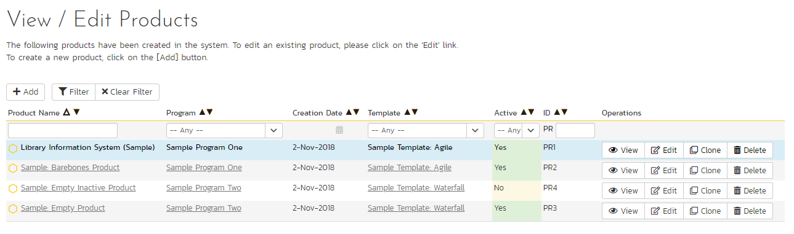
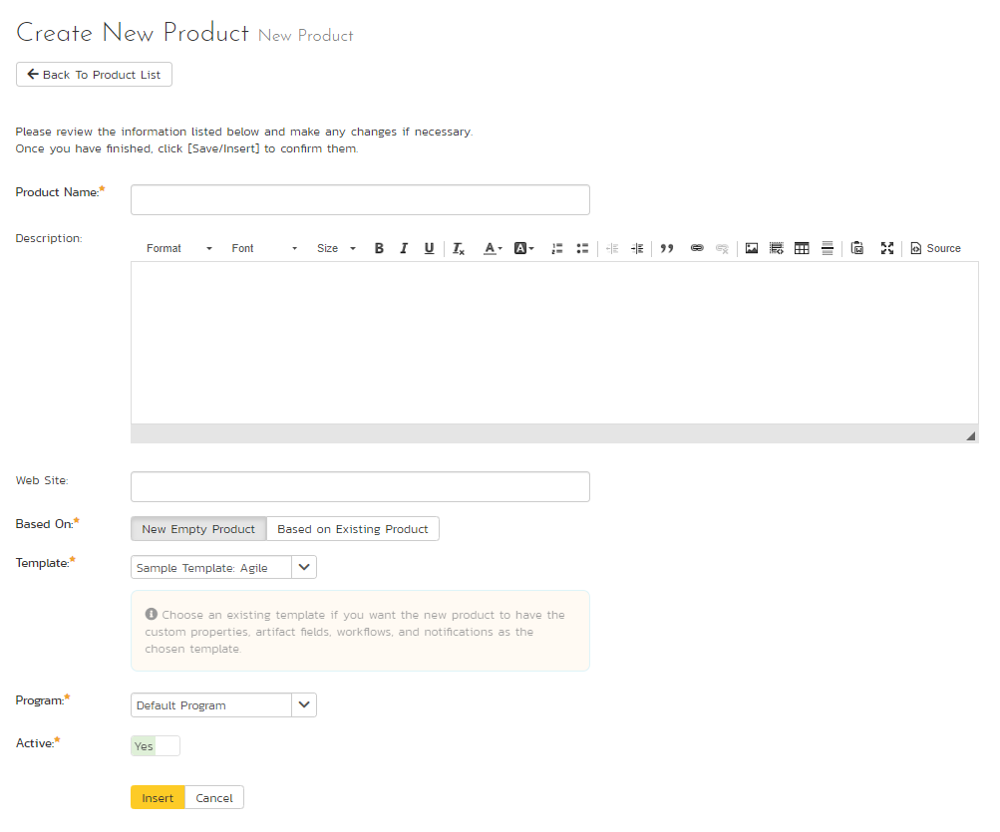
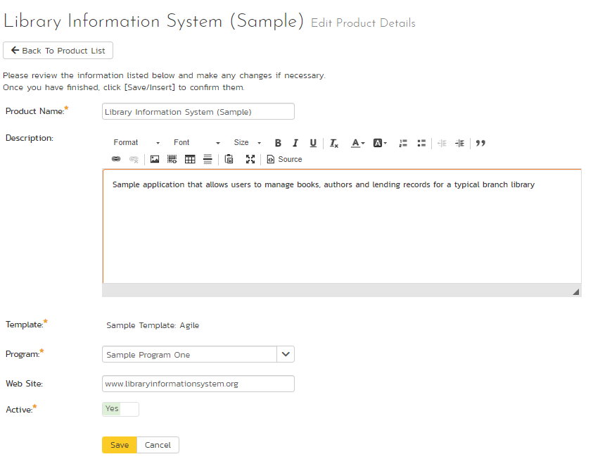
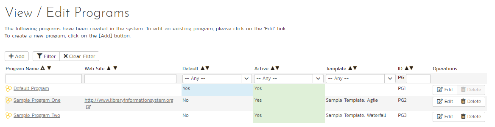
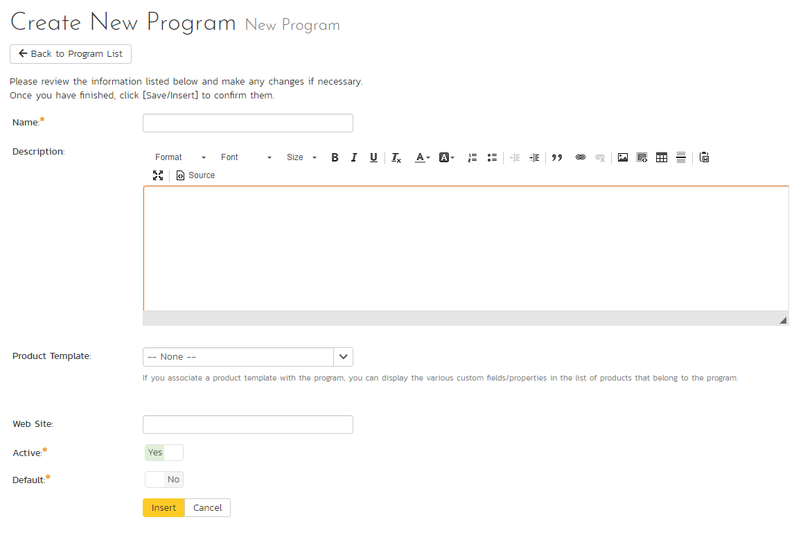
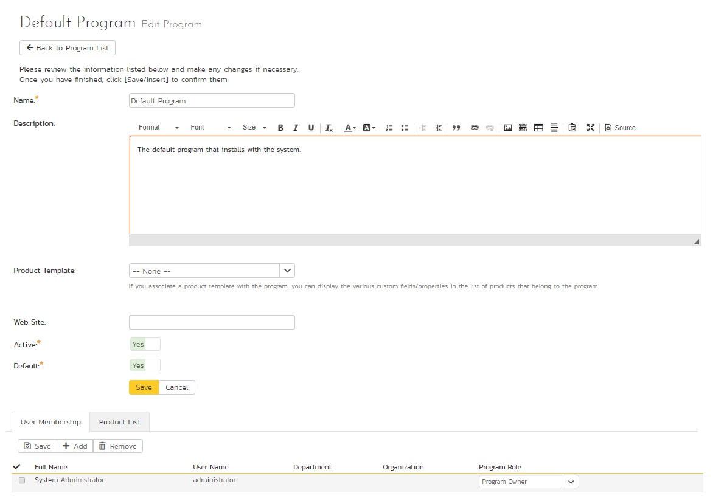
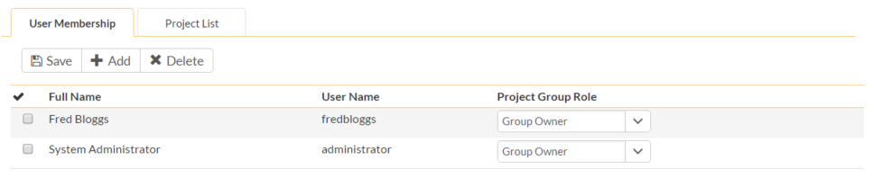
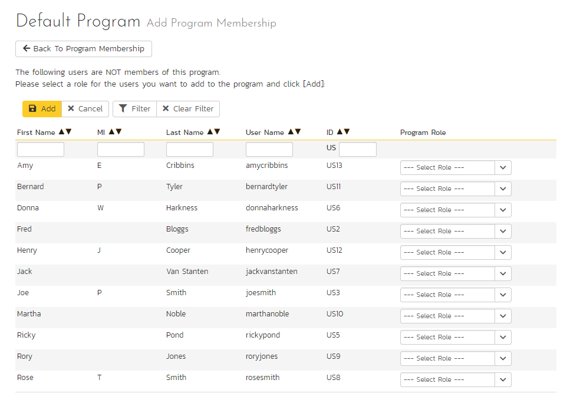
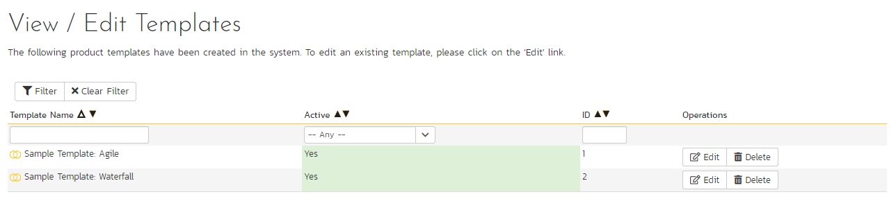

## System: Workspaces

### View/Edit Products

The following screen is displayed when you choose the "View/Edit
Products" link from the administration menu:

This screen displays the list of products in the system (both inactive
and active) together with their program, template, date of creation, and
active status. Clicking on either the "View" link in the right-hand
column or the name of the product will change the currently selected
product to one clicked.

You can filter the list of products by either choosing an active status,
program, or entering a portion of the name or date into the appropriate
text box. When you click the "Filter" button, the list of products will
be filtered by the criteria you entered. You can clear the filter
selection by clicking the "Clear Filters" button. To sort the list of
products, just click on the appropriate arrow icon located in the header
row of each field (one each for ascending / descending) In addition, the
list of products is paginated into groups of fifteen (15). You can step
through the different pages by clicking the page numbers at the bottom
of the product list.

To permanently delete a product, you should click the "Delete" button to
the right of the product details. This is irreversible and will delete
all the artifacts associated with the product. If you want to
temporarily delete a product, set its Active flag to 'No' instead. To
make a copy of a product to reuse its test cases, releases, test sets
and requirements, click the "Copy" link to the right of the product.
*Note that this will not make a copy of any historical
information, test runs or incidents.*

To add a new product to the system, click the "Add" button at the bottom
of the product list, and a new screen will be displayed that allows you
to enter the new product information:

You need to:

-   enter a name for the product (which cannot be the same as any
already in use);

-   select which program it belongs to and optionally enter a detailed
description and/or web-site URL;

-   you should initially make sure that the product is marked as
"Active";

-   decide what to base the product on. It can either be a new empty
product, or be based on another product already in the system. Doing
the latter will copy across its membership, settings and
customizations;

-   select a template that will control the product. If you are creating
an empty product (not based on an existing one) you can select any
template in the system to use for this product, or you can start
with a brand new template. If you are creating a product based on an
existing one, then by default the template will be the same as the
one the existing product uses. You can still create a new template
in this case, which will effectively be a clone of the template the
existing product uses.

Once you are satisfied with the information, click the "Insert" button
to actually create the new product.

In a similar way, to edit the details of an existing product, click the
"Edit" button in the right hand column of the product list box, and you
will be taken to the following screen that allows you modify the product
details:

On this screen you can edit the name, description, program, website URL
and active status. Once you have made the necessary changes, click the
"Save" button to commit them. If you decide that you want to ignore the
changes, click the "Cancel" button and the changes will be discarded.

### View/Edit Programs

The following screen is displayed when you choose the "View/Edit
Programs" link from the Administration menu:

This screen displays the list of programs in the system (both inactive
and active) together with their template, web site URL, date of creation
and active status. Programs are used to relate products that are in the
same department/division/organization or are for a common customer,
client, etc. When products are in the same program, a user that is a
member of the program can see the special Program Dashboard that
displays key metrics from all the products in the program combined.
Also, such users will have observer-level access to the contained
products without needing to be explicitly added to each product.

You can filter the list of programs by either choosing an active status,
or entering a portion of the name, web-site or date into the appropriate
text box. When you click the "Filter" button, the list of programs will
be filtered by the criteria you entered. You can clear the filter
selection by clicking the "Clear Filters" button. To sort the list of
programs, just click on the appropriate arrow icon located in the header
row of each field (one each for ascending / descending) In addition, the
list of programs is paginated into groups of fifteen (15). You can step
through the different pages by clicking the page numbers at the bottom
of the product list.

To permanently delete a program, you should click the "Delete" button to
the right of the program details. Any products contained in the program
will not be deleted, but instead just moved to the default
program. There has to be at least one program in the system at all
times, so the program designated as the 'default' one will not be
available for deletion.

To add a new program to the system, click the "Add" button at the bottom
of the program list, and a new screen will be displayed that allows you
to enter the new program information:

You need to enter:

-   a name for the program;

-   optionally enter a detailed description and/or web-site URL;

-   you should initially make sure that the program is marked as
"Active";

-   you can choose to make this program the default one (meaning that it
cannot be deleted and products get added to it when their programs
are deleted);

-   in addition you can optionally choose to associate the program with
a product template. The template only controls the products that use
it. It does not control the program, but it can affect what data is
visible from some of the program pages.

Once you are satisfied with the information, click the "Insert" button
to actually create the new program.

In a similar way, to edit the details of an existing program, click the
"Edit" button in the right-hand column of the program list box, and you
will be taken to the following screen that allows you modify the program
details. **Please note that this is the only administrative page in the
program administration section.**

On the top part of this screen you can edit the name, description,
website URL, active status and default status. Once you have made the
necessary changes, click the "Save" button to commit them. If you decide
that you want to ignore the changes, click the "Cancel" button and the
changes will be discarded.

In addition, the lower part of the screen allows you to view/edit the
users that are members of the program and also see which products are in
the program:

a) Program User Membership

This tab allows you to see which users are members of the program and
which program role they have:

The two program roles are "Executive" and "Program Owner":

**Executive** -- This role allows the user to see the dashboard for this
program, which contains all the key metrics for the contained products
displayed in an aggregated manner. Please see the *SpiraPlan User
Manual* for more details on this dashboard. In addition, the user is
automatically granted 'observer' permissions for all the products in the
program.

**Program Owner** -- This role consists of all the permissions granted
to the "Executive" role above, but in additional allows the user to make
changes to the Program itself in the Administration section.

To change the role of an existing program member, just change the role
in the drop-down list and click \[Save\]. To remove a member from the
program, just select the appropriate checkboxes and click \[Delete\].
Finally, to add a new user to the program, click on the \[Add\] button:

You now should narrow down the list of users by entering filter criteria
and clicking \[Filter\]. Once you have located the appropriate user(s),
just select a program role for them from the drop-down list and click
\[Add\] to add them to the program in the specified role.

b) Program Product List

This tab allows you to see the list of products that are contained
within the current program. Clicking on the name of the product will
take you to the details page for that product:

### View/Edit Templates

The following screen is displayed when you choose the "View/Edit
Templates" link from the administration menu:

This screen displays the list of templates in the system (both inactive
and active) with their active status.

You can filter the list of products by either choosing an active status,
ID, or entering a portion of the name into the appropriate text box.
When you click the "Filter" button, the list of templates will be
filtered by the criteria you entered. You can clear the filter selection
by clicking the "Clear Filter" button. To sort the list of templates,
click on the appropriate arrow icon located in the header row of each
field (one each for ascending / descending).

To permanently delete a template, click the "Delete" button to the right
of the template details. This is irreversible. If you want to
temporarily delete a product, set its Active flag to 'No' instead.
Neither of these actions will be possible if any product (active or
inactive) is controlled by the template*.*

To add a new template to the system, you need to create a new template
when creating a new product (as described in section 3.1.1 above). To
edit the details of an existing template, click the "Edit" button in the
right hand column of the template list box, and you will be taken to the
following screen that allows you modify the template details:

On this screen you can edit the name, description, program, and active
status. Once you have made the necessary changes, click the "Save"
button to commit them. If you decide that you want to ignore the
changes, click the "Cancel" button and the changes will be discarded.

