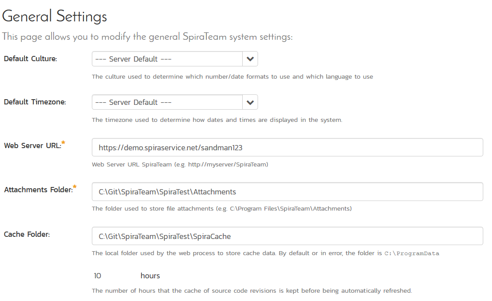
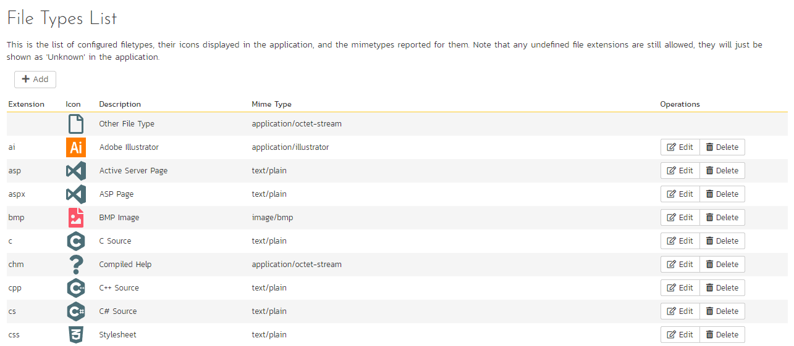
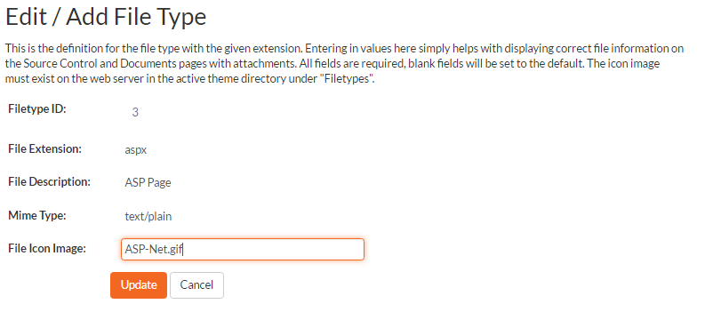
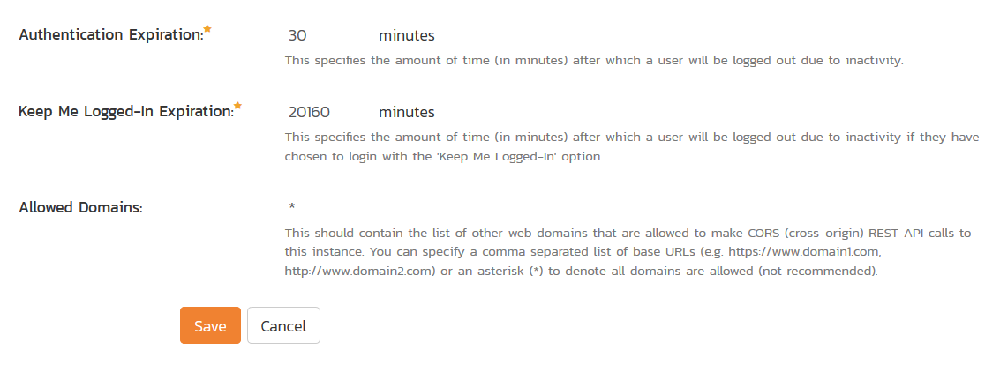
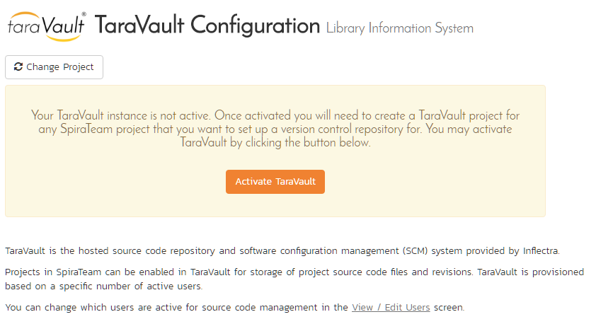
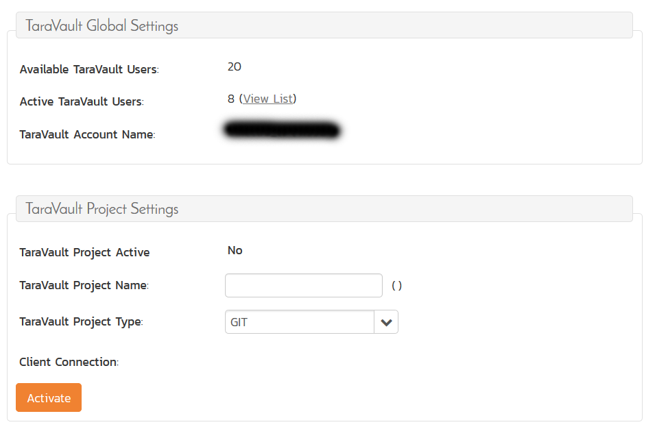
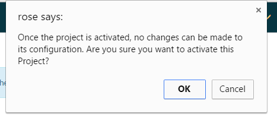
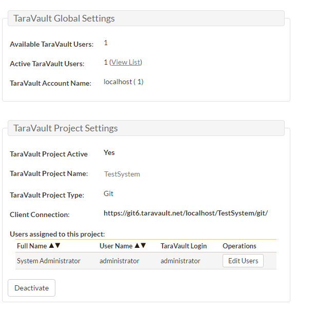
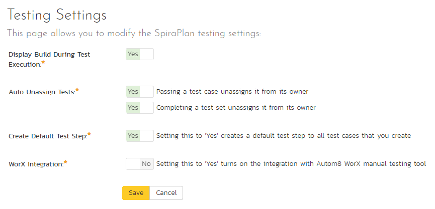

## System

### General Settings

The general settings page allows you to configure SpiraPlan® to better
match your environment and setup. In the current version, you can
specify the default language, or configure the folder used to store
document attachments:

The available settings include:

-   **Default Culture** -- SpiraPlan can display information in a
variety of different languages (assuming that the appropriate
language packs have been installed) and number formats. By default,
SpiraPlan will use the regional settings (language and number
formats) of the operating system it has been installed on. However,
you can override this default by choosing the appropriate culture
from the list of options displayed in the drop-down list. *Note: The
list of culture options does not reflect the available language
packs, so in some cases, the setting will only change the number
formats.*

-   **Default Timezone --** SpiraPlan stores all dates and times
internally in Universal Coordinated Time (UTC) and can therefore
display dates/times adjusted for different timezones. By default,
SpiraPlan will display dates in the timezone specified in the
operating system it has been installed on. However, you can override
this default by choosing the appropriate display timezone from the
list of options displayed in the drop-down list.

-   **Web Server URL --** This is the URL that your users use to access
the system. Do not put the /Login.aspx or any other page here, as
this URL is used to generate links to pages in the application.

-   **Attachments Folder** - By default when SpiraPlan® is installed,
the document attachments uploaded in the system get stored inside
    the C:\Program Files\SpiraPlan\Attachments folder
located inside the main SpiraPlan® installation root. However you
may want to have the documents stored on a remotely mounted drive or
on a different hard disk partition. In which case you can simply
change the folder pointed to in the text-box illustrated above and
then click \[Update\] to commit the change.

-   **Cache Folder** -- By default when SpiraPlan needs to store
temporary data (generated reports, the version control cache, etc.)
it will store them in the C:\\ProgramData\\Inflectra\\Spira folder.
Sometimes this folder is not appropriate (e.g. you want them on a
different drive that has more space). You can enter in a different
folder for temporary storage and SpiraPlan will use that instead.

-   **Login Notice** -- this can be used system wide to set a message to
permanently display at the bottom of the login screen for all users
(for example, a company disclaimer).

-   **Administration Message** -- this can be used by the administrator
to display a temporary notice displayed on the login screen for all
users. For example it could be used to remind all users that the
server will be down for upgrading over the weekend. The
administrator should delete the message once it is no longer needed.

-   **Instant Messenger** -- SpiraPlan and SpiraTeam come with a
built-in instant messenger that allows users to communicate with
each other in real-time. This can result in higher levels of network
traffic and some system administrators may wish to disable this
feature. This option lets you disable the integrated instant
messenger. In addition, you can specify how long (in days) instant
messages are retained in the system.

-   **Event Log Retention** -- As described in section 3.3.7, SpiraPlan
comes with a built-in diagnostic event log. By default the system
will only retain the last 30-days of events to avoid wasting storage
space. You can adjust the retention period in this section to match
your organization's policies.

-   **Enable Free Text Indexes** -- This tells SpiraPlan to use SQL
Server Free Text Indexing to speed up keyword searches in the Global
Search box. You should only have this set to "Yes" if you have the
Free Text Indexing featured enabled in SQL Server, otherwise you
will cause SpiraPlan to display error messages when users try and
use the global search.

### File Type Icons

The "File Types List" administration page allows you to view all the
different filetypes that are recognized by SpiraPlan and add or edit the
associated icon, name, description and MIME type:

If you click on the "Edit" button next to a filetype, or click on the
"Add" button at the bottom of the screen, the system will display the
page that lets you add or edit a filetype entry:

On this page you can enter/edit the file extension that's used to
recognize the type of file uploaded, the description of the file type
(displayed in popup tooltips), the MIME type (used to determine how the
browser handles the file type) and the path to the icon image. Once you
are satisfied with the values, you can click on the "Save" button to
confirm the changes.

### License Details

The license details page displays the information about the installed
license for the particular instance of SpiraPlan® being used. This will
display less information for hosted customers. The information displayed
for self-hosted customers includes: the product name (e.g. SpiraPlan),
the license version (e.g. v6.0.0.0), type of license in effect (x-user
fixed, x-user concurrent, demonstration, enterprise, etc.), the
expiration date (if any) of the license, the organization that the
license belongs to, and the number of users concurrently logged-in right
now. This last piece of information is useful as it helps administrators
track down how many licenses are currently in use.

A sample page is illustrated below:

To change the license key used by the system (for example, if to upgrade
from Trial edition to Standard edition), you do **not**
need to reinstall SpiraPlan®. All you need to do is change the
**organization** and **license key** text-boxes to match the license key
and organization name found in the customer area of our website
(<http://www.inflectra.com/CustomerArea>) and click the "Save" button.

If there is an issue with the license key (e.g. a trial version that is
passed its expiration date, or where the license key doesn't match the
organization name) an error will be displayed describing the specific
issue with the information you entered. If you are unable to get the
system to work with the license key information, please contact
Inflectra^®^ customer support at: <support@inflectra.com>.

### LDAP Configuration

As described previously, you can configure SpiraPlan® to use an external
LDAP server for importing new user profiles into the system, and for
authenticating users -- instead of having to store separate passwords
inside SpiraPlan®. However, you need to first configure the LDAP server
settings. To do this, click on the "LDAP Configuration" link the
Administration navigation:

You need to fill out the various configuration settings for your LDAP
server, each of which is explained in more detail below:

**LDAP Host\
**This should contain the name of the LDAP server that you want
SpiraPlan to connect to together with the port number if it's not the
default of 389.

**Use Secure Sockets Layer (SSL)\
**You should select this check-box if your LDAP server requires use of
the LDAPS secure protocol. Leave unchecked for unencrypted LDAP
communication.

**Base DN\
**This should be the distinguished name of the object inside your LDAP
server that contains the list of user accounts. This varies by the type
of LDAP server, please consult your LDAP server documentation for more
details.

**Bind DN\
**This should be the distinguished name of the user inside your LDAP
server that will be used to authenticate against when importing users.
If not provided, SpiraPlan® will try and authenticate with the LDAP
server anonymously.

**Bind Password\
**The is the password of the user specified in the Bind DN field above.

**Login Attribute\
**When SpiraPlan® imports users from the LDAP server it needs to know
the user attribute inside the LDAP server that it should use to generate
the SpiraPlan® user-name. For most LDAP servers the appropriate
attribute would be "uid". However for Windows ActiveDirectory, the
attribute "sAMAccountName" should be used instead.

**First Name Attribute\
**Providing this optional attribute will allow SpiraPlan® to
automatically populate the first name field of the imported user instead
of simply using the username as a placeholder.

**Last Name Attribute\
**Providing this optional attribute will allow SpiraPlan® to
automatically populate the last name field of the imported user instead
of simply using the username as a placeholder.

**Middle Initial Attribute\
**Providing this optional attribute will allow SpiraPlan® to
automatically populate the middle initial field of the imported user
instead of simply leaving it blank.

**Email Address Attribute\
**Providing this optional attribute will allow SpiraPlan® to
automatically populate the email address field of the imported user
instead of simply using the username\@spiratest.com as a placeholder.

**Sample User\
**You can optionally enter a sample user and password to test that the
user is correctly authenticated against the server. You can update the
LDAP configuration without setting this, but if you do provide a sample
user/password, it will not save the configuration unless the
authentication succeeds. If you choose to enter it, the user's name
should be the fully-distinguished name of the user (e.g. CN=Sample User,
CN=Users, OU=Headquarters, DC=MyCompany, DC=Com).

### Security Settings

The "Security Settings" administration page lets you specify the various
security settings within SpiraPlan to match your organization's policies
and processes:

The following settings can be changed within the system, once you are
satisfied, click the "Save" button to commit the changes:

**Allow User Registration** -- Set this to "Yes" if you want to allow
users to self-register for SpiraPlan accounts (that you can subsequently
approve). If you set this to "No", a system administrator will need to
create all user accounts. Also set this to "No" if you plan on using
LDAP-based authentication.

**Maximum \# Invalid Password Attempts** -- Set this to the number of
times a user can enter an incorrect password before their account is
temporarily locked out. This is important in preventing 'brute force'
password hacking attempts.

**Minimum Required Password Length** -- Set this to the minimum length
of passwords in the system. Choosing a longer password will make it
harder for an unauthorized user to crack a password and gain entry into
the system.

**Minimum Required Special Characters** - Set this to the minimum number
of non-alphanumeric characters that will be required for passwords in
the system. Choosing more required special characters will make it
harder for an unauthorized user to crack a password and gain entry into
the system.

**Password Attempt Time Window** -- Set this to the duration (in
minutes) after which a user's account will be automatically unlocked
(due to repeated incorrect password attempts).

**Password Change Interval --** If set to a value, it will require all
password to be changed after the specified number of days.

**Require Password Change on First Login --** Enabling this requires all
new users to change their password on first login.

**Disallow Names in Passwords --** If enabled, passwords cannot contain
the user's real name and/or username.

**Authentication Expiration** -- This specifies the amount of time (in
minutes) after which a user will be logged out due to inactivity when
they login without choosing the 'Keep Me Logged-In' option.

**Keep Me Logged-In Expiration** - This specifies the amount of time (in
minutes) after which a user will be logged out due to inactivity if they
have chosen to login with the \'Keep Me Logged-In\' option. This should
normally be longer than the previous setting.

**Allowed Domains -** This should contain the list of other web domains
that are allowed to make CORS (cross-origin) REST API calls to this
instance. You can specify a comma separated list of base URLs (e.g.
https://www.domain1.com, http://www.domain2.com) or an asterisk (\*) to
denote all domains are allowed (not recommended).

### TaraVault®

*This section refers to the functionality available to hosted/cloud
customers of SpiraPlan. If you are using the on-premise version of
SpiraPlan, please refer to section **3.4.2** (Version Control
Integration) instead.*

TaraVault® is the hosted source code repository and software
configuration management (SCM) system provided by Inflectra. When you
signed-up or purchased a subscription to either SpiraPlan or SpiraTeam,
it will have come with an entry-level subscription to TaraVault.

When you first click on the Administration \> TaraVault administration
page, you will see the following screen:

This lets you know that you have not yet activated your TaraVault
account with Inflectra. When you click on the \[Activate TaraVault\]
button you will see the following:

This will let you see how many TaraVault SCM users your subscription
allows and also the name of the TaraVault instance that your SpiraPlan
instance is associated with.

Each product in SpiraPlan has its own corresponding TaraVault product,
and each TaraVault product can be configured to use one of the two
different SCM providers:

-   **Subversion (SVN)** -- This is a simple, centralized version
control system (VCS) that works best for teams that want to have a
centralized SCM environment with only one central instance of the
SCM repository. Subversion only allows a single branch to be managed
and is generally easier to understand conceptually.

-   **Git** -- This is a more powerful, distributed version control
system (DVCS) that works best for teams that want to have multiple
distributed instances of their source code repository. Git offers
superior merging and branching functionality to Subversion but is
generally more complicated to understand conceptually.

For the current SpiraPlan product you can choose the type of provider
you wish to use, enter the name of the TaraVault product and click
Activate:

Since you cannot change the type or name of the TaraVault product once
activated, please review your entries and click \[OK\] to confirm the
new product activation.

Once the product activation has been completed, the screen will display
the following:

The screen will display the name of the linked TaraVault product as well
as the list of TaraVault SCM users that are configured to use this
TaraVault product -- this list will not necessarily be all of the users
in the SpiraPlan product, just those that need to connect to TaraVault
to commit source code into the repository.

If you want to deactivate this TaraVault product, click the
\[Deactivate\] button and the product will be removed from TaraVault.

To improve performance, SpiraPlan will cache some of the data it
receives from TaraVault. Normally SpiraPlan will know when to update the
cached data based on changes made in TaraVault automatically. However
sometimes you may wish to flush the cached data completed, to do this,
click on the \[Clear Cache\] button.

To add new SCM users to the TaraVault product, click on the 'Add Users'
link to add new SCM users to the product.

### Event Log

The "System Event Log" administration page lets you view all of the
errors, warning and other diagnostic messages that have been logged in
the system:

Each event entry is displayed along with the date-time it occurred, the
type of event (error, warning, information, success audit, failure
audit), category (application, source code provider,
data-synchronization) and the short name. To view the full message,
click on the "View Item" hyperlink:

The popup dialog box will display the full error message log and stack
trace in a moveable dialog box. This information should be provided to
Inflectra customer support if you log a help desk ticket.

### Testing Settings

Clicking on the "Testing Settings" link brings up a list of options that
the administrator can configure regarding testing. Select from the
options displayed (as illustrated below) and click "Save" to commit the
changes.

You can enable or disable the following settings:

-   **Display Build During Test Execution** -- During test execution the
system can display a drop-down list of builds associated with the
selected release. If you are using SpiraPlan in conjunction with a
build server such as Jenkins/Hudson, you should choose "Yes",
otherwise we recommend hiding the list of builds (to avoid confusing
your testers) by choosing "No".

-   **Auto Unassign Tests** -- When a tester passes an assigned test
case or all the test cases in an assigned test set the system by
default will automatically un-assign the test case / test set from
the user. To prevent this from happening, change either setting to
"No".

-   **Auto create a test step** - Automatically creating a default test
step on the creation of any test case

-   **Worx Integration** -- Integrating with the Worx desktop
application

### Email Configuration

The Email Configuration page is split into two sections. The first
section covers email notification details, and the second section
configures how email from the application is sent.

-   **Email Notifications Active?** -- Defaults to Yes. If changed to
No, the system will not send out any emails, regardless of other
settings. Note that this means that new user requests will not get
sent either.

-   **From Email Address --** This is the email address specified in the
'From:' field of email notifications sent from the application.

-   **Reply-To Email Address --** This is the address specified in the
'ReplyTo:' field for notification emails sent from the application.

-   **Send HTML Emails?** -- Defaults to Yes. This option specifies
whether HTML or Plain-Text emails are sent from the system.

-   **Allow Users Control of Receiving Emails?** -- Defaults to Yes.
This specifies whether or not a user can modify their profile to not
receive any emails from the system. If set to no, users' preference
will be enabled and locked out.

To use the internal IIS's default virtual SMTP server, leave all fields
blank. The virtual server must then be configured to use proper SMTP
server and network configuration. If you want the application to contact
an SMTP server directly, use the following fields:

-   **Host Name --** This is the SMTP server to connect to.

-   **Port Number --** This is the port number to use, blank uses the
default port 25.

-   **SSL Connection --** Whether or not to use an SSL connection with
the server. Be sure that the SMTP server's SSL certificate is
trusted on the application server.

-   **User Name --** When using an authentication method, this is the
username to log in as.

-   **Password --** When using an authentication method, this is the
password to use.

Example settings for connecting to Gmail/Google Mail for sending
notifications:

-   **Host Name:** smtp.gmail.com

-   **Port Number:** 587

-   **SSL Connection:** Yes

-   **User Name:** "account"\@gmail.com

-   **Password:** "account password"

