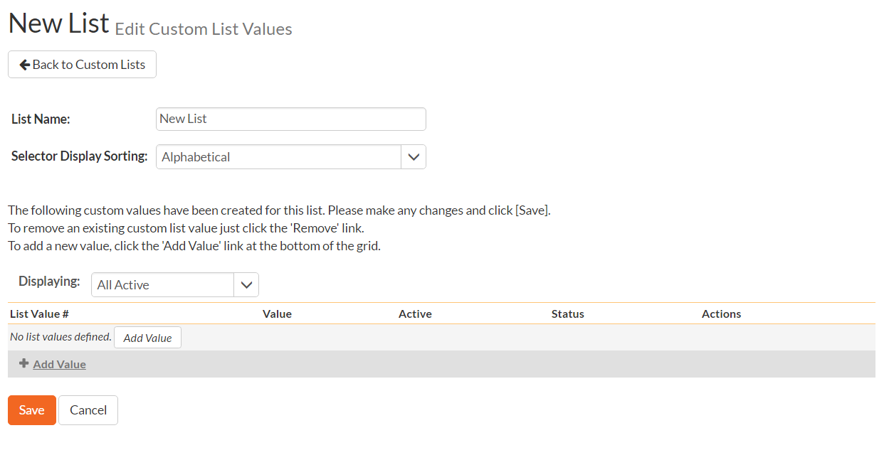
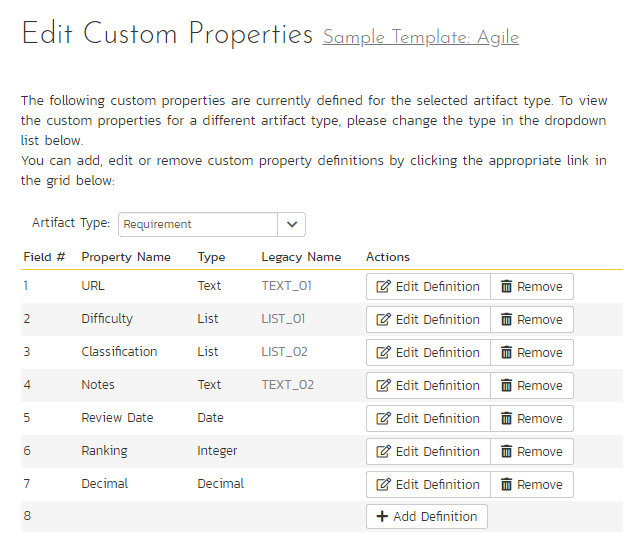

## Template: Custom Properties

SpiraPlan allows you to customize all of the artifacts in the system
(requirements, test cases, incidents, etc.) by adding user-defined
custom properties in addition to the built-in fields. You can create a
variety of different types of custom properties. This section describes
how to setup different custom lists and custom properties in your
templates.

Artifacts in SpiraPlan can have up to 30 different custom properties per
artifact-type, per template. There are different types of custom
properties allowed:

-   **Text**: Normal or Rich-Text field.

-   **Integer**: Whole-Number entry.

-   **Decimal**: Fractional number entry (currency, etc.)

-   **Boolean**: Simple yes/no (on/off) checkbox.

-   **Date**: Date selector.

-   **List**: Custom List selector.

-   **Multi-List**: Custom List selector that allows multiple values.

-   **User**: List of assignable users.

Each custom property can have optional settings applied to it. Optional
settings are as follows. (Note that not all settings are allowed for all
property types.)

-   **Default**: The default value when a new artifact is created.

-   **Allow Empty**: Whether or not an empty value is allowed.

-   **Precision**: (Decimal Only) How many decimal places is allowed (or
the value is rounded to).

-   **Minimum Value**: The minimum value allowed.

-   **Maximum Value**: The maximum value allowed.

-   **Minimum Length**: The minimum length of the data required in the
field.

-   **Maximum Length**: The maximum length of the data allowed in the
field.

-   **Rich Text**: Whether or not the text field allows HTML or not.

-   **Custom List**: The defined Custom List for the field that users
can select from.

***Important***: Note that setting 'Allow Empty' to No will override any
*workflow step* definitions, and will always require a value to be
entered in, even if the workflow is configured to have the field
disabled!

### Edit Custom Lists

If you are planning on having any list based custom properties in your
template, then you first need to create and populate the custom template
lists that the user will be able to select from. These lists are stored
separately from the individual artifact types so that you can have one
set of values (e.g. list of operating systems under test) be reused by
multiple artifact types.

The following screen is displayed when you choose the "Custom Lists"
link from the Administration menu:

The screen displays all the custom lists currently defined within the
template, together the number of values associated with each list. By
default the screen will initially be empty so the first thing you need
to do is click "Add List" to create a new custom list:

After changing the name of the list, and specifying whether the values
will be ordered by their name or the order in which they were entered
(called by ID), you can either click "Save" to commit the change, or
click the "Add Value" option to add some list values:

This is the set of values that the user will select from the drop-down
list when the custom property is displayed. You can change the display
to include:

-   **All Active** -- displays only custom list values that are active

-   **All But Deleted** -- displays all custom list values that are
active or inactive but have not been deleted

-   **All** -- displays all custom list values, including those that
have been deleted

To add a new custom list value, click the "Add Value" button and a new
row will be added to the list which you can now edit. To edit an
existing custom list value, change the name in the textbox and click
"Save". To delete a custom list value, click on the "Delete" hyperlink.
If you want to remove an item from the list temporarily, you can set its
Active dropdown list to 'No', if you want to remove an item permanently,
just click the 'Delete' button.

*Note: Even if you delete a custom list value, there is an option to
undelete by simply changing the display selection to "All" and clicking
the 'Undelete' hyperlink next to a deleted value.*

To edit an existing custom list, you just need to click on the "Edit
Values" button to display the custom list name and list of associated
values (which is the same screen as the one displayed for a new list).
To remove a custom list from the template, just click on the "Remove"
button next to the custom list and the list and all its associated
values will be deleted from the template.

### Edit Custom Properties

This option is used to actually define the custom properties associated
with each artifact type in the template. The following screen is
displayed when you choose the "Custom Properties" link from the
Administration menu:

The screen displays a list of all the possible custom properties for a
particular artifact type for the current template. Each artifact type
(requirement, test case, etc.) can have up to thirty (30) custom
properties of various types.

Initially the screen will default to showing the existing custom
properties for a template's Requirements; to change the list to a
different artifact type (e.g. Incidents), all you need to do is change
the artifact type in the drop-down-list. This will refresh the list to
show the custom properties for that artifact type.

To edit an existing custom property definition or add a new definition,
click the "Edit Definition" button for a specific property, and the
following dialog will be displayed:

The fields visible will vary depending on the type of custom property
you have selected, but every custom property will need to have a Name
and a Type. The Name is the caption that will be shown to the user when
viewing or editing the artifact. The type is the type of data the field
allows. If the custom property is either a List or Multi-List type, you
will need to choose the associated Custom List that you previously
defined.

Under the Options tab will be available options that can be set for the
custom property:

When finished, click the 'Save' button and you will be returned to the
Custom Property list.

***Important***: When changing a custom property's type or removing a
custom property, the data is not actually removed from the artifact.
Therefore, if you change a custom property from a date type to a text
custom property, the field will display the old date value until it is
changed by the user.

