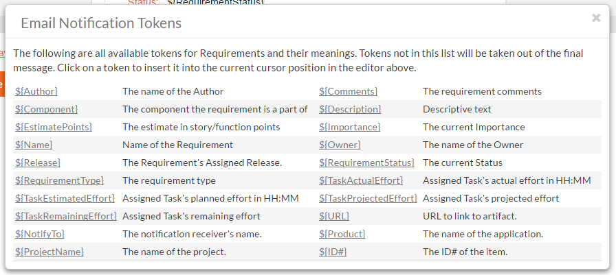
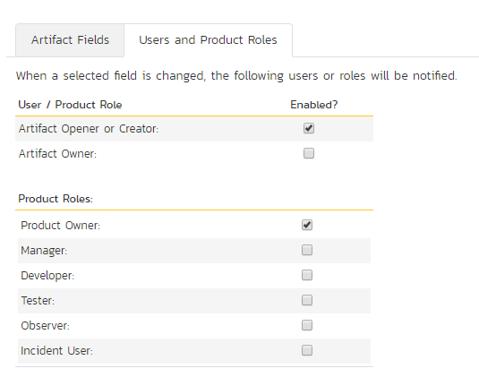

## Template: Notifications

Section 3.3.9. above discussion how to configure emails across the
entire system. However, notification events can be configured in the
Notifications section of the template administration.

### Notification Templates

Notification templates are used by notification events, and are defined
for each artifact type in the template.

To edit a template, click the Edit button. To send a test email
notification to yourself using the current template, click the Test
button.

Clicking the Edit button will take you to a page similar to the
following. Depending on the artifact type you selected, the list of
available fields will vary.

On this screen you are presented with the same rich text editor
available elsewhere in the application. Displayed in it is the current
template (with template tags showing) for the artifact. Template tags
start with a \$ (dollar sign) and then a string name enclosed in {}
parentheses. When email notifications are sent, tokens will be replaced
with specific information from the artifact that the notification is
being sent for. Invalid tokens will be stripped from the template text.
Clicking the link "(Display Email Template Field Tokens" to see a list
of available tokens to insert into the textbox for easy selecting and
editing.

If HTML notifications are disabled, the template will be converted to
plain text before sending.

When finished, click the update button to save your new template. The
new template will take effect immediately.

### Notification Events

The Notification Events section is where template administrators can set
up when and to whom notifications are sent out to users of the system.
Clicking on the Notification Events link will present you with a list of
all events defined for the current template:

**Note:** These events can handle all changes to any of the artifacts
except changes handled by Status changes to Incidents. Incident status
changes are handled through the Workflow configuration.

When clicking on the Edit or Add buttons, you will be presented with the
event details screen:

The top section defines general configuration items for the event:

-   **Event Name:** used to name the event, only used for administrative
purposes.

-   **Artifact Type:** The artifact type this event is attached to. Once
an event is created, the artifact type cannot be changed.

-   **On Creation?** If set to yes, this event will fire when an
artifact is created, as well as when any configured fields are
changed.

-   **Active?** If set to yes, this event is active and will send
notifications when configured fields are modified.

-   **Subject Line:** The subject line of the notification email.

The Artifact Fields will let you configure which fields will cause this
notification to send an email notification:

Selected fields are treated in an OR-based query, so that if you have
two or more fields checked for an event, the event will send a
notification if **either** of the two fields are changed. Depending on
the artifact type configured above, the available fields will vary.

The last section is the configuration of whom to send the notifications
to:

If a user belongs to more than one group or they have manually signed up
to receive notifications to any changes in the artifact, they will only
receive one notification for the artifact change.

# Appendices

There are no appendices at this time.

####  Legal Notices

This publication is provided as is without warranty of any kind, either
express or implied, including, but not limited to, the implied
warranties of merchantability, fitness for a particular purpose, or
non-infringement.

This publication could include technical inaccuracies or typographical
errors. Changes are periodically added to the information contained
herein; these changes will be incorporated in new editions of the
publication. Inflectra^®^ Corporation may make improvements and/or
changes in the product(s) and/or program(s) and/or service(s) described
in this publication at any time.

The sections in this guide that discuss internet web security are
provided as suggestions and guidelines. Internet security is constantly
evolving field, and our suggestions are no substitute for an up-to-date
understanding of the vulnerabilities inherent in deploying internet or
web applications, and Inflectra^®^ cannot be held liable for any losses
due to breaches of security, compromise of data or other cyber-attacks
that may result from following our recommendations.

The section of the manual that describes modifying the Windows System
Registry ("Registry") should only be attempted by experienced Windows
administrators who are familiar with its organization and contents.
Inflectra^®^ cannot be held liable for any losses due to damage to the
system registry made by inexperienced personnel.

SpiraTest®, SpiraPlan®, SpiraTeam® and Inflectra^®^ are registered
trademarks of Inflectra Corporation in the United States of America and
other countries. Microsoft®, Windows®, Explorer® and Microsoft Project®
are registered trademarks of Microsoft Corporation. All other trademarks
and product names are property of their respective holders.

Please send comments and questions to:

> Technical Publications
>
> Inflectra Corporation
>
> 8121 Georgia Ave
>
> Suite 504
>
> Silver Spring, MD 20910
>
> U.S.A.
>
> [*support\@inflectra.com*](mailto:support@inflectra.com)
