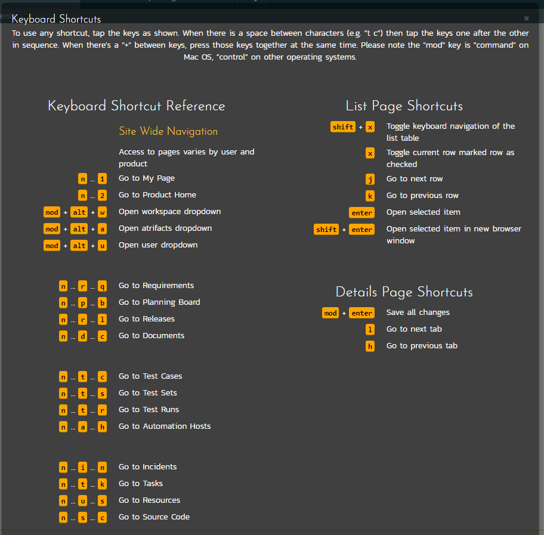

#  Appendix 1: Keyboard Shortcuts

SpiraPlan® includes an array of keyboard shortcuts to speed up
navigation and use of the application. All functionality can be
performed using a mouse and clicking and therefore using a keyboard
shortcut is never required. However, keyboard shortcuts can be an
efficient way of performing common tasks. A list of the keyboard
shortcuts and what they do is available throughout the application in
two ways:

-   Via the user profile action menu

-   By typing "?" anywhere in the application (not when the cursor is in
a text field). For example, on Windows machines typing shift and the
? key together.

There are two main ways of using the shortcuts: either pressing a key or
key(s) at the same time (indicated by a single key or "a + b"); or
pressing a number of keys in succession as with normal typing (indicated
by "a ... b"). The popup menu explaining the shortcuts is illustrated
below (please note that the keyboard shortcuts displayed will vary
depending on the current page:

