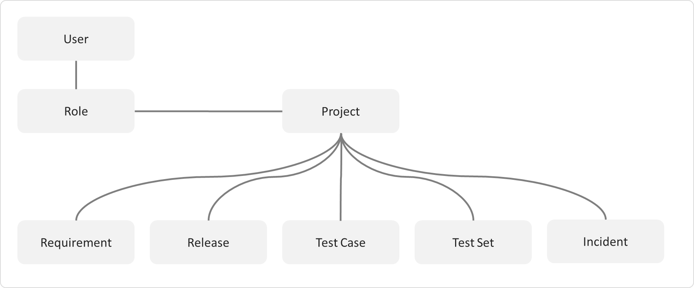
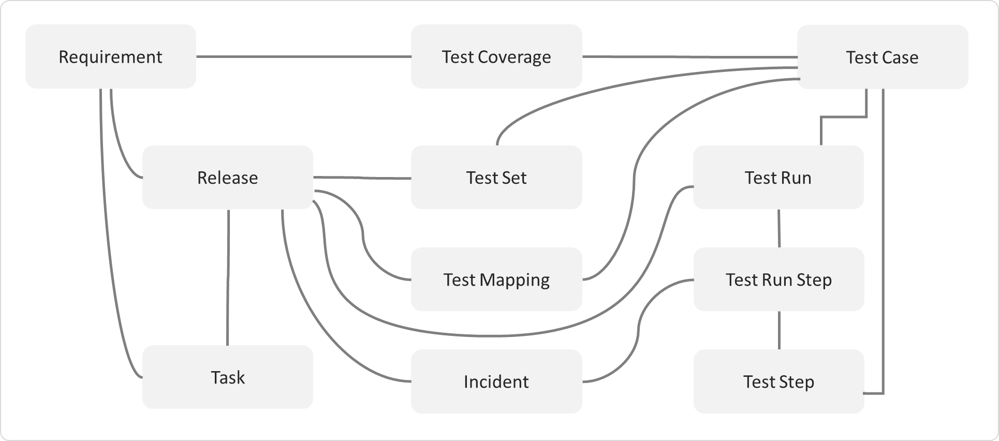

# Functionality Overview

This section outlines the functionality provided by SpiraPlan® in the
areas of requirements management, test case management, release
planning, sprint planning, incident tracking, task management and
product / user management.

Please note, that SpiraPlan® is designed for use on a very wide range of
devices from desktops, to tablets, to smartphones. This guide is written
using desktop conventions (e.g. using 'click' throughout where 'tap'
would apply on mobile devices) but the functionality remains very
similar throughout the application across all devices and platforms. See
[Mobile Access](../Mobile%20Access/) for more information.

## Requirements Management

SpiraPlan® provides the ability to create, edit and delete product scope
/ requirements in a hierarchical organization that resembles a typical
scope matrix. Each requirement is associated with a particular
importance level and a status identifier that designates where the
requirement is in the development lifecycle (requested, planned,
in-progress and completed). The requirements can be organized according
to which part of the system they relate to (called the Component) as
well as being organized into different types (features, qualities, use
cases, etc.). Certain types (such as use cases) allow you to define the
scenario steps that help describe that requirement.

In addition, each requirement can be mapped to one or more test cases
that can be used to validate that the functionality works as expected.
This mapping is called the "Requirement Test Coverage", since the test
cases "cover" the requirement so that if all the tests can be executed
successfully, then the requirement is validated.

At the same time, from a development perspective, the team begins
initial estimation of the lowest-level requirements in the requirements
matrix to determine the complexity and associated resourcing. Once the
high-level release schedule has been determined, the requirements can
then be prioritized and scheduled against the appropriate release
according to their business priority.

Once the release is underway, the requirements are further decomposed
into their constituent low-level product tasks that can be assigned to
the product team. The system will track the progress and revised
estimates for the tasks and display them against the requirements so
that risks to the schedule can be quickly determined.

## Test Case Management

SpiraPlan® provides the ability to create, edit and delete product test
cases that are stored in a hierarchical folder structure that resembles
Windows Explorer ®. Each test case consists of a set of test steps that
represent the individual actions a user must take to complete the test.
These test steps also contain a description of the expected result and
any sample data elements that the tester should use when performing the
action. When a user executes a test case, the results are stored in a
test run that contains the success/failure status of each test step as
well as the actual observed result that the tester experienced.

In addition each test case is mapped to one or more requirements that
the test is effectively validating, providing the test coverage for the
requirement. During the execution of the test case, each failure can be
optionally used to record a new incident, which can then be managed in
the incident tracking module (see below). This provides complete
traceability from a recorded incident to the underlying requirement that
was not satisfied.

To streamline the assignment and tracking of multiple test cases,
SpiraPlan® allows users to select groups of test cases and arrange them
into *test sets*. Each test set can contain test cases from a variety of
different folders and can be associated with a specific release of the
system being tested.

### Test Automation

As well as being able to store and manage manual test cases, SpiraPlan®
can be used to manage the scheduling and execution of automated test
scripts for a variety of third-party test automation engines. This
allows you to centrally plan your automated testing and monitor the
results of automated unit, functional and load testing remotely. For
example, you could schedule a set of automated functional tests to run
on five different machines (each with a different browser/OS
combination) at 2:00 AM and have the results be ready for the next
morning.

## Release Planning

SpiraPlan® provides the ability to track different versions / releases
of the application being tested. Each product in the system can be
decomposed into an unlimited number of specific product releases,
denoted by name and version number. Requirements and Test Cases
developed during the design phase can then be assigned to these
different releases. When a tester executes a series of test cases, they
are able to choose the version of the product being tested and the
resulting test run information is then associated with that release.

From a product planning perspective, the releases are the major
milestones in the product, which are further sub-divided into sprints
which are separate mini-products with associated product scope and
tasks. The product's requirements are scheduled at a high-level against
the releases and the detailed tasks are scheduled against specific
sprint within the release.

In addition, all incidents raised during the testing process are
associated with this release, allowing the development team to easily
determine which version of the product is affected. Finally as the
incidents are resolved and verified during the testing phase, the
appropriate release can be selected to indicate which release the
incident was resolved and/or verified in.

## Sprint Planning

As described in [Release Planning](#release-planning), in addition to high-level product releases,
SpiraPlan® can also track the individual sprints that comprise a
release, giving the product manager the option to manage agile
methodology products within the SpiraPlan® environment. Unlike the
release planning stage, where high-level requirements are estimated and
scheduled, the sprint planning phase involves assigning each of the
requirements, incidents and tasks in the product backlog against a
specific sprint until the available effort in the sprint has been
completely allocated.

When you first create sprints, you specify the start and end-dates
together with the notional number of product resources assigned to the
sprint and any non-working days. SpiraPlan® uses this information to
calculate the planned effort available to the sprint, from which it will
subtract the estimated task and incident effort values to determine how
much effort is available to schedule.

## Incident Tracking

SpiraPlan® provides the ability to create, edit, assign, track, manage
and close incidents that are raised during the testing of the software
system under development. These incidents can be categorized into bugs,
enhancements, issues, training items, limitations, change requests, and
risks, and each type has its own specific workflow and business rules.
Typically each incident is raised initially as a 'New' item of type
'Incident'. Following the review by the product manager and customer,
they are changed to one of the other specific types, given a priority
(critical, high, medium or low), and status changed to 'Open'. Once it
is assigned to a developer for fixing, it is changed to status
'Assigned'.

The developer now works to correct the incident, after which time its
status changes to 'Fixed' or 'Not Reproducible' depending on the actions
taken (or not taken). Finally the product manager and customer verify
that it has indeed been fixed, and the status is changed to 'Closed'.
SpiraPlan® provides robust sorting and filtering of all the incidents in
the system, as well as the ability to view the incidents associated with
particular test cases and test runs, enabling drill-down from the
requirements coverage display, right through to the open incidents that
are affecting the requirement in question.

## Task Management

As described above, in addition to storing the requirements for a
product, SpiraPlan® includes the capability of drilling each
lowest-level requirement down further into a series of work items called
'Tasks'. These tasks are the discrete activities that each member of the
development team would need to carry out for the requirement to be
fulfilled. Each task can be assigned to an individual user as well as
associated with a particular release or sprint. The system can then be
used by the product manager to track the completion of the different
tasks to determine if the product is on schedule.

The tasks can be organized into different folders as well as categorized
by different types (development, testing, infrastructure, etc.), each of
which can have its own *workflow* which defines the process by which the
task changes status during the product lifecycle.

## Products and Users

SpiraPlan® supports the management of an unlimited number of users and
products, which can be administered through the same web interface as
the rest of the application. All artifacts (requirements, tests and
incidents) are associated with a particular product, and each user of
the system can be given a specific role for the particular product. So,
a power user of one software product may be merely an observer of
another. That way, a central set of users can be managed across the
enterprise, whilst devolving product-level administration to the manager
of the product. In addition to these administration functions, each user
profile and product has its own personalized dashboard view of all the
pertinent and relevant information. This feature reduces the information
overload associated with managing such a rich source of product
information, and allows a single user or product snapshot to be viewable
at all times for rapid decision-making.

## Document Management

SpiraPlan® includes an integrated document management collaboration
system that can be used to upload, manage and share documents between
the different members of the product. This module includes support for
uploading files and URLs, versioning of documents, the ability to
organize into folders and categorize and search using meta-tags.

## Risk Management

SpiraPlan® (not available in SpiraTest or SpiraTeam) enables a complete
risk management workflow. This module aids in the analyzing and
categorizing of risks based on their Probability and their impact, which
produces a calculated risk exposure. The tool tracks both risks and
their mitigations, and provides dynamic risk reporting tools.

## Source Code Tracking

SpiraPlan® and SpiraPlan® provide the ability to browse your source code
repository from within the main web application. This is an excellent
way for managers and casual users of the product to browse the files and
revisions of the software code without needing to install the version
control software on their own workstations. In addition all users have
the ability to link source code revisions with SpiraPlan®
artifacts--providing traceability from requirements, incidents, and
tasks to the code changes that were made to implement the required
feature, or fix the identified defect. Should a defect resurface later,
you can view the associated source code revisions to determine which
changes were made and did they truly correct the defect.

## Build Management

SpiraPlan® includes the ability to integrate with a variety of
continuous integration / automated build servers so that the results of
automated builds can be displayed in SpiraPlan linked to the associated
release or sprint. In addition, the results of automated tests and
source code operations can be linked to the build events, providing
traceability from a specific build to the bugs that were fixed, tests
that were run and source code files that were modified.

## Instant Messenger

SpiraPlan® comes with a build-in integrated instant messaging
capability. This lets users see which users are currently logged-into
the system, maintain a list of contacts and where available, send short
instant messages to other users. Any messages exchanged can then be
posted to relevant artifacts in the system as permanent comments.

## Miscellaneous

### Artifact Relationships

The sections above have outlined the different features and functions
available in the system, and have described the various artifacts
managed in the system (e.g. products, users, requirements, tests, etc.).
To aid in understanding how the information is related, the following
diagrams illustrates the relationships between the different artifacts
and entities:

Figure 1: The main entities that comprise a SpiraTest product.

Figure 2: The relationships between the various SpiraTest entities

With these overall concepts in mind, the rest of this help manual will
outline the functionality in each of the SpiraPlan® screens, and provide
specific information on how to manage each of the artifacts illustrated
above. Note that this manual does not explain the Administration-level
functionality of the system; for that, please refer to the *SpiraPlan®
Administration Guide*.

### Artifact Naming Conventions

On various screens in the system, you will see lists of artifacts
(requirements, test cases, etc.) together with a unique identification
number. In order to make it easier to recognize at a glance which type
of artifact the identification number refers to, SpiraPlan® uses a
system of two-letter prefixes which help identify the type of artifact
being displayed. The current prefixes used by the system are:

| Artifact         |   Prefix  | Artifact                |   Prefix |
| ---------------- | --------- | ----------------------- | -------- |
| Product          |  PR       | Program                 | PG |
| User             |  US       | Incident Type           | IT |
| Requirement      |  RQ       | Incident Priority       | IP |
| Requirement Step |  RS       | Incident Severity       | IV |
| Test Case        |  TC       | Workflow                | WK |
| Test Step        |  TS       | Workflow Transition     | WT |
| Test Run         |  TR       | Custom Property Values  | PV |
| Test Run Step    |  RS       | Product Role            | RX |
| Incident         |  IN       | Task                    | TK |
| Incident Status  |  IS       | Test Set                | TX |
| Custom List      |  CL       | Document                | DC |
| Document Type    |  DT       | Document Folder         | DF |
| Automation Host  |  AH       | Build                   | BL |
| Release/Sprint   |  RL       | Component               | CP |
| Risk             |  RK       | Risk Mitigation         | RM |

In addition, certain artifacts in the system are displayed with an icon
that helps distinguish them from each other, and provides additional
context on the state of the artifact:

| Icon                                   | Artifact Description |
| ----                                   | -------------------- |
|   |    Program |
|   |    Product |
|   |    Summary Requirement |
|  |    Detailed Requirement |
|  |    Use Case Requirement |
|  |    Use Case Scenario Step |
|  |    Folder |
|  |    Test Case with Test Steps |
|  |    Test Case without Test Steps |
|  |    Test Set |
|  |    Test Run |
|  |    Test Step |
|  |    Linked Test Case |
|  |    Test Automation Host |
|  |    Test Configuration |
|  |    Release |
|  |    Iteration / Sprint |
|  |    Component |
|  |    Task |
|  |    Incident |
|  |    Risk |
|  |    Risk Mitigation |
|  |    Source Code Revision |
|  |    Product User |
|  |    Build |
|  |    Artifact has an Attachment |

