# Requirements Management

This section outlines how the requirements management features of
SpiraPlan® can be used to develop a requirements / scope matrix for a
product, and how you can map any existing test-cases to the
requirements. Typically when starting a product, developing the
requirements list is the first activity after the Administrator has set
up the product in the system.

## Requirements List

When you click on the Planning \> Requirements link on the global
navigation bar, you will initially be taken to the requirements list
screen illustrated below:

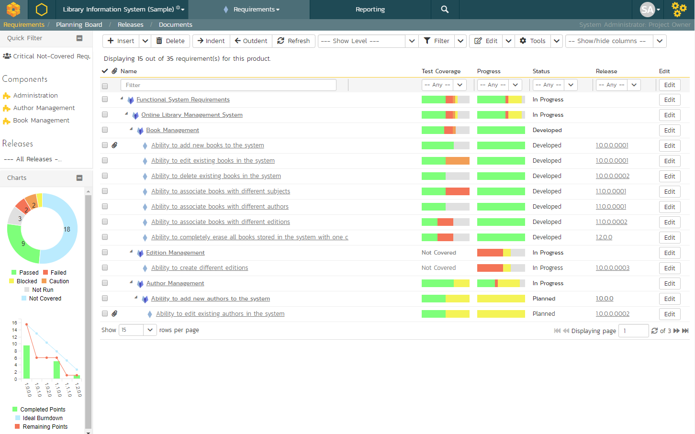

The requirements list consists of a hierarchical arrangement of the
various requirements and functionalities that need to be provided by the
system in question. The structure is very similar to the Work Breakdown
Structure (WBS) developed in Microsoft Product®, and users of that
software package will find this very familiar to use. When you create a
new product, this list will initially be empty, and you will have to
start using the "***Insert***" button to start adding
requirements.

Requirements come in two main flavors: summary items shown in
**bold-type**, and detail items shown in normal-type with a hyperlink.
When you indent a requirement under an existing requirement, the parent
is changed from a detail-item to a summary-item, and when you outdent a
child item, its parent will return to a detail-item (assuming it has no
other children). This behavior is important to understand, as only
detail items are assigned a status themselves; the summary items simply
display an aggregate of the worst-case assessment of their children's
status. Both summary and detail items can be mapped against test-cases
for test-coverage, in addition the summary items display an aggregate
coverage status.

Each requirement is displayed along with its importance/priority (ranked
from "Critical" to "Low"), its completion status (from "Requested" to
"Completed"), the version of the software that the requirement is
planned for, and graphical indicators that represents its test coverage
status and its task progress.

For those requirements that have no test-cases covering them (i.e.
validating that the requirement works as expected) the indicator
consists of a white solid bar, bearing the legend "Not Covered". For
those requirements that have *at least one* test-case mapped against
them, they will display a block graph that illustrates the last
execution status of each of the mapped test-cases. Thus if the
requirement is covered by two test cases, one of which passed, and one
of which wasn't run, the graph will display a green bar (50% passed) and
an equal length gray bar (50% not run). To determine the exact
requirements coverage information, position the mouse pointer over the
bar-chart, and the number of covering tests, along with the pass / fail
/ blocked / caution / not-run breakdown will be displayed as a
"tooltip".

For those requirements that have at least one task associated with them,
they will display a block graph that illustrates the relative numbers of
task that are on-schedule (green), late-starting (yellow),
late-finishing (red) or just not-started (grey). These values are
weighted by the effort of the task, so that larger, more complex tasks
will be change the graph more than the smaller tasks. To determine the
exact task progress information, position the mouse pointer over the
bar-chart and the number of associated tasks, along with the details of
how many are in each status will be displayed as a "tooltip".

### Insert

Clicking on the \<Insert\> icon inserts a requirement *above* the
currently selected requirement -- i.e. the one whose check-box has been
selected, at the same level in the hierarchy. If you want to insert a
requirement below an existing item, you can use the Insert \> Child
Requirement option instead. If you insert a requirement without first
selecting an existing requirement from the list, the new requirement
will simply be added at the end of the list. Note that if the full list
of requirements are paginated, the new requirement will be at the bottom
of the last page.

Once the new requirement has been inserted, the item is switched to
"Edit" mode so that you can rename the default name and choose a
priority, status and/or author.

### Delete

Clicking on the "***Delete***" button deletes all the
requirements whose check-boxes have been selected. If any of the items
are summary items, the child requirements are also deleted. If all the
children are deleted from a summary item, it changes back into a
non-summary item.

### Indent

Clicking on the "***Indent***" button indents all the
requirements whose check-boxes have been selected. If any of the items
are made children of a requirement that had no previous children, it
will be changed from a detail item into a summary item.

### Outdent

Clicking on the "***Outdent***" button de-indents all the
requirements whose check-boxes have been selected. If any of the items
were the only children of a summary requirement item, then that item
will be changed back from a summary item to a detail item.

### Refresh

Clicking on the "***Refresh***" button simply reloads the
requirements list (not the entire page). This is useful as other people
may be modifying the list of requirements at the same time as you, and
after stepping away from the computer for a short-time, you should click
this button to make sure you are viewing the most current requirements
list for the product.

### Edit

Each requirement in the list has an "**Edit**" button display in its
right-most column. When you click this button or just *double-click* on
any of the cells in the row, you change the item from "View" mode to
"Edit" mode. The various columns are made editable, and
"***Update***" buttons are
displayed in the last column:

If you click "***Edit***" on more than one row, the
"***Update***" buttons
are only displayed on the first row selected. You can make changes to
all the editable rows and then update the changes by clicking the one
"***Update***" button. Also, if you want to make the same
change to multiple rows (e.g. to change five requirements from "In
Progress" status to "Completed"), you can click on the "fill" icon to
the right of the editable item, which will propagate the new value to
all editable items in the same column.

If you want to edit lots of items, first select their checkboxes and
then click the \[Edit\] button on the same row as the Filters and it
will switch all the selected items into edit mode.

When you have made your updates, you can either click
"***Save***" to commit the changes, or
"***Cancel***" to revert back to the original information.
Alternatively, pressing the \<ENTER\> key will commit the changes and
pressing the \<ESCAPE\> key will cancel the changes.

### Show Level

Choosing an indent level from the 'Show Level' drop down box allows you
to quickly and easily view the entire requirements list at a specific
indent level. For example you may want to see all requirements
drilled-down to the *third* level of detail. To do this you would simply
choose 'Level 3' from the list, and the requirements will be expanded /
collapsed accordingly.

### Filtering

You can easily filter the list of requirements as illustrated in the
screen-shot below:

To filter the list by any of the displayed columns, you either choose an
item from the appropriate drop-down list or enter a free-text phrase
(depending on the type of field) then click the \<Filter\> icon or press
the \<ENTER\> key to apply the different filters. Note that the name
field is searched using a "LIKE" comparison, so that searching for
"database" would include any item with the word database in the name.
The other freetext fields need to be exact matches (e.g. dates,
requirement numbers). In the screen-shot above, we are filtering on
Status = Requested.

In addition, if you have a set of filters that you plan on using on a
regular basis, you can choose the option Filter \> Save Filter to add
the current filter to the list of saved filters that appear on your 'My
Page'. If you would like to share the filter with other members of the
product, choose the "Share with other members of the product" option.
The list of saved filters can also be retrieved by clicking Filter \>
Retrieve Filter:

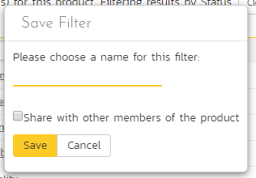

As a shortcut, the left hand panel includes a set of **Quick Filters**
that can be applied in a single-click:

-   **The topmost section** -- This displays any saved requirement
filters created by the current user alongside any 'shared' filters.
The latter are marked with an icon showing a group of people.

-   **Components** -- This section lists the components defined for the
current product. Clicking on any of the components in the list will
filter the requirements to only show those that belong to the
selected component.

-   **Releases** -- This section lists the releases and sprints defined
for the current product. Clicking on any of the releases or sprints
in the list will filter the requirements by that release/sprint.

### Show / Hide Columns

This drop-down list allows you to change the fields that are displayed
in the requirement list as columns for the current product. To show a
column that is not already displayed, simply select that column from the
list of "Show..." column names and to hide an existing column, simply
select that column from the list of "Hide..." column names. This is
stored on a per-product basis, so you can have different display
settings for each product that you are a member of. The fields can be
any of the built-in fields or any of the custom properties set up by the
product owner.

### Copying Requirements

To copy a requirement or set of requirements, simply select the
check-boxes of the requirements you want to copy and then select the
Edit \> Copy Items menu option. This will copy the current requirements
selection to the clipboard. Then you should select the place where you
want the requirements to be inserted and choose the Edit \> Paste Items
option.

The requirements will now be copied into the destination location you
specified. The name of the copied requirements will be prefixed with
"Copy of..." to distinguish them from the originals. Note that copied
requirements will also include the test coverage information from the
originals.

### Moving Requirements

To move a requirement in the requirements hierarchy, there are two
options:

1.  Click on the requirement you want to move and then drag it to the
location you want it moved. An empty space will appear to show you
where it will be inserted:

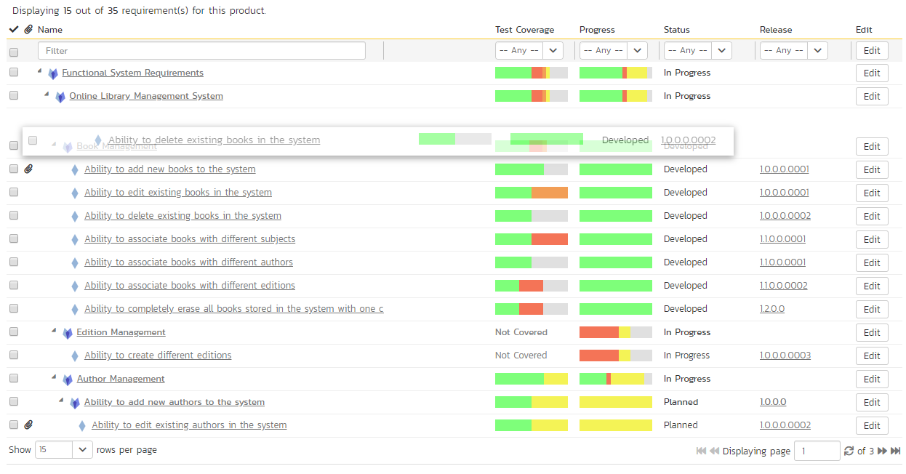

Once you have the requirement positioned at the correct place that you
want it inserted, just release the mouse button. To move multiple items
simply select their checkboxes and then drag-and-drop one of the
selected items.

2.  Alternatively, you can select the check-boxes of the requirements
you want to move and then select the Edit \> Cut menu option. This
will cut the current requirements selection to the clipboard. Then
you should select the place where you want the requirements to be
inserted and choose the Edit \> Paste option. The requirements will
now be moved into the destination location you specified.

### Exporting Requirements

To export a requirement or set of requirements from the current product
to another product in the system, all you need to do is select the
check-boxes of the requirement(s) you want to export and then click the
Tools \> ***Export To Product*** button. This will then
bring up a list of possible destination products:

Once you have chosen the destination product and clicked the
"***Export***" button, the requirements will be exported
from the current product to the destination product. Any file
attachments will also be copied to the destination product along with
the requirements.

### Creating Test Cases from Requirements

To quickly create test cases from a group of requirements, all you need
to do is select the check-boxes of the appropriate requirements and then
click Tools \> ***Create Test Cases***. This will then
create new test cases based on the selected requirements.

### Creating a Test Set from Requirements

To quickly create a new test set from a group of requirements, all you
need to do is select the check-boxes of the appropriate requirements and
then click Tools \> ***Create Test Set***. This will then
create new test set containing the test cases that are already mapped to
the selected requirement(s).

### Printing Items

To quickly print a single requirement or list of requirements you can
select the items' checkboxes and then click Tools \> ***Print
Items***. This will open a new window containing a
printable version of the selected items.

### Focus-On Branch

Sometimes you will a list of filtered requirements displayed and you
would like to view all of the items that in the same branch of the
requirements tree, even those that don't match the current filter. To
view the branch, select the checkbox of the branch and then click Tools
\> ***Focus on***, and the system will clear the current
filters and then expand just the selected branch.

### Right-Click Context Menu

SpiraPlan® provides a shortcut -- called the *context menu* - for
accessing some of the most commonly used functions, so that you don't
need to move your mouse up to the toolbar each time. To access the
context menu, right-click on any of the rows in the requirements list
and the following menu will be displayed:

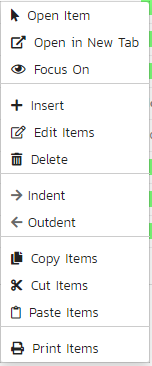

You can now choose any of these options as an alternative to using the
icons in the toolbar.

### Viewing Requirements from Shared Products

If you are displaying the requirements list for a product has required
shared from other products, you will see the option on the top-right to
view the requirements from the shared product(s):

If you choose the option to show the requirement from 'All Products' and
not just the current product, the shared products are displayed, grouped
under the name of the product they are being shared from:

Note: Any requirements shared from other products will be read-only and
won't display any of their custom properties. However you can
expand/collapse these shared requirements and filter using the standard
fields.

## Requirement Details

When you click on a requirement item in the requirements list described
in [Requirements Management > Requirements List](../Requirements%20Management/#requirements-list), you are taken to the requirement details page
illustrated below:

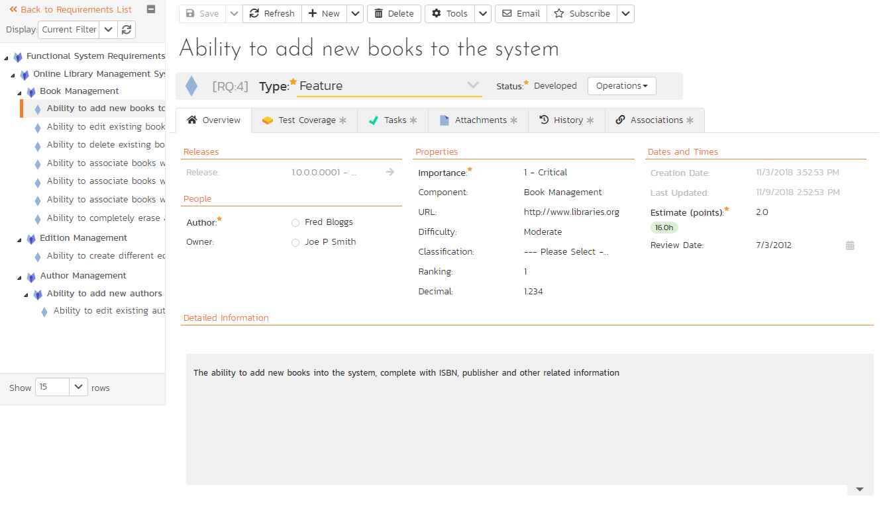

This page is made up of *three* areas;

1.  the left pane displays the requirements list navigation;

2.  the right pane's header, which displays: the operations toolbar; the
editable name of the selected requirement; and the info bar (with a
shaded background), which also contains the workflow status
transitions (see below); and

3.  the right pane's tabbed interface with rich information related to
the requirement.

Please note that on smaller screen sizes the navigation pane is not
displayed. While the navigation pane has a link to take you back to the
requirements list, on mobile devices a 'back' button is shown on the
left of the operations toolbar.

The navigation pane can be collapsed by clicking on the "-" button, or
expanded by clicking anywhere on the gray title area. On desktops the
user can also control the exact width of the navigation pane by dragging
and dropping a red handle that appears on hovering at the rightmost edge
of the navigation pane.

The navigation pane shows a list of the peer requirements to the one
selected. This list is useful as a navigation shortcut; you can quickly
view the coverage information of all the peer requirements by clicking
on the navigation links without having to first return to the
requirements list page. The navigation list can be switched between
three different modes:

-   The list of requirements matching the current filter

-   The list of all requirements, irrespective of the current filter

-   The list of requirements assigned to the current user

On the main right hand side of the page, which of the fields for the
currently selected requirement are available and which are required will
depend on your stage in the requirement workflow. For example, a
requested requirement might not require a "Release" whereas a planned
requirement could well do. The types of change allowed and the fields
that are enabled/visible/required will depend on how your product
administrator has set up the system for you. Administrators should refer
to the *SpiraPlan Administration Guide* for details on configuring the
requirement workflows to better meet their needs.

Depending on the user's role and whether they are listed as the owner or
author of the requirement, displayed in the info bar beneath the
requirement name is the current workflow status and an "operations"
button which, when clicked, will show a set of allowed workflow
operations:

These workflow transitions allow the user to move the requirement from
one status to another. For example when the requirement is in the
Developed status, you will be given the options to:

**Continue Development** -- changes status to "In-Progress"

**Mark as Completed** -- changes the status to "Completed"

**Mark as Tested**- changes the status to "Tested"

After changing the status of the requirement by clicking on the workflow
link, you can then fill in the additional fields that are now enabled
and/or required. Once you've made the changes to the appropriate
requirement fields, you can either click "***Save***",
"***Save and Close***", or "***Save and
New***" to commit the changes or
"***Refresh***" to discard the changes and reload the
requirement from the database. In addition you can print the current
requirement by clicking "***Print***", which will display
a printable version of the page in a separate window.

Please note that if digital signatures have been enabled for a
particular workflow operation (and therefore a digital signature is
required to confirm the status change. Workflow operations requiring a
digital signature are marked with a padlock icon:

On attempting to save changes made after clicking a workflow operation
that requires a digital signature you will be presented with the
following popup:

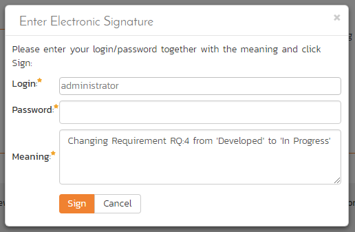

Using the "***Email***" button on the toolbar, you can
send an email containing details of the requirement to an email address
or another user on the system:

You can specify the subject line for the email, and either a list of
email addresses, separated by semicolons, or an existing product user
.The content of the email is specified in the System Administration --
Notification Templates.

To be notified of any changes made to the current artifact via email,
click the "***Subscribe***" button. If you already
subscribed, the button will instead let you
"***Unsubscribe***" to stop receiving emails about that
particular artifact. Depending on your role, you may also see a dropdown
arrow to the right of this button. This will let you subscribe others in
the product to this artifact.

The bottom part of the right pane can be switched between six views:
"Overview", "Test Coverage", "Tasks", "Attachments", "History" and
"Associations", each of which will be described in more detail below.

### Overview - Details

The Overview tab is divided into a number of different sections. Each of
these can be collapsed or expanded by clicking on the title of that
section. It displays the description, fields and comments associated
with the requirement.

The top part of this tab displays the various standard fields and custom
properties associated with the requirement. Fields (both standard and
custom) are grouped under the collapsible headings (marked by orange
text and underline) in the screenshot below. For instance, all fields
regarding dates are grouped together in the "Dates and Times" area.

### Followers

Using the "***Subscribe***" button on the toolbar, you can
quickly follow the item, and receive updates on certain changes to it.
Depending on your role, you may also see a dropdown to this button,
which let's you add another product member as a follower to this item.

You can also quickly see who is following an incident under the "People"
section in the Overview tab.

To view information about the follower, or to unfollow them from the
item, hover over their avatar to display a user profile card.

### Overview -- Detailed Information

The Detailed Information section contains the long, formatted
description of the requirement, as well as any rich text custom fields.
You can enter rich text or paste in from a word processing program or
web page into these fields. Clicking on the shaded areas of one of these
detailed fields will display the rich text toolbar.

### Overview - Comments

The Comments section allows you to add and view discussions relating to
the requirement:

Existing comments are displayed in order underneath the textbox in date
order (either newest first or oldest first). To add a new comment, enter
it into the textbox, and click the "***Add Comment***"
button.

### Overview -- Scenario

If you are editing a 'Use Case' type of requirement, there will be a
special 'Scenario' section where you can enter in the scenario steps
that define the use case:

This section displays the various steps that a user would perform when
carrying out the defined use case. The list of use case steps displays
the position number, and the description. If a test case is created from
this use-case, the steps will be used to create the test steps.

Clicking on the "***Insert Step***" button inserts a new
step *before* the currently selected (by means of the check-box) step.
Clicking the "***Insert Step***" button without selecting
an existing step will insert a new step at the end of the list. When a
new step is inserted, the fields are displayed in "Edit" mode, so the
description, field is editable, allowing you to enter the data:

To move the steps in the list, click on the step you want to move and
drag it to the location you want it moved.

### Test Coverage

This tab shows the test coverage information for the requirement in
question:

The tab displays a grid containing the test cases already mapped to this
requirement. You can filter that list by the test case type, name,
status, execution status, execution date, priority, product name and ID.
You can remove an existing test case by selecting its check box and
clicking the 'Delete' button. This doesn't delete the test case, just
removes it from the requirement.

Hovering the mouse over the names of the test cases will display a
"tooltip" consisting of the test case name, place in the folder
structure and a detailed description.

To add a new test case to the requirement, simply click on the 'Add'
button:

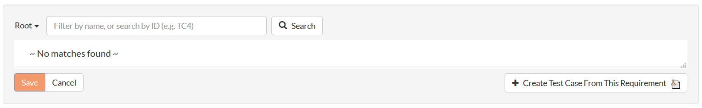

You can search for a test case by its ID if you know it (make sure to
include the "TC" prefix):

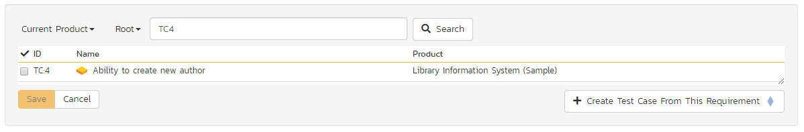

Otherwise, you can search for the test cases by choosing a folder from
the dropdown and/or entering a partial name match:

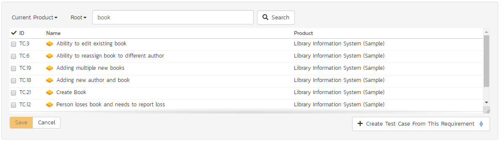

One you have found the desired test case(s), simply select their check
boxes and click the 'Save' button to add them to the current
requirement:

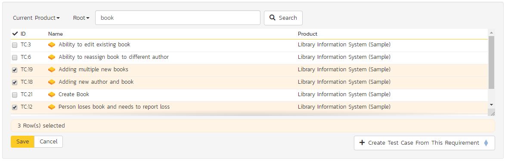

Finally, as a shortcut you can click the "***Create Test Case from This
Requirement***" button to create a new test case in the
list of covered test cases that will be automatically linked to this
requirement. This is useful when you have created a new requirement and
want to generate an initial covering test to be fleshed-out later.

### Tasks

This tab shows the list of product tasks that need to be completed for
the requirement to be satisfied:

Each of the tasks is displayed together with, by default, its name,
description (by hovering the mouse over the name), progress, priority,
start-date, current owner, estimated effort, producted effort and
numeric task identifier. Clicking on the task name will bring up the
[Task Details page](../Task%20Tracking/#task-details). This
allows you to edit the details of an existing task.

You can perform the following actions on a task from this screen:

**New Task** -- inserts a new task in the task list with a default set
of values. The task will be associated with the current requirement.

**Remove** -- removes the task from this requirement without actually
deleting the task

**Refresh** -- updates the list of tasks from the server, useful if
other people are adding tasks to this requirement at the same time.

**Filter / Apply Filter** -- Applies the entries in the filter boxes to
the list of tasks

**Clear Filters** -- Clears the current filter, so that all tasks
associated with the current requirement are shown.

**Edit** -- Clicking the "***Edit***" button to the right
of the task allows you to edit the task inline directly on this screen.
Only columns visible will be editable.

**Show/Hide Columns** -- Allows you to choose which Task columns are
visible

The system has a series of shortcuts that simplify the editing of
requirements and tasks:

If you create a new task on the requirements page, the priority,
release/sprint and owner are automatically copied from the parent
requirement. You can change these suggested values before clicking
"***Save***"

When you assign a release/sprint to a requirement, its status
automatically changes to "Planned"

When at least one task assigned to the requirement changes from "Not
Started" to "In Progress", the parent requirement automatically switches
from "Planned" to "In Progress"

When all the tasks under the requirement are completed, the parent
requirement will switch to the "Completed" status.

If you manually move a requirement that has *no associated tasks* from
"Planned" to "In Progress", the system will automatically generate one
task under the requirement and use the requirement's planned effort
field to generate the task's estimated effort.

### Attachments

The attachment tab displays the list of documents, screenshots or
web-links (URLs) that have been "attached" to the requirement. The
documents can be in any format, though SpiraPlan® will only display
icons for certain known types.

The attachment list includes the filename/URL that was originally
uploaded together with the file-size (in KB), name of the person who
attached it and the date uploaded. In addition, if you position the
pointer over the filename and hold it there for a few seconds, a
detailed description is displayed as a tooltip.

To actually view the document, click on the filename hyperlink and a new
web browser window will open. Depending on the type of file, this window
will either display the document / web-page or prompt you for a place to
save it on your local computer. To remove an existing attachment from a
requirement, simply click the "***Remove***" button and
the attachment will be removed from the list. Using the standard
filter/sort options you can also sort and filter the list of attachments
to make it more manageable.

If you are using SpiraPlan or SpiraTeam (but not SpiraTest) you can also
choose to include file attachments stored in a linked version control
system (e.g. Git, Subversion, CVS, Perforce, etc.) by selecting the "Include
Source Code Documents" option.

To attach a new document to the requirement, you need to first click the
"***Add New***" button to display the new attachment
dialog box:

There are three different types of item that can be attached to a
requirement:

To upload a file, choose "File" as the type and then click the Browse
button and select the file from your local computer, optionally enter a
detailed description then click the "***Upload***" button.
The document will be copied from your computer and attached to the
artifact.

To attach a web-link (URL) to the artifact, you need to choose "URL" as
the type and then enter the fully qualified URL (e.g.
[http://mywebsite.com?Document=1](http://mywebsite.com/?Document=1)), an
optional description and then click the "***Upload***"
button to attach the web-link.

To attach a screenshot to the artifact, you need to choose "Screenshot"
as the type and then copy the image to your computer's clipboard (e.g.
on Windows computers, the PRINT SCREEN button captures the current page
and adds to the clipboard). Once the image is in the clipboard, paste it
into the editor using CTRL+V (or the equivalent keystroke for your
operating system) and the item will appear in the preview window. You
can then fill in the other fields and click "***Upload***"
to attach the image.

Note: If you are using a non-Windows® computer (e.g. Macintosh®) that
doesn't put file extensions on filenames (e.g. .xls for an Excel sheet)
automatically, then you will need to manually add the file extension to
the filename before uploading if you want it to be displayed with the
correct icon in the attachment list.

You can also associate an existing document (that's already stored in
SpiraTeam) with the requirement. To do that, click on the "***Add
Existing***" button to bring up the add file association
dialog box:

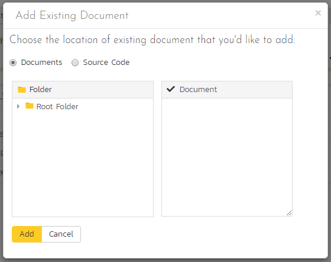

You can then choose to either associate a document stored in the
SpiraPlan Documents repository or (in the case of SpiraPlan/SpiraTeam
but not SpiraTest) from the linked source code repository. In either
case you first select the appropriate folder, and then pick the
document(s) from the file list on the right. In the case of a source
code file association you can also add a comment.

### History

This tab displays the list of changes that have been performed on the
requirement artifact since its creation. An example requirement change
history is depicted below:

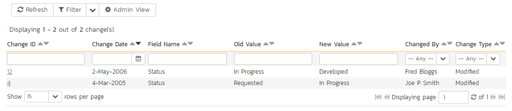

The change history displays the date that each change was made, together
with the fields that were changed, the old and new values and the person
who made the change. This allows a complete audit trail to be maintained
of all changes in the system. In addition, if you are logged in as a
product administrator you can also click on the "Admin View" hyperlink
to revert any unwanted changes.

### Associations

This displays a list of any incidents, source code revisions or other
requirements that are associated with this requirement:

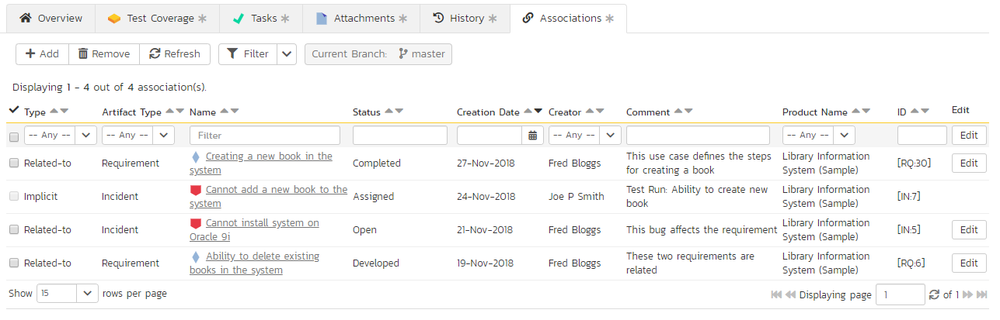

The requirements in this list are those a user has decided are relevant
to the current one and has created a direct link between them. In the
case of incidents, the association can be either due to the creator of
an incident directly linking the incident to the requirement, or it can
be the result of a tester executing a test-run and creating an incident
during the test run. In this latter case, the check-box to the left of
the association will be unavailable as the link is not editable.

Each association is displayed with the type of association (related-to,
vs. a dependency), name of the artifact being linked-to, type of
artifact (requirement, incident, etc.), the name of the person who
created the association, and a comment that describes why the
association was made. In the case of an indirect association due to a
test run, the comment will contain the name of the test run.

In addition, when using SpiraPlan or SpiraTeam, the system automatically
scans the source code repository for any revisions that are linked to
this artifact.

You can perform the following actions on an association from this
screen:

**Delete** -- removes the selected association to the other artifact.
This will only delete the association, not the linked artifact itself.

**Refresh** -- updates the list of associations from the server, useful
if other people are adding associations to this requirement at the same
time.

**Filter / Apply Filter** -- Applies the entries in the filter boxes to
the list of associations

**Clear Filters** -- Clears the current filter, so that all associations
for the current requirement are shown.

**Edit** -- Clicking the "***Edit***" button to the right
of the associations allows you to edit the association type and comment
fields inline directly on this screen.

To create a new association, click the "***Add***" button
to display the add association panel:

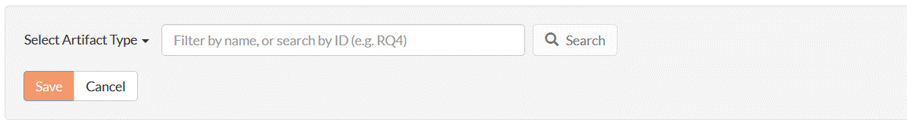

If you know the ID of the requirement or incident you want to associate,
you can enter its ID prefixed by the appropriate token ("RQ" for
requirement or "IN" for incident):

Otherwise you should choose the Artifact Type (and Product if making a
cross-product association):

You can narrow down your search by entering a keyword:

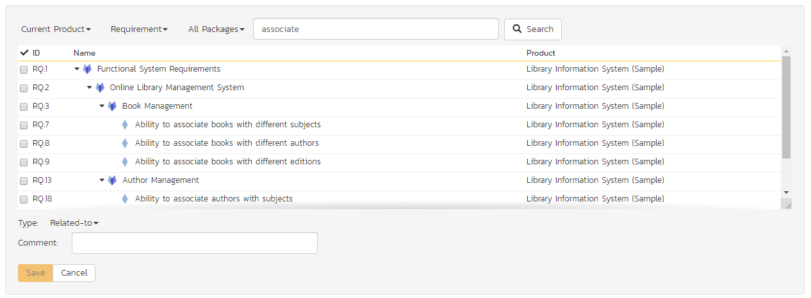

For requirements, you can also choose a package from the list to narrow
down the results:

Once you have a list of artifacts, you should select the checkboxes of
the items you want to associate with the current requirement and click
the 'Save' button.

You can add a comment that explains the rationale for the association
and choose the type of association being created:

-   **Related-to:** this is used to specify that the two artifacts are
simply related

-   **Depends-on:** this is used to specify that the current artifact
has a dependency on the one being linked to.

