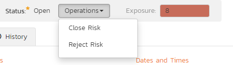
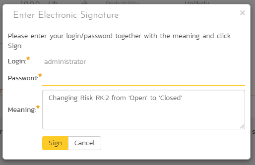
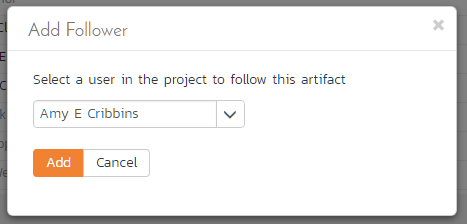

# Risks Management

This section outlines the risk management features of SpiraPlan® (not
available in SpiraTest or SpiraTeam) and how they can be used to help
understand, track, and mitigate risks across your products. The expected
principle ways of managing risks is through assigning values to each
risk's probability and impact. These two fields, multiplied together,
represent the potential (negative) exposure from the risk: a highly
likely risk that would have a large impact has a higher exposure (and
should be managed with a higher priority) than an unlikely risk which
will not have much real world impact.

## Risks List

When you click on the Tracking \> Risks global navigation link, you will
initially be taken to the risks list screen illustrated below:

The risk list screen displays all the risks entered for the current
product, in a filterable, sortable grid. The grid displays the risk
number together with fields such as risk type (schedule, financial,
etc.), status (open, evaluated, etc.), probability, impact, and exposure
(calculated from the probability and impact). The choice of columns
displayed is configurable per-user, per-product, giving extensive
flexibility when it comes to viewing and searching risks.

The sidebar on the left gives you quick access to saved filters, along
with useful charts to get an at-a-glance view of risks for this product.

In addition, you can view a more detailed description of the risk (along
with any mitigations) by positioning the mouse pointer over the incident
name hyperlink and waiting for the popup "tooltip" to appear. If you
click on the risk name hyperlink, you will be taken to the [risk details](#risk-details)
page. Clicking on any of the pagination links
at the bottom of the page will advance you to the next set of risks in
the list according to the applied filter and sort-order. There is also a
drop-down-list at the bottom of the page which allows you to specify how
many rows should be displayed in each page, helping accommodate
different user preferences.

### Sorting and Filtering

You can easily filter and sort the list of risks as illustrated in the
screen-shot below:

To filter the list by a field like type, probability, impact, or status
choose an item from the appropriate drop-down list. For exposure you can
search for a specific number range, and for the other fields, you enter
a free-text phrase then click "***Filter***" or press the
\<ENTER\> key to apply the different filters. Note that the name field
is searched using a "LIKE" comparison, so that searching for "database"
would include any item with the word database in the name. The other
freetext fields need to be exact matches (e.g. dates, risk numbers).

To change the column that is sorted, or to change the direction of the
current sort, click on the up/down arrow icon in the appropriate column.
The currently sorted column is indicated by the darker arrow. In the
screen-shot above, we are filtering on Exposures between 6 and 15
(inclusive), and sorting by ascending name.

Clicking on Filter \> Clear Filter removes any set filters and expands
the risk list to display all risks for the current product, and clicking
on Filter \> Save Filter allows you to save the filter to your 'My Page'
for use in the future. The list of saved filters can also be retrieved
by clicking Filter \> Retrieve Filter.

As a shortcut, the left hand panel includes a set of **Quick Filters**
that can be applied in a single-click:

-   The topmost section displays any saved risk filters created by the
current user or that are shared with the current user (the former
are designated with an icon representing a single person, the latter
a group of people)

-   **Components** -- This section lists the components defined for the
current product. Clicking on any of the components in the list will
filter the risks to only show those that are associated with the
selected component.

### New Risk

Clicking on the "***New Risk***" button takes you to the
new risk screen. This is essentially the same screen as the [risk details](#risk-details)
screen except, depending on how the workflow has
been configured for your product, certain fields may be disabled. For
more details on setting and up configuring workflow for your product,
please refer to the *SpiraTest Administration Guide*.

### Delete

Clicking on the "***Delete***" button deletes the risk(s)
whose check-boxes have been selected in the risk list.

### Refresh

Clicking on the "***Refresh***" button simply reloads the
list of risks; this is useful when new risks are being added by other
users, and you want to make sure you have the most up-to-date list
displayed.

### Show / Hide Columns

This drop-down list allows you to change the fields that are displayed
in the risk list as columns for the current product. To show a column
that is not already displayed, select that column from the list of
"Show..." column names and to hide an existing column, select that
column from the list of "Hide..." column names. This is stored on a
per-product basis, so you can have different display settings for each
product you are a member of. The fields can be any of the built-in
fields or any of the custom properties set up by the product owner.

### Edit

Each risk in the list has an "***Edit***" button display
in its right-most column. When you click this button or *double-click*
on any of the cells in the row, you change the item from "View" mode to
"Edit" mode. The various columns are made editable, and
"***Save***" buttons are
displayed in the last column:

If you click "***Edit***" on more than one row, the
"***Save***" buttons are
only displayed on the first row, and you can make changes to all the
editable rows and then update the changes by clicking the one
"***Save***" button. Also, if you want to make the same
change to multiple rows (e.g. to change five risks from "Resolved"
status to "Closed"), you can click on the "fill" icon to the right of
the editable item, which will propagate the new value to all editable
items in the same column.

If you want to edit lots of items, first select their checkboxes and
then click the "***Edit***" button on the same row as the
Filters and it will switch all the selected items into edit mode.

When you have made your updates, you can either click
"***Save***" to commit the changes, or
"***Cancel***" to revert back to the original information.
Alternatively, pressing the \<ENTER\> key will commit the changes and
pressing the \<ESCAPE\> key will cancel the changes.

### Cloning Risks

To create a clone of an existing risk or set of risks, select the
check-boxes of the risks you want to copy and then click Edit \>
"***Clone***". This will make a copy of the current risk
with its name suffixed with '... - Copy' to distinguish itself from the
original. Any file attachments and mitigations will also be copied along
with the risk itself.

### Exporting Risks

To export a risk or set of risks from the current product to another
product in the system, select the check-boxes of the risk(s) you want to
export and then click the Tools \> "***Export to
Product***". This will then bring up a list of possible
destination products:

Once you have chosen the destination product and clicked the
"***Export***" button, the risks will be exported from the
current product to the destination product. Any file attachments will
also be copied to the destination product along with the risks.

### Printing Items

To quickly print a single risk or list of risks you can select the
items' checkboxes and then click Tools \> Print Items. This will display
a popup window containing a printable version of the selected items. You
can also save the report in a variety of common formats from the same
Tools menu.

## Risk Details

When you click on a risk item in the [risks list](#risks-list), you are taken to the risk details page illustrated below:

This page is made up of *three* areas;

4.  the left pane displays the risks list navigation;

5.  the right pane's header, which displays: the operations toolbar; the
editable name of the selected risk; and the info bar (with a shaded
background), which also contains the workflow status transitions
(see below); and

6.  the right pane's tabbed interface with rich information related to
the risk.

Please note that on smaller screen sizes the navigation pane is not
displayed. While the navigation pane has a link to take you back to the
risks list, on mobile devices a 'back' button is shown on the left of
the operations toolbar.

The navigation pane can be collapsed by clicking on the "-" button, or
expanded by clicking anywhere on the gray title area. On desktops the
user can also control the exact width of the navigation pane by dragging
and dropping a red handle that appears on hovering at the rightmost edge
of the navigation pane.

The navigation pane shows a list of the peer risks to the one selected.
This list is useful as a navigation shortcut; you can quickly view the
coverage information of all the peer risks by clicking on the navigation
links without having to first return to the risks list page. The
navigation list can be switched between three different modes:

-   The list of risks matching the current filter

-   The list of all risks, irrespective of the current filter

-   The list of risks assigned to the current user

On the main right-hand side of the page, which of the fields for the
currently selected risk are available and which are required will depend
on your stage in the risk workflow. For example, an identified risk
might not require a "Release" whereas an evaluated risk could well do.
The types of change allowed and the fields that are
enabled/visible/required will depend on how your product administrator
has set up the system for you. Administrators should refer to the
*SpiraPlan Administration Guide* for details on configuring the risk
workflows to better meet their needs.

Depending on the user's role and whether they are listed as the owner or
author of the risk, displayed in the info bar beneath the risk name is
the current workflow status and an "operations" button which, when
clicked, will show a set of allowed workflow operations:

These workflow transitions allow the user to move the risk from one
status to another. For example, when the risk is in the Open status, you
may be given options to:

**Close Risk** -- changes status to "Closed"

**Reject Risk** -- changes the status to "Rejected"

After changing the status of the risk by clicking on the workflow link,
you can then fill in any additional fields that are now enabled and/or
required. Once you've made the changes to the appropriate fields, you
can either click "***Save***", "***Save and
Close***", or "******" to commit
the changes or "***Refresh***" to discard the changes and
reload the risk from the database. In addition, you can print the
current risk by clicking "***Print***", which will display
a printable version of the page in a separate window.

Please note that if digital signatures have been enabled for a
particular workflow operation (and therefore a digital signature is
required to confirm the status change. Workflow operations requiring a
digital signature are marked with a padlock icon:

On attempting to save changes made after clicking a workflow operation
that requires a digital signature you will be presented with the
following popup:

Using the "***Email***" button on the toolbar, you can
send an email containing details of the risk to an email address or
another user on the system:

You can specify the subject line for the email, and either a list of
email addresses, separated by semicolons, or an existing product user
.The content of the email is specified in the System Administration --
Notification Templates.

To be notified of any changes made to the current artifact via email,
click the "***Subscribe***" button. If you already
subscribed, the button will instead let you
"***Unsubscribe***" to stop receiving emails about that
particular artifact. Depending on your role, you may also see a dropdown
arrow to the right of this button. This will let you subscribe others in
the product to this artifact.

The bottom part of the right pane can be switched between four views:
"Overview", "Tasks", "Attachments", "History", each of which will be
described in more detail below.

### Overview - Details

The Overview tab is divided into a number of different sections. Each of
these can be collapsed or expanded by clicking on the title of that
section. It displays the description, fields and comments associated
with the risk.

The top part of this tab displays the various standard fields and custom
properties associated with the risk. Fields (both standard and custom)
are grouped under the collapsible headings (marked by orange text and
underline) in the screenshot below. For instance, all fields regarding
dates are grouped together in the "Dates and Times" area.

### Followers

Using the "***Subscribe***" button on the toolbar, you can
quickly follow the item, and receive updates on certain changes to it.
Depending on your role, you may also see a dropdown to this button,
which let's you add another product member as a follower to this item.

You can also quickly see who is following an incident under the "People"
section in the Overview tab.

To view information about the follower, or to unfollow them from the
item, hover over their avatar to display a user profile card.

### Overview -- Detailed Information

The Detailed Information section contains the long, formatted
description of the risk, as well as any rich text custom fields. You can
enter rich text or paste in from a word processing program or web page
into these fields. Clicking on the shaded areas of one of these detailed
fields will display the rich text toolbar.

### Overview -- Mitigations

The mitigations section is where you can enter information about any
plans or ideas about how the risk in question can be mitigated, in other
words how its impact or probability can and/or will be lowered. The list
of mitigations displays the position number, and the description, and
date fields.

Clicking on the "***Add***" button inserts a new
mitigation *before* the currently selected (by means of the check-box)
step. Clicking the "***Add***" button without selecting an
existing step will insert a new mitigation at the end of the list. When
a new mitigation is inserted, its fields are displayed in "Edit" mode,
so the description and review date fields are editable, allowing you to
enter the data:

To move the mitigations around in the list, click and hold on the
mitigation you want to move and drag it to the location desired.

If at least one mitigation is selected (using the checkboxes on the
left-hand side), then clicking "***Clone***" will clone
those mitigations and add them to the bottom of the list.

### Overview - Comments

The Comments section allows you to add and view discussions relating to
the risk:

Existing comments are displayed in order underneath the textbox in date
order (either newest first or oldest first). To add a new comment, enter
it into the textbox, and click the "***Add Comment***"
button.

### Tasks

This tab shows the list of product tasks that need to be completed for
the risk to be properly managed/mitigated:

Each of the tasks is displayed together with, by default, its name,
description (by hovering the mouse over the name), progress, priority,
start-date, current owner, estimated effort, producted effort and
numeric task identifier. Clicking on the task name will bring up the
[Task Details page](../Task%20Tracking/#task-details). This
allows you to edit the details of an existing task.

You can perform the following actions on a task from this screen:

**New Task** -- inserts a new task in the task list with a default set
of values. The task will be associated with the current risk.

**Remove** -- removes the task from this risk without actually deleting
the task

**Refresh** -- updates the list of tasks from the server, useful if
other people are adding tasks to this risk at the same time.

**Filter / Apply Filter** -- Applies the entries in the filter boxes to
the list of tasks

**Clear Filters** -- Clears the current filter, so that all tasks
associated with the current risk are shown.

**Edit** -- Clicking the "***Edit***" button to the right
of the task allows you to edit the task inline directly on this screen.
Only columns visible will be editable.

**Show/Hide Columns** -- Allows you to choose which Task columns are
visible

Note that if you create a new task on the risks page, the component,
release/sprint, and owner are automatically copied from the parent risk.
You can change these suggested values before clicking
"***Save***"

### Attachments

The attachment tab displays the list of documents, screenshots or
web-links (URLs) that have been "attached" to the risk. The documents
can be in any format, though SpiraPlan® will only display icons for
certain known types.

The attachment list includes the filename/URL that was originally
uploaded together with the file-size (in KB), name of the person who
attached it and the date uploaded. In addition, if you position the
pointer over the filename and hold it there for a few seconds, a
detailed description is displayed as a tooltip.

To actually view the document, click on the filename hyperlink and a new
web browser window will open. Depending on the type of file, this window
will either display the document / web-page or prompt you for a place to
save it on your local computer. To remove an existing attachment from a
risk, simply click the "***Remove***" button and the
attachment will be removed from the list. Using the standard filter/sort
options you can also sort and filter the list of attachments to make it
more manageable.

If you are using SpiraPlan or SpiraTeam (but not SpiraTest) you can also
choose to include file attachments stored in a linked version control
system (e.g. Subversion, CVS, Perforce, etc.) by selecting the "Include
Source Code Documents" option.

To attach a new document to the risk, you need to first click the
"***Add New***" button to display the new attachment
dialog box:

There are three different types of item that can be attached to a risk:

To upload a file, choose "File" as the type and then click the Browse
button and select the file from your local computer, optionally enter a
detailed description then click the "***Upload***" button.
The document will be copied from your computer and attached to the
artifact.

To attach a web-link (URL) to the artifact, you need to choose "URL" as
the type and then enter the fully qualified URL (e.g.
[http://mywebsite.com?Document=1](http://mywebsite.com/?Document=1)), an
optional description and then click the "***Upload***"
button to attach the web-link.

To attach a screenshot to the artifact, you need to choose "Screenshot"
as the type and then copy the image to your computer's clipboard (e.g.
on Windows computers, the PRINT SCREEN button captures the current page
and adds to the clipboard). Once the image is in the clipboard, paste it
into the editor using CTRL+V (or the equivalent keystroke for your
operating system) and the item will appear in the preview window. You
can then fill in the other fields and click "***Upload***"
to attach the image.

Note: If you are using a non-Windows® computer (e.g. Macintosh®) that
doesn't put file extensions on filenames (e.g. .xls for an Excel sheet)
automatically, then you will need to manually add the file extension to
the filename before uploading if you want it to be displayed with the
correct icon in the attachment list.

You can also associate an existing document (that's already stored in
SpiraTeam) with the risk. To do that, click on the "***Add
Existing***" button to bring up the add file association
dialog box:

You can then choose to either associate a document stored in the
SpiraPlan Documents repository or (in the case of SpiraPlan/SpiraTeam
but not SpiraTest) from the linked source code repository. In either
case you first select the appropriate folder, and then pick the
document(s) from the file list on the right. In the case of a source
code file association you can also add a comment.

### History

This tab displays the list of changes that have been performed on the
risk artifact since its creation. An example risk change history is
depicted below:

The change history displays the date that each change was made, together
with the fields that were changed, the old and new values and the person
who made the change. This allows a complete audit trail to be maintained
of all changes in the system. In addition, if you are logged in as a
product administrator you can also click on the "Admin View" hyperlink
to revert any unwanted changes.

