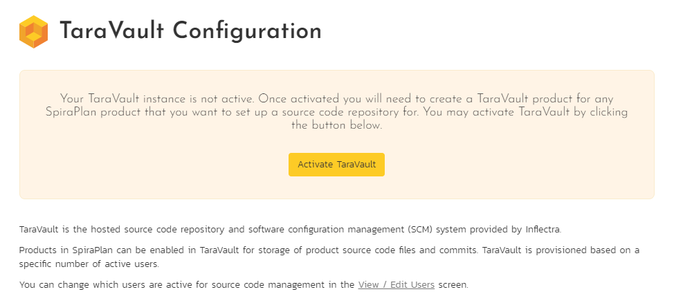
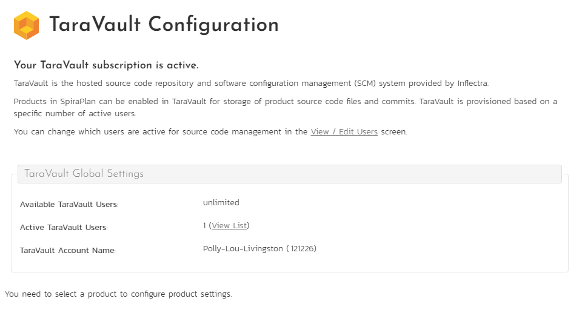

# Activating TaraVault
## Introduction

TaraVault® is the secure source code and file hosting service from Inflectra that allows you to host source code and other assets in our secure cloud, integrated with our SpiraPlan® application lifecycle management system.

This guide assumes that the reader is familiar with both SpiraPlan/SpiraTeam and the appropriate SCM platform (Git and/or Subversion). For information regarding how to use SpiraPlan/Team, please refer to the *[User Manual](../Spira-User-Manual/index.md)*.

You can use either Git or Subversion with TaraVault. If you want to learn more about each of these and which is right for you, read our intro guides to  [using Git](Using-Git.md) and [using Subversion](Using-Subversion.md).

## Activation
To activate TaraVault:

- log into your existing SpiraPlan or SpiraTeam instance (hereafter referred to as Spira) with a system administrator account 
- open the Administration menu
- open the TaraVault page by clicking the **'TaraVault (Source Code)'** link under the "Integrations" section of the system administration menu. 

NOTE: If you don't see the above link it will because you are: self-hosted, are using SpiraTest, or are not a system administrator. Please contact Inflectra customer services to upgrade to SpiraTeam or SpiraPlan, if needed.

If TaraVault is not yet activated, the TaraVault page displays a message explaining just that. This is normal. Click 'Activate TaraVault' to activate TaraVault. Once this succeeds, the page will change to look like the image below.

This shows you you the following information:

- the number of available TaraVault users (typically this is unlimited)
- the number of active TaraVault users. When you first activate TaraVault this will be 1 - the system administrator. Click "view list" to see all TaraVault users.
- the name of your TaraVault account (this should match the name of your SpiraPlan application as shown in its url)
- the TaraVault ID, which is shown in parentheses after the account name information
- the number of active TaraVault products. Click "view list" to see all TaraVault products.

Now that TaraVault is active, you can:

- setup TaraVault on [individual products](./Provisioning-Projects-&-Users.md/#provisioning-products)
- [activate the Spira users](./Provisioning-Projects-&-Users.md/#managing-users) who will be allowed to commit code or files into the TaraVault repositories. Note: *All SpiraPlan users with roles that let them view source code, can view the code in the application, even if they are not a TaraVault user.*

