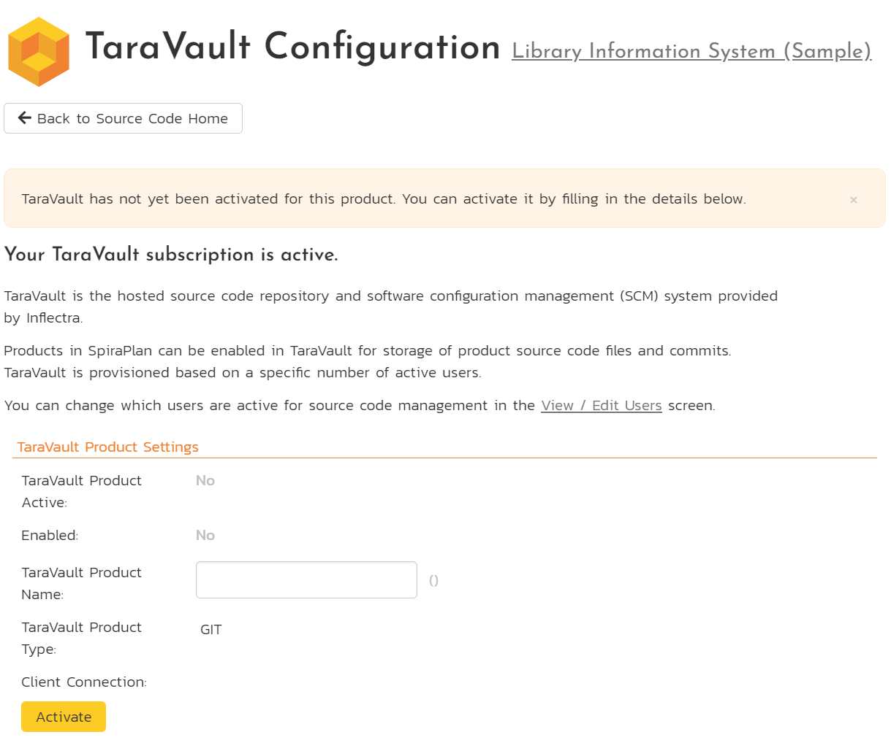
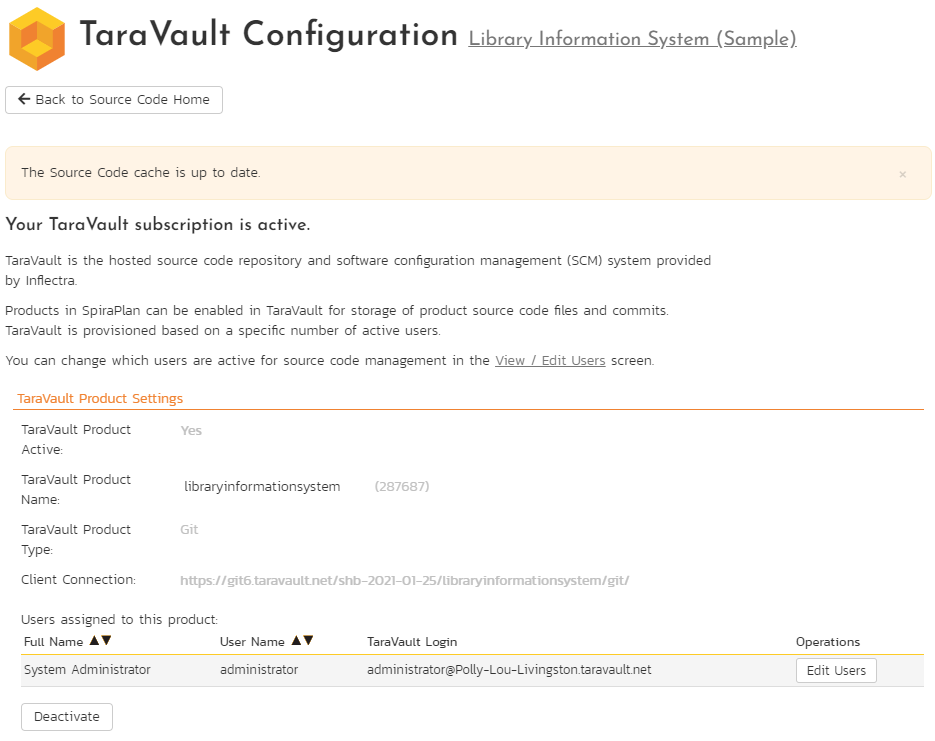
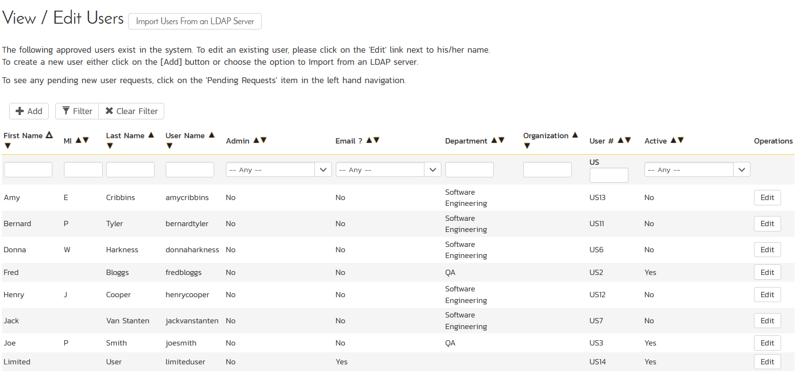
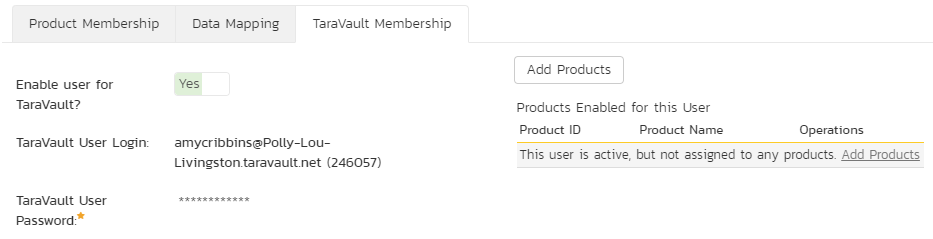
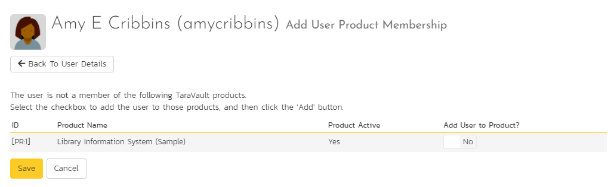
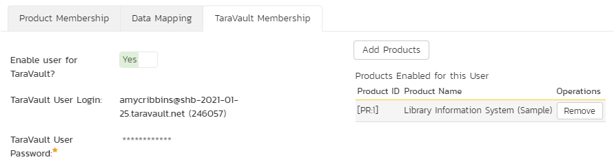
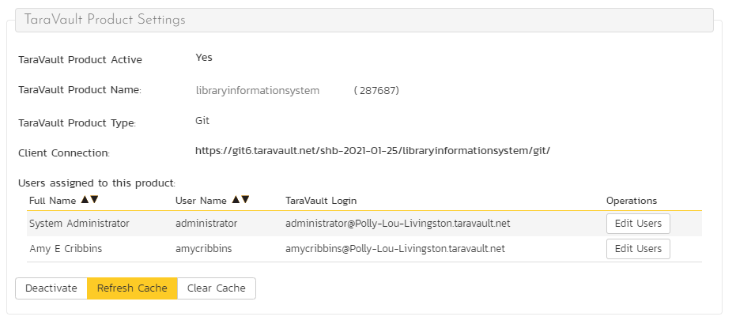
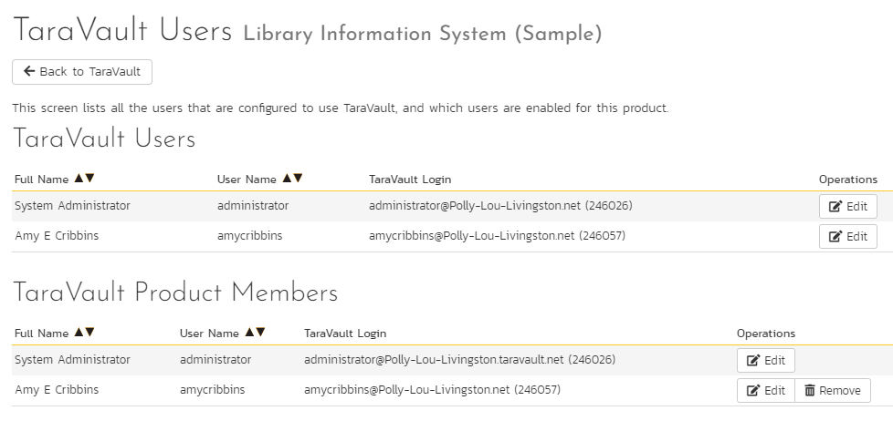
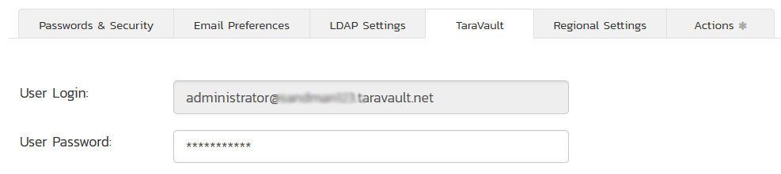
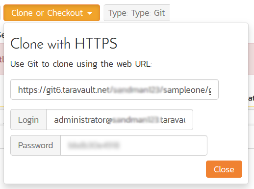

# Provisioning Products & Users
Once you have [activated TaraVault](Activating-TaraVault.md), you can begin to provision specific products to use source code with TaraVault and assign users to commit code or files into the TaraVault repositories. **Note**: All SpiraPlan users with roles that let them view source code, can view the code in the application, even if they are not a TaraVault user.

## Provisioning Products

When you provision a product with TaraVault you are setting up TaraVault's source code to be fully integrated into the SpiraPlan product. To do this: 

- select the product as a product admin
- open the administration menu
- click the "Source Code" link from "General Settings" section of the product admin menu

This opens the TaraVault product administration page. In the screenshot below we have selected the 'Library Information System' sample product:

To provision this product with TaraVault:

- enter a **Product Name**: this should normally be the name of the SpiraPlan product. This name forms part of the connection URL so it should be alphanumeric only.

Click 'Activate' to complete the TaraVault setup for this product. 

!!! info "For new products, TaraVault only supports Git."

In the screenshot below 'libraryinformationsystem' is the product name and 'Git' is the type. The application will now:

- show that TaraVault is active (there is a repository configured) and enabled (the repository is set to be in use)
- fills in the 'Client Connection' with the URL you need to connect to this TaraVault product
- shows the list of TaraVault users that are active for this product.

Once TaraVault has been activated on a product, you can perform the following actions:

- **Disable/Enable**: use this to temporarily disable TaraVault for this product. The TaraVault repository is not deleted and remains active but will no longer be available to view in the app. While disabled, you can, if [configured](../Spira-Administration-Guide/System.md/#taravault-for-source-code) a third party provider to the product. Once disabled you can re-enable TaraVault by clicking the Enable button
- **Delete**: will permanently delete, deactivate, and disable TaraVault for this product. This is a destructive operation that deletes all source code. Make sure you have created all necessary backups before doing this operation
- **Refresh Cache**: will force the cache to refresh right now - this is not normally required as the cache refreshes automatically as you use the application
- **Clear Cache**: to wipe the cache completely and have it rebuild from scratch (note that for large repositories this process can take some time)
deactivate it at anytime, by clicking the "Deactivate" button. This will completely remove the source code from SpiraPlan and from the remote source code repository. Be very careful before doing this destructive action.

## Managing Users

By default, the built-in system administrator account will be automatically enabled for TaraVault and will be added as a member of all TaraVault products. To enable other users to commit code/files to a TaraVault repository, go to Administration > Users > View/Edit Users menu item.

Click on the user you want to add to TaraVault. This will show their user details page. On this page, if TaraVault is active, you will see a TaraVault tab. From here you can enable a specific Spira user for TaraVault:

Now change the setting to "YES" and the following screen appears:

Enter a TaraVault password and click 'Save'. The user is now added to TaraVault and you can add them to specific TaraVault products.

To add a user to TaraVault products, make sure you are on their admin user details page. On the TaraVault tab click "Add Products".

You can now choose which TaraVault products to add the user to - select Yes for each active TaraVault product they should be added to. Then click Save.

The user will now be listed for those specific TaraVault products.

On the admin user details page, on the TaraVault tab:

And on the Product Admin > Source Code page:

You can see in the example above we have two users listed under the current product Library Information System. If you click on any of the 'Edit Users' you can make changes to the TaraVault user settings page.

From here you can:

- CLick "Add To Product" for a user in the "TaraVault Users" section to add that user to the TaraVault Product
- Click "Remove" for a user in the "TaraVault Product Members" section to remove that user from the TaraVault Product
- Click "Edit" for a user to go to the User Details page for that user 

Individual users can see their own TaraVault profile from the main Spira profile page. They need to click on the 'My Profile' link under their user's avatar on the main Spira navigation page:

This page displays the current user's TaraVault login and password (masked). They can update the password for connecting to TaraVault.

## Connecting to the Source Code Repository

Individual users can see the connection information they can use for connecting via. Git or Subversion by going to Developing > Source Code:

This dialog displays the connection string they should use to connect to the current product (the format will depend on whether the user is using Git or Subversion) along with the login and password.

They can click on the blurred password option to reveal their actual password. This is necessary since they will need to know the password to use when connecting to Subversion / Git using their desired SCM client (e.g. TortoiseSVN, TortoiseGit, etc.).

