# Using Git

Git is a Distributed Version Control System (DVCS) system that keeps track of software commits and allows many developers to work on a given project without necessarily being connected to a common network since it doesn't rely on a central repository, but instead distributes copies of the entire source code repository to each user's workstation.

## Git Basics

The major difference between Git and most other VCS (e.g. Subversion described in the previous section) is the way Git thinks about its data. Conceptually, most other systems store information as a list of file-based changes. These systems (CVS, Subversion, Perforce, Bazaar, and so on) think of the information they keep as a set of files and the changes made to each file over time.

Git doesn't think of or store its data this way. Instead, Git thinks of its data more like a set of snapshots of a miniature filesystem. Every time you commit, or save the state of your project in Git, it basically takes a picture of what all your files look like at that moment and stores a reference to that snapshot. To be efficient, if files have not changed, Git doesn't store the file again, just a link to the previous identical file it has already stored. Git thinks about its data more like a stream of snapshots:

This is an important distinction between Git and nearly all other VCSs. It makes Git reconsider almost every aspect of version control that most other systems copied from the previous generation. This makes Git more like a mini filesystem with some incredibly powerful tools built on top of it, rather than simply a VCS.

Another major difference between Git and Subversion is that Git has built-in support for 'branches' instead of relying on a specific folder structure. In Git, Branches are used to develop features isolated from each other. The master branch is the "default" branch when you create a repository. You can then use other branches for development and merge them back to the master branch upon completion.

## Working with Remotes

To be able to work on any Git project, you need to know how to manage your remote repositories. Remote repositories the versions of your project that are hosted TaraVault itself. Collaborating with others involves managing these remote repositories and pushing and pulling data to and from them when you need to share work. Managing remote repositories includes knowing how to add remote repositories, remove remotes that are no longer valid, manage various remote branches and define them as being tracked or not, and more.

This is in stark contrast to [Subversion](../Using-Subversion/) where every commit and update is being performed directly on the central TaraVault remote repository. So when you make changes to your local repository, the will need to explicitly synchronized with TaraVault for other users to see them, and for them to appear in Spira:

## Getting Started with Git

This section assumes that you have already provisioned at least one Git project in TaraVault following the steps in [Activating TaraVault](../Activating-TaraVault/) and 
[Provisioning Projects & Users](../Provisioning-Projects-&-Users/). So you should now have a TaraVault user/password and a Git project with a connection URL:

The next step is to actually connect to this repository using a Git client and commit some source code. We recommend using a GUI tool such as TortoiseGit but you can use any standard Git client with TaraVault (command-line or GUI-based) just as well. In our examples we shall be using TortoiseGit.

The first thing we need to do is perform an initial 'clone' of our remote Git repository into a local repository. This will also do an implicit checkout from the local repository into the working directory.

Assuming that you have already installed TortoiseGit, you would now create a folder to hold all of your Git projects (in our example we shall use C:\\Temp\\Git) and right-click and choose "Git Clone":

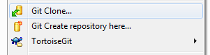

The following dialog box will appear:

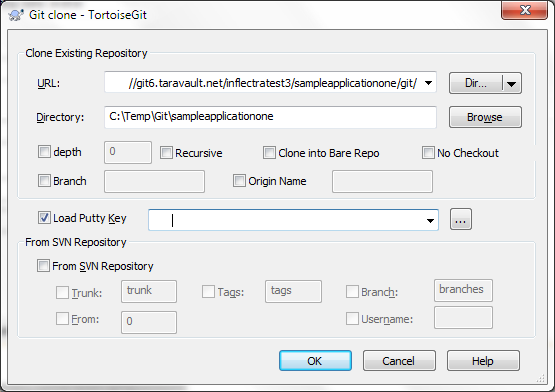

You need to enter the following:

-   **URL**-- needs to be the TaraVault Git connection string listed under 'My Profile' for the current project.

-   **Directory** -- needs to be the local name of the folder for the local repository. Typically it is best to make it the same as the name of the project in TaraVault (e.g. C:\\Temp\\Git\\libraryinformationsystem in this example)

When you click on the 'OK' button, the following authentication dialog box will appear:

Enter your TaraVault Git username, and then click 'OK'. Then the following will appear:

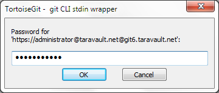

Enter your TaraVault password and then click 'OK' again. The success dialog will appear:

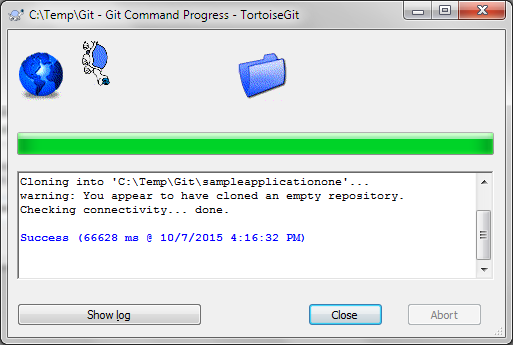

You will now get a folder C:\\Temp\\Git\\sampleapplicationone that is completely empty apart from a special .git folder that is used by Git internally.

Now that you have your Git local repository and working folder available, you are ready to start using Git.

## Adding Files to the Master Branch

Now that you have your Git repository ready, we shall simulate working on a real project. You can now copy some code and folders into the empty working folder (which will be set to use the 'master' branch). In this example we shall add some sample Inflectra code:

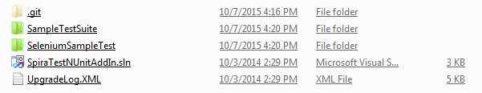

Select all the files and folders and choose TortoiseGit \> Add. That will display the following dialog box:

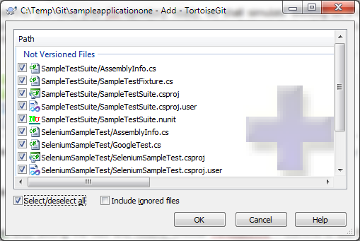

Select all the files and click OK.

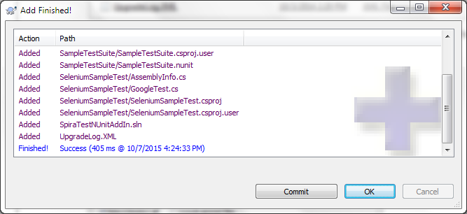

Click on \[OK\] to commit the files to the local repository. Note that this does not send them to the remote TaraVault repository at this stage since this is a distributed version control system and all commits are done locally.

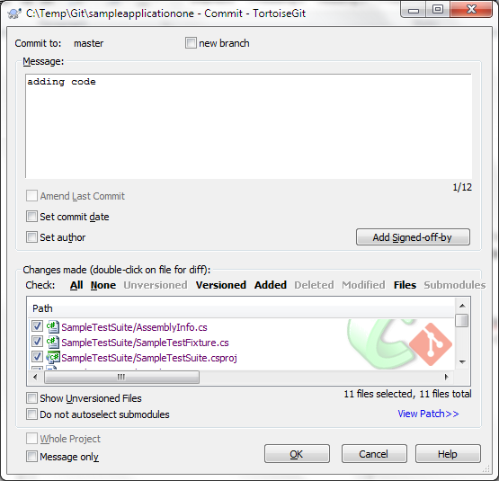

Enter in the appropriate commit message and then click \[OK\] to complete the local commit. The following screen will be displayed:

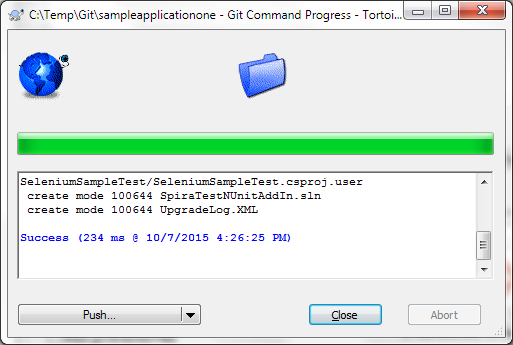

At this stage, we are not ready to 'Push' the repository to TaraVault so just click 'Close'.

Now, open up one of the files (we shall modify the SampleTestSuite\\AssemblyInfo.cs file in our example) and make a change to it. Then right-click on the top-level 'sampleapplicationone' folder and choose Git Commit -\> "master" to commit the change. Make sure you add a comment:

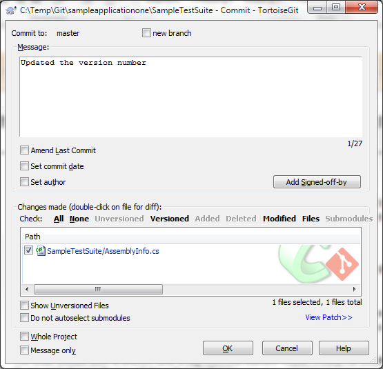

Click OK and the change (known as a commit) will now be committed into the 'master' branch of the local repository.

## Working with Branches

Now that we have the primary development line in our master branch, we can work on a separate version of the code in a different branch, and then at a later date merge back in the changes to the 'master' branch. For example we might be working on an experimental new feature and we only want to merge it into the 'master' when it is internally stable and all the unit tests pass.

We shall create a new named branch in our local repository using TortoiseGit. To do that right-click on the top-level folder (sampleapplicationone) and then click Tortoise Git \> Create Branch:

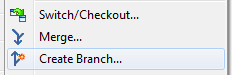

This will display the following dialog box:

Enter in the name of the new branch (we have chosen 'experimental' in the example shown) and click \[OK\] to create the new branch. Since we want to start working in this new branch, we should now using TortoiseGit \> Switch/Checkout to switch to this new branch:

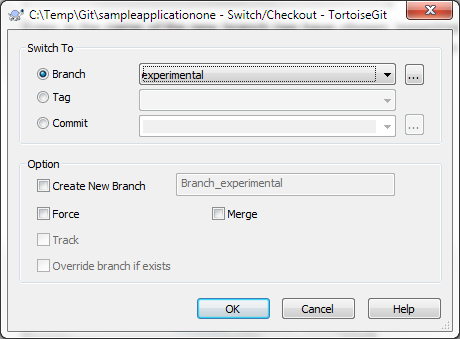

Click \[OK\] to confirm the switch. Now all your changes will be made on this branch.

Now, let's simulate making a code change on the 'experimental' branch we made. To do that, change one of the files in the folder structure and then right-click Git Commit -\> "experimental":

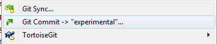

That will display the commit dialog box:

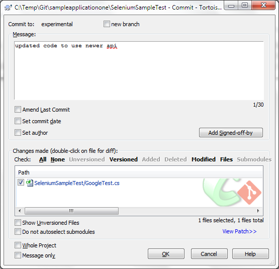

Enter in a comment in the 'Message' text box that describes the purpose of the change. Then click \[OK\]. On the success dialog box that appears, click 'Close'.

Now unlike other VCS such as Subversion, we have made all of these changes in the local Git repository. Once you are ready to share your changes with your team, you need to 'Push' the local branches to the remote TaraVault repository.

To do this, right-click on the top-level folder (sampleapplicationone) and choose TortoiseGit \> Push. The following dialog box will be displayed:

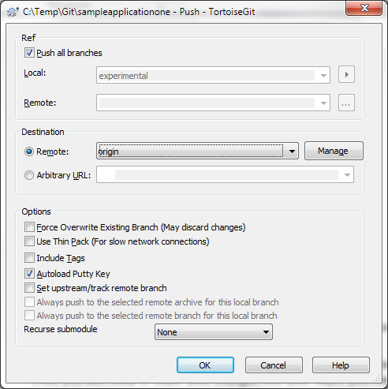

In this case we want to push all branches (master and experimental) to TaraVault, so select the checkbox 'Push all branches'. Then click 'OK'
to push the changes:

Once they have been pushed, we are now ready to view the repository within Spira.

## Using Git with SpiraPlan
Click on the "Source Code" or "Commits" menu items under the Developing tab to navigate and browse the source code repository.

You can read more about working with source code in SpiraPlan at the links below:

- [Source code files](../../Spira-User-Manual/Source-Code/#source-code-file-list)
- [Commits](../../Spira-User-Manual/Commits/#commit-list)
- [Linking to artifacts in commit messages](../../Spira-User-Manual/Commits/#linking-to-artifacts-in-commit-messages)