# Using Subversion

Subversion is a version control system (VCS) -- also known as a revision control system (RCS). That is, Subversion manages files and directories, and the changes made to them, over time. This allows you to recover older versions of your data or examine the history of how your data changed.

Some version control systems are also software configuration management (SCM) systems. These systems are specifically tailored to manage trees of source code and have many features that are specific to software development---such as natively understanding programming languages, or supplying tools for building software. Subversion, however, is not one of these systems. It is a general system that can be used to manage any collection of files, though it is often used for SCM, handling source code files

## Repository Layout

Before we get started with using Subversion, we need to discuss the standard folder layout. For TaraVault to display its branches, folders, files and commits correctly in Spira you need to follow this layout for all your Subversion projects:

 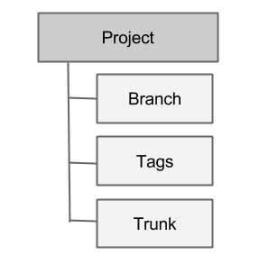  

These three concepts are explained below:

-   **Trunk** is the main folder containing all the data. This is the main line of current development for the project.

-   A **Branch** contains copy of the trunk files and directories. These are used to denote older or non-primary versions of the Trunk. You may still commit changes into these branches. For example you may be still fixing bugs on an older version whilst primary development is occurring on the latest version.

-   **Tags** can also be referred as milestone. This is a check-point to indicate that your project has reached a certain point. You can use this to mark various releases. Unlike a branch, you cannot commit changes into a tag.

An example setup for such a project could look like:

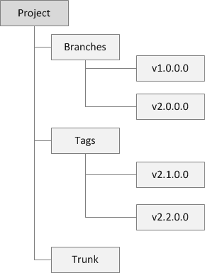

The same folders and files are typically stored inside each of the Branches, Tags and the Trunk. We shall illustrate this more closely when we get started in the next section.

## Getting Started with Subversion

This section assumes that you have already provisioned at least one Subversion project in TaraVault following the steps in [Activating TaraVault](../Activating-TaraVault/) and 
[Provisioning Projects & Users](../Provisioning-Projects-&-Users/). So you should now have a TaraVault user/password and a Subversion project with a connection URL:

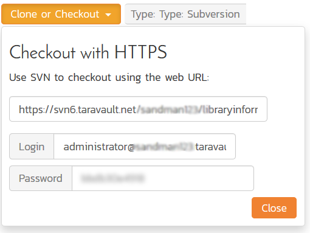

The next step is to actually connect to this repository using a Subversion client and commit some source code. We recommend using a GUI tool such as TortoiseSVN but you can use any standard Subversion client with TaraVault (command-line or GUI-based) just as well. In our examples we shall be using TortoiseSVN.

The first thing we need to do is perform an initial 'check-out' of our repository into a new working folder (that will initially be empty).

Assuming that you have already installed TortoiseSVN, you would now create a folder to hold all of your Subversion projects (in our example we shall use C:\\Temp\\Subversion) and right-click and choose TortoiseSVN \> Check Out:

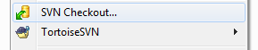

The following dialog box will appear:

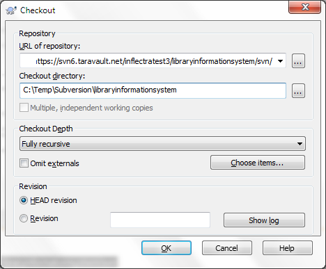

You need to enter the following:

-   **URL of repository** -- needs to be the TaraVault connection string listed under 'My Profile' for the current project.

-   **Checkout Directory** -- needs to be the local name of the folder for this project. Typically it is best to make it the same as the name of the project in TaraVault (e.g. C:\\Temp\\Subversion\\libraryinformationsystem in this example)

When you click on the 'OK' button, the following authentication dialog box will appear:

Enter your TaraVault username/password, choose 'Save authentication' and then click 'OK'. You will now get a folder C:\\Temp\\Subversion\\libraryinformationsystem that is completely empty apart from a special \_svn (or .svn) folder that is used by TortoiseSVN internally.

Now that you have your Subversion working folder downloaded, you should add the following three folders right now:

-   Trunk

-   Branches

-   Tags

Once you have added them to Windows Explorer, select them all and choose TortoiseSVN \> Add:

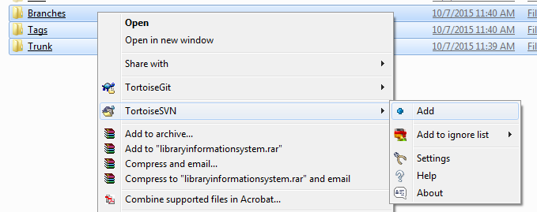

This will display the following:

Once they are added, then choose TortoiseSVN \> Commit to commit these folders to the TaraVault repository. That will display the following dialog box:

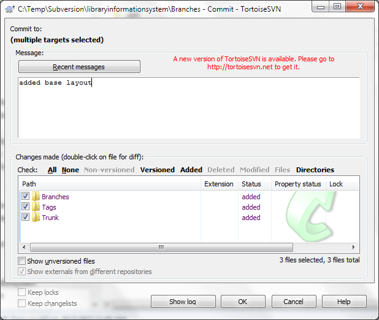

Typically you should add a message to describe what you did. Then click
'OK' and the three layout folders will now be added to your TaraVault subversion repository.

## Adding Files to the Trunk

Now that you have your Subversion repository layout setup, we shall simulate working on a real project. You can now copy some code and folders into the Trunk top-level folder for your project. In this example we shall add some sample Inflectra code:

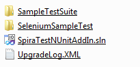

Select all the files and folders and choose TortoiseSVN \> Add, then after adding the files and folders, choose TortoiseSVN \> Commit to add these files to the repository.

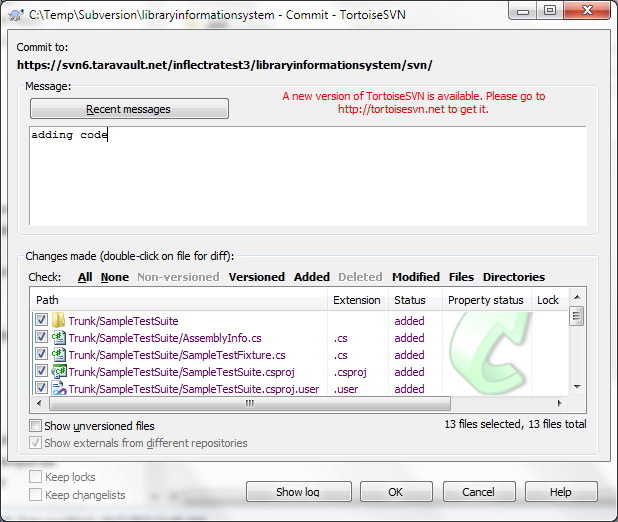

Now, open up one of the files (we shall modify the SampleTestSuite\\AssemblyInfo.cs file in our example) and make a change to it. Then right-click on Trunk and choose TortoiseSVN \> Commit to commit the change. Make sure you add a comment:

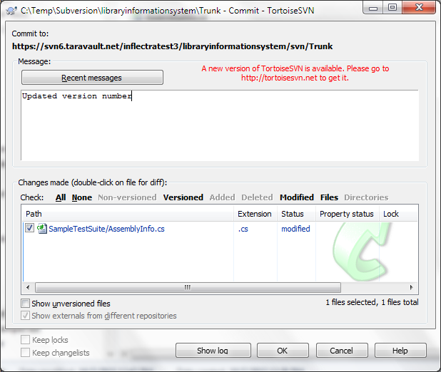

Click OK and the change (known as a /commit) will now be committed into TaraVault.

## Branching and Tagging

Now that we have the primary development line in our Trunk, we can branch and tag a specific version of the code before we make other changes. For example we might be releasing a version and then making changes specific only to the next version.

We shall create both a branch and a tag from the current Trunk. Firstly, to create a Branch, right-click on Trunk and choose TortoiseSVN \> Branch/Tag:

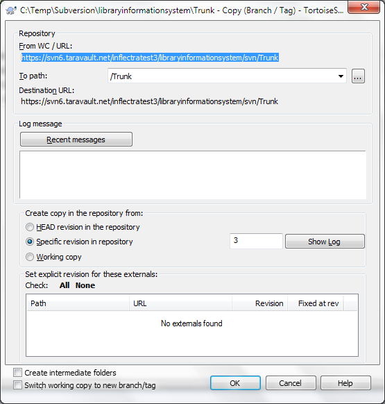

Change the 'To path' from /Trunk to /Branches/v2.0.0.0. You can either branch the latest commit (called the HEAD revision) or a specific commit:

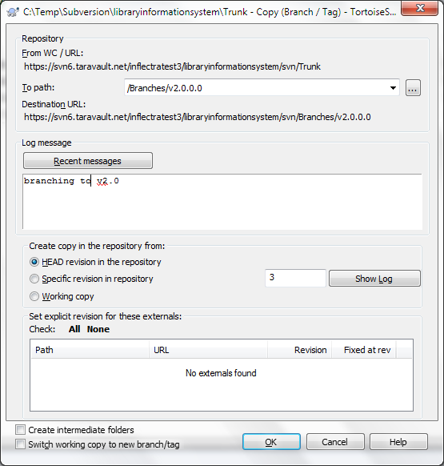

We also recommend adding a 'Log message' to describe the purpose of making the branch. Once you are happy with your choice, click 'OK' to confirm the branch. Once that is done, a copy of the Trunk will now be available under the Branches/v2.0.0.0 folder. To see this, right-click on Branches and choose TortoiseSVN \> Update:

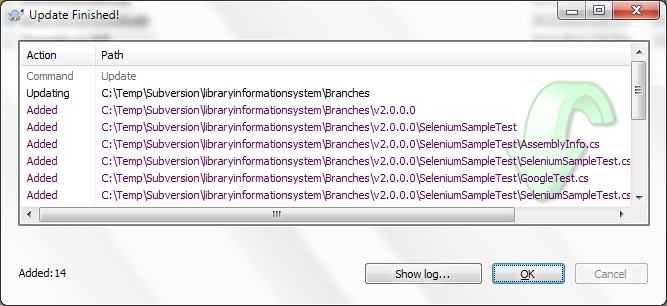

Similarly, to make a Tag, right-click on Trunk and choose TortoiseSVN \> Branch/Tag, and change the 'To path' from /Trunk to /Tags/v1.0.0.0:

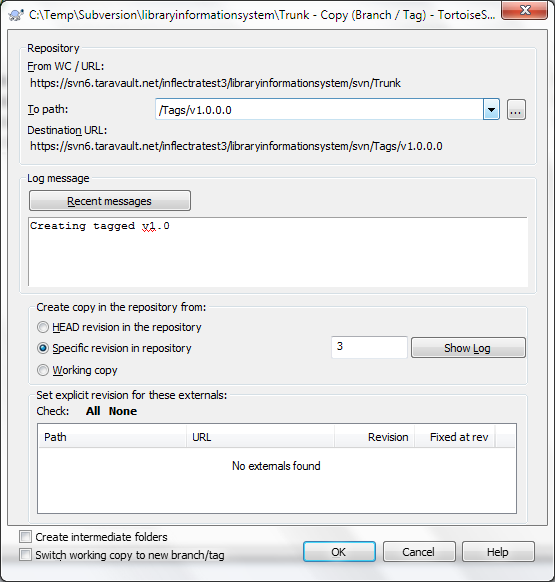

Once that has been completed, right-click on the Tags folder and choose TortoiseSVN \> Update:

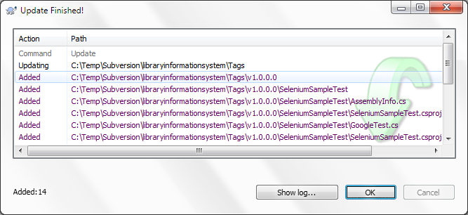

The main difference between a Branch and a Tag is that you can continue to make changes on a Branch, whereas a Tag is a fixed snapshot of the Trunk and cannot be modified. To illustrate this, let's simulate making a bug fix on the v2.0 branch we made. To do that, change one of the files in the /Branches/v1.0.0.0 folder structure and then right-click TortoiseSVN \> Commit:

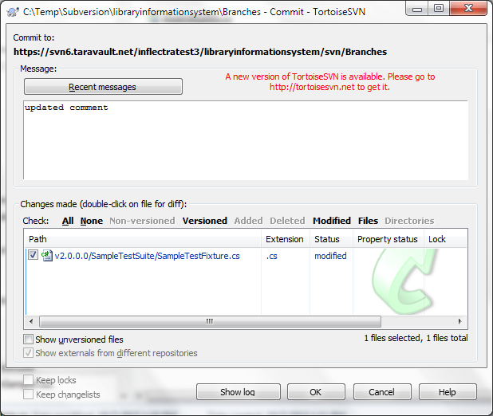

Click 'OK' and we are now ready to view the repository within Spira.

## Using Subversion with SpiraPlan
Click on the "Source Code" or "Commits" menu items under the Developing tab to navigate and browse the source code repository.

You can read more about working with source code in SpiraPlan at the links below:

- [Source code files](../../Spira-User-Manual/Source-Code/#source-code-file-list)
- [Commits](../../Spira-User-Manual/Commits/#commit-list)
- [Linking to artifacts in commit messages](../../Spira-User-Manual/Commits/#linking-to-artifacts-in-commit-messages)