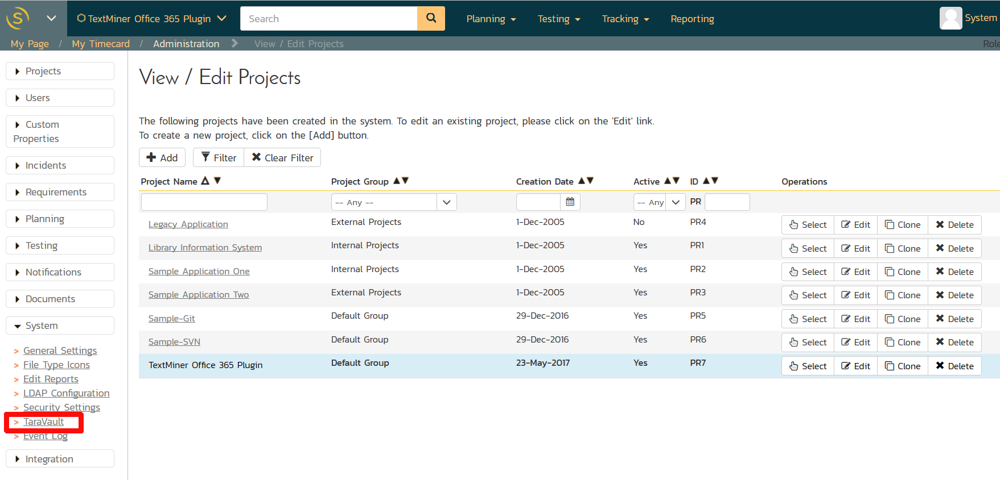
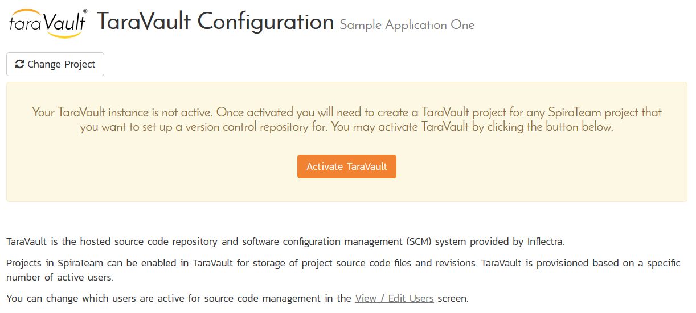
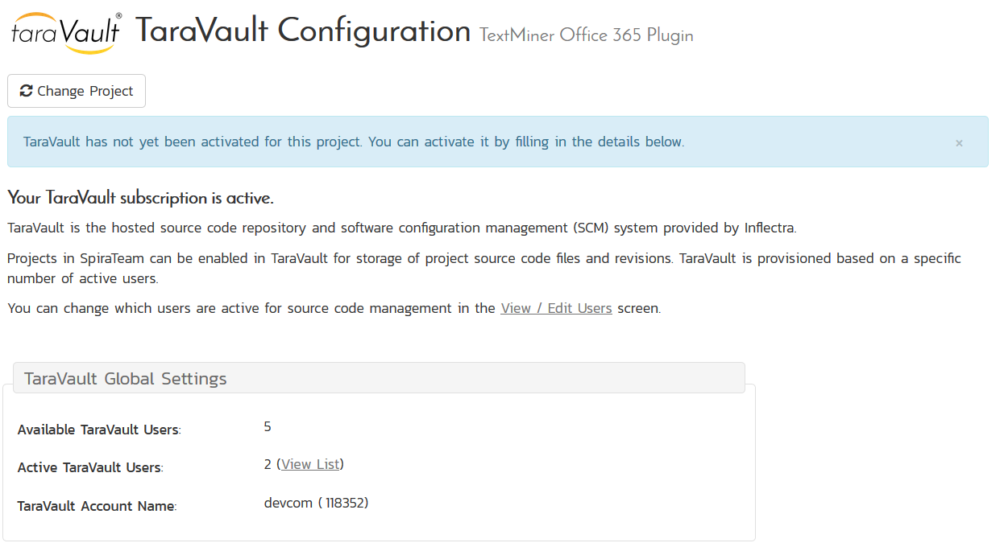

# Introduction

TaraVault® is the secure source code and file hosting service from
Inflectra that allows you to host your source code and other assets in
our secure cloud, integrated with our SpiraTeam® application lifecycle
management system.

This guide outlines how to activate and use TaraVault® with a
cloud-based instance of SpiraPlan^®^ or SpiraTeam^®^. The guide covers
the general activation process in additional to specific sections
dedicated to the two supported SCM technologies -- *Git or*
*Subversion*.

This guide assumes that the reader is familiar with both
SpiraPlan/SpiraTeam and the appropriate SCM platform (Git and/or
Subversion). For information regarding how to use SpiraPlan/Team, please
refer to the *SpiraPlan User Manual* or the *SpiraTeam User Manual*.

# Activating TaraVault

To get started, log into your existing SpiraPlan or SpiraTeam instance
(hereafter referred to as Spira) with a system administrator account and
go to the main Administration menu:

You should see the '**TaraVault'** menu entry under the "**System**"
heading. If you don't see this option then you might either be
self-hosted or running SpiraTest. If you are running SpiraTest, please
contact Inflectra customer services to get your account upgraded to
SpiraTeam.

Click on this TaraVault link to bring up the TaraVault administration
home page:

This screen lets you know that your instance of Spira does not yet have
an active instance of TaraVault. This is normal and you should now click
on the 'Activate TaraVault' button to activate TaraVault. Once this is
done, the screen will display:

This provides you information on the name and ID of your TaraVault
account as well as an indication as to how many source code users your
subscription allows. If you need to purchase additional users, just
contact Inflectra customer services who will be happy to help you out.

Now that your instance is active, you will need to provision individual
projects and also activate the Spira users that will be allowed to
commit code or files into the TaraVault repositories. Note: *All users
in Spira will be able to view the files in TaraVault without needing a
separate TaraVault license.*

