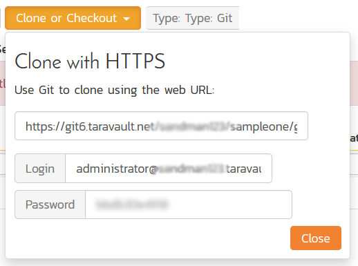

# Provisioning Projects & Users

Once you have activated TaraVault for your instance of Spira, you can
now begin to provision specific projects and assign users.

## Provisioning Projects

To provision a new project with TaraVault, go to the main Spira
Administration page and select the appropriate project and then go to
the TaraVault administration page. For example, in the screenshot below
we have selected the 'Library Information System' sample project:

To provision this project with TaraVault, you need to choose the
following:

-   **Project Name** -- this is the name of the project in TaraVault.
This name is incorporated into the connection URL so it should be
alphanumeric only.

-   **Project Type** -- this is the type of SCM repository you wish to
use. Currently the choices are between Subversion and Git. We
discuss the differences between Subversion (also known as SVN) and
Git in sections 4 and 5 respectively.
Note: once you choose the repository type for a project it cannot be
changed without deleting the entire repository, so make sure you
understand the differences between the two technologies beforehand.

For example we will choose 'libraryinformationsystem' as the project
name and 'SVN' (Subversion) as the project type. Once you are happy with
your choice, click 'Activate' to enable this project for TaraVault:

The system will then populate the 'Client Connection' section with the
URL that you need to use to connect to this TaraVault project from your
Subversion or Git client (this is described in more detail in sections 4
and 5 respectively). In addition, it will display a list of users that
are enabled for this project.

## Managing Users

By default, the built-in system administrator account will be
automatically enabled for TaraVault use and will be added as a member of
all TaraVault projects. To enable other users to commit code/files to a
TaraVault repository, you need to go to the Administration \> Users \>
View/Edit Users menu item:

This will display the user details page. On this page, if you have
activated TaraVault there will be a special TaraVault tab that is used
to enable a specific Spira user for TaraVault:

Now change the setting to "YES" and the following screen appears:

Enter in the desired password for TaraVault and click the main 'Save'
button and this user will now be added to TaraVault. *Note that you need
to have sufficient TaraVault licenses for all of the users you wish to
activate.*

Finally, you can now add this user to specific TaraVault projects by
clicking on the user's administration page again:

Now click on the 'Add Projects' link and you can now choose which
TaraVault projects to add the user to:

You should now click the 'Add User to Project' YES/NO slider and then
click the 'Save button:

The user will now be listed for that specific TaraVault project.

If you now go back to the main Administration \> TaraVault page:

You will see the two users listed under the current project. If you
click on the 'Edit Users' hyperlink it will let you make changes to the
TaraVault user settings page.

On this page you can use the **Add Project** option to add multiple
TaraVault users to the current Spira project:

Individual users can see their own TaraVault profile from the main Spira
profile page. They need to click on the 'My Profile' link under their
user's avatar on the main Spira navigation page:

This page displays the current user's TaraVault login and password
(masked). They can update the password for connecting to TaraVault via.
Git or Subversion.

## Connecting to the Project

Individual users can see the connection information they can use for
connecting via. Git or Subversion by going to Tracking \> Source Code:

This dialog displays the connection string they should use to connect to
the current project (the format will depend on whether the user is using
Git or Subversion) along with the login and password.

They can click on the blurred password option to reveal their actual
password. This is necessary since they will need to know the password to
use when connecting to Subversion / Git using their desired SCM client
(e.g. TortoiseSVN, TortoiseGit, etc.).

