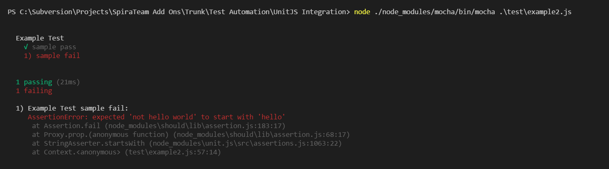
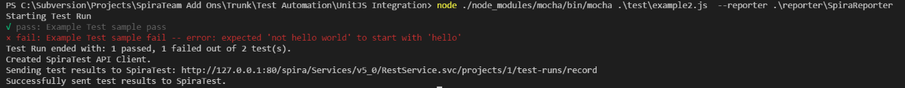
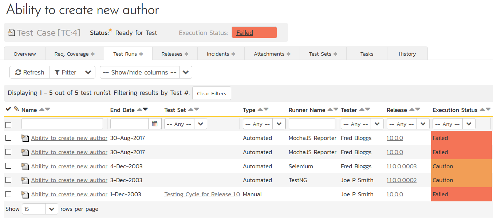
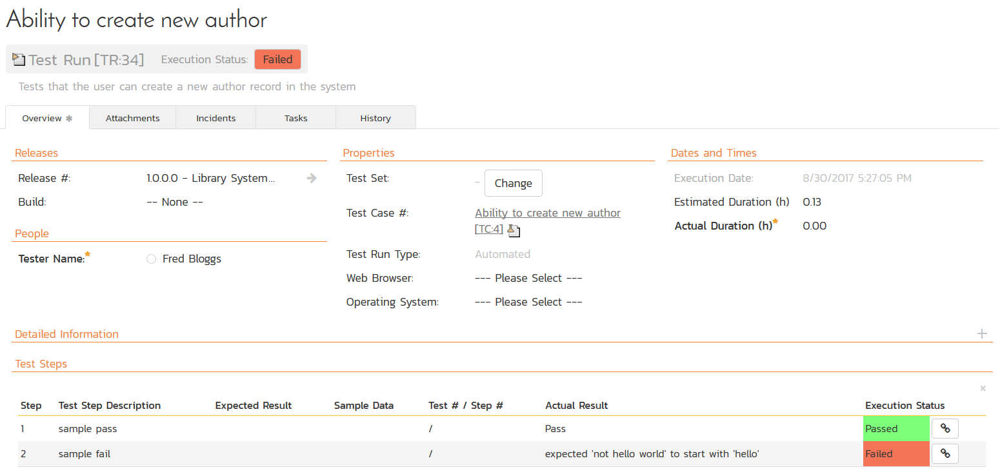
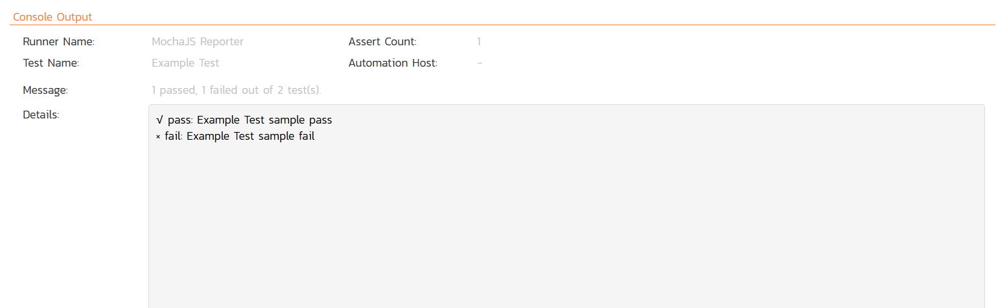

# Integrating UnitJS & NodeJS

UnitJS is an assertion library for JavaScript, running on Node.js or a
web browser. It works with various test runner and unit testing
frameworks, including Mocha, Karma, Protractor, and QUnit.

SpiraTest currently includes a pre-built extension for the MochaJS test
runner and our sample code illustrates it working with UnitJS. However,
we supply the source code to the extension, so you can easily adapt it
for other runners such as Protractor.

## Using the SpiraTest MochaJS Reporter

Mocha is a feature-rich JavaScript test framework running on Node.js and
in the browser, making asynchronous testing simple and fun. Mocha tests
run serially, allowing for flexible and accurate reporting, while
mapping uncaught exceptions to the correct test cases.

An example UnitJS test running Mocha looks something like:

```javascript
var test = require('unit.js');

describe('Example Test', function(){

it('sample pass', function(){

// just for example of tested value

var example = 'hello world';

test

.string(example)

.startsWith('hello')

.match(/\[a-z\]/)

.given(example = 'you are welcome')

.string(example)

.endsWith('welcome')

.contains('you')

.when('"example" becomes an object', function(){

example = {

message: 'hello world',

name: 'Nico',

job: 'developper',

from: 'France'

};

})

.then('test the "example" object', function(){

test

.object(example)

.hasValue('developper')

.hasProperty('name')

.hasProperty('from', 'France')

.contains({message: 'hello world'})

;

})

.if(example = 'bad value')

.error(function(){

example.badMethod();

})

;

});

it('sample fail', function(){

// just for example of tested value

var example = 'not hello world';

test

.string(example)

.startsWith('hello')

.match(/\[a-z\]/)

.given(example = 'you are welcome')

.string(example)

.endsWith('welcome')

.contains('you')

.when('"example" becomes an object', function(){

example = {

message: 'hello world',

name: 'Nico',

job: 'developper',

from: 'France'

};

})

.then('test the "example" object', function(){

test

.object(example)

.hasValue('developper')

.hasProperty('name')

.hasProperty('from', 'France')

.contains({message: 'hello world'})

;

})

.if(example = 'bad value')

.error(function(){

example.badMethod();

})

;

});

});
```

In this sample, we have one test suite "Example Test" that has two tests
-- "sample pass" and "sample fail" inside it. When you run this test
using Mocha using the command line:

node ./node\_modules/mocha/bin/mocha .\\test\\example2.js

You get the following:




What we want is to have this test suite report back against a matching
test case in SpiraTest.

To do that we need to download and unzip the
**UnitJS-MochaJS-Reporter.zip** file from the Inflectra website and
extract the contents to the same location as your test framework. The
**reporter** subfolder contains two NodeJS modules:

-   SpiraReporter.js -- this contains the Mocha custom reporter used for
sending the results to SpiraTest

-   SpiraClient.js -- this contains the JavaScript module that sends a
test result back to SpiraTest. It is used by SpiraReporter.js but
can also be used directly in your code if you want to report back
results without using Mocha.

To use this custom reporter with your Mocha test framework, you simply
need to do these two things:

1.  Add the reporter name to the command line used to invoke Mocha

2.  Add some configuration code to your UnitJS test suite to tell Mocha
how to connect to your instance of SpiraTest.

The first part is very straightforward, just add the Reporter to your
Mocha command line:

node ./node\_modules/mocha/bin/mocha .\\test\\example2.js \--reporter
.\\reporter\\SpiraReporter

For the second part, you need to add the following code to your test
suite at the top:

```javascript
var SpiraReporter = require('../reporter/SpiraReporter.js');

//set the SpiraTest options

global.spiraOptions = {

projectId: 1,

testCaseId: 4,

releaseId: 1,

testSetId: null,

login: 'fredbloggs',

apiKey: '{7A05FD06-83C3-4436-B37F-51BCF0060483}',

protocol: 'http',

host: '127.0.0.1',

vdir: 'spira'

};
```
The first line simply adds a reference to the SpiraTest Mocha reporter
module.

The second line defines the connection and test case information used
for reporting back to SpiraTest. Here's what you need to put in each of
the required configuration options:

-   **protocol** -- this needs to be set to either "http" or "https"
depending on how you connect to SpiraTest

-   **host** -- this needs to be the name or IP address of the host
running SpiraTest. For cloud customers, it will be something like
**mycompany.spiraservice.net**

-   **port** -- this is usually 80 for http and 443 for https unless you
are running SpiraTest on a custom port

-   **vdir** -- this is the name of any path used after the hostname.
For example, if your URL is <https://demo.spiraservice.net/mysite>
then the vdir would be "mysite". If your URL is just
<https://mycompany.spiraservice.net> then you can leave the vdir
blank or just not set a value for it.

-   **login** -- this should be a login that has access to the project
in SpiraTest with permissions to create test runs.

-   **apiKey** -- this should be the API Key (also known as the RSS
Token) for the login specified

-   **projectId** -- this should be the numeric ID of the project that
the test case belongs to (e.g. if the project is PR56 just use 56)

-   **testCaseId** -- this should be the numeric ID of the test case
that you want this Mocha test suite to report against (e.g. if the
test case in question is TC23 just use 23)

In addition, there are two optional configuration parameters you can
use:

-   **releaseId** -- If you would like the recorded test run to be
reported against a specific release, iteration or phase in
SpiraTest, you need to specify the ID of the release in question
(e.g. for release RL18 just use 18)

-   **testSetId** - If you would like the recorded test run to be
reported against a specific test set in SpiraTest, you need to
specify the ID of the test set in question (e.g. for test set TX35
just use 35)

With those values set, when you run the test suite using the command
line:

node ./node\_modules/mocha/bin/mocha .\\test\\example2.js \--reporter
.\\reporter\\SpiraReporter

The results of the test suite will be displayed inside the Mocha
console:




When you login to SpiraTest and view the test case being executed, you
will now see the automated test runs reported back from Mocha:




Clicking on one of the MochaJS Reporter test runs will bring up a screen
that provides the detailed test run report from Mocha:




The Console Output section gives more detailed information:




Congratulations... You are now able to run UnitJS automated tests using
Mocha and the SpiraTest custom reporter and have the results be recorded
within SpiraTest. The sample test suites **example.js** and
**example2.js** are provided with the installation.

## Have Questions or Need Assistance?
If you are an Inflectra customer, please contact our customer support at:
- Email: support@inflectra.com
- Help Desk: https://www.inflectra.com/Support/

Otherwise, please feel free to post a question on our public forums:
- [Test Case Integration Forum](https://www.inflectra.com/Support/Forum/integrations/unit-testing/List.aspx)