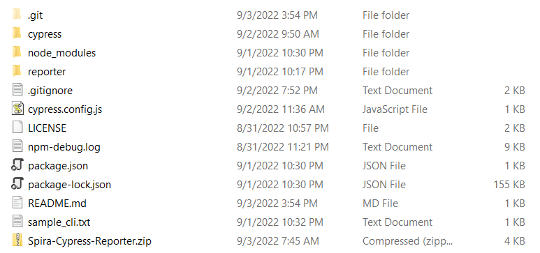
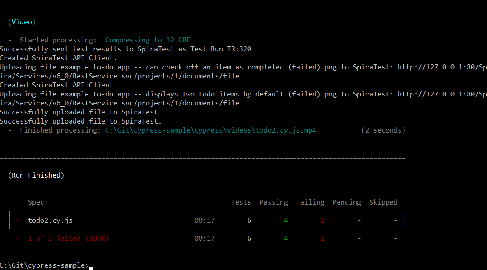
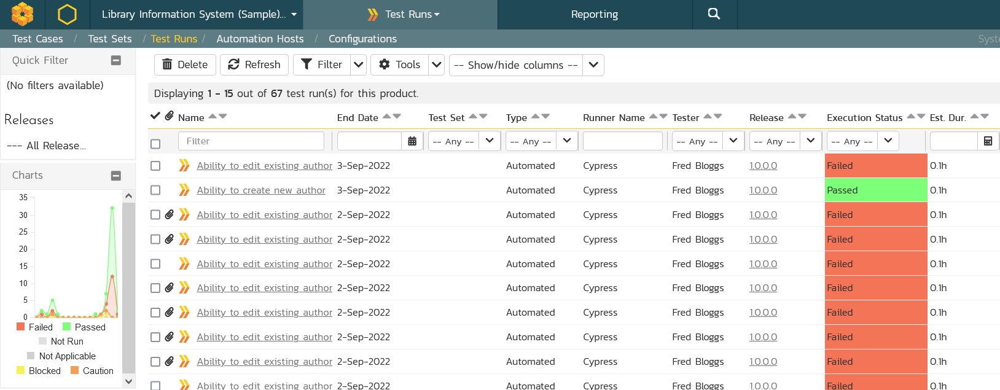
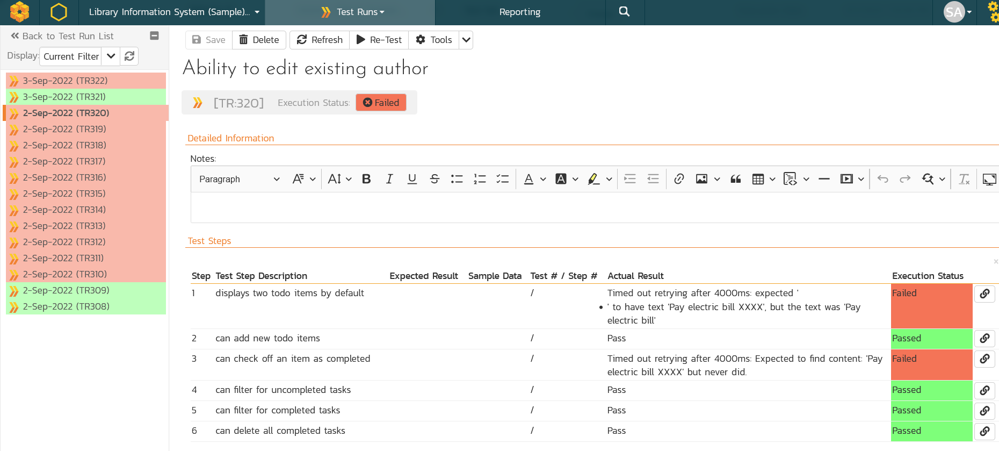
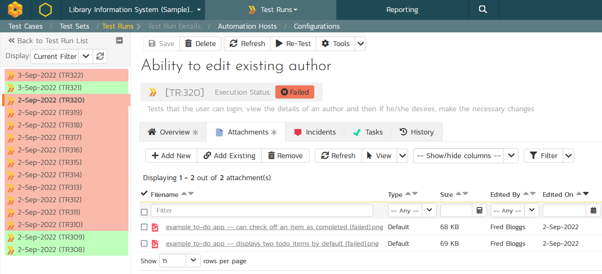
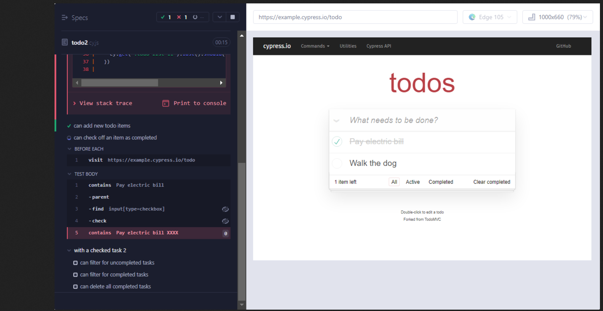

# Cypress Reporter for Spira
!!! abstract "Compatible with SpiraTest, SpiraTeam, SpiraPlan"

This is a sample cypress project that uploads Cypress test results automatically to Inflectra's Spira.

It is implemented as a custom reporter that you can easily add to your existing Cypress projects and have the benefit of the test results and screenshots automatically upload against the corresponding Spira test case.

## Installing the Cypress Reporter
To install the Spira custom reporter, simply download the [Spira-Cypress-Reporter.zip](https://github.com/Inflectra/cypress-sample/raw/main/Spira-Cypress-Reporter.zip) zip file and extract the contents (consisting of the `reporter` folder) and place in your Cypress project at the same level as the `cypress` folder. For example:



To use the custom Spira reporter in your Cypress project, you just add it to the Cypress command line: `npx cypress run --browser edge --spec "cypress\e2e\1-getting-started\todo.cy.js" --reporter "reporter\SpiraReporter"` or you modify the `cypress.config.js` to include the report. We recommend this method since it avoids need to add it to the command-line each time.

However before you can use the reporter, you will need to configure it to point to Spira, and map the Cypress spec files to specified Spira test cases.

## Configuring the Cypress Reporter
Locate the `cypress.config.js` file from the root of your Cypress project. Open this up in your favorite text/code editor, for example Visual Studio Code. This file contain something similar to the following:

```
const { defineConfig } = require("cypress");

module.exports = defineConfig({
    e2e: {
        setupNodeEvents(on, config) {
        on('task', { 
            log(message) {
            console.log(message)
            return null
            },
        })
        },
    }
});
```

Depending on how you have Cypress configured, you may have additional settings.

Now we need to modify it to enable the Spira custom reporter and configure its settings:

```
const { defineConfig } = require("cypress");

module.exports = defineConfig({
    e2e: {
        setupNodeEvents(on, config) {
        on('task', { 
            log(message) {
            console.log(message)
            return null
            },
        })
        },
    },
    reporter: 'reporter/SpiraReporter',
    reporterOptions: {
        projectId: 1,
        releaseId: 1,
        testSetId: null,
        login: 'fredbloggs',
        apiKey: '{7A05FD06-83C3-4436-B37F-51BCF0060483}',
        protocol: 'https',
        host: 'demo-us.spiraservice.net',
        vdir: 'mysite',
        mapping: {
        "with a checked task": 4,
        "with a checked task 2": 5
        }
    }
});
```

Notice that we have added `reporterOptions` object that specifies how the Cypress reporter will communicate with Spira:

- **projectId** - this should be the ID of the Spira project (e.g. `PR:5` would be just `5`)
- **releaseId** - this should be the ID of the Spira release we're reporting against (e.g. `RL:2` would be just `2`)
- **testSetId** - this should be the ID of the Spira test set we're reporting against (e.g. `TX:3` would be just `3`)
- **login** - this is the username for a valid Spira user
- **apiKey** - this is the API Key / RSS Token associated with the Spira user
- **protocol** - this should be either `http` or `https`
- **host** - this should be the domain name of your Spira instance (e.g. demo-us.spiraservice.net or myinstance.spiraservice.net)
- **vdir** - this should be the name of any virtual directory in your instance (e.g. `mysite`). If there is no virtual directly, leave this field empty - see below for troubleshooting.
- **mapping**  - this is where we map our spec files to the test cases, we will explain this next.

!!! info "Troubleshooting when you do not have a virtual directory"
    If you have set the **vdir** property to "" (an empty string), you may have problems connecting to Spira, depending on your version of Cypress and/or Node.js. Some versions do not accept empty entries for the vdir parameter. 

    To fix this issue, you need to add 'video: true' in the cypress.config.js file:

    ```
    const { defineConfig } = require("cypress");

    module.exports = defineConfig({
        video:true,
        e2e: { ... }
    })
    ```

### Mapping the Test Cases
The `mapping` section is where we map the name of each test suite in a spec file with a corresponding Spira test case. For example, if we have a spec file that has this `context` section:

```
context('with a checked task', () => {
    beforeEach(() => {
    cy.contains('Pay electric bill')
        .parent()
        .find('input[type=checkbox]')
        .check()
    })
```

Then the name of the test suite wiuld be `with a checked task` and then we map that to a test case in Spira, for example `TC:5`. For our sample tests, we have the following example mapping:

```
mapping: {
    "with a checked task": 4,
    "with a checked task 2": 5
}
```

So we are mapping:
- `with a checked task` to Spira test case `TC:4`
- `with a checked task 2` to Spira test case `TC:5`

We have now finished our configuration of the reporter, and can run the tests.

## Running a Cypress Test
You can execute the tests using the Cypress command-line, launch-pad, CI tool or whatever method you currently use. For example, to execute one of the sample tests in this repository, you can use: `npx cypress run --browser edge --spec "cypress\e2e\1-getting-started\todo.cy.js"`. To run the entire folder of tests, you can use: `npx cypress run --browser edge --spec "cypress\e2e\1-getting-started"`

The system will then execute the test and let you know that it is reporting back to Spira:



### Viewing the Results in Spira
Once the Cypress tests have finished running, you can view the results in Spira:



If you click on one of the runs, you will see the details of that specific execution, including the pass/fail steps and the actions recorded:



In addition, if you choose one of the failed runs, you will see that any screenshots have been automatically uploaded as well:



If you click on the picture link, you can view the uploaded image/screenshot directly in Spira:



**Congratulations! You have now run your first Cypress test and reported back the results to Spira!**

## Where Can I Obtain Spira?
If you would like to learn more about the Inflectra Spira suite, please go to the following website:

- [SpiraTest](https://www.inflectra.com/SpiraTest/), powerful requirements and test management
- [SpiraTeam](https://www.inflectra.com/SpiraTeam/), agile planning and test management for teams
- [SpiraPlan](https://www.inflectra.com/SpiraPlan/), enterprise planning and testing platform

## Have Questions or Need Assistance?
If you are an Inflectra customer, please contact our customer support at:

- Email: support@inflectra.com
- Help Desk: https://www.inflectra.com/Support/

Otherwise, please feel free to post a question on our public forums:

- [Test Case Integration Forum](https://www.inflectra.com/Support/Forum/integrations/unit-testing/List.aspx)